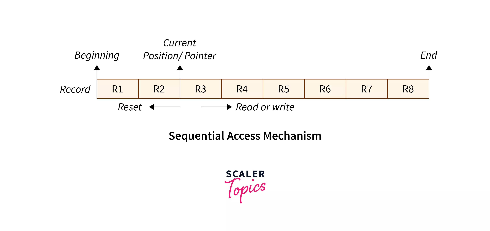
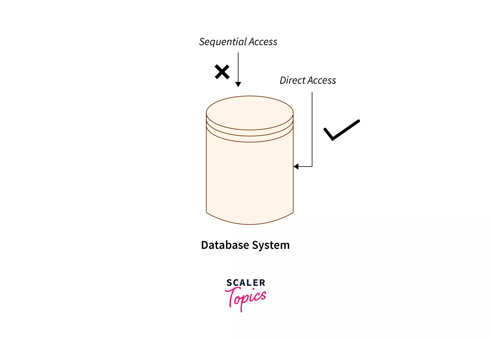
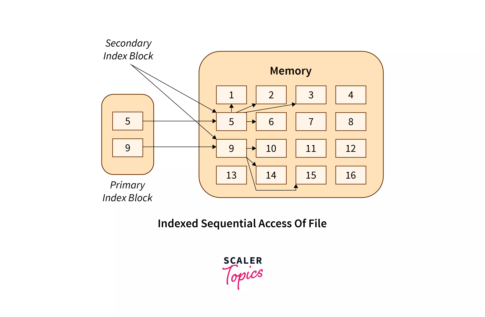

# File Access Methods

---

# 개념

전제 조건 – **파일 시스템**

- 파일이 사용될 때 정보를 읽어 컴퓨터 메모리에 액세스하며, 파일의 이 정보에 액세스하는 방법에는 여러 가지가 있다.
- 일부 시스템에서는 파일에 대해 하나의 액세스 방법만 제공한다. IBM과 같은 다른 시스템은 다양한 액세스 방법을 지원하며 특정 애플리케이션에 적합한 방법을 선택하는 것은 주요 설계 문제다.
- 컴퓨터 시스템에 있는 파일에 접근하는 방법에는 순차 접근, 직접 접근, 인덱스 순차 방법의 세 가지가 있다.

# 1. **Sequential Access(**순차적 접근**)**

- 가장 간단한 액세스 방법이다.
- 파일의 정보는 한 레코드씩 순서대로 처리된다. 이 액세스 모드가 가장 일반적이다.
    - 예를 들어, 편집기와 컴파일러는 일반적으로 이러한 방식으로 파일에 액세스한다.
- 파일을 한 단어씩 읽은 뒤 파일의 기본 주소에 연결되는 포인터가 만들어진다.
    - 사용자가 파일의 첫 번째 단어를 읽을 때 포인터는 이를 사용자에게 제공하고 그 값을 다음 단어로 올린다.
    - 위 절차가 파일이 완료될 때까지 계속된다.
    - 쓰기 작업의 경우 메모리를 할당하고 포인터를 파일 끝으로 이동한다.
- 이러한 방법은 테이프에 적합하다.
- 파일의 데이터는 파일에 나타나는 순서대로 평가되므로 순차 접근 메커니즘을 사용하여 파일 데이터에 쉽고 간단하게 접근할 수 있다.

## 1-1. 장점

- 다음 항목에 빠르게 액세스하기 위해 사전식 순서를 사용한다.
- 특정 순서로 파일의 모든 레코드에 액세스해야 하는 애플리케이션에 적합하다.
- 데이터가 무작위가 아닌 순차적으로 기록되므로 데이터 손상 가능성이 적다.
- 필요한 데이터만 읽고, 불필요한 데이터를 읽는 데 시간을 낭비하지 않기 때문에 대용량 파일을 읽을 때 더욱 효율적인 방법이다.
- 데이터가 순차적으로 저장되고 필요한 경우 쉽게 복원할 수 있으므로 백업 및 복원 작업을 위한 안정적인 방법이다.

## 1-2. 단점

- 다음에 액세스해야 하는 파일 레코드가 현재 레코드 옆에 없으면 이러한 유형의 파일 액세스 방법은 속도가 느리다.
- 새 레코드를 삽입하려면 상당한 양의 파일을 이동해야 할 수도 있다.
- 파일을 자주 업데이트하거나 수정해야 하는 응용 프로그램에는 적합하지 않다. 대용량 파일 중간에 레코드를 업데이트하거나 삽입하는 작업은 느리고 번거로운 과정이 될 수 있다.
    - 파일의 특정 레코드에 대한 빠른 액세스는 허용되지 않는다. 특정 기록을 찾으려면 전체 파일을 순차적으로 검색해야 하는데, 이는 시간이 많이 걸릴 수 있다.
- 레코드의 길이가 다양한 경우 순차적 액세스로 인해 저장 공간이 낭비될 수도 있다. 레코드 사이의 공간은 다른 레코드가 사용할 수 없으므로 저장 공간을 비효율적으로 사용할 수 있다.

# 2. **Direct Access(직접 액세스)**

- 상대 액세스 방법 이라고도 알려진 직접 액세스 방법이다.
- 프로그램이 레코드를 빠르게 읽고 쓸 수 있도록 하는 고정 길이 논리 레코드이다.
    - 레코드가 모두 동일한 크기를 가져야 한다는 것을 의미한다.
- 특별한 순서는 없다. 디스크는 모든 파일 블록에 대한 무작위 액세스를 허용하므로 직접 액세스는 파일의 디스크 모델을 기반으로 한다.
- 직접 액세스의 경우 파일은 번호가 매겨진 블록 또는 레코드의 시퀀스로 간주된다. 따라서 블록 14를 읽은 다음 블록 59를 읽고 블록 17을 쓸 수 있다.
- 직접 액세스 파일에 대한 읽기 및 쓰기 순서에는 제한이 없다. 사용자가 운영 체제에 제공하는 블록 번호는 일반적으로 *상대 블록 번호* 이며 파일의 첫 번째 상대 블록은 0이고 그 다음은 1이다.

## 2-1. 장점

- 파일에 즉시 액세스할 수 있어 평균 액세스 시간이 단축된다.
- 직접 접근 방식에서는 블록에 접근하기 위해 그 앞에 있는 블록을 모두 탐색할 필요가 없다.
- 어디에서 접근하든. 액세스 속도가 똑같다.

# 3. **Index sequential method(인덱스 순차 방식)**

- 순차 접근 방식의 상위에 구축된 파일에 접근하는 또 다른 방식이다.
- 이러한 메소드는 파일에 대한 색인을 구성한다. 인덱스를 사용하여 포인터를 제어한다.
    - 책 뒷면의 색인과 마찬가지로 색인에는 다양한 블록에 대한 포인터가 포함되어 있다.
    - 파일에서 레코드를 찾으려면 먼저 색인을 검색한 다음 포인터를 사용하여 파일에 직접 액세스한다.
- 특정한 주소나 키값을 통해서 특정 주소의 값을 찾는다.
- 색인 테이블이 적절하게 배열되어 있다면 레코드에 매우 빠르게 접근할 수 있다.
- 파일의 어느 위치에나 빠르게 레코드를 추가할 수 있다
- 다른 파일 접근 방법과 비교할 때 비용이 많이 들고 효율성이 떨어진다
- 추가 저장 공간이 필요하다.

# 4. **Relative Record Access(상대 기록 접근)**

- 파일 포인터의 현재 위치(상대적인 위치를 기반)를 기준으로 레코드에 액세스하는 운영 체제에서 사용되는 파일 무작위 액세스 방법이다.
- 이 방법에서는 특정 주소나 키 값이 아닌 현재 레코드를 기준으로 한 위치를 기준으로 레코드를 찾는다.
- 이 방법은 개별 기록에 접근하는 데는 효율적이지만 특정 기록에 대한 무작위 접근이나 빈번한 업데이트가 필요한 파일에는 적합하지 않을 수 있다.
    - 빈번한 업데이트 발생 시, 상대적 위치가 변경되고 레코드 삭제 시 빈 공간이 생길 수 있다.
    - 또한 이를 위해 모든 레코드를 검색해야 될 수도 있다.
- 상대 레코드 액세스에는 고정 길이 레코드가 필요하며 일부 애플리케이션에서는 유연성이 충분하지 않을 수 있다.
- 이 방법은 특정 순서로 레코드를 처리하거나 순차적으로 액세스되는 파일에 유용하다.
- 지역성 개념.

## 4-1. 장점

- 무작위 액세스
    - 상대 레코드 액세스를 통해 파일의 레코드에 무작위로 액세스할 수 있다.
    - 시스템은 파일 포인터의 현재 위치에서 특정 오프셋에 있는 모든 레코드에 액세스할 수 있다.
- 효율적인 검색
    - 시스템은 현재 레코드와 건너뛰어야 하는 모든 레코드만 읽으면 되므로 개별 레코드에 액세스할 때는 상대 레코드 액세스가 순차 액세스보다 효율적이다.
- 순차적 처리에 유용
    - 상대 레코드 액세스는 특정 순서로 레코드를 처리하는 데 유용하다.
    - 예를 들어, 레코드가 특정 순서로 정렬된 경우 시스템은 파일 포인터의 현재 위치를 기준으로 다음 또는 이전 레코드에 액세스할 수 있다.

## 4-2. 단점

- 고정 레코드 길이 레코드 길이가 가변적이면 찾기가. 힘들다.
    - 상대 레코드 액세스에는 고정 길이 레코드가 필요하다.
    - 레코드의 길이가 다양한 경우 각 레코드의 길이가 동일하도록 패딩을 사용해야 할 수도 있다.
- 제한된 유연성
    - 상대 레코드 액세스는 그다지 유연하지 않다. 다른 레코드의 상대적 위치를 방해하지 않고 파일 중간에 레코드를 삽입하거나 삭제하는 것은 어렵다.
- 제한된 적용
    - 상대 레코드 액세스는 순차적으로 또는 어느 정도 규칙적으로 액세스되는 파일에 가장 적합하지만 자주 업데이트되거나 특정 레코드에 대한 무작위 액세스가 필요한 파일에는 적합하지 않을 수 있다.

# 5. **Content Addressable Access(콘텐츠 주소 지정이 가능한 액세스)**

- CAA(Content-Addressable Access)는 주소가 아닌 콘텐츠를 기반으로 레코드나 블록에 액세스할 수 있도록 하는 운영 체제에서 사용되는 파일 액세스 방법이다.
    - 키는 위치나 주소가 아닌 레코드나 블록의 콘텐츠를 기반으로 계산된다.
- 이 방법에서는 해시 함수를 사용하여 각 레코드나 블록에 대한 고유 키를 생성하고, 시스템은 해당 키를 지정하여 모든 레코드나 블록에 액세스할 수 있다.
    - 각 레코드나 블록에는 해시 함수를 사용하여 생성된 고유 키가 있다.
    - 키는 위치나 주소가 아닌 레코드나 블록의 콘텐츠를 기반으로 계산된다.

## 5-1. 장점

- 효율적인 검색
    - 레코드나 블록의 내용을 기반으로 효율적인 검색을 허용하므로 대규모 데이터베이스나 파일 시스템을 검색하는 데 이상적이다.
- 유연성
    - 레코드나 블록을 쉽게 삽입하고 삭제할 수 있으므로 다른 액세스 방법보다 더 유연하다.
- 데이터 무결성
    - 각 레코드나 블록에 해당 콘텐츠를 기반으로 생성된 고유 키가 있으므로 데이터 무결성을 보장한다.

## 5-2. 단점

- 오버헤드
    - 각 레코드나 블록에 대해 해시 함수를 계산해야 하므로 추가 오버헤드가 필요하다.
- 충돌
    - 두 개의 레코드나 블록이 동일한 키를 가질 수 있는 경우 충돌 가능성이 있다. 이는 좋은 해시 함수를 사용하면 최소화할 수 있지만 완전히 없앨 수는 없다.
- 제한된 키 공간
    - 키 공간은 사용되는 해시 함수의 크기에 따라 제한되며 이로 인해 충돌 및 기타 문제가 발생할 수 있다.