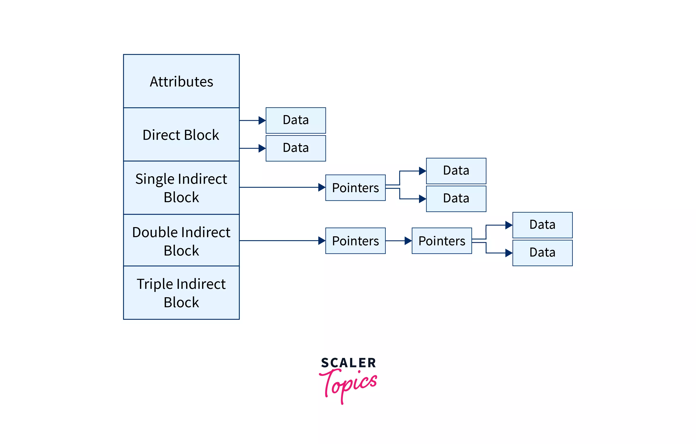

# File Allocation Methods

---

<aside>
💡 Allocation(파일 할당)은 OS가 정보를 메모리 블록에 저장하여 하드 드라이브를 효과적으로 활용하고 파일에 접근할 수 있도록 하는 다양한 방법이다. 주요 목표는 공간 활용을 최적화하고 조각화를 최소화하는 것에 있다

</aside>

# 개념

- 파일이 디스크 블록에 저장되는 방식을 정의한다.
- 세 가지의 파일 할당 방법이 존재한다.
- 효율적인 디스크 공간 활용과 파일 블록에 대한 빠른 액세스를 제공할 수 있도록 한다.

# 1. **Contiguous Allocation(연속 할당)**

- 이 구성표에서 각 파일은 디스크의 연속된 블록 세트를 차지한다.
    - 예를 들어, 파일에 n 블록이 필요하고 블록 b가 시작 위치로 지정된 경우 파일에 할당된 블록은 *b, b+1, b+2,…b+n-1*이 된다*.*
    - 이는 시작 블록 주소와 파일 길이(필요한 블록 측면에서)가 주어지면 파일이 차지하는 블록을 결정할 수 있음을 의미한다.
    - *그림의 'mail' 파일은* 길이 = 6 블록인 블록 19에서 시작한다. 따라서 *19, 20, 21, 22, 23, 24* 블록을 차지한다.
- 각 파일은 디스크의 연속된 여유 공간 블록을 차지한다.
    - 즉, 특정 파일에 대한 모든 데이터가 디스크의 하나의 연속 섹션에 저장된다.
    - 파일이 생성되면 OS는 파일을 수용할 수 있을 만큼 큰 여유 공간이 있는 연속 블록을 검색한다
    - 블록이 발견되면 파일은 해당 블록에 저장되고 OS는 시작 주소와 크기를 추적한다.
- 이는 시작 블록 주소와 파일 길이가 주어지면 파일이 차지하는 블록을 결정할 수 있음을 의미한다
- 연속 할당된 파일의 디렉터리 항목에는 시작 블록의 주소와 할당된 부분의 길이가 포함된다.

## 1-1. **장점**

- 순차 액세스와 직접 액세스가 모두 지원된다.
    - 직접 접근을 위해서는 b 블록에서 시작하는 파일의 k번째 블록 주소를 (b+k)로 쉽게 구할 수 있다.
- 파일 블록이 연속적으로 할당되어 탐색 횟수가 최소화되어 매우 빠르다.
- OS가 파일의 시작 주소만 기억하면 되므로 파일에 대한 빠른 접근을 제공할 수 있다
    - 사용자가 파일에 대한 접근을 요청하면 OS는 파일의 시작 주소를 빠르게 찾아 전체 파일을 순차적으로 읽을 수 있다
    - 인접한 블록에 저장될 때 더 빠르게 접근할 수 있는 비디오 또는 오디오 파일과 같은 대용량 파일에 특히 유용하다

## 1-2. **단점**

- 이 방법은 내부 단편화와 외부 단편화가 모두 발생한다. 이는 메모리 활용 측면에서 비효율적이다.
- 파일 크기를 늘리는 것은 특정 인스턴스의 연속 메모리 가용성에 따라 달라지기 때문에 어렵다.
- 파일이 삭제되거나 새 파일이 생성될 때 조각화가 발생할 수 있다.
    - 파일이 삭제되면 해당 파일이 차지했던 공간은 빈 공간이 되지만, 해당 공간이 디스크에 남아 있는 여유 공간과 연속되지 않을 수 있다.
    - 이로 인해 디스크 전체에 여유 공간의 간격이나 조각이 분산되어 OS가 새 파일을 위한 연속 여유 공간 블록을 찾는 것이 어려워질 수 있다.
- 생성 시 파일 크기의 초기화가 필요하며, 사전 초기화로 인해 파일의 크기를 늘릴 수 없다.

# 2. **Linked List Allocation(연결리스트 할당)**

- **이 구성표에서 각 파일은 연속 될 필요가 없는** 디스크 블록의 연결된 목록이다. 디스크 블록은 디스크의 어느 곳에나 분산될 수 있다.
    - 디렉토리 항목에는 시작 및 끝 파일 블록에 대한 포인터가 포함되어 있다. 각 블록에는 파일이 차지하는 다음 블록에 대한 포인터가 포함되어 있다.
    - 이미지의 'jeep' 파일은 블록이 무작위로 분포되는 방식을 보여준다. 마지막 블록(25)에는 널 포인터를 나타내는 -1이 포함되어 있으며 다른 블록을 가리키지 않는다.
- 파일이 디스크의 여유 공간 중 연속되지 않은 블록에 저장되고, 각 블록은 포인터를 사용하여 다음 블록에 연결된다.
    - 파일이 생성되면 OS는 파일을 저장할 수 있을 만큼 큰 일련의 사용 가능한 블록을 검색하고, 포인터를 사용하여 연결한다.
    - 각 블록에는 파일의 다음 블록 주소가 포함되어 있어 OS가 포인터 체인을 따라 전체 파일에 접근할 수 있다.

## 2-1. **장점**

- 파일이 연속되지 않은 여러 블록에 저장될 수 있으므로, 모든 크기의 파일을 수용할 수 있다.
- 즉, 여유 공간 블록을 찾을 필요 없이 디스크의 사용 가능한 여유 공간에 파일을 저장할 수 있으므로 조각화를 방지한다.

## 2-2. 단**점**

- 파일 블록은 디스크에 무작위로 배포되므로 모든 블록에 개별적으로 액세스하려면 많은 수의 검색이 필요하다. 이로 인해 연결된 할당이 느려진다.
- 무작위 또는 직접 액세스는 지원하지 않는다. 파일 블록에 직접 접근할 수는 없다. 파일의 시작 블록부터 블록 포인터를 통해 k 블록을 순차적으로 탐색(순차 접근)하여 파일의 블록 k에 접근할 수 있다.
- OS가 전체 파일에 접근하기 위해 포인터 체인을 따라야 하므로 파일에 대한 접근 시간이 느려질 수 있다.
    - 각 블록에 파일의 다음 블록에 대한 포인터가 포함되어 있으므로 더 많은 디스크 공간이 필요할 수도 있다.
    - 또한, 포인터가 손상되거나 손실되면 OS가 전체 블록 체인에 접근할 수 없어 전체 파일이 손실될 수 있다.
- 랜덤 접근이나 직접 접근은 지원하지 않으며, 블록의 포인터를 위한 추가 비용이 필요하다.

# **3. Indexed Allocation(인덱스 할당)**

- **이 구성표에서 인덱스 블록**으로 알려진 특수 블록에는 파일이 차지하는 모든 블록에 대한 포인터가 포함되어 있다.
    - 각 파일에는 자체 인덱스 블록이 있다. 인덱스 블록의 i번째 항목에는 i번째 파일 블록의 디스크 주소가 포함된다.
    - 디렉토리 항목에는 이미지에 표시된 것처럼 인덱스 블록의 주소가 포함되어 있다.
- 파일은 연속되지 않은 블록에 저장되지만 각 블록을 함께 연결하는 대신, OS가 파일의 각 블록에 대한 포인터 목록이 포함된 인덱스 블록을 만든다.
    - 파일이 생성되면 OS는 파일을 저장할 수 있을 만큼 큰 일련의 사용 가능한 블록을 검색하고 해당 블록 각각에 대한 포인터가 포함된 인덱스 블록을 생성한다.
    - 그 뒤 파일의 각 블록은 디스크의 별도 블록에 저장된다.
- 인덱스 파일 할당 방법은 여러 유형이 있으며, 대표적인 유형은 다음과 같다.
    - 단일 수준 인덱스
    - 다중 수준 인덱스
    - Combined 인덱스
    - 연결된 인덱스
    - Inverted 인덱스

## 3-1. **장점**

- OS가 파일 블록을 찾기 위해 인덱스 블록만 읽어도 되므로, 파일에 대한 빠른 접근이 가능하다
    - 연속된 여유 공간 블록을 찾을 필요 없이 디스크의 사용 가능한 여유 공간에 파일을 저장할 수 있으므로 조각화를 방지한다
    - 인덱스 블록을 복제하여 중복성을 제공함으로써 데이터 손실 위험을 줄인다

## 3-2. **단점**

- 인덱스 할당의 포인터 오버헤드는 링크 할당보다 크다.
- 매우 작은 파일(예: 2-3개 블록만 확장하는 파일)의 경우 인덱스 할당은 포인터에 대해 하나의 전체 블록(인덱스 블록)을 유지하므로 메모리 활용 측면에서 비효율적이다.
    - 연결 할당에서는 블록당 포인터 1개만 손실된다.
- 인덱스 블록이 디스크에서 상당한 양의 공간을 차지할 수 있으므로 디스크 공간이 낭비될 수 있다
    - 파일의 각 블록이 디스크에 별도로 저장되므로 연결된 파일 할당보다 더 많은 디스크 공간이 필요하다

# 4. 아이노드(Inode)

- UNIX 기반 운영체제에서는 모든 파일이 Inode(Information-node)를 사용하여 색인화된다.
- 파일 시스템 생성과 함께 생성되는 특수 디스크 블록이다.
- 파일이 저장된 다른 블록에 대한 포인터와 함께 이름, 권한, 크기 등과 같은 파일과 관련된 모든 정보를 저장하는 데 사용된다.
- 필드와 관련된 정보를 일부 공간에, 나머지 공간은 실제 파일이 포함된 블록의 주소를 저장하는 데 사용된다.
- 처음 몇 개의 포인터는 블록을 지시한다.
    - 즉, 파일 데이터를 포함하는 디스크 블록의 주소를 포함한다.
    - inode의 몇 가지 포인터는 간접 블록을 가리키며, 간접 블록에는 단일 간접, 이중 간접, 삼중 간접의 세 가지 유형이 있다.
- 파일 접근이 쉬워지며, 읽기-쓰기 및 생성 타임 스탬프는 inode 내부에 저장된다.
- 파일 이름은 inode에 영향을 주지 않으므로 주소를 잃지 않고 단일 파일을 복사하거나 이름을 바꿀 수 있다
- 파일 시스템에 inode가 부족해지면 모든 새 파일과 폴더가 거부된다.