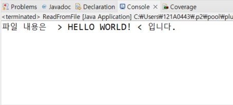
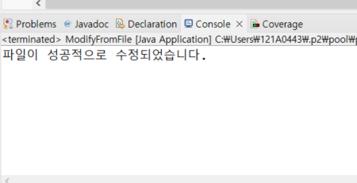

# Implement

---

# 1. 김현희

- JAVA 코드로 TXT파일을 읽어오는 것을 구현하도록 한다.

## 1-1. 바탕화면에 있는 TXT파일을 읽어 콘솔에 출력하기

```java
package hhkim;

import java.io.BufferedReader;
import java.io.BufferedWriter;
import java.io.File;
import java.io.FileFilter;
import java.io.FileReader;
import java.io.FileWriter;
import java.io.IOException;

public class ReadFromFile {

public static void main(String[] args) {

	        // 수정할 파일의 경로
	        String filePath = "C:/Users/121A0443/Desktop/CodingTest.txt";

	        //파일 객체 생성
	        File file = new File(filePath);

	        //파일 객체가 존재하고, 또 그것이 파일이면
	        if (file.exists() && file.isFile()) {
	            try {

	                FileReader fileReader = new FileReader(file);
	                BufferedReader bufferedReader = new BufferedReader(fileReader);

	                // 파일 내용 읽기
	                StringBuilder content = new StringBuilder();
	                String line;
	                /* bufferReader가 한 줄씩 읽어서(readLine메서드) line에 할당한다.
	                	그리고 그것이 null이 아니면  
                    System.out.println("파일 내용은 " + " > " + line  + " < "  + "입니다.");
	                	를 출력한다.
	                */
	                while ((line = bufferedReader.readLine()) != null) {
	                	 System.out.println("파일 내용은 " + " > " + line  + " < "  + "입니다.");
	                }

	                bufferedReader.close(); //반드시 닫아줘야 함.
	                fileReader.close();	//반드시 닫아줘야 함.

	            } catch (IOException e) {
	                e.printStackTrace();
	            }
	        } else {
	            System.err.println("지정된 파일이 존재하지 않거나 파일이 아닙니다.");
	        }
	    }
	}

```

### console 출력



## 1-2. 바탕화면에 있는 TXT파일 내용 수정하기

```java
package hhkim;

import java.io.BufferedWriter;
import java.io.File;
import java.io.FileReader;
import java.io.FileWriter;
import java.io.IOException;

public class ModifyFromFile {
	
	public static void main(String[] args) {
	
	    //수정할 파일의 경로
    	String filePath = "C:/Users/121A0443/Desktop/CodingTest.txt";
    	
    	 // 파일 생성(파라미터로 파일 경로 넣어줌)
	     File file = new File(filePath);
    	
	     //주어진 파일이 존재하고, 그것이 파일이면
     if (file.exists() && file.isFile()) {
    	 try {  //예외 처리를 위한 try~catch 문으로 감싸줌.

         // 파일 내용을 읽어온다.
         StringBuilder content = new StringBuilder();
         
		 /* 파일 내용을 수정. 예를 들어, txt파일을 "Bye Bye!"로 변경한다.
         StringBuilder는 기존의 문자열과 호환되지 않기 때문에 toString()으로 
         문자열을 받아야 한다. */
	    String modifiedContent = content.toString().replace(content, "코딩 좆같다!");
	  
	    /* 파일을 다시 쓰기 위한 FileWriter와 BufferedWriter를 사용 
	    FileWriter : 파일을 열어 텍스트 데이터를 쓰기 위한 클래스
	    			 주로 텍스트 파일에 데이터를 쓰기 위해 사용된다. 
	    두 클래스를 같이 쓰는 것은 필수적이지는 않지만, 같이 쓴다면 파일 쓰기의 성능을 향상시킬 수 있다. */
	    FileWriter fileWriter = new FileWriter(file); 
	    BufferedWriter bufferedWriter = new BufferedWriter(fileWriter);
	   
	    // 수정된 내용을 파일에 쓴다.
	    bufferedWriter.write(modifiedContent);
	  
	    bufferedWriter.close();  //사용 후 반드시 닫아야 한다.
	    fileWriter.close(); //사용 후 반드시 닫아야 한다.
	  
	    System.out.println("파일이 성공적으로 수정되었습니다.");
    	} catch (IOException e) {
    		e.printStackTrace();   //try 블록 내에서 발생한 IOException 예외를 잡아서 처리하는 역할을 한다. 
    	  }
        }else {
        	System.out.println("파일이 아닙니다.");
        }
     }
	
	}
```

### console 출력




# 2. 나큰솔

```java
package test;

import java.io.BufferedReader;
import java.io.BufferedWriter;
import java.io.File;
import java.io.FileReader;
import java.io.FileWriter;
import java.io.IOException;
import java.io.InputStreamReader;

public class test {
	  
	public static void main(String[] args) {
		
		String filePath = "C:\\test\\test.txt";
		File file = new File(filePath);
		
		if(!file.exists())
			
			try {
				
				createFile(filePath);
				System.out.println(readFile(file, filePath));;
				
				BufferedReader br = new BufferedReader(new InputStreamReader(System.in));
				StringBuilder sb = new StringBuilder();
				String input = "";
				
				while(!(input = br.readLine()).equals("STOP")) sb.append(input + "\n");
				updateFile(filePath, sb.toString());
				
				System.out.println(readFile(file, filePath));;
				
			} catch (IOException e) { e.printStackTrace(); }
	}
	
	private static String readFile(File file, String filePath) throws IOException {
		
		StringBuilder returnText = new StringBuilder();
		int nBuffer;
		BufferedReader buffFileReader = new BufferedReader(new FileReader(file));
		
		while((nBuffer = buffFileReader.read()) != -1) returnText.append((char)nBuffer);
		
		buffFileReader.close();
		
		return returnText.toString();
		
	}
	
	private static void updateFile(String filePath, String text) throws IOException {
		
		File file = new File(filePath);
		String fileText = readFile(file, filePath);
		BufferedWriter bufw = new BufferedWriter(new FileWriter(file));
		
		text = fileText + text;
		
		bufw.write(text, 0, text.length());
		bufw.flush();
		bufw.close();
		
	}

	private static void createFile(String filePath) throws IOException {
		
		System.out.println("CREATEFILE");
		int last = filePath.lastIndexOf("\\");
		String dir = filePath.substring(0, last);
		String name = filePath.substring(last + 1, filePath.length());
		
		File dirFolder = new File(dir);
		dirFolder.mkdir();
		
		File f = new File(dirFolder, name);
		f.createNewFile();
		
	}

}
```

# 3. 박경연

## 3-1. .txt 파일 읽기

```java
package coding_test;

import java.io.BufferedReader;
import java.io.File;
import java.io.FileInputStream;
import java.io.IOException;
import java.io.InputStreamReader;

public class FileReadAndModify {

	public static void main(String[] args) {
		//검색할 디렉토리 경로를 지정해준다.
		String directoryPath = "D:\\study_test";
		
		//File 클래스를 사용하여 directoryPath를 기반으로 디렉토리를 나타내는 directory 객체를 생성한다.
        File directory = new File(directoryPath);
        //directory 디렉토리 내에 있는 모든 파일 및 디렉토리를 나타내는 File 객체 배열을 얻는다.
        File[] files = directory.listFiles();

        //files 배열의 각 요소인 file에 대한 반복문을 시작한다.
        for (File file : files) {
        	//현재 file이 파일이면서 확장자가 .txt인 경우를 확인한다.
            if (file.isFile() && file.getName().endsWith(".txt")) {
                try {
                	//file을 읽을 수 있는 FileInputStream 객체를 생성한다.
                    FileInputStream fileInputStream = new FileInputStream(file);
                    //fileInputStream을 UTF-8 문자 인코딩을 사용하는 InputStreamReader로 래핑한다. 
                    //이것은 파일을 텍스트로 읽을 때 사용되며 한글을 제대로 표시하도록 도와준다.
                    InputStreamReader inputStreamReader = new InputStreamReader(fileInputStream, "UTF-8"); // UTF-8 인코딩 사용
                    //inputStreamReader를 BufferedReader로 래핑한다. BufferedReader는 텍스트를 한 줄씩 읽을 수 있도록 해준다.
                    BufferedReader bufferedReader = new BufferedReader(inputStreamReader);

                    //현재 파일의 이름을 콘솔에 출력한다.
                    System.out.println("파일: " + file.getName());
                    //문자열 변수 line을 선언한다.
                    String line;
                    //bufferedReader를 사용하여 파일 내용을 한 줄씩 읽어 line 변수에 저장하고, 파일의 끝에 도달할 때까지 반복한다.
                    while ((line = bufferedReader.readLine()) != null) {
                        //현재 읽은 행을 콘솔에 출력한다.
                    	System.out.println(line);
                    }

                    bufferedReader.close();
                    inputStreamReader.close();
                    fileInputStream.close();
                  //파일 읽기 및 입출력 예외가 발생한 경우 예외 처리를 시작한다.
                } catch (IOException e) {
                	//예외 정보를 콘솔에 출력한다.
                    e.printStackTrace();
                }
            }
        }
	}

}

=====================================================================================
<결과값>
파일: study_file.txt
집갈래욘
```

## 3-2. .txt 파일 수정 후 저장

```java
package coding_test;

import java.io.BufferedWriter;
import java.io.File;
import java.io.FileOutputStream;
import java.io.IOException;
import java.io.OutputStreamWriter;
import java.util.Scanner;

public class ModifyTextFile {

	public static void main(String[] args) {
		//디렉토리 경로를 지정
		String directoryPath = "D:\\study_test";

        // 사용자로부터 입력 받을 텍스트
		//Scanner 클래스를 사용하여 사용자로부터 입력을 받기 위한 scanner 객체를 생성한다.
        Scanner scanner = new Scanner(System.in);
        System.out.print("수정할 텍스트를 입력하세요: ");
        //사용자로부터 입력받은 텍스트를 newText 문자열 변수에 저장한다.
        String newText = scanner.nextLine();
        scanner.close();

        //File 클래스를 사용하여 directoryPath를 기반으로 디렉토리를 나타내는 directory 객체를 생성한다.
        File directory = new File(directoryPath);
        //directory 디렉토리 내에 있는 모든 파일 및 디렉토리를 나타내는 File 객체 배열을 얻는다.
        File[] files = directory.listFiles();

        //files 배열의 각 요소인 file에 대한 반복문을 시작한다.
        for (File file : files) {
        	//현재 file이 파일이면서 확장자가 .txt인 경우를 확인한다.
            if (file.isFile() && file.getName().endsWith(".txt")) {
            	//파일 쓰기 작업을 시도하는 try 블록을 시작한다.
                try {
                    // 수정할 내용을 파일에 쓰기
                	//현재 file을 쓸 수 있는 FileOutputStream 객체를 생성한다.
                    FileOutputStream fileOutputStream = new FileOutputStream(file);
                    //fileOutputStream를 UTF-8 문자 인코딩을 사용하는 OutputStreamWriter로 래핑한다. 
                    //이것은 파일에 텍스트를 쓸 때 사용된다.
                    OutputStreamWriter outputStreamWriter = new OutputStreamWriter(fileOutputStream, "UTF-8");
                    //outputStreamWriter를 BufferedWriter로 래핑합니다. BufferedWriter는 텍스트를 한 줄씩 쓸 수 있도록 해준다.
                    BufferedWriter bufferedWriter = new BufferedWriter(outputStreamWriter);

                    //newText를 파일에 작성한다.
                    bufferedWriter.write(newText);

                    bufferedWriter.close();
                    outputStreamWriter.close();
                    fileOutputStream.close();

                    //현재 파일의 이름을 포함한 메시지를 콘솔에 출력한다.
                    System.out.println("파일 수정 및 저장 완료: " + file.getName());

                  //파일 쓰기 예외가 발생한 경우 예외 처리를 시작한다.
                } catch (IOException e) {
                	//예외 정보를 콘솔에 출력한다.
                    e.printStackTrace();
                }
            }
        }
	 }
}

=====================================================================================
<결과값>
수정할 텍스트를 입력하세요: 집가자요
파일 수정 및 저장 완료: study_file.txt
```