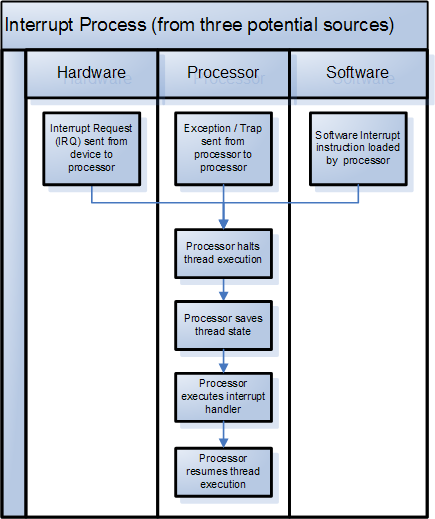
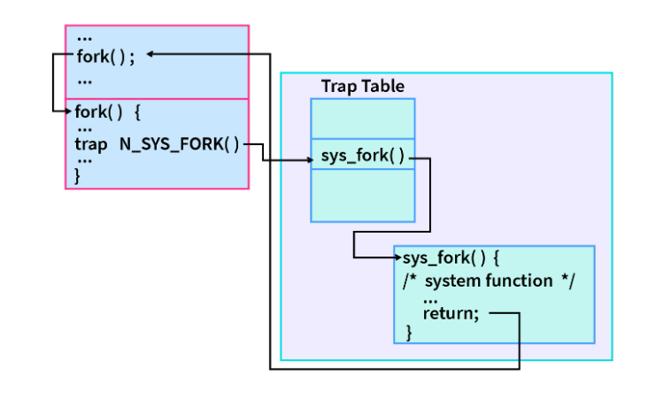
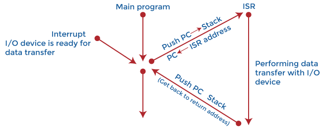
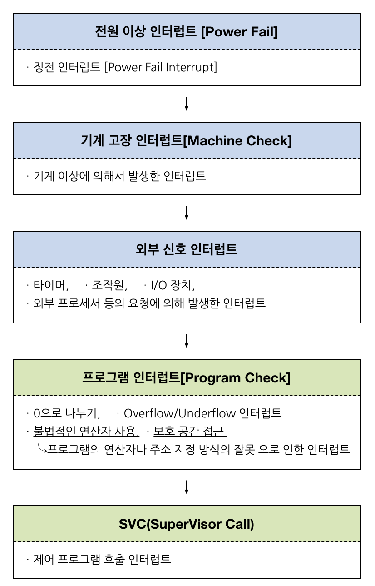

# Interrupt

---

# 정의

- 인터럽트는 컴퓨터에 연결된 장치나 컴퓨터 내의 프로그램에서 발생하는 신호다.
- 인터럽트는 서비스나 현재 프로세스를 일시적으로 중지하거나 종료한다.
- 운영 체제를 중지하고 다음에 수행할 작업을 파악해야 한다.
    - 우선적으로 처리해야 할 일이 발생하였을 때 그것을 처리하고 원래 동작으로 돌아온다.
- 대부분의 I/O 장치에는 ISR(Interrupt Service Rutine)이라는 버스 제어 라인이 있으며 이를 통해 서비스나 프로세스를 중지 및 종료하는 작업을 제어한다.
- 인터럽트 신호는 계획될 수도(프로그램에 의한 요청), 계획되지 않을 수도(시스템에서 실행 중인 프로그램과 관련되지 않은 이벤트로 인해 발생) 있다.
- 오늘날 거의 모든 컴퓨팅 시스템은 인터럽트 기반으로 이루어져 있다. 컴퓨팅 시스템은 프로그램의 컴퓨터 명령어 목록을 따르고 끝에 도달하거나 인터럽트 신호를 감지할 때까지 명령어를 실행한다.
- 인터럽트 신호가 감지되면 컴퓨터는 현재 프로그램 실행을 재개하거나 다른 프로그램 실행을 시작한다. 두 경우 모두 다음 작업을 결정하는 동안 작업을 중지해야 한다.
- 장치 프로세서는 인터럽트를 처리할 때 IRQ(인터럽트 요청, Interrupt ReQuest)이 인식되었음을 신호를 보내는 장치에 알린다. 그 뒤 장치는 IRQ 신호 전송을 중지한다.
- OS에는 일반적으로 인터럽트의 우선 순위를 지정하고 둘 이상이 처리 대기 중인 경우 대queue에 저장하는 Interrupt handler 코드가 포함되어 있다. 또한, 제어할 다음 프로그램을 결정하는 scheduler 프로그램도 있다.
- 인터럽트가 발생하면 관련 서비스가 즉시 시작되지 않을 수 있으며, 인터럽트가 발생한 시간과 ISR 실행이 시작되는 시간 사이의 간격을 인터럽트 대기 시간이라고 한다.
- 일반적으로 내부 장치 및 소프트웨어 프로그램에서 발생하는 인터럽트 신호를 소프트웨어 인터럽트, 외부 장치 및 I/O 장치에서 발생하는 인터럽트 신호와 CPU에 대한 인터럽트를 하드웨어 인터럽트라고 한다.

<aside>
💡 **ISR(Interrupt Service Routine)** : 모든 인터럽트마다 ISR이 존재한다. 각 ISR의 주소는 메모리의 고정된 위치에 저장된다. ISR은 비동기 인터럽트를 호출하고 **Maskable Interrupts**와 **Non-Maskable Interrupts**를 모두 처리할 수 있다.
실행 시작 시 ISR은 다른 장치 인터럽트 서비스를 비활성화한다. ISR 실행이 완료된 후 인터럽트 서비스를 다시 초기화한다.
어떤 소프트웨어나 하드웨어가 인터럽트를 발생시켰는지 알아내고, 이에 대해 CPU에 알리는 역할을 담당한다.

</aside>

# 특징

- 오늘날 거의 모든 컴퓨팅 시스템은 인터럽트 기반이다.
- 장치가 프로세스 i에서 인터럽트를 발생시키면 프로세서는 먼저 명령 i의 실행을 완료한다.
- 그 다음, ISR의 첫 번째 명령어 주소로 프로그램 카운터(PC)를 로드한다.
- 프로그램 카운터에 주소를 로드하기 전에 중단된 명령어의 주소가 임시 위치로 이동된다.
- 따라서, 인터럽트를 처리한 후 프로세서는 프로세스 i+1을 계속할 수 있다.
- 프로세서는 인터럽트를 처리하는 동안 해당 요청이 인식되었음을 장치에 알려 인터럽트 요청 신호 전송을 중지해야 한다.
- 또, 나중에 중단된 프로세스를 복원할 수 있도록 레지스터를 저장하면 인터럽트가 수신된 시간과 ISR 실행 시작 사이의 지연이 늘어난다. 이를 **인터럽트 대기 시간**이라고 한다.
- 단일 컴퓨터는 한 번에 하나의 컴퓨터 명령만 수행할 수 있다. 그러나 중단될 가능성이 있으므로 프로그램이나 명령 집합이 수행되는 방식을 관리할 수 있다. 이것을 **멀티태스킹**이라고 한다.
    
    → 사용자는 다양한 작업을 동시에 수행할 수 있으며 컴퓨터는 사용자가 시작하는 프로그램을 관리하게 된다. 물론 컴퓨터는 모든 사용자 작업이 동시에 수행되는 것처럼 보이게 작동된다.
    
- 인터럽트 핸들러는 인터럽트의 우선순위를 지정하고 둘 이상이 처리 대기 중인 경우 큐에 저장한다.
- 다음에 제어할 프로그램을 파악하는 **스케줄러**라는 프로그램이 존재한다.

# Type of Interrupt

### Hadware Interrupt

- 하드웨어 인터럽트는 OS의 주의가 필요함을 나타내는 외부 하드웨어 장치의 전자 신호다. 예시로는 키보드를 누르거나 마우스를 움직이는 행위가 있다. 이러한 예시에서 프로세서는 해당 순간에 마우스 위치나 키 입력을 읽기 위해 중지해야 한다.
- 하드웨어 인터럽트에서는 모든 장치가 IRL(Interrupt Request Line)에 연결된다. 일반적으로 하드웨어 IRQ에는 이를 특정 장치와 연결하는 값이 있다. 이를 통해 프로세서는 IRQ를 높여 어떤 장치가 서비스를 요청하는지 확인한 다음 그에 따라 서비스를 제공할 수 있다.
- Timer, Keyboard 입력, mouse 입력, DMA 등
- 인터럽트는 **시스템 버스를 통해 전달**된다.
- 프로세서에는 일반적으로 하드웨어 인터럽트를 선택적으로 활성화 및 비활성화할 수 있는 내부 인터럽트 마스크 레지스터가 있다.

1. **Maskable interrupts**
    - CPU의 명령에 의해 비 활성화되거나 무시될 수 있는 하드웨어 인터럽트
    - 프로세서에서 내부 인터럽트 마스크 레지스터는 하드웨어 요청을 선택적으로 활성화 및 비 활성화한다. 마스크 비트가 설정되면 인터럽트가 활성화되며 마스크 비트가 지워지면 비 활성화된다. 마스크의 영향을 받는 신호는 마스크 가능한 인터럽트다.
    - 일부 시스템에서는 비트가 설정되면 인터럽트가 활성화되고 비트가 지워지면 비활성화되는 반면, 다른 시스템에서는 설정된 비트가 인터럽트를 비활성화한다. 인터럽트가 비활성화되면 프로세서는 관련 인터럽트 신호를 무시한다. 마스크의 영향을 받는 신호를 ***마스크 가능한 인터럽트***라고 한다.
    - Interrupt Mask(인터럽트가 발생하였을 때 요구를 받아들일지 말지 지정하는 것)가 가능
    - 인텔CPU 에서 **INTR pin**으로 신호가 들어온다.
    
2. **Non-maskable interrupts**
    - CPU 명령에 의해 비 활성화되거나 무시될 수 없는 하드웨어 인터럽트
    - 경우에 따라 인터럽트 마스크를 비 활성화할 수 없으므로 일부 인터럽트 신호에 영향을 미치지 않는다.
    - 마스크할 수 없는 인터럽트이며 일반적으로 무시할 수 없는 우선순위가 높은 이벤트다.
    - 인터럽트 마스크는 일부 인터럽트 신호에 영향을 미치지 않으므로 비활성화할 수 없다. ***이를 마스크 불가능 인터럽트*** 라고 한다. NMI는 즉시 처리해야 하고 감시 타이머의 시간 초과 신호와 같이 어떤 상황에서도 무시할 수 없는 우선 순위가 높은 이벤트를 나타낸다. ***인터럽트를 마스크하는*** 것은 비활성화하는 것이고, 인터럽트를 ***마스크 해제하는 것은 활성화하는 것이다.***
    - Mask가 불가능
    - 거부, 무시할 수 없음 (매우 중요함)
    - 정전, 하드웨어 고장 등 어쩔 수 없는 오류
    - 인텔 CPU에서 **NMI pin**으로 신호가 들어옴
    
3. **Spurious interrupts**
    - phantom interrupt, ghost interrupt로도 알려진 인터럽트로, 가짜(Spurious) 인터럽트는 소스를 찾을 수 없는 하드웨어 인터럽트 유형이다. 가짜 인터럽트는 시스템이 오작동 하는지 식별하기 어려우며, ISR이 가짜 인터럽트 가능성을 고려하지 않으면 시스템 교착 상태가 발생할 수 있다.
    - 레벨 감지 프로세서 입력에 연결된 유선 OR 인터럽트 회로에서 문제가 되는 경향이 있다.
    - 소스를 찾을 수 없는 하드웨어 인터럽트이다. 이 현상을 설명하기 위해 팬텀 인터럽트 또는 고스트 인터럽트라는 용어도 사용할 수 있다. 스퓨리어스 인터럽트는 레벨 감지 프로세서 입력에 연결된 유선 OR 인터럽트 회로에서 문제가 되는 경향이 있다. 이러한 인터럽트는 시스템이 오작동할 때 식별하기 어려울 수 있다.
    - Wired-OR 회로에서는 인터럽트 라인의 바이어스 저항을 통한 기생 용량 충전/방전으로 인해 프로세서가 인터럽트 소스가 삭제되었음을 인식하기 전에 약간의 지연이 발생한다. 인터럽트 서비스 루틴(ISR)에서 인터럽트 장치가 너무 늦게 클리어되면 현재 ISR 인스턴스가 종료되기 전에 인터럽트 회로가 정지 상태로 돌아갈 시간이 충분하지 않다. 그 결과 프로세서는 인터럽트 요청 입력의 전압이 명확한 내부 논리 1 또는 논리 0을 설정할 만큼 높거나 낮지 않기 때문에 다른 인터럽트가 보류 중이라고 생각하게 된다.
    - ISR이 이러한 인터럽트 발생 가능성을 고려하지 않는 경우 가짜 인터럽트로 인해 시스템 교착 상태 또는 기타 정의되지 않은 작업이 발생할 수 있다. 가짜 인터럽트는 대부분 유선 OR 인터럽트 회로의 문제이므로 이러한 시스템에서 좋은 프로그래밍 방법은 ISR이 모든 인터럽트 소스의 활동을 확인하고 소스 중 어느 것도 인터럽트하지 않으면 조치를 취하지 않는 것이다.
    

<aside>
💡 ***하드웨어 인터럽트 종류***

- 입출력 인터럽트 (I/O interrupt) - 입출력 작업의 종료나 입출력 오류에 의해 CPU의 기능이 요청됨
- 정전,전원 이상 인터럽트(Power fail interrupt) - 전원 공급의 이상
- 기계 착오 인터럽트(Machine check interrupt) - CPU의 기능적인 오류
- 외부 신호 인터럽트(External interrupt) - I/O 장치가 아닌 오퍼레이터나 타이머에 의해 의도적으로 프로그램이 중단된 경우
</aside>

### Software Interrupt

프로세스가 fork() 시스템 호출을 실행할 때 소프트웨어 인터럽트인 인터럽트가 생성되고 이 인터럽트는 ISR에 의해 처리된다. 일단 인터럽트 요청이 서비스되면 제어는 다시 전달된다.

- 소프트웨어 인터럽트는 응용 프로그램이 종료되거나 OS의 특정 서비스를 요청할 때 발생한다.
- 일반적으로 프로세서는 특정 조건이 충족되면 특수 명령을 실행하여 소프트웨어 인터럽트를 요청한다. 이 명령어는 인터럽트를 호출하고 서브루틴 호출과 같은 기능을 한다.
- 소프트웨어 인터럽트는 시스템이 장치 드라이버와 상호 작용하거나 프로그램이 OS 서비스를 요청할 때 일반적으로 사용된다.
- 어떤 경우에는 소프트웨어 인터럽트가 의도한 것이 아닌 프로그램 실행 오류로 인해 예기치 않게 발생할 수 있다. 이를 exceptions나 traps라고 한다.
- 0으로 나누면 소프트웨어 인터럽트를 발생시키는 반면, fork() 시스템 호출을 사용하는 동안 fork()도 소프트웨어 인터럽트를 호출한다.
- CPU내부에서 자신이 실행한 명령이나 CPU의 명령 실행에 관련된 모듈이 변화하는 경우 발생한다.
- 프로세서는 특정 명령을 실행하거나 특정 조건이 충족될 때 소프트웨어 인터럽트를 요청한다. 모든 소프트웨어 인터럽트 신호는 특정 인터럽트 핸들러와 연관되어 있다.
- 의도적으로 실행될 때 인터럽트를 호출하는 특수 명령을 실행하면 소프트웨어 인터럽트가 의도적으로 발생할 수 있다. 이러한 명령어는 서브루틴 호출과 유사하게 작동하며 운영 체제 서비스 요청 및 장치 드라이버와의 상호 작용과 같은 다양한 목적으로 사용된다.
- **system call**로써 구현될 수 있다.
- 프로그램이 돌다가 인터럽트 발생 시 발생 전에 실행 중인 그 정보를 저장하고 있어야(스택 영역에) 다음에 다시 돌아와서 이전 프로그램을 실행할 수 있다.

<aside>
💡 ***소프트웨어 인터럽트 종류***

- 프로그램 검사 인터럽트 (Program check interrupt)
- 0으로 나누는 경우
- OverFlow/UnderFlow
- 페이지 부재
- 부당한 기억장소의 참조
- SVC(Supervisor Call: 감시프로그램 호출)인터럽트
- 사용자가 프로그램을 실행시키거나 supervisior을 호출하는 동작을 수행하는 경우
- 프로그래머에 의해 코드로 짜인 감시 프로그램을 호출하는 방식
</aside>

# Polling

- 폴링(Polling)은 컴퓨터 시스템의 마이크로 컨트롤러가 모든 장치의 상태를 지속적으로 확인하는 지속적인 모니터링 상태이다.
- 즉, 기본적으로 CPU가 I/O 장치를 서비스하는 프로토콜이다.
- 인터럽트와 폴링 모두에서 CPU는 수행 중인 작업을 일시 중지하고 필수 작업을 실행하도록 한다.
- IRQ 비트를 만난 첫 번째 장치가 먼저 서비스를 받고 해당 장치를 서비스하기 위해 적절한 ISR(Insterrupt Service Routine)이 호출된다.
- 마이크로 컨트롤러는 폴링에 모든 처리 시간을 사용하기에 동시 작업을 수행할 수 없다. 또한 모든 장치의 IRQ 비트를 조사하는 데 많은 시간이 낭비된다.
- 결과적으로 CPU 시간의 대부분이 불필요한 폴링에 낭비되게 되므로 비효율적인 방법이다.
- 인터럽트를 사용함으로서 컨트롤러가 장치 상태를 정기적으로 모니터링 할 필요가 없어지며, 인터럽트가 발생할 때만 응답하도록 할 수 있다.
- 즉 인터럽트가 발생하면 컨트롤러에 서비스가 필요하다는 알림이 전달된다.

# Difference between interrupt and polling

| Interrupt | Polling |
| --- | --- |
| 인터럽트는 CPU에 주의가 필요하다는 알림을 보내는 프로세스다. | 폴링은 CPU가 장치의 상태를 지속적으로 확인하여 CPU의 주의가 필요한지 확인하는 프로세스다. |
| 하드웨어 메커니즘으로 간주된다. | 프로토콜이다. |
| 인터럽트 핸들러는 장치를 서비스하고 장치와 함께 작동한다 | CPU가 장치에 서비스를 제공한다. |
| 인터럽트 요청 라인으로 장치에 서비스가 필요함을 나타낸다. | 명령 준비 비트로 장치에 서비스가 필요함을 나타낸다. |
| CPU는 장치에 서비스가 필요할 때만 사용된다. | CPU는 장치에 서비스가 필요한지 기다리고 확인해야 한다 |
| 인터럽트는 CPU 사이클을 절약한다 | 폴링은 많은 CPU 주기를 낭비한다 |
| 인터럽트는 언제든지 발생할 수 있다. | CPU는 일정한 시간 간격으로 장치를 폴링한다 |
| 장치가 CPU를 자주 중단하면 비효율적이게 된다. | CPU가 서비스할 준비가 된 장치를 거의 찾지 못하면 폴링이 비효율적이 된다.  |

# IRQ(Interrupt Request)

- 인터럽트 요구 라인(Interrupt Request Line)을 의미한다. 컴퓨터 프로세스에서 전송되는 인터럽트의 라인이다.
- IRQ는 여러 장치가 컴퓨터에 연결되어 있는 경우 중요하다.
- 컴퓨터에 연결된 모든 장치는 고유한 데이터 회선은 채널을 통해 IRQ와 통신한다. 여기에는 디스크 드라이브 컨트롤러, 사운드 카드, 프린터, 키보드 및 마우스가 포함된다.
- IRQ가 참조될 때마다 IRQ 번호라고도 하는 채널 번호와 함께 발생한다. 각 장치에는 고유한 IRQ 번호가 할당된다.
- 장치에 입력을 제공하거나 특정 작업을 시작하려면 고유한 IRQ 번호가 필요하다. IRQ 번호를 통해 다양한 장치에 우선순위를 할당하며 적절한 CPU 응답을 촉진한다.
- IRQ 번호가 낮을수록 입력이나 작업의 필요성이 더 중요해진다. 다음은 PC에 대한 일반적인 IRQ 할당
    
    
    | IRQ# | 장치 |
    | --- | --- |
    | 0 | 시스템 타이머 |
    | 1 | 키보드(PS/2) |
    | 2 | IRQ 9의 캐스케이드 |
    | 3 | COM 포트 2, 4 |
    | 4 | COM 포트 1, 3 |
    | 5 | 병렬(프린터) 포트 2 또는 사운드 카드 |
    | 6 | 플로피 드라이브 컨트롤러 |
    | 7 | 병렬(프린터) 포트 1 |
    | 8 | 실시간 시계 |
    | 9 | 동영상 |
    | 10 | Open |
    | 11 | Open |
    | 12 | 마우스(PS/2) |
    | 13 | 보조 프로세서 |
    | 14 | 기본 IDE 컨트롤러(하드 드라이브) |
    | 15 | 보조 IDE 컨트롤러(하드 드라이브) |

# ISR(Interrupt Service Routine)

- 인터럽트 서비스 루틴, 인터럽트 핸들러를 의미한다. 하드웨어 장치의 인터럽트 요청에 의해 호출되는 소프트웨어 프로세스다.
- 인터럽트가 걸리고 정해진 내용을 처리하는 과정이 인터럽트 서비스, 만들어진 내용(함수)를 인터럽트 서비스 루틴이라고 한다.
- ISR은 인터럽트를 검사하고, 처리하는 방법을 결정하고, 실행하고, 논리적인 인터럽트 값을 CPU로 반환하여 활성 프로세스를 중단한다. ISR이 완료되면 프로세스가 재개된다.
- ISR은 데이터를 CPU 레지스터나 하드웨어 포트에서 메모리 버퍼로 이동할 수 있지만 일반적으로 IST(Interrupt Service Thread)라고 하는 전용 인터럽트 스레드(또는 작업)를 사용하여 필요한 대부분의 처리를 수행한다.
- 모든 인터럽트에는 실행할 ISR이 하나만 있으며 이 Context에서 실행되는 코드는 차단될 수 없기에 ISR의 실행은 원자적이다. 프로세서가 인터럽트를 수신하면 제어가 ISR로 전환된다.
- ISR 실행이 완료된 후 제어는 중단된 프로그램으로 돌아간다. 기술적으로 인수는 ISR에 전달되지 않으며 아무것도 반환하지 않는다.

# Mechanism of Interrupt Handling

- 인터럽트의 기본은 I/O 장치를 누를 때마다 CPU가 확인하는 것이 아닌, I/O 장치가 CPU를 중단시키는 것에 있다.
- I/O 장치는 $\overline{INTR}$ 신호를 CPU에 보내 인터럽트를 요청한다
- CPU는 $\overline{INTR}$ 신호를 수신할 때마다 현재 명령어의 실행을 완료한 다음 ISR을 실행한다. CPU가 준비되면 INTA 라인을 통해 승인 신호를 보낸다
- ISR이 실행되고 CPU는 기본 프로그램으로 돌아간다
- I/O 장치는 실행 후 $\overline{INTR}$ 신호를 끈다.
명령어 주기가 fetch, decode, execute and read/write로 되어 있다.
- 모든 명령 주기 후에 프로세서는 처리할 인터럽트를 확인한다.
- 시스템에 인터럽트가 없으면 명령어 레지스터에서 제공하는 다음 명령어 주기로 이동한다.
- 인터럽트가 있으면 인터럽트 핸들러가 트리거된다.
- 핸들러는 처리 중인 현재 명령어를 중지하고 해당 구성을 레지스터에 저장하고 인터럽트 벡터 테이블에 지정된 위치에서 인터럽트의 프로그램 카운터를 로드한다.
- 프로세서가 인터럽트를 처리한 후 인터럽트 핸들러는 저장된 레지스터에서 명령어와 해당 구성을 로드한다.
1. **FLIH( First Level Interrupt Handler** )
- 하드 인터럽트 핸들러 또는 빠른 인터럽트 핸들러. 이러한 인터럽트 핸들러는 프로세스 실행 중에 더 많은 지터를 가지며 주로 마스크 가능한 인터럽트이다.
1. **SLIH( Second Level Interrupt Handler )**
- 소프트 인터럽트 핸들러와 느린 인터럽트 핸들러이다. 이러한 인터럽트 핸들러는 지터가 적다.

<aside>
💡 **지터(Jitter)**

지터는 고주파수 디지털 신호의 신호 펄스에 대한 편차 또는 변위. 편차는 진폭, 위상 타이밍 또는 signal Pulse(신호**** 진폭이 기준 값에서 더 높거나 낮은 값으로 급격하고 일시적으로 변경된 후 기준 값으로 빠르게 돌아가는 것) 폭에 따라 달라질 수 있다.

지터로 인해 디스플레이 모니터가 깜박이고, 데스크탑이나 서버의 프로세서가 의도한 대로 작동하는 능력에 영향을 미치고, 오디오 신호에 클릭이나 기타 원치 않는 효과가 발생하고, 네트워크 장치 간에 전송된 데이터가 손실될 수 있다. 허용되는 지터의 양은 애플리케이션에 따라 크게 달라진다.

</aside>

# 인터럽트에 대한 CPU의 응답

- 운영 체제의 작동 방식을 이해하는 데 있어 중요한 점은 인터럽트가 발생할 때 CPU가 수행하는 작업을 이해하는 것이다.
- CPU 하드웨어는 각 인터럽트에 대해 동일한 작업을 수행하여 운영 체제가 현재 실행 중인 사용자 프로세스를 제어할 수 있도록 한다.
- OS 커널에서 코드를 실행하기 위해 실행 중인 프로세스를 전환하는 것을 **Context Switching**이라고 한다.
- 인터럽트를 처리하는 동안 다음 단계가 필요하다.
    1. 인터럽트 처리와 관련된 첫 번째 단계는 인터럽트의 우선순위를 확인하는 것이다.
    2. 현재 실행 중인 프로세스에 비해 우선순위가 낮을 경우 인터럽트가 메모리에 저장된다.
    3. 현재 실행 중인 프로세스에 비해 우선순위가 높으면 CPU는 현재 프로세스의 context를 저장한다.
    4. CPU는 인터럽트를 호출한 새 프로세스를 로드하고 이를 실행한다.
    5. 요청된 서비스가 완료되면 CPU는 인터럽트 이전에 실행 중이던 프로세스를 로드하고 실행이 중단된 곳부터 실행을 재개한다.

# 우선순위

# 처리 과정

- 인터럽트를 발생시키기 위해 하드웨어/소프트웨어는 cpu내에 있는 `인터럽트 라인`을 세팅하여 인터럽트를 발생시킨다.
- cpu는 매번 명령을 수행하기 전에 인터럽트 라인이 세팅되어 있는지를 검사한다.
- 시스템 콜은 커널 영역의 기능을 사용자 모드가 사용 가능하게, 즉 프로세스가 하드웨어에 직접 접근해서 필요한 기능을 사용할 수 있게 해준다.

- 위 그림이 시사하는 바는 다음과 같다. 우선, 명령어 사이클은 `인출(fetch stage)`과 `실행(execution stage)` 두 가지 단계를 반복해서 수행한다. 그런데 인터럽트 요청이 들어왔다고 해서 바로 이를 처리하는 것이 아니라, 명령어 N의 `실행` 단계를 마쳐야 한다.
- 명령어의 실행단계를 마칠 때마다 중앙처리장치는 `반복적으로` 인터럽트 요청이 있는지 계속해서 확인한다. 인터럽트 요청이 있어야 인터럽트 서비스 단계를 진행한다.
- 좀 더 큰 개념으로 살펴본다면 아래와 같은 그림이 된다.

- 루틴(routine)이라는 말은, 운동선수에게 반드시 따라다니는 말이기도 한데, 반복적으로 수행하는 일을 의미한다. 인터럽트 처리과정에서 가장 핵심적인 내용은 `인터럽트 서비스 루틴`이다. 즉, 어떤 소스(source)가 인터럽트 요청을 하면 반복적으로 수행하는 일이 있다는 뜻이다. 다른 말로 `인터럽트 핸들러`(interrupt handler)라고도 한다.

<aside>
💡 ***인터럽트 서비스 루틴 Interrupt Service Routine(ISR)***

- 인터럽트 핸들러 Interrupt handler 라고도 함
- 인터럽트가 접수되면 각각의 인터럽트에 대응하여 특정 기능을 처리하는 기계어 코드 루틴(커널이 실행)
- ex) 키보드 자판을 눌러 키보드 인터럽트가 발생하면 이에 해당하는 인터럽트 서비스 루틴이 실행됨
</aside>

<aside>
💡 ***인터럽트 벡터 Interrupt Vector***

- 여러가지 인터럽트에 대해 해당 인터럽트 발생 시 처리해야 할 루틴(ISR)의 주소를 보관하고 있는 공간(배열)
- 대부분의 CPU들은 인터럽트 벡터 테이블을 가지고 있음
- 인텔x86에서는 이를 IDT(Interrupt Descriptor Table)이라고 한다.
</aside>

<aside>
💡 ***IRET(Interrupt Return) 명령어**
이전 태스크로 다시 돌아가는 어셈블리 명령어. ISR의 마지막 명령어.*

</aside>

- 소스(source)마다 처리해달라고 하는 일은 서로 다르다. 그래서 기억장치 어딘가에 서로 다른 일을 처리할 수 있도록 루틴들을 (기억장치에)저장해두었다. 인터럽스 서비스 루틴 역시 기억장치 내에 저장되어 있는 `프로그램(program)`이라는 점이다.

# 예시

<aside>
💡 **인터럽트 원천인 하드웨어에서 또는 예외상황이 발생하거나 소프트웨어 인터럽트가 걸리면:**

(명령어 실행단계를 마칠 때마다 중앙처리장치는 반복적으로 인터럽트 요청이 있는지 확인한다.)

1. 현재 진행 중인 기계어 코드를 완료한다. (명령어 사이클인 인출과 실행 단계를 일단 마친다.)
2. CPU의 특수레지스터 중, 하이로인터럽트 마스크 비트를 보고 마스크 되면 인터럽트 무시 한다.
3. 인터럽트 벡터를 읽고
4. **ISR(인터럽트 서비스 루틴, 인터럽트 핸들러)**주소값을 얻는다.
5. ISR로 점프 한다. 이때 **PC(Program Counter, IP)** 값은 자동 대피 저장된다.
6. 현재 진행중인 프로그램의 레지스터를 대피한다.
7. 해당 코드를 실행한다.
8. 해당 일을 다 처리하면, 대피시킨 레지스터를 복원한다.
9. ISR의 끝에 IRET 명령어에 의해 인터럽트가 해제 된다.
10. IRET 명령어가 실행되면, 대피시킨 PC 값을 복원하여 이전 실행 위치로 복원한다.

보통 ISR로 들어가면서 CPU코어의 인터럽트 마스크 비트를 자동 설정하고 시작되기 때문에 다른 인터럽트 처리는 대기 상태로 되는 경우가 일반적이다. 따라서 ISR 내에서 다른 인터럽트를 처리하고 싶을 경우 이 마스크 비트를 해제 해야 한다.

</aside>

<aside>
💡 **프로세스 A 실행 중 디스크에서 어떤 데이터를 읽어오라는 명령을 받았을 때 예시**

1. 프로세스 A는 system call을 통해 인터럽트를 발생시킴
2. CPU는 현재 진행중인 기계어 코드를 완료
3. 현재까지 수행중이었던 상태를 해당 프로세스의 **PCB(Process Control Block)**에 저장 (수행중이던 메모리 주소, 레지스터 값 등등)
4. PC(Program Counter, IP)에 다음 실행할 명령의 주소 저장
5. 인터럽트 벡터를 읽고 ISR 주소값을 얻어 ISR(interrupt Service Routine)으로 점프하여 루틴을 실행
6. 해당 코드 실행
7. 해당 일을 다 처리하면 저장했던 프로세스 상태 복구
8. ISR의 끝에 IRET명령어에 의해 인터럽트가 해제
9. IRET 명령어가 실행되면, 대피시킨 PC 값을 복원하여 이전 실행위치로 복원
</aside>