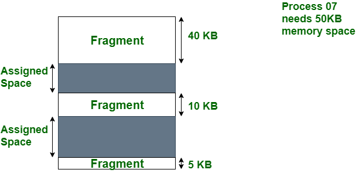
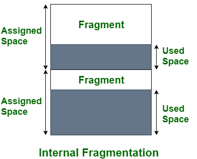

# Fragmentation

---

# 개요

- 메모리의 여유 공간(Fragments)은 프로세스가 물리적 메모리 블록에서 로드되거나 언로드될 때마다 생성된다.
- 데이터 파일이나 실행 가능한 프로그램 파일과 같은 컴퓨터 파일을 하드 디스크나 RAM과 같은 컴퓨터 저장 매체의 여러 부분에 저장되는 조각으로 나누는 프로세스를 Fragmentation이라고 한다.
- 파일이 조각화되면 저장 매체에 연속되지 않은 블록으로 저장된다. 즉, 블록이 서로 옆에 저장되지 않는다.
- 단편화(조각화)는 스토리지 공간이 비효율적으로 사용되어 용량이나 성능, 그리고 종종 두 가지 모두를 감소시키는 현상이다.
- 단편화의 정확한 결과는 사용 중인 저장소 할당 시스템과 단편화 형태에 따라 달라진다.
- 대체로 단편화로 인해 저장 공간이 낭비되며, 이 경우 단편화라는 용어는 낭비된 공간 자체를 의미하기도 한다.
- 프로그램이 시스템에 메모리 블록을 요청할 때 블록은 청크(chunks)로 할당된다.
    - 프로그램이 청크 작업을 마치면 해당 청크를 다시 시스템에 해제하여 추후 다른 프로그램이나 동일한 프로그램에 할당할 수 있도록 한다.
    - 프로그램이 청크를 보유하는 크기와 시간은 다양하며, 수명(life-cycle) 동안 컴퓨터 프로그램은 많은 메모리 청크를 요청하고 해제할 수 있다.
    - 프로그램이 시작되면 여유 메모리 영역은 길고 연속적이지만, 시간이 지남에 따라, 그리고 사용함에 따라 긴 연속 영역은 점점 더 작은 연속 영역으로 단편화된다. (청크의 할당과 해제로 인해)
- 단편화에는 외부 단편화, 내부 단편화, 데이터 단편화가 있다.

## 원인

- 이는 파일이 너무 커서 저장 매체의 단일 연속 여유 공간 블록에 맞지 않거나 매체의 여유 공간 블록이 파일을 보관하기에 부족한 경우 발생할 수 있다.
- 시스템은 파일을 열기 위해 여러 위치에서 개별 조각을 검색하고 검색해야 하기 때문에 조각화로 인해 파일을 읽거나 액세스할 때 문제가 발생할 수 있다.

## 효과

- 이로 인해 시스템 성능이 저하되고 파일에 액세스하기가 더 어려워질 수 있다.
- 일반적으로 하드 디스크 조각 모음을 정기적으로 수행하여 조각화를 방지하는 것이 가장 좋다.
- 조각화는 파일이 인접한 블록에 저장되고 더 빠르게 액세스할 수 있도록 디스크의 데이터 블록을 다시 정렬하는 프로세스이다.

# 외부 단편화(External Fragmentation)

- 메모리가 프레임워크 전체에 분산된 작은 여유 공간 블록으로 분리되어 더 큰 인접 메모리 블록을 프로세스에 배포하기 어렵게 만드는 현상을 말한다.
- 외부 조각화는 하드 디스크나 솔리드 스테이트(SSD) 드라이브와 같은 저장 매체에 전체에 흩어져 있는 많은 작은 여유 공간 블록이 있을 때 발생한다.
- 메모리 분할은 일정 시간이 지난 후 프로세스의 할당 및 할당 해제로 인해 발생한다.
- 프로세스가 쌓이고 메모리에 덤프됨에 따라 프로세스 사이에 간격이 발생하고 단편화가 발생한다.
- 이는 시스템이 파일을 자주 생성하고 삭제하여 매체에 작은 여유 공간 블록이 많이 남을 때 발생할 수 있다.
- 단편화는 메모리 할당 및 할당 해제의 동적 특성으로 인해 발생한다.
    - 프로세스는 메모리에 쌓이고 추후, 일반적으로 필요하지 않을 때 전달되므로 프로세스 사이에 간격이 남는다.
    - 장기적으로 이러한 구멍이 모여서 분할될 수 있으므로, 메모리가 여러 개의 작은 세그먼트로 분리된다.
- 조각화는 시스템 내의 다양한 수준에서 발생할 수도 있다.
    - 파일 조각화 : 파일이 연속되지 않은 여러 블록으로 나누어 저장 매체에 저장된다.
    - 메모리 조각화 : 시스템이 메모리 블록을 동적으로 할당 및 취소하는 메모리 관리 수준에서 발생된다.
    - 네트워크 조각화 : 데이터 패킷이 네트워크를 통한 전송을 위해 더 작은 조각으로 분할될 때 발생한다.
- 외부 단편화는 본질적으로 메모리를 프로세스에 동적으로 할당하고 메모리 요구 사항이 변화하는 시스템에 영향을 미친다.
- 외부 단편화의 주요 원인은 다음과 같다.
    - 원인
        - 가변적인 프로세스 크기
            - 컴퓨터 프레임워크의 프로세스에는 메모리 전제 조건이 변경되는 경우가 많다.
            - 프로세스가 스택되어 메모리에 덤프됨에 따라 분배된 메모리 블록의 크기가 대조될 수 있다.
            - 이로 인해, 할당된 메모리 블록 간에 크기가 변동하는 구멍이 발생한다.
        - 메모리 할당 및 할당 해제
            - 프로세스가 메모리에 쌓이면 특정 메모리 블록을 소유한다.
            - 따라서 프로세스가 완료되거나 종료되면 관련된 메모리 블록이 여유 메모리 풀로 다시 전달된다.
            - 그러나 전달된 메모리 블록이 인접하지 않을 경우 동적 메모리 블록 사이에 구멍이 생길 수 있다.
            - 시간이 지나면 구멍이 늘어나 새로운 프로세스에 배포할 단일 메모리 블록을 찾기 어려워질 수 있다.
        - 비균일 메모리 릴리스
            - 다른 메모리 할당과 일치하지 않는 방식으로 방전 메모리(Discharge memory) 블록을 처리하는 경우 예측할 수 없는 크기의 구멍이 형성될 수 있다.
        - 메모리 할당 방법론
            - 최적 또는 최악 적합과 유사한 일부 메모리 할당 절차는 조각화를 악화시킬 수 있다.
        - 고정 분할
            - 메모리가 고정 크기 할당으로 분리되는 고정 분할이 있는 프레임워크에서는 프로세스에 세그먼트 크기와 정확하게 일치하지 않는 크기의 메모리가 필요한 경우 외부 분리가 발생할 수 있다.
            - 이는 내부 불연속성을 유발할 수 있다.
        - 높은 프로세스 회전율
            - 정기적인 프로세스 스태킹(Stacking) 및 덤핑을 사용하는 프레임워크는 외부 불연속성에 대해 더 무방비하다.
            - 프로세스가 빠르게 쌓이고 제거되는 시점에서 메모리에 공백이 남아 조각화에 기여할 수 있다.
- 외부 단편화는 OS의 전시(exhibition) 및 메모리 관리에 영향을 미칠 수 있다.
    - 메모리 사용량 감소, 확정된 할당 실망(Disappointments), 느린 메모리 액세스
- 외부 단편화는 일반적으로 메모리 압축과 페이징을 통해 개선한다.

# 내부 단편화(Internal Fragmentation)

- 내부 단편화는 메모리 블록 내에 사용되지 않은 공간이 있을 때 발생한다.
- 예를 들어 시스템이 크기가 40KB에 불과한 파일을 저장하기 위해 64KB 메모리 블록을 할당하는 경우 해당 블록에는 24KB의 내부 조각화가 포함된다.
- 잘못된 메모리 할당으로 인해 발생하는 문제로 메모리가 낭비된다.
- 프로세스가 시스템에 로드되면 작업에 필수적인 메모리를 요청하는데, OS는 작업할 프로세스에 메모리를 할당하지만 메모리가 프로세스 요구 사항보다 작거나 커지면 추가 공간은 사용되지 않는다.
- 이 작은 양의 메모리 미활용이 OS에 나타나는 주요 내부 단편화다
- 프로세스가 작업을 위해 메모리를 요청하면 대부분의 시스템은 고정된 크기의 블록이나 페이지에 메모리를 할당하는데, 이 때 대부분의 경우 할당되는 메모리 블록은 프로세스에서 요청한 메모리의 양보다 크다. 이것이 내부 단편화가 발생하는 주요 원인이 된다.
- 일부 경우에서는 메모리를 요청하는 모든 프로세스에 일정한 양의 메모리가 할당되는데, 일정한 양보다 적은 양의 메모리를 요청/요구하는 프로세스는 결국 상당한 양의 할당된 메모리를 낭비하게 된다. 이 역시 내부 단편화의 원인 중 하나다.
- 내부 단편화로 인해 발생하는 영향은 다음과 같다.
    - 비효율적인 메모리 활용
    - 성능 지연
    - 메모리의 붕괴
    - 가상 메모리 관리의 문제점
- 내부 단편화를 방지하는 방법은 다음과 같다.
    - 가변 크기 할당 블록
    - 동적 메모리 할당

<aside>
💡 메모리 할당 시스템 : 프로그램이나 프로세스가 컴퓨터 메모리(주로 RAM)을 요청하고 관리하는 방식과 규칙을 나타낸다.

→ 주로 RAM을 요청하는 이유 
1. 빠른 액세스 속도 : CPU에 가까운 주 기억장치이며 속도가 빠르다.
2. 임의 액세스 : 어떤 메모리 위치로든 빠르게 접근할 수 있다. 이것은 데이터를 임의로 액세스하는 프로그램에 적합하며, CPU가 필요로 하는 데이터나 명령어를 빠르게 찾을 수 있도록 도와준다.
3. 휘발성  메모리 : 임시 데이터를 저장하거나 프로그램이 실행 중인 동안 사용하는 데이터를 메모리에 유지하기에 적합하다. 프로그램이 종료되면 해당 메모리가 해제되므로 다른 프로그램이 메모리를 사용할 수 있다.
4. 대용량 저장 : 현대의 컴퓨터 시스템은 대용량의 RAM을 제공하여 이로써 여러 프로그램이 동시에 실행될 수 있고, 대규모 작업을 처리할 수 있다.
5. OS 및 응용 프로그램에 필요한 공간 : 필요한 데이터와 코드를 저장하는 데 사용된다.
이 시스템은 메모리를 효과적으로 할당하고 해제함으로써 프로그램이 메모리를 사용하는 방식을 조절하고 최적화하는 역할을 한다.

</aside>

# 차이점 비교

| NO | 내부 단편화 | 외부 단편화 |
| --- | --- | --- |
| 1. | 내부 단편화에서 고정 크기 메모리는 처리하도록 지정된 블록의 제곱 단위다. | 외부 단편화에서는 가변 크기 메모리 블록이 지정된 크기의 사각형을 사용한다. |
| 2. | 내부 단편화는 메서드나 프로세스가 메모리보다 작을 때 발생한다. | 외부 단편화는 메서드나 프로세스가 제거될 때 발생한다. |
| 3. | 내부 단편화의 해결책은 최적의 블록(Best-fit)이다 . | 외부 단편화에 대한 해결책은 압축과 페이징이다 . |
| 4. | 내부 단편화는 메모리가 고정된 크기의 파티션으로 분할될 때 발생한다 https://www.geeksforgeeks.org/fixed-or-static-partitioning-in-operating-system/ | 외부 단편화는 메모리가 프로세스 크기에 따라 가변 크기 파티션으로 분할될 때 발생한다. |
| 5. | 할당된 메모리와 필요한 공간 또는 메모리의 차이를 내부 단편화라고 한다. | 연속되지 않은 메모리 조각 사이에 형성된 사용되지 않은 공간은 너무 작아서 새로운 프로세스를 제공할 수 없다. 이를 외부 단편화라고 한다. |
| 6. | 내부 단편화는 페이징 및 고정 파티셔닝에서 발생합니다. | 외부 단편화는 분할 및 동적 분할을 통해 발생합니다 . |
| 7. | 프로세스 요구 사항보다 큰 파티션에 프로세스를 할당할 때 발생한다. 남은 공간으로 인해 시스템 성능이 저하된다. | 이는 필요한 메모리 공간과 정확히 동일한 더 큰 파티션에 프로세스를 할당할 때 발생한다. |
| 8. | Worst-Fit 메모리 할당 방식에서 발생합니다 . | 이는 Best-Fit 과 First-Fit메모리 할당 방식에서 발생합니다. |

# 시스템에 미치는 영향

- **성능 저하**
    - 조각화는 파일 조각에 액세스하기 위해 디스크 헤드가 다른 위치로 이동해야 하므로 디스크의 읽기 및 쓰기 속도를 느리게 한다.
    - 이는 결과적으로 액세스 시간을 늘리고 시스템의 전체 속도를 감소시켜 애플리케이션 속도 저하 및 지연을 유발한다.
- **디스크 공간 낭비**
    - 조각화는 필요한 것보다 더 많은 공간을 차지할 수 있으므로 조각화로 인해 디스크 공간이 낭비될 수도 있다.
    - 이로 인해 디스크 공간이 부족해 시스템이 불안정해지고 충돌이나 오류에 취약해질 수 있다.
- **데이터 손실**
    - 심각한 경우 조각화로 인해 시스템의 디스크 공간이 부족해져 데이터가 손실될 수도 있다.
    - 이는 중요한 정보와 데이터를 저장하기 위해 시스템에 의존하는 사용자에게 특히 해로울 수 있다.
- **시스템 충돌 위험 증가**
    - 디스크가 조각화될수록 충돌 및 오류가 발생하기 쉽다.
    - 이로 인해 시스템이 불안정해지고 데이터 손실, 충돌 및 기타 문제에 취약해질 수 있다.
- **배터리 수명 감소**
    - 조각화는 노트북 및 기타 모바일 장치의 배터리 수명에 부정적인 영향을 미칠 수도 있다.
    - 이는 조각화로 인해 디스크가 더 열심히 작동해야 하므로 배터리에 추가적인 부담이 가해지기 때문이다.
    

# 운영 체제 성능에서 조각화의 역할

- 조각화는 운영 체제 성능에 큰 영향을 미칠 수 있는 중요한 문제이다.
- 조각화의 주요 역할은 디스크의 읽기 및 쓰기 속도를 늦추는 것이다. 파일 조각에 액세스하기 위해 디스크 헤드가 다른 위치로 이동해야 하므로 액세스 시간이 늘어나 시스템의 전체 속도가 감소된다. 이로 인해 시스템 성능이 저하되어 애플리케이션 속도가 느려지고 지연될 수 있다.
- 또한 조각화는 필요한 것보다 더 많은 공간을 차지할 수 있으므로 디스크 공간이 낭비될 수도 있다. 이로 인해 디스크 공간이 부족해 시스템이 불안정해지고 충돌이나 오류에 취약해질 수 있다. 심각한 경우에는 조각화로 인해 시스템의 디스크 공간이 부족해져 데이터가 손실될 수도 있다.
- 최적의 성능을 유지하려면 정기적으로 디스크 조각 모음을 수행하는 것이 중요하다. 조각 모음은 파일 조각을 재구성하고 파일을 저장할 연속 디스크 공간을 할당한다.
- 이는 디스크의 읽기 및 쓰기 속도를 향상시키고 액세스 시간을 줄이며 시스템의 전체 속도를 높이는 데 도움이 된다. 정기적으로 디스크 조각 모음을 수행하면 운영 체제의 성능이 향상 및 유지 관리되어 원활하고 효율적인 사용자 경험을 보장할 수 있다.
- 앞서 적었듯이, 조각화는 시스템에 큰 영향을 미친다.
- 최적의 성능을 유지하려면 정기적으로 디스크 조각 모음을 하는 것이 중요하다.
- 조각 모음을 파일 조각을 재구성하고 파일을 저장할 연속 디스크 공간을 할당한다.
- 이는 디스크의 읽기 및 쓰기 속도를 향상시키고 액세스 시간을 줄이며 시스템의 전체 속도를 높이는 데 도움을 준다.
- 정기적으로 디스크 조각 모음을 수행하면 운영 체제의 성능이 향상 및 유지 관리되어 원활하고 효율적인 사용을 할 수 있다.

# 장점

- 컴퓨터의 하드 디스크나 기타 저장 매체의 저장 공간을 더 잘 활용한다. 파일이 조각화되면 해당 블록이 연속되지 않더라도 매체의 사용 가능한 여유 공간 블록에 저장할 수 있다. 이는 매체에 낭비될 수 있는 여유 공간의 작은 블록이 많이 포함되어 있는 경우 특히 유용하다.
- 시스템의 하드 디스크 드라이브(HDD) 또는 솔리드 스테이트 드라이브(SSD)에 필요한 탐색 양을 줄여 시스템 성능을 향상시킬 수 있다. 파일이 매체에 연속된 블록으로 저장되면 HDD 또는 SSD는 다양한 블록에 액세스하기 위해 읽기/쓰기 헤드를 디스크의 다른 위치로 이동해야 한다.
- 이를 통해 시스템은 다른 방법보다 더 큰 파일을 저장할 수 있다. 시스템에 특정 파일을 저장할 만큼 큰 여유 공간이 있는 단일 연속 블록이 없는 경우 파일을 조각화하여 여러 개의 작은 블록에 저장할 수 있다.

→ 그러나 일반적으로 가능하면 조각화를 최소화하는 것이 좋다. 조각화는 시스템 성능에 부정적인 영향을 미치고 파일 액세스 및 관리를 더 어렵게 만들 수 있기 때문이다.

# 단점

- 특히 조각난 파일을 읽거나 액세스할 때 시스템 성능이 저하될 수 있다. 시스템이 조각난 파일에 액세스해야 하는 경우 저장 매체의 다양한 위치에서 다양한 조각을 검색하고 검색해야 하며 이는 연속 파일에 액세스하는 것보다 시간이 오래 걸릴 수 있다. 이로 인해 시스템 성능이 저하되고 파일에 액세스하기가 더 어려워질 수 있다.
- 시스템의 파일을 관리하고 구성하는 것이 더 어려워질 수 있다. 파일이 조각화되면 연속되지 않은 여러 블록으로 저장 매체에 저장되므로 파일을 찾고 액세스하기가 더 어려워진다.
- 하드 디스크나 솔리드 스테이트 드라이브와 같은 저장 매체의 수명을 단축할 가능성이 있다. 시스템이 저장 매체에 데이터를 쓸 때 매체가 마모될 수 있다. 비연속 블록에 저장된 데이터는 연속 블록에 저장된 데이터보다 매체에 더 많은 마모를 발생시켜 잠재적으로 매체의 수명을 단축시킬 수 있다.
- 더 많은 시스템 저장 공간을 사용할 수 있다. 파일이 조각화되면 시스템은 각 조각의 위치에 대한 추가 정보를 저장 매체에 저장해야 한다. 이로 인해 더 많은 공간이 소모되고 다른 파일에 사용할 수 있는 공간이 제한될 수 있다.