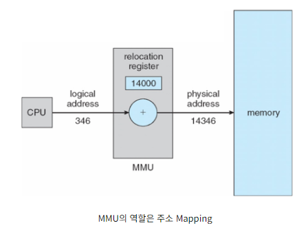

# Logical & Physical Address

---

# 개념

- 운영 체제에서는 논리적 주소와 물리적 주소를 사용하여 메모리를 관리하고 액세스한다. 각각의 개요는 다음과 같다.

## Logical Address(논리적 주소)

- 가상 주소라고도 한다.
- 프로그램 실행 중에 CPU에 의해 생성되는 주소로 프로세스에서 볼 수 있는 주소이며 프로그램의 주소 공간과 관련이 있다.
- 논리 주소는 물리적으로 존재하지 않는 가상 주소이므로 가상 주소(Virtual Address)라고도 한다.
- 논리 주소 공간은 프로그램의 관점에서 생성된 모든 논리 주소 집합에 생성된다.
    - 이진수, 16진수, 십진수 등 다양한 형식으로 표시될 수 있다.
    - 유한한 범위를 가지며 범위는 이를 표현하는 데 사용되는 비트 수에 따라 결정된다.
- 프로그램이 실행되는 동안 CPU에 의해 생성된다.
- CPU가 물리적 메모리 위치에 접근하기 위한 참조로 사용된다.
- 프로세스는 운영 체제에서 물리적 주소로 변환되는 논리 주소를 사용하여 메모리에 액세스한다.
- 논리 주소를 사용하여 프로세스가 실제 메모리 위치를 모르더라도 메모리에 액세스할 수 있는 추상화 계층이 제공된다.

## Physical Address(이진 주소 또는 실제 주소)

- 데이터가 저장되는 주 메모리에 실제 주소. 가상 주소가 아닌 실제 메모리의 위치다.
- MMU에서 논리적 주소를 물리적 주소로 변환하는 데 사용된다.
    - 이진수, 16진수, 십진수 등 다양한 형식으로 표시될 수 있다.
    - 유한한 범위를 가지며 범위는 이를 표현하는 데 사용되는 비트 수에 따라 결정된다.
- 논리적 주소에서 물리적 주소로의 변환은 OS의 MMU에 의해 수행된다. MMU는 페이지 테이블을 사용하여 논리적 주소를 물리적 주소로 변환한다.
- 페이지 테이블은 각 논리적 페이지 번호를 물리적 프레임 번호에 매핑한다.
- 메모리에서 필요한 데이터의 물리적 위치를 식별한다.
- 사용자는 물리적 주소를 직접 다루지 않으며, 해당 논리적 주소를 통해 접근할 수 있다.
- 물리적 주소 공간은 논리적 주소 공간의 논리적 주소에 해당하는 모든 물리적 주소에 사용된다.
- 컴퓨팅에서 물리적 주소는 메모리 주소 또는 주 메모리에 있는 메모리 셀의 위치를 나타낸다. 데이터에 액세스하기 위해 하드웨어와 소프트웨어 모두에서 사용된다.
- 그러나 소프트웨어는 물리적 주소를 직접 사용하지 않는다. 대신 가상 주소를 사용하여 메모리에 액세스한다. MMU(메모리 관리 장치)로 알려진 하드웨어 구성 요소는 가상 주소를 물리적 주소로 변환하는 역할을 한다.
- 네트워킹에서 물리적 주소는 네트워크에서 컴퓨터를 식별하는 데 사용되는 네트워크 어댑터와 관련된 고유 식별자인 컴퓨터의 MAC 주소를 나타낸다.

# 특징

- 논리 주소를 사용하면 프로세스가 실제 메모리 위치를 모르더라도 메모리에 액세스할 수 있는 추상화 계층이 제공된다.
- 논리적 주소는 페이지 테이블을 사용하여 물리적 주소에 매핑된다.  페이지 테이블에는 논리적 주소와 물리적 주소 간의 매핑에 대한 정보가 포함되어 있다.
- MMU는 페이지 테이블을 사용하여 논리적 주소를 물리적 주소로 변환한다. 이 변환은 프로세스에 투명하며 하드웨어에 의해 수행된다.
- 논리적 및 물리적 주소를 사용하면 운영 체제에서 페이징 및 분할과 같은 기술을 사용하여 메모리를 보다 효율적으로 관리할 수 있다.

# 유사점

- 논리적 주소와 물리적 주소는 모두 메모리의 특정 위치를 식별하는 데 사용된다.
- 논리적 주소와 물리적 주소는 모두 이진수, 16진수, 십진수 등 다양한 형식으로 표시될 수 있다.
- 논리 주소와 물리 주소 모두 유한한 범위를 가지며, 범위는 이를 표현하는 데 사용되는 비트 수에 따라 결정된다.

# 차이점

- 논리 주소는 프로그램 관점에서 CPU에 의해 생성되지만, 물리 주소는 메모리 단위에 존재하는 위치이며 MMU에 의해 계산된다.
- 사용자는 프로그램의 논리적 주소를 볼 수 없지만 물리적 주소는 사용자에게 표시된다.
- 논리 주소는 메모리에 물리적으로 존재하지 않지만 물리적 주소는 물리적으로 접근할 수 있는 메모리의 위치다
- 프로그램을 참조하여 CPU가 생성하는 모든 논리적 주소의 집합을 논리적 주소 공간(Logical Address Space)이라고 하고, 논리적 주소 공간의 논리적 주소에 해당하는 모든 물리적 주소의 집합을 물리적 주소 공간(Physical Address Space)이라고 한다.
- 컴파일 타임과 로드 타임 주소 바인딩 방식에서는 동일한 논리 주소가 생성되지만 런타임 주소 바인딩 방식에서는 서로 다르다
    
    
    | 매개변수 | 논리적 주소 | 실제 주소 |
    | --- | --- | --- |
    | 기본 | CPU에 의해 생성 | 메모리 유닛의 위치 |
    | 주소 공간 | 논리 주소 공간은 프로그램을 참조하여 CPU가 생성하는 모든 논리 주소의 집합이다. | 물리적 주소 공간는 해당 논리 주소에 매핑되는 모든 물리 주소의 집합이다. |
    | Visibility | 사용자는 프로그램의 논리 주소를 볼 수 있다. | 사용자는 프로그램의 물리적 주소를 절대 볼 수 없다. |
    | 생성 위치 | CPU에 의해 생성 | MMU에 의해 계산 |
    | 접근 | 사용자는 논리 주소를 이용하여 물리 주소에 접근할 수 있다. | 사용자는 물리적 주소에 간접적으로 액세스할 수 있지만 직접적으로 액세스할 수는 없다. |
    | 편집 가능 | 논리 주소는 변경될 수 있다. | 실제 주소는 변경되지 않는다. |
    | 동의어 | 가상 주소. | 실제 주소. |