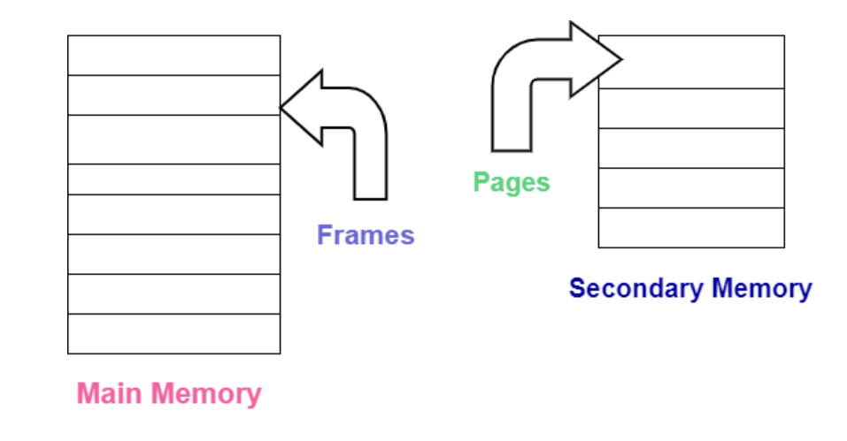

# Paging

---

# 관련 용어

- **Page(페이지)**
    - 논리/보조 메모리의 고정 크기 블록
    - 페이지는 주 메모리와 보조 저장소 사이의 정보 전송 단위를 나타낸다
    - 페이지 세트는 프로세스 작업 세트이며, 작업 세트는 프로세스가 메모리의 다른 부분에 액세스함에 따라 지속적으로 변경된다.
- **Memory Management Unit(MMU)**
    - 논리적 주소를 물리적 주소로 변환하는 하드웨어 구성 요소
    - 메모리의 페이지 할당 및 할당 해제도 관리한다.
- **Page Table(페이지 테이블)**
    - MMU가 논리주소를 물리 주소로 변환할 수 있도록 하는 데이터 구조
- **Physical memory(물리 메모리)**
    - 일반적으로 RAM 형태로 컴퓨터에서 사용할 수 있는 실제 메모리.
    - 페이징에서 물리적 또는 기본 메모리는 각각 고유한 주소를 갖는 고정 크기 블록 또는 페이지 프레임으로 분할된다.
    - 프레임은 프로세스에서 사용되는 페이지와 동일한 크기다.
- **Virtual memory(가상 메모리)**
    - 주 메모리의 확장 역할을 하는 하드 디스크 또는 SSD.
    - RAM에서 일시적으로 데이터를 가져와 물리적 메모리 부족을 보완한다.
    - 논리적 메모리는 페이지라고 불리는 동일한 크기의 블록으로 나뉜다.
    - 각 페이지에는 가상 메모리 내에 논리 주소가 있다.
- **Logical address(논리 주소)**
    - 프로그램이 실행되면 CPU는 각 페이지에 대한 논리 주소를 생성한다.
    - MMU는 논리적 주소를 물리적 주소로 변환한다.
- **Logical address space(논리 주소 공간)**
    - 실행 중인 프로그램에 의해 생성된 논리 주소 집합
- **Physical address(물리 주소)**
    - 물리적 메모리 내의 각 프레임에는 고유한 물리적 주소가 있다.
    - 주소는 실제 메모리에서 프로세스의 특정 위치를 나타낸다.
- **Physical address space(물리 주소 공간)**
    - 시스템이 참조할 수 있는 모든 가능한 물리적 주소의 범위
    

# 정의

- 페이징은 물리적 메모리를 연속적으로 할당할 필요가 없는 메모리 관리 체계다.
    - 보조 저장소에서 주 메모리로 페이지 형태의 프로세스를 검색하는 프로세스를 페이징이라고 한다.
    - 페이징을 통해 프로세스는 페이지가 물리적 메모리에 로드될 때까지 기다리지 않고 필요한 페이지에 액세스할 수 있다.
    - 컴퓨터의 보조 또는 가상 저장소의 데이터를 기본 저장소(RAM)에 저장하고 검색한다
    - 프로세스가 RAM에 없는 페이지에 액세스하려고 할 때 OS는 가상 메모리에서 페이지를 가져온다.
- 페이징을 사용하면 프로세스의 물리적 주소 공간이 연속적이지 않게 된다.
    - 고정 크기 파티셔닝 방식이다.
    - 페이징 기술에서는 보조 메모리와 주 메모리를 동일한 고정 크기 파티션으로 나눈다.
- 페이징은 프로세스가 가상 저장소를 사용할 수 있도록 하는 메모리 관리 방법이다.
- 페이징의 기본 목적은 각 프로시저를 페이지로 분리하는 것이다. 또한, 프레임은 주 메모리를 분할하는 데 사용된다. 이 체계는 프로세스의 물리적 주소 공간이 연속되지 않도록 허용한다.
    - 이를 통해 페이징은 메모리 관리의 효율성을 향상시킨다. 운영 체제는 메모리를 페이지로 나누어 필요에 따라 페이지를 메모리 안팎으로 이동한다. (보조(가상) 메모리 ↔ 기본(물리적) 메모리)
        - 보조와 기본 메모리 모두 고정 크기 블록으로 나뉘며, 기본 메모리의 블록은 프레임, 보조 메모리의 블록은 페이지
- 페이징에서 물리적 메모리는 프로세스에서 사용하는 페이지와 동일한 크기인 페이지 프레임이라는 고정 크기 블록으로 나뉜다.
    - 프로세스의 논리 주소 공간은 페이지 프레임과 동일한 크기인 페이지라고 하는 고정 크기 블록으로 나뉜다.
    - 프로세스가 메모리를 요청하면 운영 체제는 하나 이상의 페이지 프레임을 프로세스에 할당하고 프로세스의 논리적 페이지를 물리적 페이지 프레임에 매핑한다.
    - 자주 사용하는 페이지만 유지하면 페이지 오류(Page Fault) 수가 줄어들어 시스템 성능과 응답성이 향상된다.
    - 프로그램이 실행될 때마다 페이지로 분할되고 OS는 이를 자동으로 보조 메모리에 저장한다.
    - 프로세스가 메모리를 요청하면 OS는 기본 메모리의 페이지 프레임을 프로세스에 할당한다. 그 뒤 OS는 프로그램 페이지를 보조 메모리에서 기본 메모리 프레임으로 이동한다.

<aside>
💡 **프레임(Frame)** : 물리 메모리를 일정한 크기로 나눈 블록
**페이지(Page)** : 가상 메모리를 일정한 크기로 나눈 블록

</aside>

<aside>
💡 **메모리 제어와 관련된 용어
Logical Address or Virtual Address :** CPU를 통해 생성되어 메모리에 대한 입장 권한을 얻기 위한 기술에 사용
**Logical Address Space or Virtual Address Space :** 소프트웨어 프로그램을 통해 생성된 모든 논리 주소 집합
**Physical Address :** 메모리 장치에서 사용할 수 있고 reminiscence에 대한 승인을 얻기 위해 메모리 컨트롤러에서 사용됨
**Physical Address Space :** 논리적 주소에 해당하는 모든 물리적 주소의 집합

</aside>

# 주요 기능

- 요구 페이징(Demand paging)
    - Windows, Linux, macOS와 같은 최신 운영 체제에서 가장 일반적인 메모리 관리 기술.
    - 현재 사용되는 페이지만 메모리에 유지하여 메모리 사용을 최적화한다.
- 예상 페이징(Anticipatory paging)
    - 요청된 페이지 근처의 페이지를 가능한 한 빨리 미리 로드하는 보다 공격적인 형태의 요구 페이징
    - 목표는 RAM에 없는 페이지가 곧 필요할지 예측하여 페이지 오류와 대기 시간을 줄이는 것
- 사전페이징(PrePaging)
    - 덜 공격적인 형태의 예상 페이징
    - 시스템은 가까운 미래에 필요할 수 있는 모든 페이지를 모두 미리 로드한다. (즉시 또는 곧은 아니다.)
- 무료 페이지 큐(Free page queue)
    - 할당 가능한 페이지 프레임 목록.
    - 대기열이 절대 비워지지 않도록 함으로써 프로세스는 페이지 오류 처리를 최소화한다.
- 페이지 훔치기(Stealing)
    - 페이지 프레임을 해체하는 프로세스.
    - 최근에 참조되지 않은 페이지는 메모리에서 제거된다.
    - 그 뒤 사용 가능한 페이지 프레임이 사용 가능한 페이지 대기열에 추가된다.
- 페이지 회수(Reclamation)
    - 회수는 Stealing과 함께 더 이상 사용되지 않는 페이지 프레임을 해체한다.
    - 회수는 Stealing보다 더 공격적으로, OS는 곧 다시 시작될 가능성이 있는 페이지도 회수할 수 있다.
- 프리클리어링(Pre-Cleaning)
    - 해당 페이지가 곧 다시 수정될 가능성이 있는 경우에도 수정된 페이지의 내용을 다시 디스크에 저장한다.
    - 새 프로그램이 실행될 때 시스템은 디스크에서 페이지를 읽을 때까지 기다릴 필요가 없으므로 시작 시간이 향상된다.
- 기록 중 페이징 복사(Copy-on-write paging)
    - 프로세스가 다른 프로세스에서 이미 사용 중인 페이지에 작성하려 할 때 OS는 페이지의 복사본을 만들고 해당 프로세스 복사본에 대한 독점 액세스 권한을 부여한다.
    - 이를 통해 두 프로세스가 서로의 데이터를 덮어쓸 수 없도록 한다.
- 분할 페이징(Segmented paging)
    - 주 메모리를 각각 페이지 테이블이 있는 가변 크기 세그먼트로 분할하여 페이징과 세그먼트화를 결합한다.
    - 세그먼트는 더 작은 고정 크기 페이지로 나뉜다.
    - 페이지 기반 분할을 사용하는 가상 메모리와 달리 세그먼트는 가상 메모리 주소와 실제 메모리 주소의 매핑을 처리한다
- 반전 페이징(Inverted paging)
    - 페이지 테이블이 메모리에 있고, 물리적 메모리를 프레임으로 나누는 기술
    - 프로세스가 페이지에 액세스해야 할 때 페이지 테이블을 조회하여 물리적 프레임을 찾는다.

# 기본 방법

- 물리적 메모리(주 메모리)를 프레임이라고 하는 고정된 크기의 블록으로 나누고, 논리적 메모리(보조 메모리)를 페이지라고 하는 동일한 크기의 블록으로 나눈다.
- 프레임은 페이지와 동일한 크기를 갖는다.
- 프레임은 기본적으로 (논리적) 페이지가 (물리적으로) 배치될 수 있는 장소이다.
- 프로세스의 페이지는 요구 사항이 있을 때만 주 메모리로 가져오며, 그렇지 않은 경우 보조 저장소에 있는다.
- 프로세스의 한 페이지는 주로 메모리의 프레임 중 하나에 저장된다. 또한 페이지는 메모리의 다른 위치에 저장될 수 있지만 가장 중요한 우선순위는 연속된 프레임을 찾는 것이다.

# 작업 흐름

- 페이징에는 분할된 정보를 체계적으로 검색하고 표시하는 작업이 포함된다. 페이징 작업 흐름은 **페이지 조회로 종료되거나 페이지 오류가** 발생한다 .

1. 프로세스가 실행된다.

2. OS는 프로세스 세그먼트를 가상 메모리의 동일한 크기 페이지에 할당한다. 또한 실제 메모리에 해당 페이지 프레임을 생성한다.

3. OS는 프로세스의 논리적 페이지를 물리적 페이지 프레임에 매핑하는 페이지 테이블을 생성한다.

4. 다른 프로세스가 프로세스 프레임이나 페이지에 대한 액세스를 요청한다.

5a. 요청한 페이지는 이미 주 메모리에 있으며 프로세스가 계속 실행되어  **페이지 조회가** 발생한다.

5b. 요청한 페이지가 주 메모리에 없으면 시스템은 **페이지 오류** 또는 **페이지 누락을** 처리한다. 페이징 프로세스를 통해 계속해서 문제를 해결한다.

6. MMU(메모리 관리 장치)는 페이지 테이블을 사용하여 실제 메모리에서 프로세스의 올바른 위치(올바른 페이지 프레임)를 식별한다.

7. 페이지 테이블이 올바른 물리적 주소로 업데이트된다.

8. OS는 페이지를 기본 메모리의 페이지 프레임으로 가져오고,

9. 중단된 지점부터 프로세스가 재개되며 이제 페이지에 액세스할 수 있다. 페이지 오류가 해결되었다.

# 작동 방식

- 페이징을 통해 OS는 보조(가상) 메모리와 기본(물리적) 메모리 간에 데이터를 전송할 수 있다. 두 저장소 유형 모두 고정 크기 블록으로 나뉜다. 기본 메모리의 블록은 **프레임** 이고 보조 저장소의 블록은 **페이지**이다 .
- 페이징은 기본 저장소에서 사용하기 위해 보조 저장소에 데이터를 쓰고 읽는 방식으로 작동한다.
- 페이징은 컴퓨터 OS에 대한 메모리 관리의 기본 기능이다. (Windows, Unix, 및 macOS 포함)
- 프로그램이 실행될 때마다 페이지로 분할되고 OS는 이를 자동으로 보조 메모리에 저장한다.
- 프로세스가 메모리를 요청하면 OS는 기본 메모리의 페이지 프레임을 프로세스에 할당한다. 다음으로 OS는 프로그램 페이지를 보조 메모리에서 기본 메모리 프레임으로 이동한다.

<aside>
💡 프로세스 페이지는 필요할 때만 기본 메모리로 가져온다. 그렇지 않으면 보조 저장소에 유지된다.

</aside>

- 논리적 페이지와 물리적 페이지 프레임은 **페이지 테이블** 이라는 구조를 사용하여 관계를 유지한다 . MMU (메모리 관리 장치)는 페이지 테이블을 사용하여 논리적 주소(가상 메모리)를 물리적 주소(물리적 메모리)로 변환한다.

<aside>
💡 운영 체제마다 페이징을 구현하기 위해 서로 다른 접근 방식을 사용한다.
- Linux, Windows 및 macOS는 하드웨어 기반 방법을 사용하고 CPU 에 페이징 하드웨어를 구현한다 . 
- UNIX, Android, iOS와 같은 운영 체제의 소프트웨어 기반 페이징은 페이징이 소프트웨어로 구현된다.

</aside>

- 페이징을 사용하는 메모리 관리 시스템에서 OS는 페이지라는 블록으로 보조 저장소에서 데이터를 읽는다.
    - 이 블록은 동일한 크기를 갖는다.
- 페이징을 사용하는 경우 프레임은 보조 저장소에서 물리적으로 연속된 단일 영역을 구성할 필요가 없다.
- 이 접근 방식은 스토리지를 보다 효율적이고 빠르게 사용할 수 있다는 점에서 이전의 메모리 관리 방법에 비해 이점을 제공한다.

# 페이지 오류(Page Fault)

- 프로세스가 실제 메모리에 없는 페이지에 액세스하려고 하면 페이지 오류가 발생한다.
    - 최근에 사용되지 않았거나 메모리가 부족한 경우, 페이지가 이전에 메모리에 로드된 경우, 다른 페이지를 위한 공간을 확보하기 위해 페이지가 메모리에서 제거된 경우, 페이지가 메모리에서 수정되어 디스크에 다시 기록해야 하는 경우에도 페이지 오류가 발생한다.
- 페이지 오류를 처리하기 위한 최선의 전략은 OS 유형, 사용 가능한 메모리 및 프로세스를 포함한 여러 요소에 따라 달라진다. OS는 페이징 방법을 사용하거나 프로세스를 종료하여 페이지 오류를 처리한다.
- 페이지 오류 해결 방법은 다음과 같다.
    - 페이지가 중요하지 않거나 프로그램이 중요한 섹션에 없을 경우 프로그램을 종료한다.
        - 제거될 페이지는 페이지 교체 알고리즘에 따라 달라진다.
        - 교체 알고리즘에는 OPT, FIFO, LRU, LFU, NUR, SCR 등이 있다.
            - 페이지 교체 알고리즘
                - OPT(OPTimal replacement, 최적 교체)
                    - 앞으로 가장 오랫동안 사용하지 않을 페이지를 교체
                    - 페이지 부재 횟수가 가장 적게 발생하는 가장 효율적인 알고리즘
                - FIFO(First In First Out)
                    - 각 페이지가 주기억장치에 적재될 때마다 그 때의 시간을 기억시켜 가장 먼저 들어와서 가장 오래 있었던 페이지를 교체하는 기법
                    - 이해하기 쉽고, 프로그래밍 및 설계가 간단하다
                - LRU(Least Recently Used)
                    - 최근에 가장 오랫동안 사용하지 않은 페이지를 교체하는 기법
                    - 각 페이지마다 계수기(Counter)나 스택을 두어 현시점에서 가장 오랫동안 사용하지 않은 페이지를 교체한다.
                - LFU(Least Frequently Used)
                    - 사용 빈도가 가장 적은 페이지를 교체하는 기법
                - NUR(Not Used Recently)
                    - LRU와 유사한 기법으로, 최근에 사용하지 않은 페이지를 교체하는 기법
                    - 최근에 사용되지 않은 페이지는 향후에도 사용되지 않을 가능성이 높다는 점을 전제로 LRU의 시간적 오버헤드를 줄일 수 있다.
                    - 최근 사용 여부를 확인하기 위해 각 페이지마다 참조 비트(Reference Bit)와 변형 비트(Modified Bit, Dirty Bit)가 사용된다.
                - SCR(Second Chance Replacement, 2차 기회 교체)
                    - 가장 오랫동안 주기억장치에 있던 페이지 중 가장 자주 사용되는 페이지의 교체를 방지하기 위한 기법
                    - FIFO 기법의 단점을 보완하는데 사용된다.
    - 사용하지 않는 페이지를 보조 메모리로 옮기고, 페이지 오류를 일으키는 페이지를 주 메모리로 가져온다. 목표는 프로그램이 계속 실행 가능한지 확인 하는 것
    - OS에서 곧 필요할 것으로 예측되는 페이지를 미리 로드한다.

프로세스가 실제 메모리에 없는 페이지에 액세스하려고 하면 페이지 오류가 발생한다. 최근에 사용되지 않았거나 메모리가 부족하여 페이지를 사용할 수 없다.

또한 다음과 같은 경우 페이지 폴트가 발생한다.

- 페이지가 이전에 메모리에 로드된 적이 없다.
- 다른 페이지를 위한 공간을 확보하기 위해 페이지가 메모리에서 제거되었다.
- 페이지가 메모리에서 수정되었으므로 디스크에 다시 기록해야 한다.

페이지 오류를 처리하기 위한 최선의 전략은 OS 유형, 사용 가능한 메모리 및 프로세스를 포함한 여러 요소에 따라 달라진다. OS는 페이징 방법을 사용하거나 프로세스를 종료 하여 페이지 오류를 처리한다.

### 해결방법

- 페이지가 중요하지 않거나 프로그램이 중요한 섹션에 없으면 프로그램을 종료한다. 다양한 페이지 교체 알고리즘에 따라 페이지 오류가 발생할 때 제거할 페이지가 결정된다. 가장 일반적인 페이지 교체 알고리즘에는 **LRU** (**Least Recent Used**), **FIFO** ( **선입선출** ) 및 **Optimal이** 포함된다.
- 사용하지 않는 페이지를 보조 메모리로 옮기고, 페이지 폴트를 일으키는 페이지를 주 메모리로 가져온다. 목표는 프로그램이 계속 실행될 수 있는지 확인하는 것이다.
- 운영 체제에서 곧 필요할 것으로 예측하는 페이지를 미리 로드한다(예측 페이징 또는 사전 페이징). 이는 페이지 오류를 줄이는 데 도움이 되지만 미리 로드된 페이지가 사용되지 않으면 메모리 낭비로 이어진다.

# Page Table

- 페이지 테이블을 통해 가상 메모리에서 물리적 메모리로의 매핑 정보를 찾을 수 있다.
- 페이지 테이블에는 주로 물리적 메모리에 있는 각 페이지의 기본 주소가 포함된다.
- 그 다음, 기본 주소는 페이지 offset과 결합되어 물리적 메모리 주소를 정의한 다음 메모리 장치로 전송된다.
- 따라서 페이지 테이블은 주로 해당 페이지가 주 메모리(Physical Memory)에 저장되는 해당 프레임 번호(프레임의 기본 주소)를 제공한다.
- 프레임 번호는 page offset과 결합되어 필요한 물리적 주소를 형성한다.
- 물리적 주소는 두 부분으로 구성된다.
    - 페이지 오프셋 : 해당 페이지에서 읽어야 하는 특정 단어를 나타냄
    - 프레임 번호 : 필요한 페이지가 저장되는 특정 프레임을 나타내는 데 사용
    

# Thrashing

- 스레싱은 페이지 오류 비율이 너무 높아 시스템이 페이지 오류를 처리하는 데 더 많은 시간을 소비하고 사용자 코드 실행 시간이 충분하지 않을 때 가상 메모리에서 발생한다
- 스레싱을 유발하는 피드백 루프는 프로세스에 페이지 오류가 발생할 때 시작된다.
- 그 뒤 OS는 요청된 페이지를 디스크에서 메모리로 로드해야 하며 이는 많은 시간이 소요된다.
- OS가 짧은 기간 내에 여러 페이지 오류를 수신하면 페이지 오류를 처리하는 데 모든 시간을 소비하고 사용자 코드를 실행하지 않는다
- 스레싱을 해결하는 유일한 방법은 원인을 제거하는 것에 있다. 원인은 다음과 같다.
    - 너무 많은 프로세스
        - 운영 체제가 너무 많은 프로세스를 실행하면 요구 사항을 따라갈 수 없다.
        - 이로 인해 운영 체제가 메모리 안팎으로 페이지를 자주 교체해야 하므로 페이지 오류율이 높아진다.
    - 너무 많은 메모리 사용량
        - 많은 메모리를 사용하는 프로세스는 운영 체제가 모든 페이지를 메모리에 동시에 유지하는 것을 방지한다.
        - 이로 인해 페이지 폴트 비율이 높아진다.
    - 적합하지 않은 페이지 교체 알고리즘
        - 페이지 교체 알고리즘이 적합하지 않을 경우 자주 사용하는 페이지를 제거하므로 페이지 폴트 비율이 높아진다.
    - 높은 수준의 다중 프로그래밍
        - 다중 프로그래밍 정도가 높으면 시스템 내에서 프로세스가 동시에 실행된다.
        - 이로 인해 OS에 부담이 가해지고 스레싱이 발생한다.
    - 프레임 부족
        - 메모리에 사용 가능한 프레임이 충분하지 않은 경우 OS는 새 페이지가 도착할 때 메모리에서 페이지를 제거해야 한다.

### 7-1. Thrashing**의 원인**

스래싱이 발생하면 시스템은 사용할 수 없게 될 때까지 계속해서 느려진다. 스래싱을 해결하는 유일한 방법은 근본적인 원인을 해결하는 것아다.

- **프로세스가 너무 많다.**
    
    운영 체제가 너무 많은 프로세스를 실행하면 요구 사항을 따라갈 수 없다. 이로 인해 운영 체제가 메모리 안팎으로 페이지를 자주 교체해야 하므로 페이지 오류율이 높아진다.
    
- **메모리 사용량이 너무 많다.**
    
    많은 메모리를 사용하는 프로세스는 운영 체제가 모든 페이지를 메모리에 동시에 유지하는 것을 방지한다. 이로 인해 페이지 폴트 비율도 높아진다.
    
- **페이지 교체 알고리즘이 좋지 않다.**
    
    페이지 교체 알고리즘은 페이지 부재가 발생할 때 어떤 페이지를 제거할지 결정한다. 페이지 교체 알고리즘이 좋지 않으면 자주 사용하는 페이지를 제거하므로 페이지 폴트 비율이 높아진다.
    
- **높은 수준의 다중 프로그래밍**
    
    다중 프로그래밍 정도가 높으면 시스템 내에서 프로세스가 동시에 실행된다. 이로 인해 운영 체제에 부담이 가해지고 스래싱이 발생한다.
    
- **프레임 부족**
    
    메모리에 사용 가능한 프레임이 충분하지 않은 경우 운영 체제는 새 페이지가 도착할 때 메모리에서 페이지를 제거해야 한다.
    

### 7-2. Thrashing 방지 방법

- 프로세스 수를 제한한다.
- 프로세스에 더 적은 메모리를 할당한다.
- 좋은 페이지 교체 알고리즘을 사용한다.
- RAM의 양을 늘린다.
- 사용하지 않는 애플리케이션 종료
- 메모리를 많이 사용하는 프로그램 교체
- 스왑 파일 크기를 늘린다.

# 장점

- 페이징을 사용하면 OS가 물리적 메모리를 보다 효율적으로 사용하고 시스템 성능을 향상시킬 수 있다. 주요 장점은 다음과 같다.
- **외부 단편화(Fragmentation) 감소**
    - 페이징 사용시 모든 페이지가 동시에 메모리에 상주하는 경우 OS가 가능한 것보다 더 많은 메모리를 사용할 수 있다.
    - OS는 현재 사용하지 않는 페이지를 디스크로 옮긴 다음 필요할 때 다시 교체한다.
- **메모리 사용량 개선**
    - 페이징은 디스크에서 페이지가 로드될 때까지 CPU가 기다리는 시간을 줄여 성능을 향상시킨다.
    - 운영 체제는 가장 자주 사용되는 페이지를 메모리에 유지하고 자주 사용하지 않는 페이지만 교체한다
- **메모리 관리 단순화**
    - 페이징은 운영 체제의 메모리 관리를 간소화한다.
    - 이를 통해 OS는 각 프로세스의 전체 주소 공간이 아닌 현재 메모리에 있는 페이지만 추적하면 된다.
- **효율적인 교환**
    - 페이징을 사용하면 OS는 페이지를 교체할 때 단편화를 고려할 필요가 없다.
    - 또한 OS는 사용 가능성이 가장 낮은 페이지를 선택한다.
- **가상 메모리 지원**
    - 물리적 메모리가 모든 프로세스를 수용할 만큼 크지 않더라도 각 프로세스가 자체 주소 공간을 갖는다.
    

# 단점

- OS에 복잡성을 추가하고 페이징 오류를 유발하기도 한다. 장점이 단점보다 크지만, 페이징의 사용에 따른 단점은 다음과 같다.
- **오버헤드 증가**
    - 페이징은 OS가 메모리에 있는 페이지와 디스크에 있는 페이지를 추적해야 하므로 오버헤드를 발생시킨다.
    - 특히 느린 디스크가 있는 시스템에서 성능을 저하시킨다.
- **페이지 오류**
    - 운영 체제가 디스크에서 메모리로 페이지를 로드해야 할 때 페이지 오류가 발생하며, 자주 발생할 경우 시스템 속도가 느려진다.
- **복잡성**
    - 페이징은 구현하고 디버깅하기 복잡하며 까다로운 시스템이다.
- **내부 단편화**
    - 페이징은 프로세스의 마지막 페이지가 완전히 사용되지 않아 내부 단편화를 증가시켜 메모리 낭비를 초래한다.
- **페이지 테이블 오버헤드**
    - 페이징에는 상당한 메모리를 소비하는 페이지 테이블이 필요하다
    - 다단계 페이지 테이블과 가변 페이지 크기(Super Page)가 문제를 완화시킬 수 있다.