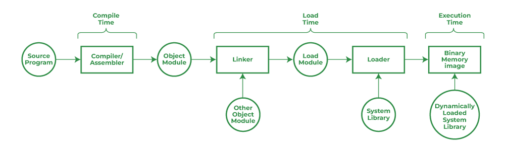
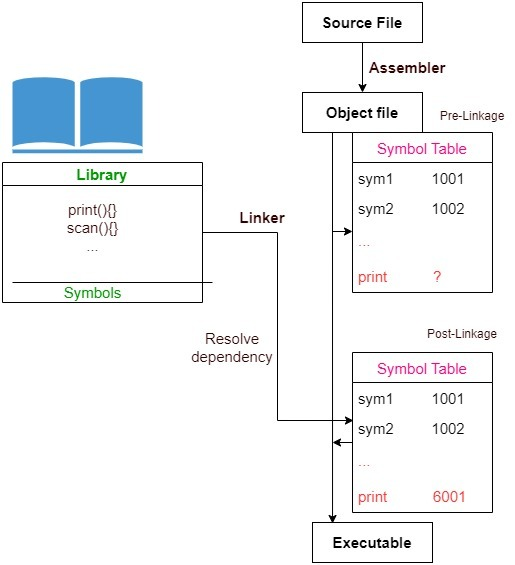

# Static & Dynamic Loading/Linking

---

# What is Linking?

- 프로그래밍 언어에서 작성한 소스 코드 파일들을 하나의 실행 가능한 프로그램으로 결합하는 프로세스를 가리킨다.
- 프로그램의 여러 부분을 하나로 연결하여 실행 파일을 생성하는 프로세스를 말한다.
- 프로그램 실행을 계속하기 위해 프로그램의 모든 모듈이나 모든 기능 사이에 링크를 설정하는 것을 말한다.
- 링크는 코드와 데이터 조각을 단일 파일로 수집 및 유지하는 프로세스이다.
- Linker는 또한 특정 모듈을 시스템 라이브러리에 연결한다.
- 어셈블러의 개체 모듈을 입력으로 사용하고 로더의 출력으로 실행 파일을 형성한다.
- 링크는 소스 코드 → 기계어 코드로 변환되는 컴파일 타임과 로더에 의해 프로그램이 메모리에 로드되는 로드 타임에 모두 수행된다.
- 링크는 프로그램 컴파일의 마지막 단계에서 수행된다.
- Linking은 어셈블러에서 생성된 개체 코드를 가져와 실행 가능한 모듈을 생성한다.
    - 프로그램 실행을 계속하기 위해 프로그램의 모든 모듈이나 모든 기능 사이에 링크를 설정하는 것을 링크라고 한다.
    - 링크는 코드와 데이터 조각을 단일 파일로 수집하고 유지하는 프로세스다.
    - 특정 모듈을 시스템 라이브러리에 연결한다.
    - 어셈블러의 개체 모듈을 입력으로 사용하고 로더의 출력으로 실행 파일을 형성한다.
    - 컴파일 타임과 로드 타임에 모두 수행되며, 프로그램 컴파일의 마지막 단계에서 수행된다.
    - 정적 연결과 동적 연결이 있다.
- 앱이나 프로그램을 빌드할 때 실행을 위해 라이브러리나 다른 프로그램을 연결해야 한다.
- 연결이란 성공적인 실행을 위해 외부 프로그램을 운영 체제와 결합하는 방식을 의미한다. 이를 달성하는 방법에는 정적 연결과 동적 연결이라는 두 가지 주요 방법이 있다.

## Static Linking

- 정적으로 링크된 프로그램은 실행을 위해 메모리에 로드될 때마다 일정한 로드 시간이 걸린다.
- 정적 링크는 프로그램 컴파일의 마지막 단계로 Linker라는 프로그램에 의해 수행된다.
- Linker는 링크 편집기라고도 한다.
- 정적 링크에서는 외부 프로그램 중 하나라도 변경된 경우 해당 프로그램을 다시 컴파일하고 다시 링크해야 한다. 그렇지 않으면 변경 사항이 기존 실행 파일에 반영되지 않는다.
- 정적 연결 시 시스템 링커는 종속성을 최종 실행 파일에 복사한다.
- 외부 라이브러리를 연결할 때 링커는 해당 라이브러리에 정의된 모든 종속성을 찾으며 이를 라이브러리의 해당 함수로 대체하여 코드의 종속성을 해결한다.
- 그 후 링크는 기본 컴퓨터에서 실행할 수 있는 최종 실행 파일을 생성한다.
- 위 과정으로 인해 정적으로 링크된 파일에는 프로그램의 코드뿐만 아니라 호출하는 모든 라이브러리의 코드도 포함된다. 이로 인해 결과 파일이 매우 커질 수 있으므로 디스크와 주 메모리 모두에 공간이 필요하다.
- 링커는 프로그램 코드를 모든 필수 라이브러리와 결합한다. 완료되면 모든 것이 하나의 실행 파일로 컴파일된다. 프로그램이 설치되면 필요한 모든 라이브러리가 메모리에 로드된다.
    - 여기서 "정적"이라는 용어가 사용된다. 이제 모든 것이 함께 제공되므로 외부 라이브러리가 변경되면 이 전체 프로세스를 다시 수행해야 한다.
- 프로그램의 .exe(실행 가능) 파일을 클릭하고 실행을 시작하면 바이너리 파일의 필요한 모든 내용이 프로세스의 가상 주소 공간에 로드된다.  그러나 대부분의 프로그램은 시스템 라이브러리의 기능도 실행해야 하며 이러한 라이브러리 기능도 로드해야 한다.
- 가장 간단한 경우에는 필요한 라이브러리 기능이 프로그램의 실행 가능한 바이너리 파일에 직접 포함된다. 이러한 프로그램은 라이브러리에 정적으로 링크되어 있으며 정적으로 링크된 실행 코드는 로드되자마자 실행을 시작할 수 있다.
- 정적링크는 소스프로그램을 컴파일하는 동안 수행된다.
- 정적 링크에서는 실행 전에 링크가 수행된다. 재할당 가능 개체 파일과 명령줄 인수를 수집하고 완전히 연결된 파일을 생성한다. 로드하고 실행할 수 있는 개체 파일이다.

### 장점

- 정적 링크는 컴파일 타임에 외부 라이브러리를 통합하므로 애플리케이션이 독립 실행형 바이너리로 실행될 수 있도록 보장한다
- 독점성을 보장한다.
    - 정적으로 연결된 각 프로세스는 코드와 데이터의 복사본을 가져옴으로써 각각 독립적인 환경을 제공, 프로세스를 다른 프로세스와 완전히 격리할 수 있다
- 정적 링크는 컴파일 타임에 전체 라이브러리 내용을 복사하기에 더 빠른 실행을 제공한다.
- 정적 링크는 프로그램이 실행하는 데 필요한 모든 것을 이미 갖추고 있으므로 바이너리를 여러 환경이나 운영 체제에 배포하는 프로세스를 단순화할 수 있다.
- 정적 링크를 사용하면 프로그램의 복잡성에 따라 시작 속도가 약간 빨라질 수 있다. 이로 인해 호환성 문제가 발생할 가능성도 줄어든다.

### **단점**

- 생성된 모든 프로그램에는 정확히 동일한 공통 시스템 라이브러리 기능의 복사본이 포함되어야 한다. 실제 메모리와 디스크 공간 사용량 측면에서 시스템 라이브러리를 메모리에 한 번만 로드하는 것이 훨씬 더 효율적이다. 동적 연결을 사용하면 이러한 단일 로딩이 발생할 수 있다.
- 모든 라이브러리를 하나의 실행 파일로 컴파일하고 제공하므로 프로그램이 훨씬 더 커지고 많은 리소스를 사용할 수 있다. 여기에는 캐시, RAM 및 디스크 공간이 포함된다.
- 외부 프로그램에서 변경 사항이 발생하면 실행 파일에 자동으로 반영되지 않는다. 전체 컴파일 및 연결 프로세스를 다시 수행해야 한다.

| 정적 연결 | 동적 연결 |
| --- | --- |
| 컴파일 타임에 필요한 모든 라이브러리 루틴과 외부 참조를 단일 실행 파일로 결합하는 프로세스. | 프로그램이 로드되거나 실행될 때 런타임에 외부 라이브러리와 참조를 연결하는 프로세스. |
| 컴파일 타임에 발생. | 런타임에 발생. |
| 모든 필수 라이브러리가 실행 파일에 포함되어 있으므로 일반적으로 파일 크기가 더 크다. | 라이브러리가 런타임에 동적으로 연결되므로 파일 크기가 더 작다. |
| 라이브러리를 업데이트하거나 변경하려면 전체 프로그램을 다시 컴파일하고 다시 연결해야 하므로 유연성이 떨어진다. | 프로그램을 다시 컴파일하지 않고도 라이브러리를 업데이트하거나 교체할 수 있으므로 더욱 유연하다. |
| 모든 라이브러리가 이미 연결되어 있으므로 프로그램 시작 및 직접 실행이 더 빨라진다. | 추가 연결 프로세스로 인해 프로그램 시작 속도가 약간 느려지지만 전반적인 성능에 미치는 영향은 미미하다. |
| .exe, .elf, .a, .lib 등과 같은 파일 확장자를 가진 실행 파일 | .dll, .so, .dylib 등과 같은 파일 확장자를 가진 실행 파일 |

## Dynamic Linking

- 동적 연결은 운영 체제에 의해 런타임에 수행된다.
- 동적 연결에서는 개별 공유 모듈을 업데이트하고 다시 컴파일할 수 있다. 이것은 동적 연결이 제공하는 가장 큰 장점 중 하나이다.
- 동적 연결에서는 공유 라이브러리 코드가 이미 메모리에 있는 경우 로드 시간이 줄어들 수 있다.
- 동적 연결에서는 외부 라이브러리의 이름을 확인되지 않은 기호로 최종 실행 파일에 복사한다.
- 그 뒤 런타임에만 이러한 해결되지 않은 기호를 실제로 연결한다.
- 이는 해결되지 않은 기호를 발견할 시 RAM에 이를 쿼리함으로써 이루어진다.
- 해당 라이브러리가 로드되지 않으면 OS는 해당 라이브러리를 메모리에 로드한다.
- 동적 링크는 외부 또는 공유 라이브러리가 런타임 시점에 바로 이름으로 실행 파일에 복사되는 경우다. 그런 다음에야 운영 체제가 필요한 라이브러리를 메모리에 로드한다.
- 모든 동적으로 연결된 프로그램에는 프로그램이 시작될 때 호출되는 정적으로 연결된 작은 함수가 포함되어 있다. 이 정적 함수는 링크 라이브러리를 메모리에 매핑하고 함수에 포함된 코드를 실행하기만 한다.
- 링크 라이브러리는 라이브러리의 섹션에 포함된 정보를 읽어 해당 라이브러리에 필요한 변수 및 함수의 이름과 함께 프로그램에 필요한 모든 동적 라이브러리가 무엇인지 결정한다. 그런 다음 라이브러리를 가상 메모리의 중간에 매핑하고 해당 라이브러리에 포함된 기호에 대한 참조를 확인한다.
- 우리는 이러한 공유 라이브러리가 실제로 매핑되는 메모리의 위치를 알 수 없다.
- 이는 위치 독립적 코드(PIC)로 컴파일되어 메모리의 모든 주소에서 실행될 수 있다.
- 동적 연결 중에 운영 체제는 프로그램이 실행될 때 외부 라이브러리를 찾는다. 현재 메모리에 로드된 라이브러리에 변경 사항이 발생하면 실행 파일을 다시 컴파일하여 새 실행 파일로 제공할 필요가 없다.

### 장점

- 동적 연결에서는 공유 라이브러리의 복사본 하나만 메모리에 유지된다.
    - 따라서 프로그램의 실행 파일이 정적 연결에 비해 더 작으며, 메모리 효율성이 더 높다.
- 평균 로드 시간이 단축된다.
- 배포 및 유지 관리 관점에서 수월해진다
- 모듈성을 촉진한다.
- DLL은 메모리에 한 번만 로드되는 반면, 둘 이상의 응용 프로그램이 현재 단일 DLL을 사용할 수 있으므로 메모리 공간이 절약된다.
- 동적 연결을 사용하면 파일 크기가 더 작아진다. 연결된 라이브러리의 코드는 실행 파일과 함께 제공될 필요가 없다. 이는 디스크 공간이나 RAM과 같은 리소스 사용량이 적음을 의미한다.
- 운영 체제에서 이미 공유 라이브러리를 사용할 수 있는 경우 시작 시간을 줄일 수 있다.
- 다시 링크할 필요 없이 라이브러리의 루틴을 업데이트할 수 있다. 즉, 새 실행 파일을 제공할 필요 없이 버그 수정 및 기타 변경 사항을 실행할 수 있다.
- 유지 관리 비용이 낮아지고 지원 필요성이 줄어든다.

### 단점

- 라이브러리를 제거하면 프로그램이 중단될 수 있다. 또는 라이브러리가 변경되면 호환성 문제가 발생하고 결과적으로 애플리케이션을 재작업할 수 있다.
- **유연성이 떨어지는 동적 링커가 있는 경우 프로그램이 더 이상 실행되지 않거나 올바르게 작동하지 않을 수 있다(“ DLL 지옥**” 이라고도 함 ).

|   | Static Linking | Dynamic Linking |
| --- | --- | --- |
| 정의  | 컴파일 타임에 필요한 모든 라이브러리 루틴과 외부 참조를 단일 실행 파일로 결합하는 프로세스이다.  | 프로그램이 로드되거나 실행될 때 런타임에 외부 라이브러리와 참조를 연결하는 프로세스입니다.  |
| 연결 시간  | 컴파일 타임에 발생  | 런타임에 발생 |
| 파일 크기  | 모든 필수 라이브러리가 실행 파일에 포함되어 있으므로 일반적으로 파일 크기가 더 크다.  | 라이브러리가 런타임에 동적으로 연결되므로 파일 크기가 더 작다.  |
| 유연성  | 라이브러리를 업데이트하거나 변경하려면 전체 프로그램을 다시 컴파일하고 다시 연결해야 하므로 유연성이 떨어진다.  | 프로그램을 다시 컴파일하지 않고도 라이브러리를 업데이트하거나 교체할 수 있으므로 더욱 유연하다.  |
| 성능  | 모든 라이브러리가 이미 연결되어 있으므로 프로그램 시작 및 직접 실행이 더 빨라진다.  | 추가 연결 프로세스로 인해 프로그램 시작 속도가 약간 느려지지만 전반적인 성능에 미치는 영향은 미미하다.  |
| 예  | .exe, .elf, .a, .lib 등과 같은 파일 확장자를 가진 실행 파일  | .dll, .so, .dylib 등과 같은 파일 확장자를 가진 실행 파일 |

### DDL Hell Issuae

- DDL(동적으로 링크된 라이브러리) 지옥 문제는 OS가 로드하는 DDL이 응용 프로그램의 기대하는 버전과 다를 때 발생한다. 이는 해결되지 않는 기호를 만든다.
- 애플리케이션이 사용하는 API를 변경했지만, 애플리케이션의 API를 사용하는 코드를 업데이트 하는 것을 잊어버린 경우, 애플리케이션이 이전 API를 호출하게 됨으로써 런타임 시 충돌이 발생한다.
- DDL에는 이전 버전과의 호환성을 확인하는 기본 제공 메커니즘이 없으므로, DDL을 조금만 변경해도 이런 문제가 발생할 수 있다.

## 선택 시 고려사항

- 예측하는 업데이트의 수준과 빈도
    - 정적으로 링크된 프로그램에서는 버그 수정 및 업데이트 제공이 훨씬 덜 효율적이다. 매번 전체 실행 파일을 다시 컴파일하고 제공해야 한다.
    - 동적 연결을 사용하면 최신 버전의 라이브러리를 호출하므로 사용자는 프로그램이 실행될 때마다 최신 버전의 프로그램을 로드하게 된다. 따라서 모든 것을 다시 컴파일할 필요 없이 필요한 변경을 수행할 수 있다.
- 정적 및 동적 연결은 프로그램을 컴파일하고 출시하는 근본적으로 다른 두 가지 방법이다. 각각은 로드 시간, 전반적인 성능 및 업데이트 용이성과 관련된 고유한 장점과 이점을 가지고 있다.
- 선택하는 방법은 전적으로 사용 사례와 앱을 배포하는 위치에 따라 다르다. 결정하기 전에 다양한 운영 체제, 사용자 경험, 패치와 업데이트를 빠르게 배포하는 능력의 영향을 신중하게 고려해야 한다.

# What is Loading?

- 프로그램을 보조 메모리에서 주 메모리로 가져오는 것을 말한다.
- 이는 로더에 의해 수행된다.
- 실행 파일을 메모리에 로드하여 프로그램을 실행 가능한 상태로 만드는 것을 말한다.
- Linker에서 실행 파일의 입력을 받아 이를 주 메모리에 로드하고 컴퓨터에서 실행할 수 있도록 이 코드를 준비하는 특수 프로그램이다.
- 정적 로딩과 동적 로딩이 있다.

## Dynamic Loading

- 동적 로딩, 컴파일러, 프로그램 및 동적으로 포함되어야 하는 모든 모듈에 대한 참조로만 제공되며 나머지 작업은 런타임에 수행된다.
- 프로세스를 실행하려면 전체 프로그램과 모든 프로세스 데이터가 **물리적 메모리에 있어야 한다.** 결과적으로 프로세스 크기는 사용 가능한 실제 메모리 양에 따라 제한된다.
    - **예 –** C++ 및 Java와 같은 Oops 언어에서 동적 로딩이 발생한다.
- 동적 로더는 요청 시 프로그램을 주 메모리에 로드하는 프로그램이다
- 동적 로더는 프로그램에서 필요한 코드와 데이터만 로드하고 나머지 부분은 실행 파일에 남겨둔다.
    - 시작 시간을 더 빠르게 만든다.
- 동적 로더는 모든 외부 종속성을 해결한다
- 동적 로더는 대량의 데이터를 효율적으로 처리해야 할 때 매우 유용하다
- 프로그램은 실행 중에 필요할 때 메모리에 로드된다.
- 메모리 사용량을 줄이고 성능을 향상시킨다.
- 동적 로딩에서는 프로그램이 메모리에 로딩되기 전에 링크 및 컴파일되지 않는다.
- 이는 프로그램에 더 많은 효율성과 유연성을 제공한다.
- 시스템이 필요할 때 필요한 모든 모듈과 라이브러리가 사전 구축되어 있다.
- **최적의 메모리 소비를** 보장하기 위해 동적 로딩이 활용된다 . 동적 로딩에서는 루틴이 호출될 때까지 루틴이 로드되지 않는다. 모든 루틴은 **다시 로드할 수 있는 로드 형식**으로 디스크에 저장된다 .
- 동적 로딩의 주요 장점은 새 루틴이 로드되지 않는다는 것이다. 이 로딩은 효율적으로 처리하기 위해 엄청난 양의 코드가 필요할 때 유용하다.

### **장점**

- **낮은 메모리 사용량**
    - 동적 로딩은 주어진 시간에 필요한 프로그램 부분만 메모리에 로드되므로 메모리 사용량을 줄일 수 있다.
- **더 빠른 시작 시간**
    - 동적 로딩은 시작 시 필요한 프로그램 부분만 메모리에 로드되므로 시작 시간이 더 빨라질 수 있다. 이는 시간에 민감한 애플리케이션에 특히 유용할 수 있습니다.
- **더 많은 유연성**
    - 동적 로딩은 코드의 런타임 로딩이 필요한 동적 연결 및 기타 프로그래밍 기술을 허용하므로 정적 로딩보다 더 유연할 수 있다.

### **단점**

- **오버헤드**
    - 동적 로딩은 런타임 중에 코드를 메모리에 로드하기 위해 시스템이 추가 작업을 수행해야 하므로 오버헤드가 발생할 수 있다.
- **예측할 수 없는 동작**
    - 동적 로딩은 예측할 수 없는 동작으로 이어질 수 있다. 런타임 중에 프로그램의 다른 부분이 로드 및 언로드됨에 따라 프로그램의 동작이 변경될 수 있기 때문이다.
- **복잡성**
    - 동적 로딩은 정적 로딩보다 더 복잡할 수 있으며, 특히 프로그램의 여러 부분 간의 종속성을 관리하는 경우 더 그렇다.

## Static Loading

- 처음에 전체 프로그램이 실행되기 전에 주 메모리에 로드된다.
- 정적 로딩의 경우 전체 프로그램이 컴파일되고 링크되므로 컴파일 타임에 프로그램이다 외부 모듈 종속성이 남지 않는다.
- 정적 로딩은 프로그램이 너무 크거나 복잡하지 않을 때, 프로그램을 여러 번 사용할 계획일 때 유용하다.
- 정적 로더는 프로그램이 실행되기 전에 프로그램에 필요한 라이브러리, 종속성 등 전체 실행 프로그램을 메모리에 로더(Loader)한다.
- 프로그램을 메모리에 로드한 후 로더는 프로그램의 모든 외부 종속성을 해결한다. (정적 연결)
- 연결이 완료되면 로더는 프로그램의 주소를 업데이트한다.
- 전체 프로그램을 로드하고 연결하는 데 추가 소프트웨어가 필요하지 않다
- 정적 로더에는 정적 링크가 적용된다 .
- 정적 로더는 프로그램에서 사용하는 실행 파일 형식을 지원하는 모든 플랫폼에서 작동할 수 있으며, 이식 가능하다.
- 정적 로딩은 메모리 사용을 위한 작은 프로그램으로 사용된다.
- 정적 로딩은 일반적으로 프로그램을 로딩하는 다른 방법보다 빠르다.
- 처리 전력 소모가 적다.
- 프로그램이 로드되면 실행은 메모리 장치에 따라 달라진다.
- 전체 프로그램이 한 번만 로드되므로 정적 로딩이 더 안전하다.

### **장점**

- **더 빠른 실행**
    - 런타임 중에 디스크에서 프로그램을 읽을 필요가 없다. 이로 인해 실행 시간이 더 빨라질 수 있다.
- **예측 가능한 동작**
    - 전체 프로그램이 메모리에 로드되므로 프로그램 동작을 더 예측하기 쉽다. 이는 시간, 안전이 중요한 애플리케이션에 특히 유용하다.
- 효**율적인 리소스 사용**
    - **프**로그램의 메모리 공간이 런타임 중에 동적으로 할당되는 것이 아니라 미리 할당되므로 리소스 사용 측면에서 정적 로딩이 더 효율적일 수 있다.

### **단점**

- **높은 메모리 사용량**
    - 전체 프로그램이 메모리에 로드되므로 정적 로딩으로 인해 메모리 사용량이 높아질 수 있다.
- **긴 시작 시간**
    - 정적 로딩은 실행이 시작되기 전에 전체 프로그램이 메모리에 로드되어야 하므로 시작 시간이 길어질 수 있습니다. 이는 시간에 민감한 애플리케이션의 경우 문제가 될 수 있다.
- **유연성 없음**
    - 정적 로딩은 실행 전에 전체 프로그램을 메모리에 로드해야 하기 때문에 동적 로딩보다 유연성이 떨어질 수 있다. 이로 인해 동적 연결과 같은 특정 프로그래밍 기술을 구현하기가 더 어려워질 수 있다.

| Dynamic Loader | Static Loader |
| --- | --- |
| 정적 로더는 실행이 시작되기 전에 전체 프로그램을 메모리에 로드한다 | 동적 로더는 프로그램 실행에 필요한 부분만 로드한다. |
| 런타임 연결이 필요하지 않다. | 런타임 연결이 필요하다. |
| 정적 로더의 경우에 사용된다. | 동적 로더의 경우 동적 링킹이 사용된다. |
| 실행 중에 파일이 변경되지 않으므로 더 빠르다. | 런타임에 파일이 업로드되므로 파일 속도가 느려진다. |
| 정적 로더는 메모리 낭비를 만든다. | 동적 메모리는 메모리 효율적이다. |
| 고성능 애플리케이션에 적합하다. | 이는 자원 제약 애플리케이션에 적합하다. |
| 런타임 오류를 제거한다. | 필요한 종속성을 사용할 수 없는 경우 런타임 오류가 발생할 수 있다. |
| 정적 로더는 컴파일러 언어에 사용된다. | 해석된 언어에 사용된다. |
| 전체 프로그램을 메모리에 로드하므로 유연성이 떨어진다. | 더 유연하다. |
| 전체 프로그램과 종속성이 메모리에 한 번 로드되므로 더 예측 가능하다. | 정적 로더보다 예측 가능성이 낮다. |
| 정적 로더에는 더 많은 디스크 공간이 필요하다. | 동적 로더에는 더 적은 디스크 공간이 필요하다. |

| 정적 로딩 | 동적 로딩 |
| --- | --- |
| 프로그램을 실행하기 전에 프로그램 전체를 주 메모리에 로드 | 조건에 따라 임의의 프로그램을 주 메모리에 로드하는 과정 |
| C와 같은 구조화된 프로그래밍 언어에서만 수행 | C++, Java 등과 같은 OOP 언어에서 발생 |
| 추가 소프트웨어 없이 전체 프로그램을 링크 및 컴파일 | 모든 모듈은 동적으로 로드됨. 개발자는 이 모든 것을 참조하고 나머지 작업은 실행 시간에 완료
필요한 모든 모듈과 라이브러리가 시스템에 미리 로드 됨 |
| 링커는 개체 프로그램과 기타 개체 모듈을 결합하여 단일 정적 로딩 프로그램을 형성 | 연결 프로세스는 재배치 가능한 형태로 동적으로 발생 
데이터는 프로그램에서 필요할 때만 메모리에 로드 됨 |
| 무제한의 데이터와 프로그램이 메모리에 로드되어 실행 시작 | 런타임에는 데이터와 정보가 조금씩 로드됨 |
| 정적 로딩을 사용하는 경우 정적 링크도 사용됨 | 동적 로딩을 사용하는 경우 동적 연결도 사용됨. |
| 코드가 메모리에 로드되면 실행될 수도 있고 실행되지 않을 수도 있다. | 필요한 경우에만 실행 → 효율적인 메모리 활용 |
| 프로세스 중에 파일이 변경되지 않으므로 처리 시간이 더 빠름 | 처리 시간에 파일이 업로드되기 때문에 처리 속도가 느려짐 |
| 더 안전하고 더 많은 시스템 리소스를 사용할 수 있다 | 보안 수준은 낮지만 시스템 리소스는 필요할 때만 소비된다 |
| 모든 라이브러리가 한 번에 로드되므로 유연성이 제한 | 필요에 따라 라이브러리를 로드할 수 있으므로 더욱 유연 |
| 프로그램 변경 시 재컴파일 및 재링크가 필요 | 다시 컴파일할 필요 없이 동적 업데이트 허용 |

# Linking과 Loading의 차이점

| Linking | Loading |
| --- | --- |
| 코드와 데이터 조각을 단일 파일로 수집하고 유지 관리하는 프로세스를 운영 체제에서는 Linking이라고 한다. | 로딩은 실행을 위해 보조 메모리에서 주 메모리로 프로그램을 로드하는 프로세스이다. |
| 연결은 모든 모듈을 결합하는 데 사용된다. | 로딩은 모든 실행 파일에 주소를 할당하는 데 사용되며 이 작업은 로더에 의해 수행된다. |
| 링커의 도움으로 연결이 수행된다.  운영 체제에서 링커는 프로그램의 개체 모듈을 단일 개체 파일로 연결하는 데 도움이 되는 프로그램이다. 링크 편집기라고도 한다. | https://www.geeksforgeeks.org/computer-memory/ 에 배치 하고 실행을 준비하는 프로그램이다. |
| 링커는 별도의 컴파일을 가능하게 하기 때문에 소프트웨어 개발 프로세스에서 중요한 부분이다.
대규모 애플리케이션을 하나의 모놀리식 소스 파일로 구성하는 것 외에도 별도로 수정하고 컴파일할 수 있는 더 작고 관리하기 쉬운 모듈로 분해할 수 있다 . | 로더는 운영 체제의 할당, 연결, 재배치 및 로딩을 담당한다. |