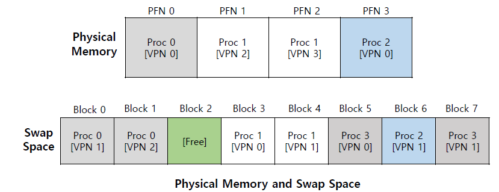
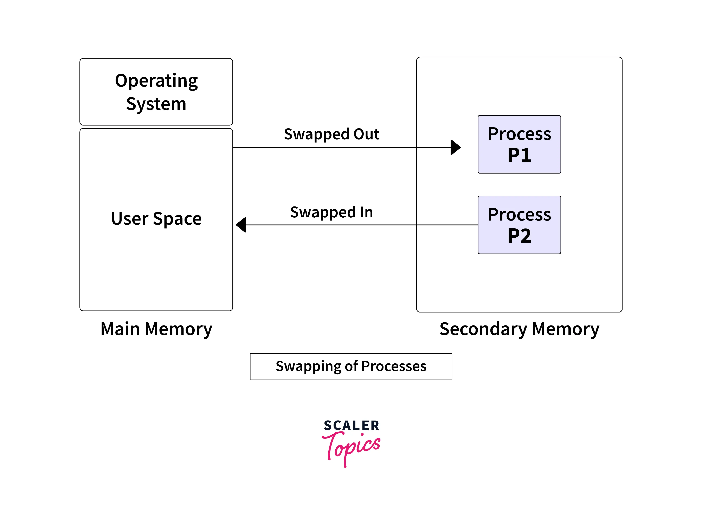

# Swapping

---

# 정의

- 현재 사용하지 않는 메모리 내용을 디스크로 스와핑하여 다른 응용 프로그램이나 프로세스에서 사용할 수 있도록 하는 메모리 회수 방법.
- 스와핑의 기본적인 목표는 컴퓨터 하드웨어가 실제로 보유하는 것보다 더 많은 사용 가능한 메모리를 활성화하는 것에 있다.
- **운영 체제에서의 스와핑은** 유휴 또는 차단된 프로세스를 주 메모리에서 보조 메모리로 일시적으로 교체하여 실행할 준비가 된 프로세스에 대한 적절한 메모리 활용도와 메모리 가용성을 보장하는 메모리 관리 체계다.
- 운영 체제의 주요 목표는 **CPU 사용률 최대화이**다 . 즉, 매번 프로세스가 실행되어야 하고, **CPU가 유휴 상태로 유지되어서는 안 되며, 프로세스가 중단되거나** 차단 **되어서**는 안 된다. 운영 체제의 이러한 목표를 달성하기 위해 다양한 프로세스 관리 및 메모리 관리 체계가 설계되었다.
- 메모리의 정확한 상태 또는 페이지가 디스크에 복사되어 데이터를 연속적으로 만들고 나중에 쉽게 복원할 수 있다.
    - 요구사항에 따라 물리적 메모리와 가상 메모리 사이를  효율적으로 전환할 수 있다.
    - 우선순위 기반 선점형 스케줄링이 사용된다.
- 메모리 스와핑은 OS 커널이나 (가상화 환경의 경우) 하이퍼바이저에 의해 수행된다.
- 운영 체제에서, Swap의 목적은 하드 디스크의 데이터에 액세스하여 응용 프로그램이 사용할 수 있도록 RAM으로 옮기는 것이다.
- 스와핑은 RAM에서 데이터를 사용할 수 없을 경우에만 사용된다.
    - 물리적인 메모리(RAM)를 초과하여 메모리 부족 상태에 놓였을 때 발생한다.
- 기본적으로 메모리 스와핑 프로세스는 물리적 RAM이 완전히 소모되고 추가 프로세스와 애플리케이션 실행을 위해 공간이 필요한 경우 수행된다.
    - 운영체제(혹은 하이퍼바이저)는 이를 자동으로 관리하고, 물리 메모리 공간을 스왑 공간에 매핑해 가상 메모리 용량(비물리적 RAM)을 형성한다.
        - 스왑 공간 : 하드 드라이브에 저장된 가상 메모리 조각
- 시스템에서 메모리 스와핑을 수행해야 하는 애플리케이션이 많아질수록 오버헤드 증가로 인해 성능이 느려진다.
- 시스템 성능에 영향을 미칠 수 있지만 메모리를 관리하여 둘 이상의 프로세스를 실행하는데 도움이 된다. **따라서 OS에서의 스와핑은 메모리 압축 기술**이라고도 알려져 있다.
- 다중 프로그래밍에서 CPU활용도를 높이려면 스와핑이라는 메모리 관리 체계를 사용할 수 있다.
- 스와핑 프로세스는 시스템 성능을 저하시키지만 더 크고 여러 프로세스를 동시에 실행할 수 있다.
- 이 때문에 스와핑을 메모리 압축이라고도 한다.
- CPU 스케줄러는 어떤 프로세스가 Swap-in 되고 Swap-out 되는지를 결정한다.
- 스왑 아웃된 프로세스가 저장되는 보조 메모리 영역을 **스왑 공간** 이라고 한다 . 스와핑 방법은 보조 메모리에 스와핑된 프로세스의 임시 대기열을 형성한다.
- 우선순위가 높은 프로세스의 경우 우선순위가 낮은 프로세스를 메인 메모리에서 스왑하여 스왑 공간에 저장한 후 우선 순위가 높은 프로세스를 메인 메모리로 스왑하여 먼저 실행한다.
- 메모리를 소비하는 프로세스가 종료 상태로 전환되면 해당 실행 전용 메모리가 해제되어 실행이 종료되었음을 의미한다. 그런 다음 교체된 프로세스가 다시 주 메모리로 가져와 실행이 시작된다.

# 장점

- 최대 메모리 활용도
    - 스와핑을 통해 메모리를 확보하고 더 많은 애플리케이션을 원활하게 작동할 수 있다.
    - 스왑 파일은 각 프로그램이 자체 전용 메모리를 갖도록 보장하여 전반적인 성능을 향상시킨다
    - 메인 메모리를 활용한다.
    - 단일 메인 메모리만을 사용하여 스왑 파티션을 사용하는 CPU에서 여러 프로세스를 실행할 수 있다.
- 지속적인 운영
    - 우선순위 기반 프로세스 스케줄링에서는 우선순위가 낮은 활동을 우선순위가 높은 프로세스로 대체하여 운영 중단을 최소화하는 스와핑 방법을 사용할 수 있다.
- 시스템 최소화
    - 스와핑을 통해 CPU는 많은 작업을 동시에 수행할 수 있으므로 대기 시간이 줄어들 수 있다.
    - 결과적으로 단일 메인 메모리에서 많은 프로세스를 제어하기가 더 수월해진다
- 향상된 멀티태스킹
    - 더 많은 프로그램이 동시에 실행되고 RAM을 효과적으로 사용할 수 있도록 하여 멀티프로그래밍 수준을 높이는 데도 도움이 된다.
    - **CPU는** 스와핑을 통해 다양한 작업을 동시에 수행할 수 있으므로 프로세스가 실행되기 전에 오래 기다릴 필요가 없다.
- **OS** 교체는 **최대 CPU 사용률** 목표를 달성하는 데 도움이 된다.
- 스와핑은 프로세스 기아 문제를 방지하는 데 도움이 된다. 즉, 프로세스가 실행되는 데 많은 시간이 걸리지 않아 다음 프로세스가 실행되어야 함을 의미한다.
- 스와핑은 적절한 **RAM**(주 메모리) 활용을 보장한다.

# 단점

- 성능
    - 메모리 스와핑으로 인해 실행되는 경우 디스크 저장 공간은 프로세스 실행에 사용되는 실제 RAM과 동일한 성능을 제공할 수 없다.
- 디스크 제한 사항
    - 저장 매체의 안정성과 접근성은 시스템 메모리만큼 안정적이지 않을 수 있는 파일을 교환하는 데 도움이 된다.
- 용량
    - 운영 체제 또는 하이퍼바이저에 할당된 스왑 공간은 스왑할 수 있는 메모리 양을 제한한다.
- 정보 손실
    - 집중적인 교환 중 컴퓨터의 전원이 꺼질 경우 사용자는 모든 프로그램 관련 정보를 잃을 수 있다.
    - 주 메모리 리소스가 부족하고, 사용자가 너무 많은 프로세스를 실행하고 갑자기 시스템 전원이 꺼지면 스와핑에 참여한 프로세스의 데이터가 지워질 가능성이 있다.
- 페이지 오류 증가
    - 스와핑 기술이 수준 이하인 경우 복합 방법을 사용하면 더 많은 페이지 오류가 발생하여 처리 속도가 느려질 수 있다.
- 페이지 폴트 횟수가 발생할 확률이 높다.
- 스와핑 방법이 목표에 미치지 못하는 알고리즘을 사용하는 경우 페이지 오류 수가 증가하여 전체 성능이 저하될 수 있다.
- 스와핑 프로세스에 참여하는 프로세스에서 사용하는 공통 리소스가 있는 경우 비효율성이 발생할 수 있다.
- 스와핑은 일반적으로 비용이 큰 작업이기 때문에 가능하면 회피하는 것이 이상적이다.
- 대신 페이징과 같은 다른 메모리 관리 기술을 사용하여 효율적으로 메모리 관리를 수행한다.