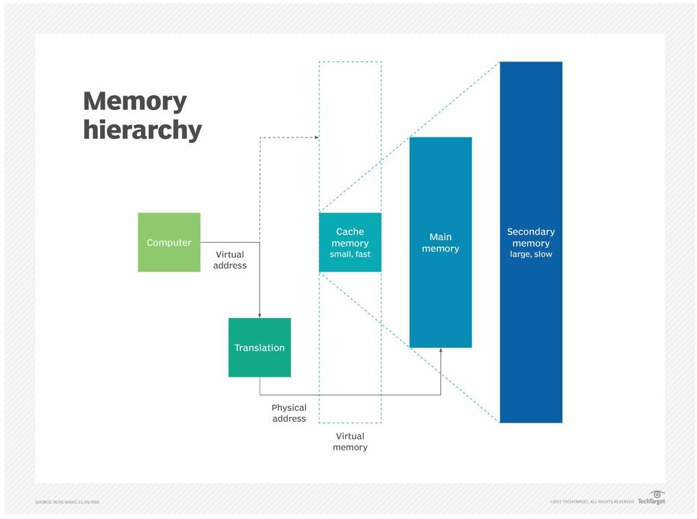

# Memory Hierarchy

[Auxiliary Memory](Memory_Hierarchy/Auxiliary_Memory.md)

[Primary Memory](Memory_Hierarchy/Primary_Memory.md)

[Cache Memory](Memory_Hierarchy/Cache_Memory.md)

[Register Memory](Memory_Hierarchy/Register_Memory.md)