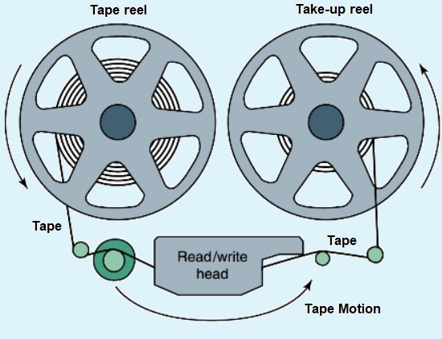
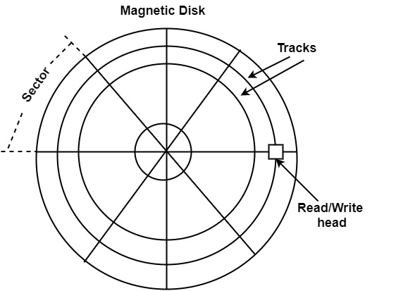
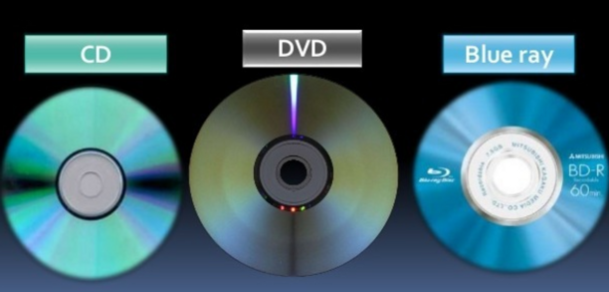
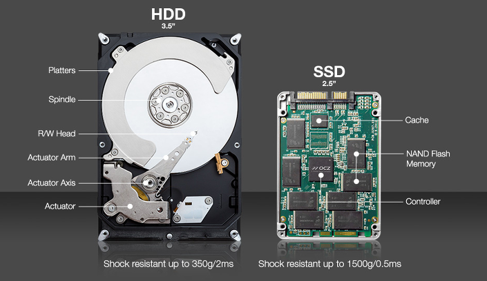

# Auxiliary Memory

# Auxiliary Memory

- 보조 메모리(Auxiliary Memory)는 컴퓨터 시스템에서 가장 저렴하고, 가장 많은 공간을 가지며, 가장 느리게 접근하는 비휘발성 메모리 스토리지다.
- auxiliary storage, secondary storage, secondary memory, external storage, external memory 라고도 한다.
- 장기간 보관하거나 직접 사용하지 않을 때 프로그램과 정보가 보존되는 곳이다.
- 보조 메모리는 기본 메모리보다 훨씬 더 큰 용량을 제공하며 일반적으로 운영 체제, 응용 프로그램, 미디어 파일 및 기타 유형의 디지털 콘텐츠와 같은 대용량 데이터를 저장하는 데 사용된다.
- 순차 액세스와 직접 액세스의 두 가지 유형으로 나뉜다.
- 보조 메모리는 CPU에서 직접 액세스할 수 없다. 대신, 필요할 때마다 사용되는 고대역폭 채널을 통해 보조 메모리에서 기본 메모리(primary memory)로 제공되는 중요하지 않은 시스템 데이터를 저장한다.
- 주요 장점 중 하나는 비휘발성이다. 즉, 컴퓨터가 꺼진 후에도 보조 메모리에 저장된 데이터와 프로그램에 액세스 할 수 있다. 또한, 보조기억장치는 큰 저장 용량을 제공하므로 많은 양의 데이터와 프로그램을 저장할 수 있다.
    - 이는 나중에 동일한 컴퓨터나 다른 컴퓨터에서 이 정보를 읽을 수 있도록 하기 위한 것으로, 백업이나 정보의 이동에 유용하다.
- 그러나 기본 메모리에 비해 액세스 시간과 읽기/쓰기 속도가 느리다.
- 기계적 오류 및 데이터 손상이 발생하기 쉬우며 이로 인해 데이터 손실이 일어날 수 있다.
- 보조 메모리의 예로는 Hard Disk Drive(HDD), Solid-State Drive(SSD), Optical Disk(광학디스크,광디스크), 플래시 메모리(USB, 메모리카드)가 있다.
- 유형으로는 고정 저장소(fixed storage)와 이동식 저장소(Removable storage)가 있다.

# Magnetic Tape

- Magnetic Tapes(자기 테이프)는 전자 데이터 저장을 위한 가장 오래된 기술 중 하나로, 자화(magnetizable) 가능한 물질로 코팅된 얇고 길고 좁은 플라스틱 스트립이다.
- 비휘발성 메모리다.
- 리본의 한쪽 면만 데이터를 저장하는 데 사용된다.
- 저장된 데이터는 사람이 읽을 수 있는 형식이 아니므로 수동 인코딩이 불가능하다.
- 먼지나 부주의한 취급으로 인해 손상되기 쉽다.
    
    ### 장점
    
    - HDD, 디스크 등에 비해 보존 가능 기한이 길다. 자기 테이프의 수명은 15~30년 정도이다. 이는 두 가지 이유가 있다.
        - 첫째, 매체의 기계 요소가 분리되었다. 하드 디스크는 내부 모터를 돌려서 플래터를 읽는다. 때문에 모터나 부속품 노후화에 의한 고장이 잦다. 반면 테이프 드라이브는 복잡하지만, 저장 매체인 테이프는 자기장으로 정보를 입힌 필름 쪼가리일 뿐이다. 고장이나 노후화 요소가 적다.
        - 둘째, 접촉식 자기 매체는 물리적 손상에 강하다. 극단적인 예로 테이프 일부가 끊어져도 그 부분만 이어 붙이면 나머지는 데이터가 읽힌다. 사소한 구겨짐 정도는 큰 문제가 없으며 오류 보정 대비도 잘 되어 있다. 이는 자기 테이프가 접촉에 강하게 발전했기 때문이다.
    - 드라이버에 삽입하지 않는 한 읽거나 수정할 수 없으므로 사이버 공격과 네트워크 바이러스로부터 안전하다.
    - 대용량 저장에 적합하다.
    - 디스크 파일에서 복사하는 데 사용할 수 있다.
    - 테이프는 타 저장 장치에 비해 매우 저렴하며 저가형 메모리이다.
    - 특정 데이터를 제거하고 같은 장소에 다른 데이터를 저장할 수 있다.
    - 컴팩트하고 보관하기 쉽다.
    
    ### 단점
    
    - 순차 액세스가 이루어지기 때문에 데이터 읽기/쓰기 속도가 매우 느리다.
        - 처리시간이 느리고, 순차적으로 구성되어 있지 않은 자료를 처리하는 데 실용적이지 않다.
    - 데이터 접근 속도가 느려 주로 백업 메모리로 활용된다. 이밖에도 소리를 녹취하거나 영상을 녹화하는 데에도 사용할 수 있다.
    - 일반 사용자에 맞춰서 보편화된 다른 컴퓨터 부품들과 달리 일반 사용자쪽 수요가 도태되어 특수 사용자만을 고려해서 발전해 왔기에 초기 구축 비용이 비싸다.
        - 신뢰성이 중요한 기업의 경우 소규모 백업은 주로 하드 디스크를 이용하며, 자기 테이프 기반 저장 장치는 대형 포털이나 정부 기관, 은행, 대기업 등에서 주로 쓰인다.
    - 새로운 자료를 추가할 때 기존의 자료가 들어 있는 자기테이프의 내용을 읽으면서 별도의 자기테이프에 자료를 추가해야 하기 때문에 자주 추가되거나 삭제되는 자료를 보관하기에는 부적합하다.

# Magnetic Disk

- Magnetic Disk(자기 디스크)는 산화철과 같은 자성 물질로 코딩 되어있다. 단단한 알루미늄이나 유리로 만든 하드 디스크와 유연한 플라스틱으로 만든 이동식 디스켓의 두 가지 유형이 있다.
- 비휘발성, 순차접근이 가능한 컴퓨터의 보조 기억 장치다.
    - 비휘발성 데이터 저장소 가운데 가장 대중적이며 용량 대비 가격이 가장 저렴하다.
- 자료를 직접 또는 임의로 처리할 수 있는 직접접근 저장장치(DASD)다.
- Tracks, spots, sectors의 형태로 데이터를 저장한다.
- 회전하는 자기 표면(platter)과 그 위에서 움직이는 기계 팔로 구성된다. 그 둘로 빗(comb)을 형성한다.
- 기계 팔은 디스크를 읽고 쓰는데 사용되며, 데이터는 자화 과정을 통해 읽고 쓰여진다.
- Platter는 기계 팔의 머리 부분이 표면을 가로질러 움직이는 동안 고속으로 계속 회전한다. 헤드에 작은 전류를 가하면 디스크 표면의 작은 점들이 자화 되는 방식으로 데이터를 저장한다.
- 한 방향의 편광 정보는 1로 표시되고 그 반대의 경우도 마찬가지다. 방향은 0으로 표시된다.
- 저장된 데이터는 사람이 읽을 수 있는 형식이 아니므로 수동 인코딩이 불가능하다.
- 명시적으로 기록에 접근할 수 있으므로 액세스 시간이 짧다.
- 자기 테이프에 비해 휴대성이 매우 떨어진다.
- 저장할 수 있는 레코드 기간은 디스크 트랙 또는 디스크 섹터의 크기에 따라 제한된다.
- 데이터 전송 속도가 빠르다.
- 특정 데이터를 제거하고 같은 장소에 다른 데이터를 저장할 수 있다.
    
    ### 구성 요소
    
    | 요소 | 설명 |
    | --- | --- |
    | 제어회로 | - 하드 디스크의 총괄적인 부분을 제어하는 회로    - 제어회로 내부의 버퍼 메모리는 하드 디스크에  입출력될 데이터를 임시 저장함 |
    | 스핀들 모터    (Spindle Motor) | 플래터의 회전을 담당하는 부분 |
    | 플래터(Platter) | - 데이터 기록 담당
    - 하나의 하드디스크에 한 개 이상 장착
    - 플래터 수 ↑ → 용량 저장 크기 ↑, 안정성 ↓ |
    | 액추에이터
    (Actuator) | 제어회로의 명령에 따라 액추에이터 암 구동
    → 헤드가 원하는 데이터 조회 가능 |
    | 액추에이터 암
    (Actuator Arm) | 액추에이터를 통해 구동됨
    - 하나의 디스크에 여러 개 달려 있음
    - 암의 끝 부분에 입출력을 위한 헤드 달려 있음 |
    | 헤드(Head) | - 데이터를 읽고 쓰는 헤드 |

# O**ptical Disk**

- Optical Disk(광 디스크)는 저전력 레이저 빔 데이터를 읽고 쓰는 컴퓨터 디스크다.
- 광디스크는 플로피 디스크의 부족한 용량을 극복한 저장 매체로 주로 멀티미디어 데이터의 저장에 사용되고 있다.
- CD, DVD, Blu-ray 등의 형태가 있다.
- 데이터를 디지털 방식으로 저장하고 레이저 빔(광 디스크 드라이브에 장착된 레이저 헤드에서 전송, 빨간색 또는 파란색)을 사용하여 데이터를 읽고 쓰는 컴퓨터 저장 디스크이다.
- 데이터는 미세한 데이터 피트(pits)와 랜드(lands) 형태로 디스크에 저장된다.
- 피트는 기록 재료의 반사층에 etched 된다.
- land는 pit 주변의 평평하고 움푹 들어간 곳이 없는 지역이다.
- 빛이 녹음 자료에 어떻게 반사되는지에 따라 피트와 랜드를 구분하며, 드라이브는 반사율의 차이를 사용하여 데이터를 나타내는 0과 1 비트를 결정한다.
- 주로 휴대용 및 보조 저장 장치로 사용되며 이전 세대의 자기 저장 매체보다 더 많은 데이터를 저장할 수 있으며, 상대적으로 수명도 길다.
- 자기 교란이나 power surge(전압 과다) 와 같은 대부분의 환경적 위협에 영향을 받지 않는다.
- 긁힘, 열 등 물리적인 손상에 대해서는 취약하다
- 데이터 백업 프로세스가 쉽다.
- 제조 비용이 저렴하다.

# Storage(SDD, HDD)

- 보조기억장치(디스크) : HDD, SDD를 일컬으며 비휘발성이다. 속도는 낮으며 기억 용량이 많다.
    
    ### HDD(HardDisk Drive)
    
    - 컴퓨터의 주요 저장장치(컴퓨터의 정보, 문서, 자료 등을 저장하고 읽을 수 있는 장치)
    - 내부에 ****플래터(디스크)를 여러 개 두고 데이터를 저장한다.
    - 장점
        - 가격이 저렴하고 장기 보존이 가능
        - 넉넉한 저장공간으로 사용가능
    - 단점
        - 속도가 느리며 소비전력이 큼.
        - 충격에 약하며 소음과 발열이 있음
    
    ### SSD(Solid State Drive. Soild State Disk)
    
    - 반도체를 이용하여 정보를 저장하는 장치
    - 저전력으로 빠르고 소음이 없다.
    - 장점
        - 데이터 읽기/쓰기가 매우 빠르다.
        - 물리적으로 움직이는 부품이 없으므로 소음이나 전력도 없는 편이다.
    - 단점
        - HDD보다 용량 당 가격이 비싸다.
    
    ### HDD vs SDD
    
    | 구분 | HDD | SSD |
    | --- | --- | --- |
    | 속도 | 보통 | 빠름 |
    | 전력 소모 | 보통 | 적음 |
    | 회전 소음 | 있음 | 없음 |
    | 가격 | 저렴 | 비쌈 |
    | 무게 | 보통 | 가벼움 |
    | 내구성 | 충격에 약함 | 충격에 강함 |
    | 전원공급 여부 | 전원공급 없어도 데이터 장기 보관 가능 | 전원공급 없이 장기 방치하면 데이터 손상 |