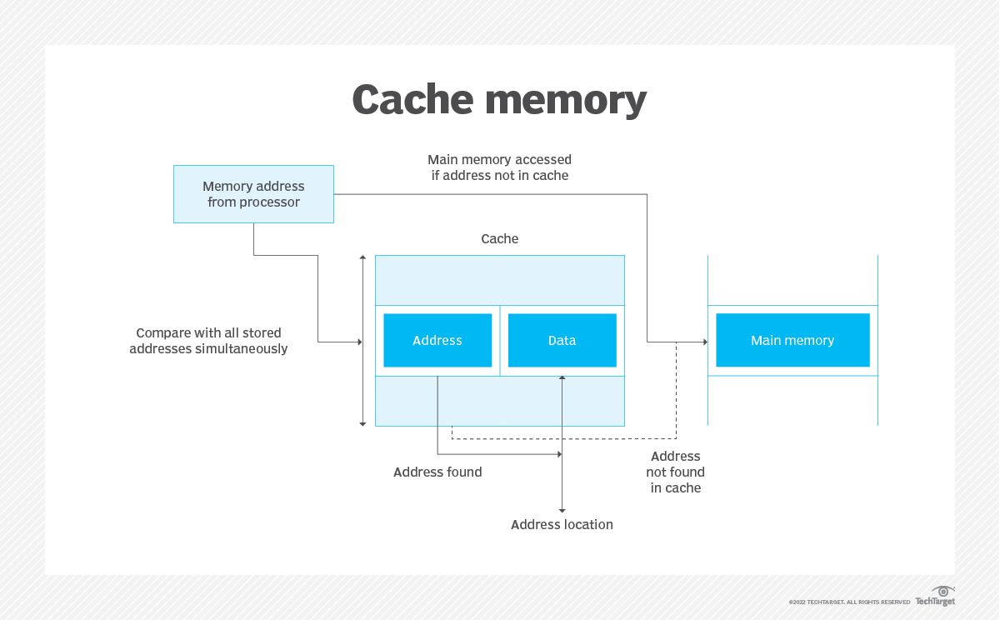
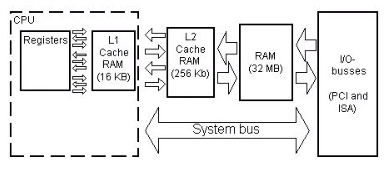
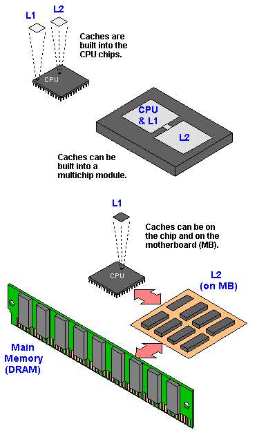
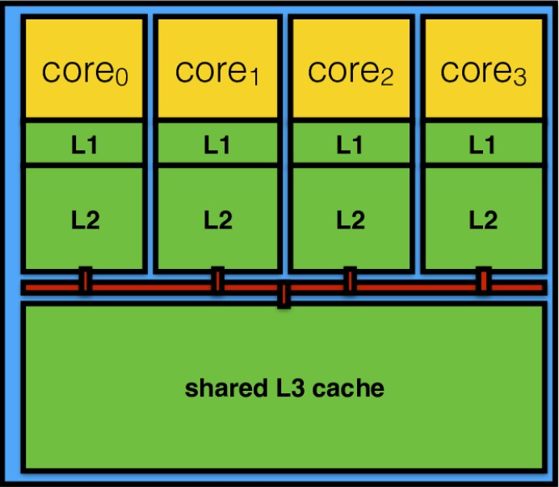
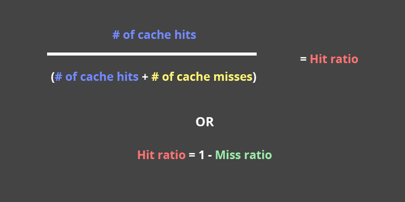
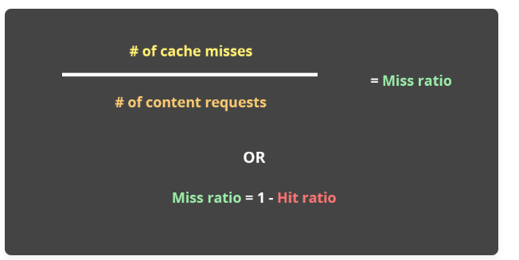
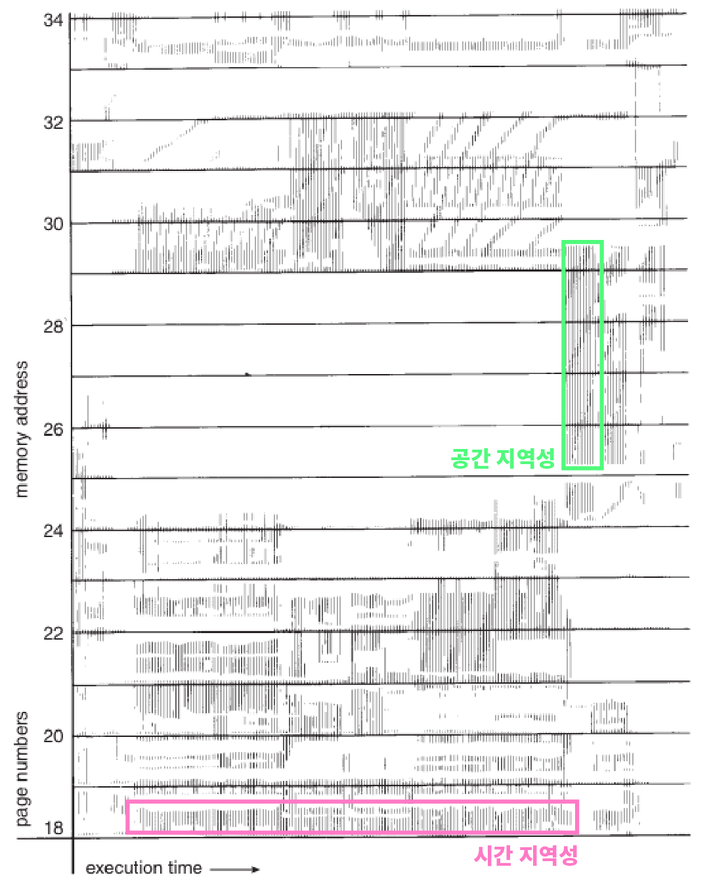
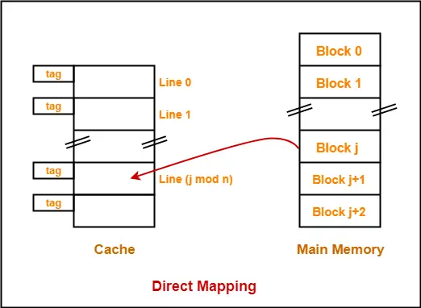
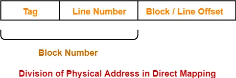
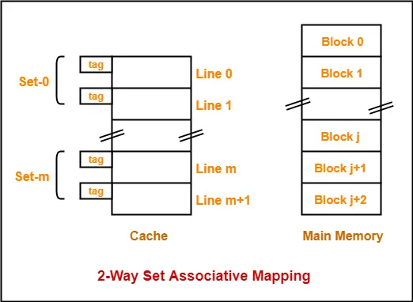

# Cache Memory

- Cache Memory는 컴퓨터 메모리에서 데이터를 보다 효율적으로 검색할 수 있게 해주는 칩 기반 컴퓨터 구성 요소다.
- Cache Memory는 컴퓨터 프로세서가 쉽게 데이터를 검색할 수 있는 임시 저장 역할을 한다.
- Cache Memory는 메인 메모리와 CPU 간의 데이터 속도 향상을 위한 중간 버퍼 역할을 하는 CPU 내/외에 존재하는 메모리다.
    - 주기억장치에서 CPU에게 업로드할 데이터의 일부분을 캐시 메모리에 적재한다.
    - 또는 자주 사용하는 데이터를 매번 주기억장치에서 가져오지 않도록, 캐시메모리에 저장한다.
    - CPU와 주기억장치의 속도차이를 상쇄하기위해 거치는 중간 매개체, 중간 저장소
- Cache Memory는 컴퓨터에서 가장 빠른 메모리이며 일반적으로 mother board에 통합되어 프로세스나 기본 RAM에 직접 내장된다.
- Cache Memory는 프로세서가 정기적으로 액세스하는 프로그램 Instance와 데이터를 저장하여 더 빠른 데이터 저장 및 액세스를 제공한다. 따라서 프로세서가 cache memory에 이미 Instance가 있는 데이터를 요청할 때 데이터를 가져오기 위해 메인 메모리나 하드 디스크로 갈 필요가 없다.
- Hardware cache는 processor cache라고도 하며 프로세서의 물리적 구성 요소다. processor core에 얼마나 가까운지에 따라 기본 또는 보조 cache memory가 될 수 있으며, 기본 cache memory는 프로세서에 직접 통합되거나 프로세서에 가장 가깝다.
- CPU의 연산은 Cache에게 미리 요청하며 시작된다. 이 때 L1 Cache가 CPU의 연산 결과를 예측하고(Cache hit), 해당 데이터(결과)를 CPU에게 전달한다.
- Primal memory의 데이터는 Auxiliary memory보다 빠르게 액세스할 수 있지만 primal memory의 액세스 시간은 일반적으로 몇 micro second에 불과한 반면, CPU는 나노 초 단위로 작업을 수행한다. 데이터 액세스와 데이터 작동 사이의 시간 지연으로 인해 CPU가 제대로 활용되지 않아 시스템 성능이 저하되어 일정 시간 동안 유휴 상태로 유지될 수 있다. 이 시간 간격을 최소화하기 위해 도입된 것이 cache memory.
- cache는 가장 자주 사용되는 정보나 프로그램 코드의 복사본을 메인 메모리에 저장한다.
- 또한 CPU가 조작을 위해 자주 필요할 수 있는 임시 데이터를 저장한다.
    
    <aside>
    💡 **클럭 속도(Clock rate)** :클럭 속도 또는 클록 주파수는 컴퓨터 프로세서의 동작 속도이다. "초당 주기"로 측정하며 헤르츠 단위를 사용한다.
    
    </aside>
    
    # Cache Level
    
    - Cache는 CPU와의 거리를 통해 Level이 나뉜다. L1, L2, L3로 이루어져있다.
        
        ### L1 Cache
        
        
        
        - L1 cache는 마이크로프로세서에 직접 내장된 memory cache로, 마이크로프로세서가 최근에 접근한 정보를 저장하는 데 사용되므로 기본 cache라고도 한다. 혹은, 내부 cache또는 시스템 cache라고도 한다.
        - L1 Cache는 가장 빠른 cache memory로, 이미 대기 상태 인터페이스가 없는 칩 내에 내장되어 있어 CPU cache 중 가장 비싼 cache다.
        - 크기가 제한되어 있으며 프로세서가 최근에 접근한 데이터, 즉시 실행해야 하는 중요한 파일을 저장하는 데 사용되며, 프로세서 자체가 컴퓨터 명령을 수행할 때 접근하고 처리하는 첫 번째 캐시다.
        - L1 Cache는 L1-I(명령어)와 L1-D(데이터)의 두 가지 수준으로 분할 되어있다.
        - L1 Cache는 CPU의 최대 작동 속도 이상으로 데이터를 전송할 수 있어 매우 효율적이다. 프로세서가 L1에서 필요한 데이터를 찾지 못하면 L2, L3 Cache에서 해당 데이터를 찾는다.
        - 최신 장치의 캐시 용량은 64KB이다. 쿼드 코어 프로세서에서 이는 최대 256KB의 L1 캐시 메모리를 추가한다.
        - 프로세서 등급에 따라 크기가 달라지는 SRAM을 사용하여 구현된다.
        
        ### L2 Cache
        
        
        
        - L2 Cache는 CPU에 내장될 수도, 별도의 칩이나 보조 프로세서에 있을 수도, cache와 CPU를 연결하는 고속 대체 시스템 버스를 가질 수도 있다.
        - 보조 cache 또는 외부 cache라고도 한다.
        - L1 캐시보다 느리지만 메인 메모리보다 빠르다.
        - L2 Cache는 프로세스와 메모리 성능 격차를 해소하는 다리 역할을 한다. 주요 목표는 중단이나 지연 또는 대기 상태 없이 프로세서에 필요한 저장된 정보를 제공하는 것이다.
        - 이는 특히 특정 데이터가 이전에 이미 액세스 된 특정 이벤트에서 데이터 액세스 시간을 줄이는 데 도움이 되므로 다시 로드할 필요가 없다.
        - L2 cache는 프로세서가 메모리에서 요청하는 프로그램 명령과 데이터를 버퍼링하여 RAM에 비해 더 가까운 대기 영역 역할을 함으로서 data prefetching기능을 강화한다.
            - Data prefetch : 앞으로 연산에 필요한 data들을 미리 가져오는 것.
        
        ### L3 Cache
        
        
        
        - L3 Cache는 CPU에서 사용하고 일반적으로 mother board의 RAM과 프로세서 모듈의 L1 및 L2 cache 사이에 구축되며 특정 특수 프로세서의 경우 CPU 모듈 자체 내에 내장되는 특수 캐시다.
        - 마지막 레벨 캐시(LLC)라고도 한다.
        - L1과 L2의 성능을 향상시키기 위해 개발된 특수 메모리다.
        - L1 및 L2 Cache와 함께 작동하여 가져오기 및 실행 주기가 너무 길어서 발생하는 병목 현상을 방지하여 컴퓨터 성능을 향상시킨다.
        - L3 cache는 L2 cache에 정보를 공급한 다음 L2 cache에서 L1 cache로 정보를 전달한다.
        - L2에 비해서는 느리지만, RAM에 비해서는 빠르다.
        - 멀티 코어 프로세서의 모든 코어 간에 공유되는 캐시이다.
        - 이를 통해 데이터 공유 및 코어 간 통신에서 중요한 역할을 할 수 있으며, 경우에 따라 설계에 따라 그래픽 처리 장치(GPU)의 캐시를 사용할 수도 있다.
    
    # Cache Hit/Miss
    
    
    
    - CPU가 캐시 메모리에서 명령을 읽어 해당 정보를 찾는 것을 말한다.
    - 캐시 히트가 발생하는 경우 캐시 메모리는 CPU와 메인 RAM 사이의 고속 중개자 및 큐 역할을 한다.
    - 데이터나 명령을 RAM이나 메모리에 다시 기록해야 하는 프로세스는 RAM이 도달할 수 있을 때까지 먼저 캐시 메모리를 통과해야 한다.
        
        ### Cache Hit/Miss
        
        - CPU는 메모리 단어가 필요할 때마다 먼저 CPU Register에서 검색한다.
        - 이 때 CPU Register에 필요한 단어가 없다면 CPU는 cache memory에서 단어를 탐색한다.
        - 필요한 단어가 cache memory에 있으면 cache Hit, 없으면 cache miss이 발생한다.
        - Cache hit은 cold, warm, hot으로 설명될 수 있다. 이들 각각에는 데이터를 읽는 속도가 설명되어 있다.
        - Hot Cache는 가능한 가장 빠른 속도로 메모리에서 데이터를 읽는 instance다. L1에서 데이터를 검색할 때 발생한다.
        - Cold Cache는 데이터를 읽는 속도가 가장 느리지만 여전히 성공하므로 cache hit으로 간주된다. 데이터는 L3와 같은 메모리 계층 구조에서 더 낮은 수준 또는 그 이하에서 발견된다.
        - Warm Cache는 L2 또는 L3에 있는 데이터를 설명하는 데 사용된다. hot cache만큼 빠르지는 않지만 cold cache보다는 빠르다.
        - Cache miss는 메모리를 검색했지만 데이터를 찾을 수 없는 경우를 말한다. 이 경우 콘텐츠가 전송되어 캐시에 기록되며 하드 드라이브와 RAM을 직접 사용해야 한다.
        - Cache miss가 발생하면 추가 시간과 서버 resource가 소모되어 페이지 load 속도도 느려진다.
        - 이처럼 cache miss로 인해 페이지 load 시간이 지연되는 현상을 누락 페널티(miss penalties)라고 한다.
        
        ### Hit and Miss Ratios in Caches
        
        - 적중률(hit ratios)는 cache 적중을 계산하고 이를 수신 된 총 콘텐츠 요청 수(contents requests)와 비교하는 것이다.
        - 실패율(miss ratios)는 cache miss가 계산되어 수신 된 총 콘텐츠 요청 수와 비교되는 반대 측면이다.
        - 적중률이 높고 실패율이 낮다면 cache가 제대로 작동하고 있다는 의미다.
            - 이는 또한 콘텐츠가 cache에서 빠르게 검색될 가능성이 높으며 최종 사용자의 페이지 load 시간도 최대한 빠르다는 것을 의미한다.
        - 많은 CDN은 cache hit, miss 및 총 contents requests를 표시한다. 적중률과 실패율과 같은 다른 측정 항목도 표시된다.
        - 단, 이를 제공 받지 못하는 경우 적중률의 계산은 cache 적중 수를 cache 적중 수와 cache miss 수의 합으로 나눠서 구한다.
            
            
            
            
            
        - Cache의 이상적인 적중률은 95~99%, 실패율은 1~5%다.
        - 단, CDN Cache 측면에서 적중률이 높은 것이 사이트의 최종 사용자가 항상 빠른 load 시간을 얻음을 의미하진 않는다.
            - 이는 cache hit이 콘텐츠가 cache에서 성공적으로 검색된 시점을 고려하지 않기 때문이다. 콘텐츠가 cache에서 load되었지만 최종 사용자로부터 멀리 떨어진 edge 서버에서 load된 경우에도 cache hit으로 계산된다. 단, 사용된 edge 서버가 더 가까운 경우보다 사용자에게 페이지 load 시간이 느려지는 경우는 제외된다.
    
    # Locality
    
    
    
    - CPU에서 명령어를 수행하면서 매번 cache memory를 참조하게 되는데, 이 때 Cache Hit은 지역성(Locality of Reference)을 갖는다.
    - 지역성이란 프로세스들이 기억 장치 내의 정보를 균일하게 액세스하는 것이 아닌, 어느 순간에 특정 부분을 집중적으로 참조하는 것을 말한다.
        - 데이터 접근이 시간적, 혹은 공간적으로 가깝게 일어나는 것
        - 캐시가 효율적으로 동작하기 위해서는 캐시가 저장할 데이터가 지역성을 가져야 한다.
    - 지역성은 메모리의 위치와 접근 시간에 따라서 공간적, 시간적인 특성을 보인다.
    - 명령어는 보통 공간 지역성이 높고 데이터는 보통 시간 지역성이 높다.
        
        ### Spatial Locality of reference
        
        - 공간적 지역성(Spatial Locality of reference)은 한 번 참조한 메모리의 옆에 있는 메모리를 다시 참조하게 되는 성질이다.
            - 이는 CPU 캐시나 디스크 캐시의 경우 한 메모리 주소에 접근할 때 그 주소뿐 아니라 해당 블록을 전부 캐시에 가져오기 때문이다.
        - 공간적 지역성의 예시로는 배열을 들 수 있다.
        - 배열은 일정한 메모리 공간을 순차적으로 할당 받아 사용하는데, 이 할당은 공간 할당을 연속적으로 받게 된다.
        - 이후 연속적으로 받게 된 메모리는 사용될 때 연속적으로 사용될 가능성이 높은 것이 공간적 지역성.
        
        ### Temporal Locality of reference
        
        - 시간적 지역성(Temporal Locality of reference)은 한 번 참조된 주소의 내용은 곧 다음에 다시 참조된다는 특성이다.
            - 메모리 상의 같은 주소에 여러 차례 읽기 쓰기를 수행할 경우, 상대적으로 작은 크기의 캐시를 사용해도 효율성을 꾀할 수 있다.
        - 시간적 지역성의 예시로는 반복문을 들 수 있다.
        - 반복문은 수행 시 특정 메모리 값으로 선언된 부분을 반복해서 접근하게 된다.
        - 즉, 방금 전에 접근했던 메모리를 다시 참고하게 될 확률이 높아지는 것이 시간적 지역성이다.
    
    # Mapping
    
    - Cache Memory는 실제 메인 메모리에 비해 그 크기가 매우 작아 메인 메모리와의 1:1 matching 되는 동일한 주소 체계를 가질 수 없다. 일반적으로 사용하는 mapping 방식은 direct mapping, associative mapping, set associative mapping의 3가지가 있다.
    - 캐시 기억장치와 주기억장치 사이에서 정보를 옮기는 것을 사상(Mapping, 매핑)이라고 함
        
        ### Direct mapped cache
        
        
        
        - 직접 매핑(Direct mapped cache) 방식은 메인 메모리를 일정한 크기의 블록으로 나누고 각각의 블록을 cache의 정해진 위치에 mapping하는 방식으로 가장 간단하며 구현도 가장 쉬운 방식이다.
            - 주기억장치의 블록들이 지정된 한 개의 캐시 라인으로만 사상될 수 있는 매핑 방법.
            - 간단하고 구현하는 비용이 적게드는 장점이 있지만 적중률이 낮아질 수 있다는 단점이 있다.
        - 주 메모리의 특정 블록은 cache의 특정 라인에만 mapping될 수 있다.
        - 특정 블록이 mapping될 수 있는 cache의 라인 번호는 아래와 같이 지정된다.
            - cache 라인 번호 = (주 메모리 블록 주소 ) % (캐시의 라인 수)
        - 직접 mapping에서는 대체 알고리즘이 필요하지 않다. 이는 주 메모리 블록이 cache의 특정 라인에만 mapping될 수 있기 때문이다. 따라서 새로운 수신 블록은 항상 특정 라인의 기존 블록(있는 경우)을 대체한다.
        - 직접 mapping에서 물리적 주소는 다음과 같이 나뉜다.
            
            
            
        
### Fully associative cache mapping
        

- 완전 연관 매핑(Fully associative cache mapping)에서는 주 메모리 블록은 해당 순간에 자유롭게 사용할 수 있는 cache의 모든 라인에 mapping될 수 있다.
    - 직접 매핑 방식의 단점을 보완한 방식
    - 모든 태그들을 병렬로 검사하기 때문에 복잡하고 비용이 높다는 단점이 있어 거의 사용하지 않는다.
- 직접 mapping보다 더 유연하다.
- cache의 모든 라인을 자유롭게 사용할 수 있다.
- 주 메모리의 모든 블록은 cache의 모든 라인에 mapping될 수 있다
- 모든 cache 라인이 사용된 경우 기존 블록 중 하나를 교체해야 한다.
- 완전 연관 mapping에서는 교체 알고리즘이 필요하다
- 교체 알고리즘은 모든 cache 라인이 점유 된 경우 블록을 교체하도록 제안한다.
- FCFS, LRU 알고리즘 등과 같은 교체 알고리즘이 사용된다.
- 완전 연관 mapping에서 물리적 주소는 다음과 같이 나뉜다.
    
    
    

### N-way set associative mapping

- 집합 연관 매핑(set associative mapping)은 직접 mapping과 완전 연관 mapping의 조합이다.
- cache 라인은 각 세트에 N 개의 라인이 포함된 set으로 grouping된다.
- 주 메모리의 특정 블록은 하나의 특정 cache set에만 mapping될 수 있다
- 해당 set 내에서 메모리 블록은 자유롭게 사용할 수 있는 모든 cache 라인을 mapping할 수 있다
- 주 메모리의 특정 블록이 mapping될 수 있는 cache set은 다음과 같이 제공된다.
    - Cache set number = (Main Memory Block Address) % (Number of sets in Cache)
- 각 set 내에서 완전한 연관 mapping을 사용한다
- 따라서 집합 연관 mapping에는 교체 알고리즘이 필요하다.
- 집합 연관 mapping에서 물리적 주소는 다음과 같이 나뉜다.
    
    