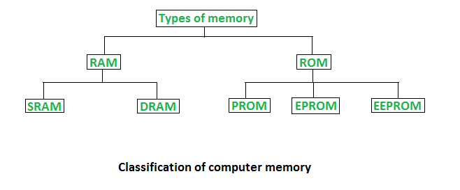

# Primary Memory

# Primary Memory

- 데이터, 프로그램 및 명령을 저장하는 컴퓨터의 일부, Main Memory(Internal memory)라고도 한다.
- 주 메모리(Primary Memory)는 프로세서가 직접 접근할 수 있는 컴퓨터 메모리의 한 부분이자 컴퓨터 시스템의 기본 메모리이다.
- 데이터 버스를 사용하여 프로세서에 의해 직접 액세스 되는 모든 유형의 컴퓨터 메모리를 main memory라고 한다. 이를 통해 프로세서는 실행 중인 프로그램과 메모리 위치에 저장된 현재 처리된 데이터에 액세스할 수 있다.
    
    <aside>
    💡 **데이터 버스(Data Bus)** : CPU와 기억장치, I/O장치 사이에서 Data를 전달하는 통로이다.
    데이터를 주고 받아야 하기 때문에 **양방향 버스 구조**이다.
    데이터 버스 크기(폭)는 한 번에 전송될 수 있는 Data의 크기(비트 수)를 결정한다.
    
    </aside>
    
- 메인 메모리는 현재 CPU에서 사용 중인 데이터와 명령어를 저장하는 데에 사용된다.
- 컴퓨터의 시작과 동시에 주 메모리는 기본 운영 체제(OS), 사용자 인터페이스, 사용자가 설치하고 실행 중인 소프트웨어 유틸리티를 포함하여 실행 중인 모든 애플리케이션을 로드한다.
- 프로세서는 주 메모리를 통해 실행 중인 프로그램과 메모리 위치에 저장된 현재 처리된 데이터에 액세스할 수 있다.
    - 컴퓨터를 켜면 일반적으로 CPU는 RAM에서 필수 코드를 검색하여 가져온다. 그렇지 않으면 ROM으로 이동한다. 두 칩 모두 컴퓨터 시스템의 기본 메모리라고 통칭된다.
- 컴퓨터를 포함하여 마이크로프로세서를 사용하는 모든 시스템에서는 메모리 사용이 필수적이다.
- 용량이 제한되어 있으며, 직접회로(IC)나 반도체 소자를 위해 제작된다.
- 기본 스토리지(Primary storage)는 마더보드에 저장되므로 기본 스토리지와 주고받는 데이터를 매우 빠른 속도로 읽고 쓸 수 있다.
- 기본 메모리는 RAM(Random Access Memory)과 ROM(Read-Only Memory)으로 나뉜다.

# RAM

- RAM은 Random access memory를 의미하거나 단기 메모리(short-term memory)를 의미한다.
- 언제든지, 물리적 위치에 관계없이 store의 데이터를 무작위로 읽을 수 있기 때문에 이를 Random이라고 한다.
- 실행 되어야 하는 모든 시스템 프로세스는 RAM에 저장된다.
- 임시저장기억(temporal storage memory)이다.
- 컴퓨터 마더보드에 설치되는 하드웨어 장치다. 마더보드에 개별적으로 장착되는 칩 형태로 제공되거나, 마더보드에 연결된 작은 보드에 칩 형태로 제공된다.
- 컴퓨터에 전원이 공급되는 동안에만 모든 데이터를 유지하는 휘발성 기억장치이며, 전원 종료시 기억된 내용 삭제되지만 가장 빠른 유형의 메모리이다.
- 실행하고 있는 파일을 보조기억장치에 수시로 저장하며 정보가 저장된 위치는 주소로 구분한다.
- CPU가 프로그램 프로세스로부터 받은 프로그램과 데이터를 저장할 수 있게 해 주는 내부 메모리이다.
- 메모리에 있는 데이터를 읽고 쓰는 데 사용된다.
- RAM은 CPU에서 현재 처리중인 데이터를 저장하고 이를 그래픽 장치로 보낸다.
    
    ### SRAM(Static Random Access Memory)
    
    - SRAM은 시스템에 전원이 공급되는 동안 데이터를 유지한다.
    - 전원이 제거되면 데이터는 손실된다.
    - 플립플롭(flip-flop)과 같은 순차 회로를 사용하여 비트를 저장하므로 주기적으로 새로 고칠 필요가 없다.
        - flip-flop : 래치(latch)라고도 한다. 1 비트의 정보를 보관, 유지할 수 있는 회로이며 순차 회로의 기본 요소.
    - 비용이 많이 들기에 속도가 최우선인 경우에만 사용된다.
    - 속도가 빠르므로 컴퓨터 시스템에서 Cache Memory 및 내부 레지스터로 사용된다.
    - DRAM보다 빠르고 안정적이지만 더 비싸고 많은 전력이 필요하며 구조가 복잡하다.
    
    ### DRAM(Dynamic Random Access Memory)
    
    - DRAM은 데이터를 유지하기 위해 몇 밀리초 내에 주기적으로 새로 고쳐야 한다.
    - 커패시터(capacitors)와 트랜지스터(transistors)로 구성되며, 커패시터에서 전하가 누출되어 DRAM을 주기적으로 충전해야 한다.
    - 커패시터에서 개입하지 않을 경우 데이터가 손실되므로 이를 방지하기 위해 외부 메모리 새로 고침 회로(external memory refresh circuit)이 필요하다.
    - DRAM은 일반적으로 컴퓨터에서 현재 사용 중인 데이터와 프로그램을 저장하는 주 메모리(main memory)로 사용된다
        - 사용할 RAM 유형의 선택은 속도와 안정성 및 비용 문제를 포함하여 어플리케이션의 특정 요구 사항에 따라 다르다.
    - DRAM은 SRAM보다 느리지만 저렴하고 전력 소모도 적다.
    
    ### DRAM VS SRAM
    
    | 구분 | 동적 램(DRAM) | 정적 램(SRAM) |
    | --- | --- | --- |
    | 구성소자 | 커패시터 = 콘덴서 | 플립플롭 = 래치 |
    | 특징 | 전원이 공급되어도 일정 시간이 지나면 
    전하가 방전되어 주기적인 재충전 필요 | 전원이 공급되는 동안에는
    기억 내용이 유지 |
    | 전력소모 | 적음 | 많음 |
    | 접근속도 | 느림 | 빠름 |
    | 집적도(밀도) | 높음 | 낮음 |
    | 가격 | 저가 | 고가 |
    | 용도 | 일반적인 주기억장치 | 캐시메모리 |
    | 용량 | 크다 | 적다 |

# ROM

- ROM은 장기 내부 메모리이다.
- 전기의 흐름 없이 데이터를 유지하는(전원이 꺼져도 내용이 계속 유지되는) 비휘발성 메모리다.
- 데이터나 프로그램이 영구적으로 기록되는 필수 칩이다.
- 변경할 필요가 없는 모든 데이터가 ROM에 저장된다.
- ROM에 저장된 모든 내용은 일반적으로 조작되거나 변경될 수 없다.
- 컴퓨터를 부팅하는 데 필요한 모든 지침은 ROM에 저장한다.
- 주기억장치로 사용되기보다는 주로 기본 입,출력 시스템(BIOS), 자가 진단 프로그램(POST)같은 변경 가능성이 희박한 시스템 소프트웨어를 기억시키는데 이용
- CPU가 직접 접근하다.
    
    ### MROM(Masked Read Only Memory)
    
    - 사전에 프로그래밍 되고 배선된 ROM.
    - 이미 작성된 내용은 어떤 식으로든 변경할 수 없다.
    - 사용자가 아닌 전자기기의 제조사에서 작성하는 제조사 프로그래밍 ROM이다.
    
    ### PROM(Programmable Read Only Memory)
    
    - 사용자가 읽기 전용 프로그램과 데이터를 로드하고 저장할 수 있는 것이다.
    - 사용자는 PROM을 구입하고 그 위에 필요한 내용을 기록한다. 그러나 일단 작성된 내용은 변경할 수 없다.
    - ROM과 달리 PROM은 전기 흐름 없이 내용을 유지한다.
    - 비휘발성 메모리이며 PROM 버너를 사용한다.
    - 비휘발성 메모리이며, ROM과 PROM의 차이점은 ROM은 컴퓨터 제조업체에서 미리 작성한 반면 PROM은 빈 메모리로 제조된다는 것이다.
    
    ### EPROM(Erasable Programmable Read Only Memory)
    
    - 삭제 및 프로그래밍 가능한 ROM.
    - 내용이 지워지는 강렬한 자외선에 노출될 때까지 내용을 유지하므로 메모리를 다시 프로그래밍 할 수 있다.
    - EPROM을 UV 방사선에 노출시켜 초기 콘텐츠를 삭제함으로써 변경할 수 있다.
    
    ### EEPROM(Electrically Erasable Programmable Read Only Memory)
    
    - 전기적(electrically)으로 삭제 및 프로그래밍 가능한 ROM.
    - 한 번에 모든 것을 삭제하는 것이 아닌 한 번에 1바이트씩 내용을 지운다. 즉, 재 프로그래밍에 많은 시간이 소요된다.
    - EEPROM의 내용을 쓰거나 지우려면 PROM 버너라는 장치가 필요하다.
    - 밀리초 안에 최초의 전자파에 의해 프로그래밍 및 삭제될 수 있다.
    - 단일 바이트의 데이터 또는 장치의 전체 내용을 지울 수 있다
    
    ### EAROM(Erasable Alterable Read Only Memory)
    
    - 전기적 특성을 이용하여 기록된 정보의 일부를 바꿀 수 있는 ROM