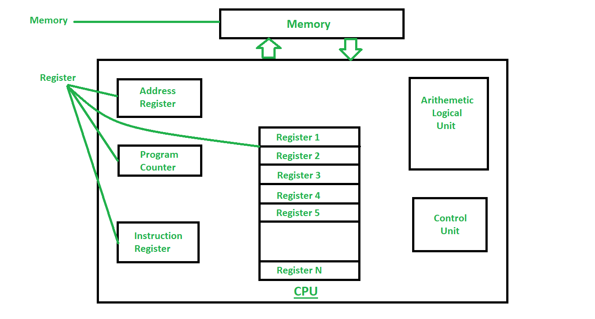

# Register Memory

- 레지스터 메모리는 컴퓨터 시스템의 가장 작은 메모리로 나머지 메모리보다 훨씬 빠르다.
- Primary 메모리의 일부가 아니라 레지스터 형태로 CPU에 위치하며 나머지 메모리에 비해 가장 적은 양의 데이터를 저장한다.
- 메모리 레지스터에는 CPU가 자주 사용하는 데이터, 명령어, 메모리 주소를 임시로 저장한다.
- 현재 CPU에서 실행 중인 프로그램의 명령을 보유한다. CPU가 명령어를 처리하기 전에 레지스터에 저장되고, CPU는 레지스터에서 해당 명령어를 가져와 처리한다.
- 레지스터는 32bit에서 64bit 정도의 소량의 데이터를 보유한다.
- CPU의 속도는 CPU에 내장된 레지스터의 수와 크기(bit 수)에 따라 달라진다.
- 컴퓨터 레지스터가 수행하는 세 가지 중요한 역할은 다음과 같다.
    - Fetching : 레지스터는 사용자가 제공한 데이터 명령을 지정된 위치에 수집하고 저장한다.
    - Decoding : 사용자에게 원하는 출력을 제공하기 위해 명령이 해독되고 처리된다.
    - Execution : decoding된 명령을 실행한다.
    
    ### Data Register
    
    - 프로세서에서 연산할 피연산자를 저장하는 데 사용되는 16bit 레지스터.
    - I/O 장치로부터 받은 데이터를 임시로 저장하는 역할을 한다.
    
    ### Program Counter(PC)
    
    - 8085 microprocessor의 16bit 특수 기능 레지스터다. 명령어 포인터 레지스터라고도 한다.
    - CPU에서 처리 중인 프로그램의 다음 명령어의 메모리 주소를 유지하여 현재 명령어가 완료된 후 CPU에서 다음 명령어를 빠르게 가져와 실행할 수 있도록 한다
    - 즉, microprocessor가 현재 명령어를 실행한 후 다음 명령어의 메모리 위치 주소를 유지한다.
    
    ### Instructor Register
    
    - 16bit 레지스터. 메인 메모리로부터 받은 명령을 저장한다.
    - 현재 실행 중이거나 decoding 중인 명령어를 보유하는 CPU 제어 장치의 일부.
    - 나중에 실행될 명령 코드를 저장하는 데 사용된다.
    - 제어 장치는 Instructor Register에서 명령을 받은 다음 이를 디코딩하고 실행한다.
    
    ### Accumulator Register
    
    - 프로세스로부터 시스템이 받은 결과를 저장하는 역할을 하는 16bit 레지스터.
    - 누산기 레지스터는 산술 및 논리 연산을 담당하는 ALU(Arithmetic logic unit)의 일부다.
    - 누산기 레지스터에는 초기 데이터, 중간 결과 및 최종 결과가 저장된다.
    
    ### Address Register
    
    - 명령어와 데이터가 저장되는 메모리 위치의 주소를 저장하는 12bit 레지스터
    - 명령어 실행 단계에서 메모리의 데이터 및 명령어에 액세스하는 데 사용된다.
    - 메모리에서 읽을 때 주소 레지스터로 주소가 지정된 데이터는 Data Register로 공급된 다음 CPU에서 사용된다.
    - 메모리에 쓸 때 CPU는 Data Register의 데이터를 주소 레지스터에 주소가 저장된 메모리 위치에 쓴다.
    - CPU 내부에 있는 주소 레지스터는 RAM이나 cache로 이동한다.
    - 일반적으로 조작할 다음 메모리 주소가 포함된 parallel load register다.
    
    ### I/O Address Register
    
    - I/O 장치의 주소를 저장하는 데 사용된다.
    
    ### I/O Buffer Register
    
    - I/O 모듈과 CPU 사이에서 데이터를 교환하는 데 사용된다.
    
    ### Flag Register
    
    - CPU에서 다양한 발생 조건을 확인하는 레지스터.
    - Flag Register는 플래그 정보만 보유하므로 크기는 1byte 또는 2byte다.
    
    ### Index Register
    
    - 기본 레지스터라고도 한다.
    - 프로그램 실행 중에 메모리 피연산자의 주소를 수정하는 데 도움이 되는 컴퓨터 CPU의 필수 부분
    
    ### Memory Buffer Register
    
    - MBR이라고도 한다. 메모리에서 들어오고 메모리로 들어가는 데이터/명령을 수행하는 데 사용된다.
    
    ### Memory Data Register
    
    - 컴퓨터 저장소(ex.RAM)에 저장될 데이터 또는 컴퓨터 저장소에서 가져온 후의 데이터가 포함된 컴퓨터 제어 장치의 레지스터이다.
    - 버퍼처럼 작동하고, 프로세서가 사용할 수 있도록 메모리에서 복사된 모든 항목을 보유한다. MDR은 정보가 디코더로 전달되기 전에 정보를 보관한다
    - 주소가 지정된 위치에 쓰거나 읽을 데이터가 포함된 MDR이다.
    
    ### Memory Address Register
    
    - 메모리로부터 읽어오거나 메모리에 쓰기 위한 주소를 가지고 있는 레지스터
    
    ### Status Register
    
    - 현재 CPU의 상태를 가지고 있는 레지스터
    
    <aside>
    💡 **버퍼(Buffer)** : 버퍼는 데이터가 한 위치에서 다른 위치로 이동하는 동안 데이터를 임시로 보관하는 데 사용되는 메모리 영역이다. 버퍼는 컴퓨터 내 프로세스 간에 데이터를 이동할 때 사용된다. 대부분의 버퍼는 소프트웨어로 구현된다.
    
    </aside>