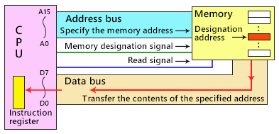
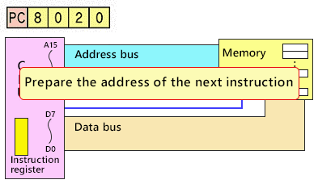
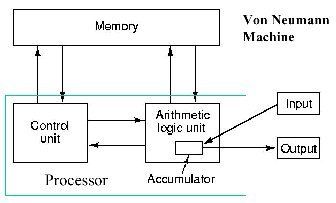

# Program Counter

## 정의

- 프로그램 카운터(Program Counter)란 프로세서 내부에 있는 레지스터 중의 하나로서, 다음에 실행할 명령어의 주소를 가지고 있어 실행할 기계어 코드의 위치를 지정한다. 다른 말로는 명령어 포인터라고도 불린다. CPU(중앙 처리 장치)는 명령어를 순차적으로 실행하는 데 사용되며, 이 때 프로그램 카운터가 중요한 역할을 한다.
    
    **→ 쉽게 말하면, 다양한 명령어들이 실행되기를 기다리고 있는데, 이 중 어떤 것부터 처리해야 하는지를 알려주는 역할을 한다.**
    
- 작업 실행 속도를 높이고 현재 실행 지점을 추적하는 데 필요한 디지털 카운터이다.
- PC는 현재 실행 중인 명령(Instruction)의 주소(위치)를 포함하는 컴퓨터 프로세서의 레지스터이다.

## 특징

- Intel x86, Itanium microprocessors에서 IP(Instruction Pointer)라고 하며, 때로는 IAR(Instruction Address Register)라고 한다.
- 각 명령을 가져올 때 PC는 저장된 값을 1씩 증가시킨다. 각 명령을 가져온 후 PC는 시퀸스의 다음 명령을 가리키며, 컴퓨터가 다시 시작되거나 재설정되면 PC는 일반적으로 0으로 돌아간다.
- 프로세서는 일반적으로 메모리에서 순차적으로 명령을 가져오지만 제어 전송 명령(control transfer instructions)은 PC에 새 값을 배치하여 시퀀스를 변경한다. 여기에는 branches(jumps라고도 한다), subroutine 호출 및 반환이 포함된다.
- 일부 assertion의 참에 대한 조건부 전송을 통해 컴퓨터는 다른 조건에서 다른 시퀀스를 따를 수 있다.
    - assertion : 프로그램의 한 지점에 연결된 술어(상태 공간에 대한 boolean 값 함수, 일반적으로 프로그램의 변수를 사용하여 논리적 명제로 표현됨)
- branch는 메모리의 다른 곳에서 다음 명령을 가져오는 것을 제공한다. subroutine 호출을 분기하며, PC의 이전 내용을 저장한다. 리턴은 PC의 저장된 내용을 검색하여 PC에 다시 배치하고 subroutine 호출 다음에 오는 명령으로 순차적 실행을 재개한다.
- PC는 각각 PC 값의 1비트를 나타내는 bank of binary latches일 수 있다.

## Instruction Cycle

- 명령 주기(Instruction cycle)는 CPU가 PC의 값을 Data bus에 배치하여 메모리로 보내는 fetch로 시작한다.
- 메모리는 Data bus에서 해당 메모리 위치의 내용을 전송하여 응답한다.
- fetch 이후 CPU는 실행을 진행하여 얻은 메모리 내용에 따라 몇 가지 작업을 수행한다. 이 주기의 특정 지점에서 PC는 다음에 실행되는 명령이 다른 명령이 되도록 수정된다.
    - 일반적으로 다음 명령이 현재 명령의 마지막 메모리 위치 바로 다음에 오는 메모리 주소에서 시작하는 명령이 되도록 증분(incremented)됨.
- CPU는 다음에 실행할 명령어가 저장되어 있는 주소를 PC에서 읽어서 순차적으로 실행한다.
    - 실행 명령 호출
        
        
        
    - 다음 명령 주소 호출(Program Counter)
    
    
    

## Accumulator

- 누산기는 CPU에 포함된 일종의 레지스터로, 수학 및 논리적 계산에서 중간 값을 보유하는 임시 저장 위치 역할을 한다.
- 작업의 중간 결과는 누산기에 점진적으로 기록되어 이전 값을 덮어쓴다.
- 최신 컴퓨터 시스템에는 모든 레지스터가 누산기 역할을 할 수 있다.
    
    
    
    ## PC 실행 순서
    
    - 모든 명령어와 메모리의 데이터에는 특정 주소가 있다.
    
      1. 각 명령이 처리될 때 담당 소프트웨어 응용 프로그램은 가져와야 하는 다음 명령의 주소로 프     로그램 카운터를 업데이트한다.
    
    1. 프로그램 카운터는 이 정보를 메모리 주소 레지스터에 전달한다.
    2. 프로그램 카운터는 다음 명령어를 가져올 때 저장된 값을 1씩 증가시킨다.
    3. 컴퓨터가 재설정되거나 다시 시작되면 프로그램 카운터는 일반적으로 0 값으로 되돌아간다. 
    
    <aside>
    💡 **CPU(Central Processing Unit) :** 컴퓨터 시스템의 두뇌 역할을 하는 중앙처리장치. 레지스터, 산술논리유닛(ALU), 제어장치(CU), 버스로 구성한다.
    
    </aside>
    
    <aside>
    💡 **레지스터(Register) :**
    
    - CPU내에서 데이터를 기억하는 메모리 장치
    - CPU내에서 처리할 명령어나 연산에 사용할 값이나 연산 결과를 일시적으로 기억하는 장치
    - 메모리 장치중에 가장 빠르다.
    - 플리플롭과 래치(Latch)를 병렬로 구성한다.
    </aside>
    
    ## **작동 방식**
    
    - 프로그램 카운터의 작동 방식은 다음과 같다.
        1. **초기화**: 프로그램이 실행될 때, 주로 메모리의 특정 주소(보통은 시작 주소)를 프로그램 카운터에 할당하여 시작한다.
        2. **명령어 실행**: 현재 프로그램 카운터가 가리키는 주소에 있는 명령어가 실행된다. 명령어는 기본적으로 하나의 연산이나 동작을 나타내며, CPU는 이를 실행한다.
        3. **증가**: 명령어가 실행되면, 프로그램 카운터는 다음에 실행할 명령어의 주소로 증가한다. 이는 일반적으로 순차적으로 진행되지만, 분기(branch)나 점프(jump) 명령어를 통해 다른 주소로 이동할 수도 있다.
        4. **다음 명령어 실행**: 프로그램 카운터가 가리키는 주소에 있는 다음 명령어가 실행된다. 이러한 과정이 반복되어 프로그램의 명령어가 하나씩 실행되며, 프로그램이 완료될 때까지 계속된다.
    - 프로그램 카운터는 컴퓨터 아키텍처에 따라 다를 수 있으며, 특정 명령어 집합 구조나 마이크로프로세서 아키텍처에서는 그 동작이 상이할 수 있다.
    - 하지만 기본적인 개념은 다음에 실행할 명령어의 주소를 추적하여 프로그램의 실행 흐름을 관리하는 데 사용된다는 점이다.
    
    ## Program Counter를 쓰는 이유
    
    - 빠른 작업 실행과 현재 실행 지점 추적이 필요하기 때문이다.
    - PC가 다중 프로세스/다중 스레드 환경에서 명령들을 수행할 때 명령 주기(Instruction Cycle)를 수행하는데, 이 명령 주기가 시행되는 방식에서 각 프로세스들 간의 순서를 Paging 등의 방식에 따라 분배해줌. 이 때 분배되는 순서가 PC이며, PC에 맞춰 CPU는 실행을 진행하게 된다.