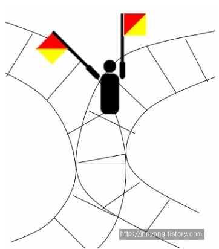
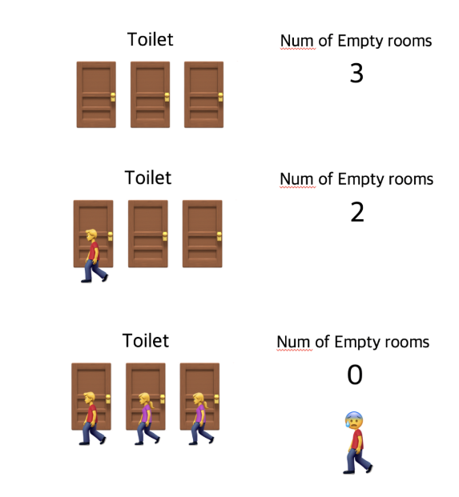
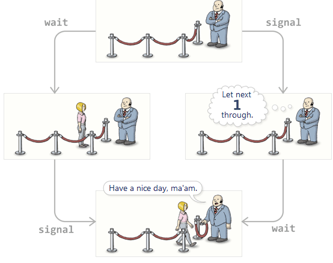
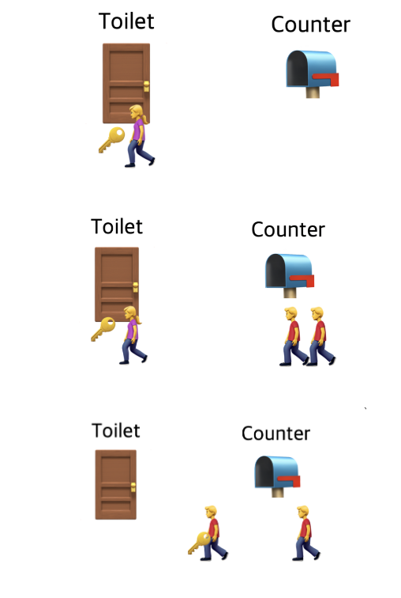

# Semaphore & Mutex

---

- 프로세스 간 메시지를 전송하거나, 공유메모리를 통해 공유된 자원에 여러 개의 프로세스가 동시에 접근하면 Critical Section(여러 프로세스가 데이터를 공유하며 수행될 때, 각 프로세스에서 공유 데이터를 접근하는 프로그램 코드 블록) 문제가 발생할 수 있다.
    
    <aside>
    💡 **Critical section(임계구역) 이란 ?**
    
    - 여러 프로세스가 데이터를 공유하며 수행될 때, **각 프로세스에서 공유 데이터를 접근하는 프로그램 코드 블록**
    - 공유 데이터를 여러 프로세스가 동시에 액세스하면 시간적인 차이 등으로 인하여 잘못된 결과를 만들어 낼 수 있기 때문에 한 프로세스가 위험 부분을 수행하고 있을 때, 즉 공유 데이타를 액세스하고 있을 때는 다른 프로세스들은 절대로 그 데이타를 액세스하지 못하도록 하여야 한다.
    </aside>
    
- 이를 해결하기 위해 데이터를 한 번에 하나의 프로세스만 접근할 수 있도록 제한을 두는 동기화 방식을 취해야 한다. 동기화 도구에는 대표적으로 **뮤텍스**(Mutex)와 **세마포어**(Semaphore)가 있다. 이들은 모두 공유된 자원의 데이터를 여러 스레드/프로세스가 접근하는 것을 막는 역할을 한다.
- **세마포어는 정수로 되어 있는 변수, 뮤택스는 객체이다.**

# 1. Semaphore



> **유래**
> 
- Semaphore는 깃발이라는 뜻이다.
- 옛날에는 기찻길에서 깃발 표식으로 파란색이 걸려있으면 지나가도 되고 빨간색이 걸려있으면 섰다가 다른 기차가 지나가면 지나가게끔 하 는 용도로 깃발을 사용했다. 이 깃발을 semaphore라고 부른다.
- 즉 저 겹치는 기찻길 부분이 두 기차가 공유하는 critical section이다.  저 기찻길에서도 critical section을 지나가도 된다 안된다를 알려 주는 단어로 쓰인 것이다.

## 1-1. 개념

- E. J. Dijkstra(다익스트라)에 의해 고안된 프로세스 간의 상호배제 및 동기화 문제 해결 방법이다.
- 공유된 자원의 데이터 혹은 임계영역(Critical Section) 등에 여러 Process 혹은 Thread가 접근하는 것을 막아준다. (동기화 대상이 하나 이상)
- 만약, 어떤 공유 자원의 세마포어가 3이라면, 해당 자원은 동시에 최대 3개의 프로세스가 접근 가능하다는 의미이다. (단순히 말하면, 공유자원의 개수를 나타내는 변수이다.)
- 즉, 병행 처리를 위한 동기화 기법이다.
    
    <aside>
    💡 **동기화 기법** : 두 개 이상의 프로세스를 동시에 처리할 수 없으므로, 각 프로세스에 대한 처리 순서를 결정하는 것. 상호 배제의 한 형태이다.
    
    </aside>
    


- 사용하고 있는 스레드/프로세스의 수를 공통으로 관리하는 하나의 값을 이용해 상호배제를 달성한다. 공유 자원에 접근할 수 있는 프로세스의 최대 허용치만큼 동시에 사용자가 접근할 수 있으며, 각 프로세스는 세마포어의 값을 확인하고 변경할 수 있다.
- 자원을 사용하지 않는 상태가 될 때, 대기하던 프로세스가 즉시 자원을 사용하고. 이미 다른 프로세스에 의해 사용중이라는 사실을 알게 되면, 재시도 전에 일정시간 대기해야 한다.
- 일반적으로 비교적 긴 시간을 확보하는 리소스에 대해 사용하게 된다.

- **sudo code**
    
    ```cpp
    struct semaphore {
        int count;
        queueType queue;
    };
    
    void semWait (semaphore s) {
        s.count--;
        if (s.count <= 0) {
        	// 락이 걸리고 공유 자원에 접근할 수 없음
        }
    } 
    
    void semSignal (semaphore s) {
        s.count++;
        if (s.count <= 0) {
        	// 아직 락에 걸려 대기중인 프로세스가 있음
        }
    } 
    ```
    
- Semaphore는 액세스 제어 메커니즘에 사용되는 음수가 아닌 변수 값이다.
- 여러 프로세스 간에 정보를 공유하기 위한 동기화 도구로 사용된다.
- 리소스의 한정된 인스턴스가 사용 가능해질 때까지 여러 Process Thread가 리소스의 한정된 Instance에 액세스할 수 있다.
    - Semaphore 변수의 값은 리소스가 필요한 모든 Process에서 변경할 수 있지만, 한 번에 하나의 Process만 값을 변경할 수 있다.
- Semaphore는 Signaling 메커니즘으로 락을 걸지 않은 Thread도 Signal을 보내 lock을 해제할 수 있다.
    - Semaphore는 동기화를 위해 wait와 signal이라는 2개의 atomic operations를 사용한다. wait를 호출하면 semaphore의 카운트를 1 줄이고, semaphore의 카운트가 0보다 작거나 같아질 경우에 lock이 실행된다.
    - Semaphore의 카운트가 0보다 작거나 같아져 동기화가 실행된 상황에서, 다른 Thread가 signal 함수를 호출하면 Semaphore의 카운트가 1 증가하고, 해당 Thread는 lock에서 빠져나올 수 있다.

## 1-2. 그림으로 보는 예시



**Toilet : 공유자원**

**사람들 : 프로세스 / 스레드**

**화장실 빈 칸의 개수 : 현재 공유 자원에 접근할 수 있는 프로세스와 스레드의 개수**

→ 이처럼 세마포어는 공통으로 관리하는 하나의 값을 이용해 상호배제를 달성한다.

## 1-3. 종류

Semaphore는 Counting Semaphores, Binary Semaphore 2종류가 있다. 

- Counting Semaphore는 카운트가 양의 정수값을 가지며, 설정한 값만큼 Thread를 허용하고 그 이상의 Thread가 자원에 접근하면 락이 실행된다.
- Binary Semaphore는 카운트가 1이며 뮤텍스 처럼 사용될 수 있다

### 1. 이진 세마포어(Binary Semaphore)

- 0 또는 1의 값을 가지며, 주로 상호 배제를 위해 사용된다. 한 번에 하나의 프로세스나 스레드만이 접근할 수 있도록 제어한다.
    
    ex) 사용자가 프린터를 사용하면 세마포어는 0이 되고, 반환 후 다시 세마포어는 1이 된다. (사용가능상태)
    

### 2. 카운팅 세마포어(Counting Semaphore)

- 음이 아닌 정수의 값을 가지며, 동시에 접근할 수 있는 프로세스나 스레드의 수를 제어하기 위해 사용된다. 일종의 동시 접근 허용 개수 제한을 구현할 때 사용된다.
    
    ex) 서버에 프린트 5개가 있는데, 사용자가 사용할 때마다 1개씩 감소한다. 그러다 사용할 프린터가 없어지면 카운팅 세마포어는 0이 되고, 누군가 프린터를 다 쓰고 반환하면 세마포어가 1로 증가한다.
    

- **부가설명**
    - lock의 경우는, 0 또는 1이다.
    - 세마포어는 shared data의 개수를 의미한다. 그래서 0 또는 1 또는 2 또는.. 등이 될 수 있다. 이 그림에서는 공유자원이 한 개이 므로 (저 겹쳐지는 기찻길) semaphore의 값은 0 또는 1이다. 어떤 기차가 지나가고 있으면 내가 사용할 수 없으니 0이고 비어있으면 1 의 값을 가지게 된다. (이렇게 0 또는 1의 값만 갖는 세마포어를 binary semaphore라고 한다.)
    - 위처럼 누가 쓰면 0이 되고 안쓰면 1이 되는, 즉 0과 1만 갖는 binary semaphore는 Lock하고 작동 원리가 반대다. 0하고 1이 왔다갔다 하는 것은 똑같지만, 세마포어는 초기화가 1이고 누가 사용하면 0인데, Lock은 누가 사용 했을 경우 1이다.
    - 0과 1뿐만 아니라,2,3, 4 등의 값들 또한 가질 수 있는, 즉 도메인이 제한 없는 counting semaphore의 예시를 하나 들어보자.
    - 서버에 프린터가 다섯 대가 물려있다. 사용자가 프린트를 사용하려고 서버에 요청한다. 그러면 공유자원 즉 프린터가 5개가 있으니까 5로 설정이 된다. 그리고 프린터를 사용자가 사용할 때마다 하나씩 감소한다. 그러다 가 사용할 프린터가 없어지면 세마포어는 0이되고 누군가가 프린터를 다 쓰고 반환하면 세마포어가 다시 1이 증가한다.
    - 여기서 세마포어는 단순히 변수이다. 공유자원의 개수를 나타내는 변수.
    - 카운팅 세마포어는 자원이 몇 개로 한정되었을 때, 이 자원에 접근하는 걸 컨트롤하는 데 사용된다. 그리고 세마포어는 사용가능한 자원의 갯수로 초기화된다.

## 1-4. 신호

세마포어는 signal 매커니즘에서 작동하며, 여기에서 스레드는 다른 스레드에 의해 신호를 받을 수 있다. 세마포어는 프로세스 동기화를 위해 두 가지 atomic opertaion을 사용한다.

- wait(P) : 세마포어의 값을 감소시키는 연산. 자원에 접근하기 전에 해당 세마포어의 값을 감소시킨다.
- signal(V) : 세마포어의 값을 증가시키는 연산. 작업이 완료되어 공유 자원을 해제한 후에 호출된다.
- **semaphore 접근 함수**
    
    > semaphore 접근 함수- wait(), signal()
    > 
    
    
    
    - 자원을 어떻게 사용하고 반납하는 지를 위해 제공되는 함수가 wait()하고 signal()이다.
    - 사용하면 -1이 되고, 반납할 때 +1 해주는 함수다.
    - 다만 세마포어 자체가 공유자원이 되면 안되니까 쪼개지지 않는 함수로 구성된다. shared data를 보호하려고 세마포어를 사용하는데 세마포어 자체가 shared data가 되면 안 된다.
    - 세마포어 변수 S는 결국 초기화를 제외하면 atomic operation인 wait()와 signal()로만 접근 가능한 정수 타입의 변수다. 이 두 함수는 p 또는 v라고 많이 얘기를 하기도 한다. (p는 네덜란드어 "테스트하다"라는 단어의 probern에서 유래됐고 signal은 "증가하다"라는 뜻 의 verhogen 단어에서 유래됐다) 근데 이게 미국으로 건너가면서 영어로 표현할 때에는 -1하는 함수를 wait, +1하는 함수로 signal로 불리게 됐다.
    - shared data를 사용하려고 봤는데 shared data가 없으면 기다려야하니까 이 함수의 이름을 wait이라고 지었고, 지금 비어있는 shared data가 있으면 기다리지 않고 사용하는 것이다. (-1)
    - 그런데 만약 semaphore의 값이 0이면 남은 게 하나도 없다는 뜻이니까 기다려야 한다고 해서 이름이 wait다.
    - 다 쓰고 나서는 세마포어 값을 +1시켜주면 된다. 내가 지금 다 쓴 이 shared data를 누군가 쓰려고 기다릴 수 있어서 나 다 썼으니 너 써! 신호를 보내줘야 한다. 그래서 이 함수가 signal()이다.

## 1-5. Semaphore의 장단점

> **장점**
> 
- Semaphore를 사용하면 시스템 리소스를 보다 효율적으로 할당할 수 있다. 이는 메모리를 보다 효율적으로 사용할 수 있음을 의미한다
- Semaphore를 사용하면 여러 프로세스를 제어할 수 있다. 즉, 필요에 따라 특정 작업에 메모리를 할당할 수 있다.
- Semaphore 기반 메모리 관리는 성능을 향상시키고 시스템 응답성을 향상시킨다.
- Semaphore는 기계 독립적이며 마이크로커널에서 실행되어야 한다.
- 한 번에 하나의 프로세스만 임계 영역에 있기 때문에 경쟁 조건이 발생하지 않는다.
- 데이터는 일관성을 유지하며 무결성을 유지하는 데 도움이 된다.
- 임계 영역에 들어가기 전에 프로세스가 획득하고 임계 영역을 떠나면서 해제할 수 있는 간단한 lock 매커니즘이다.
- 자원 관리가 유용하다.
- 한 번에 하나의 프로세스만 임계 구역에 접근 가능하지만, 멀티 스레드는 허용된다.

> **단점**
> 
- Semaphore는 프로그래밍 오류가 발생하기 쉽다
- 프로그래밍 Semaphore의 복잡성으로 인해 상호 배제가 불가능하다
- Semaphore 구현은 메모리 및 CPU 사용 측면에서 비용이 많이 들 수 있다
- 우선 순위 반전 문제가 있다.
    
    → Priority Inversion State(우선순위 역전현상) :  상대적으로 우선순위가 가장 높은 프로세스가 마치 우선순위가 가장 낮은 프로세스처럼 실행이 되는 현상
    
- 대규모 시스템에 사용할 수 없다.
- 세마포어의 Operation(Wait, Signal)은 교착 상태를 피하기 위해 올바른 방식으로 구현돼야 한다.
- 세마포어는 프로그래밍 오류가 발생하기 쉽기 때문에 교착 상태나 상호배제 속성 위반이 발생할 수 있다.
- 운영 체제는 대기 및 신호 작업에 대한 모든 호출을 추적해야 한다.

# 2. Mutex

- 뮤텍스란 상호 배제(Mutual Exclusion)의 줄임말이다.
- 임계구역(Critical Section)을 가진 스레드들의 실행시간(Running Time)이 서로 겹치지 않고 각각 단독으로 실행(상호배제_Mutual Exclusion)되도록 하는 기술이다.
- 뮤텍스는 **단 하나**의 프로세스/스레드만 접근이 가능하다. 뮤텍스가 사용하는 임계 구역은 공유가 불가능한 자원이다. 따라서 한번에 하나의 프로세스/스레드만 접근이 가능하며, 사용 중인 프로세스/스레드가 락(Lock)을 걸어버려 다른 프로세스/스레드의 접근을 방지한다.
- 한 번에 하나의 프로세스만 리소스에 액세스할 수 있도록 하는 데 사용된다.
    - 프로세스가 리소스를 사용할 때 리소스를 잠그고 사용한 다음 해제한다.
    - 동일한 Process가 잠금을 동시에 획득하고 해제할 수 있다.
    - Mutex 개체는 모든 Process가 동일한 리소스를 사용할 수 있도록 허용하지만 한 번에 한 Process에서 리소스에 액세스한다.
    - 여러 Process Thread가 공유 리소스에 액세스할 수 있지만 한 번에 하나만 액세스할 수 있다.
    - 1개의 lock만을 갖는 Locking 메커니즘으로 한 번에 하나의 Thread만이 동일한 시점에 뮤텍스를 얻어 Critical Section에 들어올 수 있다.


- 한 프로세스에 의해 소유될 수 있는 Key를 기반으로 한 상호배제 기법이고 Key에 해당하는 어떤 객체(Object)가 있으며, 이 객체를 소유한 스레드/프로세스만이 공유자원에 접근할 수 있다.
- 다중 프로세스들의 공유 리소스에 대한 접근을 조율하기 위해 동기화(Synchronization) 또는 락(Lock)을 사용함으로써 뮤텍스 객체를 두 스레드가 동시에 사용할 수 없다.
- 뮤텍스의 락은 다른 프로세스들도 자유롭게 확인하고 변경 가능했던 세마포어와는 다르게 락을 건 프로세스/스레드 본인이 아니면 락을 해제할 수 없다.
- 프로그램이 시작될 때(프로세스가 시스템에서 리소스를 요청할 때마다) 고유한 이름 또는 ID를 가진 뮤텍스 개체가 만들어진다.
    - Process가 해당 리소스를 사용하려고 할 때마다 개체에 대한 잠금을 획득한다.
    - 잠금 후 Process는 리소스를 사용하고 Mutex 개체를 해제한다.
- 뮤택스는 Semaphore처럼 사용될 수 없다.

## 2-1. 그림으로 보는 예시



**사람** : 프로세스 / 스레드

**열쇠** : lock

**화장실** : 자원

→ 손님 한 명이 키를 받아 화장실을 쓰고 있으면, 손님이 나오기 전엔 그 화장실을 쓸 수 없다.

열쇠가 없으면 들어갈 수 없으니, 이전 사용자가 열쇠를 반환할 때 까지 다음 사용자는 대기해야 한다. 그러다 사용 중이던 손님이 카운터에 열쇠를 반환하면, 그 때 열쇠를 가져가서 화장실을 사용할 수 있게 된다.

- 이것이 뮤텍스가 동작하는 방식이다. 화장실을 이용하는 사람은 프로세스 혹은 쓰레드이며 화장실은 공유자원, 화장실 키는 공유자원에 접근하기 위해 필요한 어떤 오브젝트다. 즉, 뮤텍스는 Key에 해당하는 어떤 오브젝트가 있으며 이 오브젝트를 소유한 (쓰레드,프로세스) 만이 공유자원에 접근할 수 있다.
- 뮤택스 → 키 자체가 객체임. (공유 자원에 접근하기 위한)
    
    ex) 로그인 → 아이디, 패스워드 일치해야 공유자원에 접근 가능
    

## 2-2.  뮤텍스의 장단점

> **장점**
> 
- 뮤텍스는 서로 다른 두 Thread가 동시에 리소스에 액세스하는 것을 방지하는 장벽을 만드는 것으로, 다른 Thread가 리소스를 필요로 할 때 리소스를 사용할 수 없게 된다.
- 뮤텍스는 코드 안정성에 도움이 될 수 있다. CPU의 메모리 관리가 실패하면 Thread가 액세스하는 리소스를 사용할 수 없게 될 수 있는데, 이 시점에서 리소스에 대한 액세스를 방지함으로써 시스템은 메모리 관리 실패를 유발하는 오류로부터 복구할 수 있으며, 여전히 리소스를 사용할 수 있게 도와준다.
- 한 번에 하나의 프로세스만 임계 영역에 있기 때문에 경쟁 조건이 발생하지 않는다.
- 데이터는 일관성을 유지하며 무결성을 유지하는 데 도움이 된다.
- 임계 영역에 들어가기 전에 프로세스가 획득하고 임계 영역을 떠나면서 해제할 수 있는 간단한 lock 매커니즘이다.

> **단점**
> 
- 획득한 Context 이외의 Context에 의해 잠기거나 잠금 해제될 수 없다
- 일반적인 구현은 CPU 시간을 낭비하는 바쁜 대기 상태를 초래할 수 있다
- Critical Section에서는 한 번에 하나의 Thread만 허용해야 한다.
- 임계 영역에 진입 후 스레드가 잠들거나(일시정지 되었거나) 우선 순위가 높은 프로세스에 의해 선점되면, 다른 스레드는 임계 영역에 진입할 수 없게 되어 기아 상태에 이어질 수 있다.
    
    <aside>
    💡 **기아 상태(Starvation)** : 프로세스가 끊임없이 필요한 자원을 가져오지 못하는 상황
    
    </aside>
    
- 이전 스레드가 임계 영역을 떠나면 다른 프로세스만 진입할 수 있으며, 임계 영역을 잠그거나 잠금을 해제하는 다른 매커니즘은 없다.
- 뮤텍스를 구현하면 busy waiting이 발생하여 CPU주기가 낭비될 수 있다.
    
    → 이유 : 다른 프로세스가 생산적으로 쓸 수 있는 CPU자원을 CPU싸이클을 통해 쓸 데 없이 낭비하기 때문이다.
    
    <aside>
    💡 **Busy Waiting** : 어떤 임계영역에 들어가기 위해 무한루프에 들어가게 되는 것. (권한 획득)
    
    </aside>
    

# 3. Semaphore VS Mutex

가장 큰 차이점은 동기화 대상의 개수 즉, 위에서 예시든 화장실의 갯수다.

- 세마포어(Semaphore) : 공유된 자원의 데이터 혹은 임계영역(Critical Section) 등에 **여러** **Process 혹은 Thread**가 접근하는 것을 막아준다.(즉, 동기화 대상이 하나 이상)
- 뮤텍스(Mutex) : 공유된 자원의 데이터 혹은 임계영역(Critical Section) 등에 **하나의** **Process 혹은 Thread**가 접근하는 것을 막아준다.(즉, 동기화 대상이 하나)

| Semaphore | Mutex |
| --- | --- |
| 신호 메커니즘 | 잠금 및 잠금 해제 메커니즘 |
| 정수 변수 | 객체 |
| 세마포어 작업:• Wait• Signal | 뮤텍스 작업:• Lock• Unlock |
| Counting Semaphores, Binary Semaphore 존재 | 하위 유형 없음 |
| Semaphore는 수정할 수 있는 두 개의 원자 연산(wait, signal)으로 작동한다. | 자원을 요청하거나 해제하는 프로세스에 의해서만 수정 가능 |
| Process에 리소스가 필요하고 사용 가능한 리소스가 없는 경우, Process는 Semaphore 값이 0보다 클 때 까지 대기 작업을 수행해야 한다. | 뮤텍스가 잠겨 있으면 Process는 Process Queue에서 대기해야 하며 뮤텍스는 잠금이 해제된 후에만 액세스할 수 있다. |
| 자원 소유가 불가하다. | 자원을 소유할 수 있고, 책임을 가진다. |
| 시스템 범위에 걸쳐 있고, 파일 시스템 상의 파일로 존재한다. | 프로세스의 범위를 가지며 프로세스 종료될 때 자동으로 Clean up 된다. |

