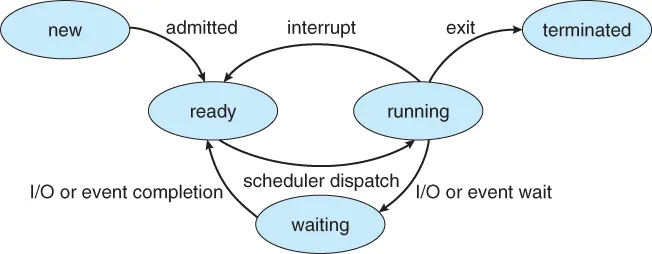
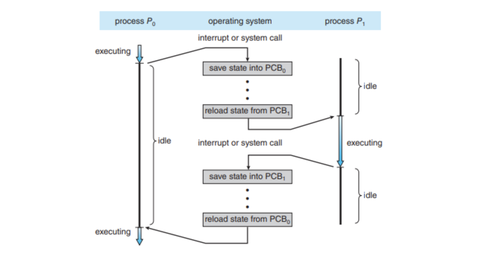
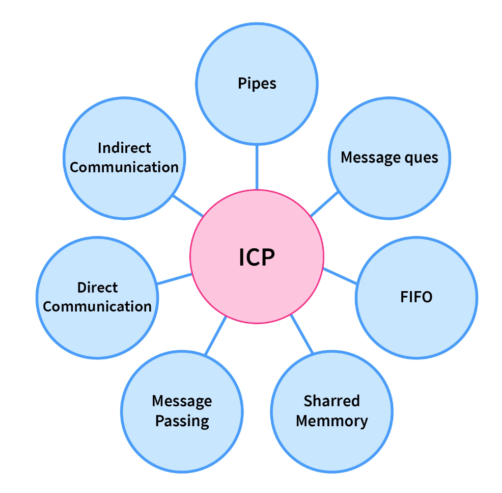
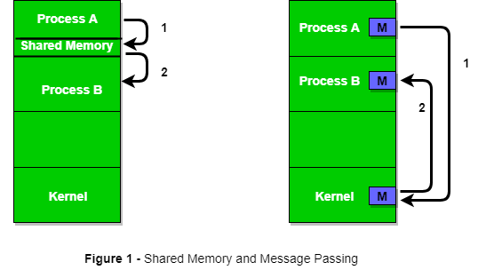
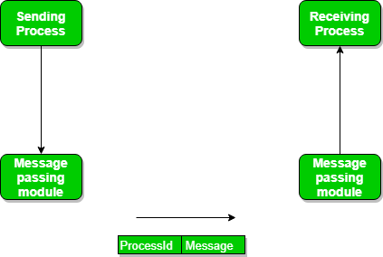
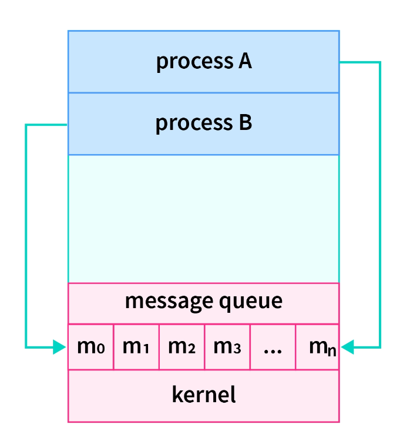
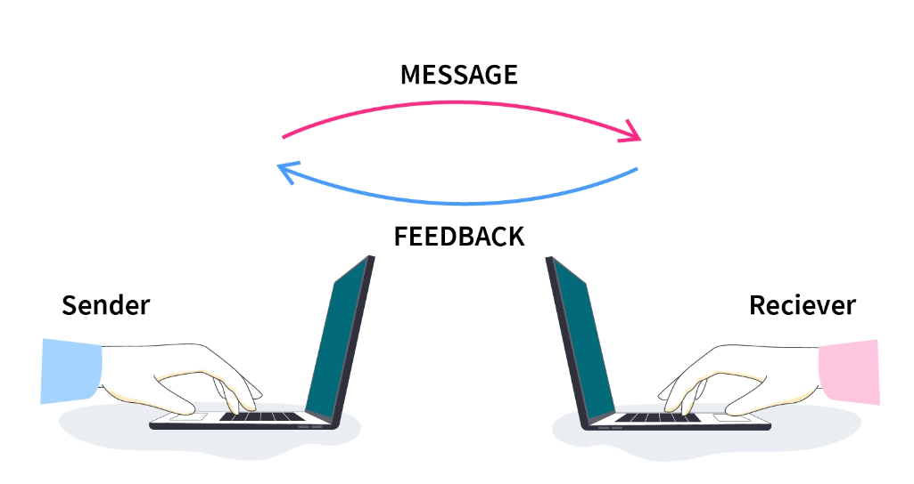

# Process

# Definition

- 하나 이상의 스레드에 의해 실행되는 컴퓨터 프로그램의 인스턴스다
- 실행 중인 프로그램이며 프로그램이 메모리에 로드되면 프로세스가 된다.
- 프로세스는 프로세스를 추적할 수 있도록 특정 데이터 집합이 연결되어 실행되는 프로그램이다.
- 대부분의 경우 하나의 프로그램에는 하나의 프로세스가 연결되어 있다.
    
    
    | Num |  설명 |
    | --- | --- |
    | 1 | Stack
    프로세스 스택에는 메서드/함수 매개 변수, 반환 주소 및 지역 변수와 같은 임시 데이터가 포함된다. |
    | 2 | Dummy
    이는 런타임 동안 프로세스에 동적으로 할당된 메모리이다. |
    | 3 | Text
    여기에는 프로그램 카운터 값과 프로세서 레지스터의 내용으로 표시되는 현재 활동이 포함된다. |
    | 4 | Data
    이 섹션에는 전역 변수와 정적 변수가 포함되어 있다. |

# Program

- 프로그램은 파일에 작성하는 일련의 명령이다.
- 이 파일은 실행 가능한 형태로 하드디스크에 저장된다.
- 현재 프로세서에 의해 운영되지 않으므로 passive entity라고도 한다.
- 일반적으로 컴퓨터 프로그래머가 프로그래밍 언어로 작성한다.
- 프로그램을 실행 파일이 메인 메모리에 로드되면 프로세스가 된다.
    - 다음 두 작업을 수행하여 이 작업을 수행할 수 있다.
        - 프로그램의 실행 파일을 더블 클릭한다.
        - 명령 프롬프트에 실행 파일 이름을 입력한다.
- 프로세서(CPU)에는 다음에 실행 될 다음 명령어의 주소를 제공하는 프로그램 카운터(Program Counter)가 있다.
- 해당 특정 프로세스에 대한 set of resources도 있다.

# Process와 Program의 차이점

| S. N | 프로세스 | 프로그램 |
| --- | --- | --- |
| 1 | 프로세스는 소프트웨어나 컴퓨터 코드를 활발하게 실행하고 있다. 모든 절차는 정확한 순서에 따라 수행되어야 한다. 모든 시스템에서 구현되어야 하는 기본 작업 단위를 설명하는 데 도움이 되는 엔터티를 프로세스라고 한다. | 프로그램은 특정 작업이 특정 작업을 완료하도록 허용될 때 실행되는 일련의 명령이다. |
| 2 | 프로세스는 본질적으로 동적이다. | 프로그램은 본질적으로 정적이다. |
| 3 | 프로세스는 본질적으로 active하다. | 프로그램은 본질적으로 passive하다. |
| 4 | 실행 중에 프로세스가 생성되어 메인 메모리에 직접 로드된다. | 프로그램은 이미 메모리에 존재하며, 보조 메모리에도 존재한다. |
| 5 | 프로세스에는 프로세스 제어 블록(Process Control Block)이라는 자체 제어 시스템이 있다. | 프로그램에는 제어 시스템이 없습니다. 지정되면 호출되고 호출되면 전체 프로그램이 실행된다. |
| 6 | 프로세스는 수시로 저절로 변경된다. | 프로그램 자체는 변경할 수 없다. 프로그래머가 변경해야 한다. |
| 7 | 프로세스에는 관리 및 실행에 필요한 프로그램 데이터 외에 추가 데이터가 필요하다. | 프로그램은 기본적으로 두 부분으로 나누어진다. 하나는 코드 부분이고 다른 부분은 데이터 부분이다. |
| 8 | 프로세스에는 상당한 리소스 수요가 있다. 운영 체제에 존재하거나 존재할 때까지 메모리 주소, 중앙 처리 장치, 입력 또는 출력과 같은 리소스가 필요하다. | 프로그램에는 명령을 저장하기 위한 메모리 공간만 필요하다. 더 이상 자원이 필요하지 않다. |

# State

- 생성부터 완료까지 프로세스는 다양한 상태를 거친다. 일반적으로 프로세스는 실행 중 5가지 상태 중 하나로 나타낼 수 있다.
    
    
    
    - New
        - 운영 체제가 주 메모리에 불러올 준비가 된 프로세스가 포함된다.
    - Ready
        - 실행할 준비가 되어 있고 현재 시스템의 주 메모리에 있는 프로세스가 포함되어 있다.
        - 운영 체제는 보조 메모리의 프로세스를 주 메모리(RAM)으로 가져온다.
        - 해당 프로세스는 주 메모리에 존재하며 CPU에 할당되기를 기다린다.
    - Running
        - 현재 시스템의 CPU에 의해 실행되는 프로세스가 포함된다.
    - Waiting(Block)
        - 프로세스는 running 상태에서 block으로 전환되거나 scheduling 알고리즘에 따라 또는 프로세스의 내부 동작으로 인해 대기(waiting) 된다.
    - Termination
        - 실행이 완료된 프로세스는 종료 상태가 된다.
        - 해당 프로세스(PCB)의 모든 내용도 운영 체제에 의해 삭제된다.

# Logic

- 주로 컴퓨터 시스템이나 소프트웨어에서 프로세스의 동작 및 제어를 설명하는 논리적인 구성 요소를 의미한다.
- 주로 다음과 같은 문맥에서 사용된다.
    
    ### Process Management
    
    - 운영 체제에서는 프로세스 관리를 통해 운영체제는 여러 프로세스를 동시에 실행하고 관리한다.
    - 프로세스 관리는 프로세스 생성, 종료, 일시 중단, 병합 및 우선순위 조절과 같은 작업을 포함하며, 이러한 작업을 제어하기 위한 논리가 Process Logic
    
    ### Program Flow
    
    - 소프트웨어 프로그램에서는 프로그램 실행 흐름을 제어하는 부분이다.
    - 조건문, 반복, 함수 호출 및 제어 구조를 사용하여 프로그램이 특정 조건에서 어떻게 동작해야 하는지를 정의한다.
    
    ### Multi-threading
    
    - 멀티스레드 프로그래밍에서는 다중 스레드가 동시에 실행되므로 각 스레드 간의 실행 순서와 데이터 공유를 제어해야 하는데, 이 역할이 Process Logic
    
    ### Synchronization and Concurrency
    
    - 여러 프로세스 또는 스레드 간의 동기화와 병행성을 관리하는 논리도 Process Logic에 포함된다. 이는 경쟁 조건과 데드락과 같은 문제를 방지한다.
    
    ### Data Processing and Algorithms
    
    - 데이터 처리 알고리즘에서 프로세스 로직은 데이터를 입력에서 출력으로 변환하는 방법을 정의하는 데 사용된다.

# Context Switching

- CPU가 프로세스를 실행시키기 위해 필요한 정보들을 Context(문맥)라 한다.
- 문맥 교환은 CPU가 멀티태스킹 환경에서 여러 프로세스 간에 전환할 수 있도록 하는 운영 체제의 중요 개념이다.
- 프로세스가 실행되다가 인터럽트가 발생해 CPU를 한 프로세스에서 다른 프로세스로 넘겨주는 과정이다.
- 스케줄러가 CPU를 한 프로세스 실행에서 다른 프로세스로 전환할 때 현재 실행 중인 프로세스의 항태가 PCB에 저장된다. 또,  CPU를 새롭게 얻는 프로세스 상태를 PCB에서 읽어온다.
- CPU 입장에서는 Context는 PCB에서 읽어오기 때문에, PCB정보가 바뀌는 것이 Context Switching이다.
- 문맥 교환이 발생하면 운영 체제는 CPU Register의 내용과 기타 관련 정보를 OS의 PCB에 저장하여 현재 프로세스의 Context를 저장한다. 그 뒤 CPU는 자유롭게 다른 프로세스를 실행할 수 있고 운영 체제는 PCB에서 다음 프로세스의 저장된 Context를 불러온다.
- PCB에는 프로세스를 관리하는데 필요한 모든 정보가 포함되어 있으며 프로세스가 일시 중지되거나 선점 되면 운영 체제는 PCB를 업데이트하여 현재 상태와 Resource를 반영한다.
- PCB를 사용한 문맥 교환은 복잡하고 Resource 집약적인 작업이므로 운영 체제에서 프로세스를 최적화하여 overhead를 최소화하고 시스템 성능을 향상시키는 것이 중요하다.
- 최신 운영 체제는 정교한 알고리즘과 데이터 구조를 사용하여 PCB를 관리하고 문맥 교환에 필요한 시간과 Resource를 최소화한다.
    
    ### 문맥 교환 과정
    
    
    
    - 요청 발생
        - 인터럽트나 트렙에 의해서 컨텍스트를 바꿔야 한다는 요청이 들어온다.
    - PCB 에 프로세스 정보 저장
        - 기존에 실행중이던 프로세스 `P0` 와 관련된 정보들을 PCB 에 저장한다
    - CPU 새롭게 할당
        - 운영체제는 새롭게 실행할 프로세스 `P1` 에 대한 정보를 해당 PCB 에서 가져와 CPU 레지스터에 적재한다.
    
    ### 문맥 교환 발생
    
    - Multi tasking
        - 실행 가능한 여러개의 프로세스들이 운영체제의 스케쥴러에 의해, 우선순위에 따라 조금씩 번갈아가면서 수행된다. CPU를 할당 받는 프로세스가 변경될 때 마다 문맥 교환이 일어난다.
    - Interrupt handling
        - 컴퓨터 시스템에서 예외 상황이 발생했을 때 이를 CPU 에게 알려 실행중이던 프로세스 정보를 저장하고 발생한 예외 상황을 처리하기 위한 문맥 교환이 일어난다.
    - User and Kernel mode Switching
        - 문맥 교환이 필수는 아니지만 운영체제에 따라 발생 가능하다.
    
    ### 관리 방식
    
    - 운영 체제는 프로세스 테이블을 사용하여 메모리에 있는 PCB를 찾는다.
        
        <aside>
        💡 프로세스 테이블
        
        - 프로세스 테이블은 프로세스 ID 와 메모리의 해당 PCB에 대한 참조를 포함하는 테이블이다 . 프로세스 테이블을 실행 중인 모든 프로세스 목록이 포함된 사전으로 시각화할 수 있다.
        </aside>
        
    
%20f8ff71708c9b41a7a6be9b42298eceb7/Untitled2.png)
    
- 프로세스 간에 컨텍스트 전환이 발생할 때마다 운영 체제는 해당 프로세스 ID의 도움으로 PCB 에 대한 참조를 찾기 위해 프로세스 테이블을 참조한다.
- 운영체제는 빠르게 PCB 에 접근하기 위해서 **프로세스 테이블**을 사용해 각 프로세스의 PCB 를 관리하고 PCB 는 **연결 리스트 방식**으로 관리된다. 프로세스가 생성, 삭제될 때 PCB 의 삽입 삭제가 용이하다.

# Process Scheduling

- CPU에서 실행 중인 프로세스를 제거하고 특정 전략에 따라 다른 프로세스를 선택하는 프로세스 관리자의 활동이다.
- 다중 프로그래밍 운영 체제는 한 번에 둘 이상의 프로세스를 실행 가능 메모리에 적재할 수 있으며, 적재된 프로세스는 Time Multiplexing에 의해 CPU를 공유한다.
    
    ### 종류
    
    - **비선점형(Non-preemptive)** :
        - 프로세스 실행이 완료되기 전에 프로세스의 리소스를 가져올 수 없다. 실행 중인 프로세스가 완료되고 대기 상태로 전환되면 리소스가 전환된다.
    - **선점형(Preemptive)**
        - OS는 미리 정해진 기간 동안 프로세스에 리소스를 할당한다. 프로세스는 자원 할당 중에 실행 상태에서 준비 상태로 전환되거나 대기 상태에서 준비 상태로 전환된다. 이러한 전환은 CPU가 다른 프로세스에 우선순위를 부여하고 현재 active한 프로세스를 더 높은 우선순위 프로세스로 대체할 수 있기 때문에 발생한다.
    
    ### 유형
    
    - **Long Term or Job Scheduler**
        - 새로운 프로세스를 ‘준비 상태’로 만든다. 특정 시점에 준비 상태에 있는 프로세스의 수를 제어한다. Long Term 스케줄러는 I/O 및 CPU 바인딩 프로세스를 모두 신중하게 선택하는 것이 중요하다. I/O 바인딩 작업은 입력 및 출력 작업에 많은 시간을 사용하는 반면에 CPU 바인딩 프로세스는 CPU에서 시간을 보낸다. Job 스케줄러는 둘 사이의 균형을 유지하여 효율성을 높인다. 일반적으로 일괄 처리 시스템에 사용된다.
    - **Short-Term or CPU Scheduler**
        - 실행 상태에서 예약하기 위해 준비 상태에서 하나의 프로세스를 선택하는 역할을 담당한다. Medium 스케줄러는 예약할 프로세스만 선택하며 실행 시 프로세스를 로드하지 않는다.
        - CPU 스케줄러는 버스트 시간이 긴 프로세스로 인해 Starving state가 발생하지 않도록 하는 역할을 한다.
        - Dispatcher는 단기 스케줄러가 선택한 프로세스를 CPU에 로드하는 역할을 담당한다.
        - Context Switching은 Dispatcher에 의해서만 수행된다.
            
            <aside>
            💡 **Dispatcher(디스패처)** : 스케줄러 다음에 실행되는 특수 프로그램이다. 스케줄러가 프로세스 선택 작업을 완료하면 해당 프로세스를 원하는 상태/큐로 가져오는 역할을 한다.
            
            **Dispatcher의 역할** 
            1. Context Switching
            2. 사용자 모드로 전환
            새로 로드된 프로그램의 적절한 위치로 jump시킴.
            
            </aside>
            
    - **Medium-Term Schduler**
        - 프로세스를 일시 중지하고 재개하는 역할을 담당한다.
        - 주로 스와핑(프로세스를 주 메모리에서 디스크로 또는 그 반대로 이동)을 수행한다.
            - 프로세스 혼합 개선, 또는 메모리 요구사항의 변경으로 인해 사용 가능 메모리가 과도하게 커밋되어 메모리를 확보해야 하기 때문에 스와핑이 필요할 수 있다.
            - I/O 경계와 CPU 경계 사이의 완벽한 균현ㅇ을 유지하는 데 도움이 된다.
    - **Some other Schedulers**
        - I/O Scheduler  : I/O Scheduler는 디스크, 네트워크에 대한 읽기/쓰기와 같은 I/O 작업 실행을 관리하는 역할을 담당한다. FCFS(First-Come, First-Served) 또는 RR(Round Robin)과 같은 다양한 알고리즘을 사용하여  I/O작업이 실행되는 순서를 결정할 수 있다.
        - Real-Time Scheduler : 실시간 시스템에서 Real-Time Scheduler는 중요한 작업이 지정된 시간 내에 완료되도록 보장한다.  EDF(Earliest Deadline First) 또는 RM(Rate Monotonic)과 같은 다양한 알고리즘을 사용하여 작업의 우선순위를 지정하고 일정을 계획할 수 있다.
    
    ### 스케줄러 간 비교
    
    | Long Term Scheduler | Short term schedular | Medium Term Scheduler |
    | --- | --- | --- |
    | 작업 스케줄러 | CPU 스케줄러 | 프로세스 교환 스케줄러 |
    | 일반적으로 속도는 단기 스케줄러보다 느리다. | 속도는 가장 빠르다. | 속도는 단기 스케줄러와 장기 스케줄러의 중간이다. |
    | 다중 프로그래밍의 정도를 제어한다. | 다중 프로그래밍이 수행되는 정도에 대한 제어력이 떨어진다. | 다중 프로그래밍 정도를 줄인다(reduce). |
    | 시분할 시스템에서는 거의 존재하지 않거나 존재하지 않는다. | 최소한의 시간분배 시스템이다. | 시간 공유를 위한 시스템의 구성 요소이다. |
    | 프로세스를 메모리에 다시 입력하여 실행을 계속할 수 있다. | 실행할 준비가 된 프로세스를 선택한다. | 프로세스를 메모리에 다시 도입하고 실행을 계속할 수 있다. |

# IPC(Inter-Process Communication)

- 프로세스가 서로 통신하고 작업을 동기화할 수 있도록 하는 메커니즘
- OS의 공유 메모리, 메시지 큐, FIFO등은 OS에서 IPC를 활용하는 몇 가지 방식이다.
- 프로세스는 공유 메모리, 메시지 전달의 두 가지 방식으로 서로 통신할 수 있다.
- Independent Process, Cooperating Process의 두 유형이 있다.
- IPC는 계산 속도 향상, 모듈성, 정보 및 데이터 공유, 권한 분리, 프로세스간 통신 및 작업 동기화를 위해 필요하다.
    
    ### 접근방식
    
    
    
    - IPC의 접근 방식은 크게 다음과 같다.
        
        ### Pipes
        
        
        
        - 관련된 두 프로세스 간의 IPC에 사용되는 단방향 통신이다.
        - Writing Process는 파이프에 쓰는 것이고, Reading Process는 파이프에서 검색된다.
        - 파이프는 운영체제가 제공하는 동기화 통신 방식으로 파일 입출력과 같이 Open() 함수로 descripter를 받고 작업을 한 후에 close로 마무리 한다.
        - 파이프를 이용한 통신은 전역 통신과 마찬가지로 단방향 통신이다. 때문에 양방향 통신을 하기 위해서는 파이프를 두 개 사용해야 한다.
        - 파이프는 queue와 같다. 때문에 한쪽에서는 write( push )하는 것이고, 한 쪽은 read( pop ) 밖에 할 수가 없다.
        - 만약 프로세스 B가 파이프 1에 대해 읽기 연산을 수행했는데 프로세스 A가 파이프 1에 아직 쓰기 연산을 하지 않았다면 프로세스 B는 대기 상태가 된다. 이러한 대기 상태는 프로세스 A가 파이프 1에 데이터를 쓰는 순간 자동으로 풀려 동기화가 이루어진다. 프로세스 B는 Busy waiting를 하지 않아도 된다.
        - 한 가지 헷갈리지 말아야 하는 것이 Wait은 프로세스를 block(wait) 상태로 만든다. 단 busy waiting은 계속해서 체크해야 하기 때문에 계속해서 타임 슬라이스를 얻어 run 상태, ready 상태를 반복한다. 그렇기 때문에 wait보다 busy waiting이 훨씬 자원을 많이 소모하는 것이다.
        - 파이프는 이름 없는 파이프와 이름 있는 파이프로 나뉜다.
            - **이름 없는 파이프(anonymous pipe)** : 일반적으로 파이프라고 하면 이름 없는 파이프를 가리킨다. 부모와 자식 프로세스 혹은 같은 부모를 가진 자식 프로세스와 같이 서로 관련 있는 프로세스 간 통신에 사용된다.
            - **이름 있는 파이프** : FIFIO라 불리는 특수 파일을 이용하며 서로 관련 없는 프로세스 간 통신에 사용된다.
        
        ### Shared memory
        
        
        
        - 프로세스가 일부 변수를 공유해야 하며 이는 전적으로 프로그래머가 구현하는 방법에 따라 달라진다.
        - 여러 프로세스가 공통 공유 메모리에 액세스 할 수 있으며 공유 메모리를 통해 통신한다.
        - 한 프로세스는 한 번에 변경 사항을 적용하고 다른 프로세스는 변경 사항을 확인한다.
        - 커널을 사용하지 않는다.
            - 제한된 버퍼에서 생산자와 소비자가 공통 메모리를 공유한 경우의 sudo 코드
                
                ```cpp
                #include <iostream>
                #include <mutex>
                #include <thread>
                #include <vector>
                 
                #define buff_max 25
                #define mod %
                 
                struct item {
                  // different member of the produced data
                  // or consumed data   
                  // ---------
                };
                 
                // An array is needed for holding the items.
                // This is the shared place which will be 
                // access by both process  
                // item shared_buff[buff_max];
                 
                // Two variables which will keep track of
                // the indexes of the items produced by producer
                // and consumer The free index points to
                // the next free index. The full index points to
                // the first full index.
                std::atomic<int> free_index(0);
                std::atomic<int> full_index(0);
                std::mutex mtx;
                 
                void producer() {
                  item new_item;
                  while (true) {
                    // Produce the item
                    // ...
                    std::this_thread::sleep_for(std::chrono::milliseconds(100));
                    // Add the item to the buffer
                    while (((free_index + 1) mod buff_max) == full_index) {
                      // Buffer is full, wait for consumer
                      std::this_thread::sleep_for(std::chrono::milliseconds(100));
                    }
                    mtx.lock();
                    // Add the item to the buffer
                    // shared_buff[free_index] = new_item;
                    free_index = (free_index + 1) mod buff_max;
                    mtx.unlock();
                  }
                }
                 
                void consumer() {
                  item consumed_item;
                  while (true) {
                    while (free_index == full_index) {
                      // Buffer is empty, wait for producer
                      std::this_thread::sleep_for(std::chrono::milliseconds(100));
                    }
                    mtx.lock();
                    // Consume the item from the buffer
                    // consumed_item = shared_buff[full_index];
                    full_index = (full_index + 1) mod buff_max;
                    mtx.unlock();
                    // Consume the item
                    // ...
                    std::this_thread::sleep_for(std::chrono::milliseconds(100));
                  }
                }
                 
                int main() {
                  // Create producer and consumer threads
                  std::vector<std::thread> threads;
                  threads.emplace_back(producer);
                  threads.emplace_back(consumer);
                 
                  // Wait for threads to finish
                  for (auto& thread : threads) {
                    thread.join();
                  }
                 
                  return 0;
                }
                ```
                
        
### Messaging Passing



- 프로세스가 어떤 종류의 공유 메모리도 사용하지 않고 서로 통신한다.
- 두 프로세스간 통신은 다음과 같이 진행된다.
    - 통신 링크 설정 (이미 존재하는 경우 다시 설정할 필요 없음)
    - 기본 primitives를 사용하여 메시지 교환 시작
        - 최소 두개의 기본 요소 필요
            - send(메시지, 대상) 또는 send(메시지)
            - receive(메시지, 호스트) 또는 receive(메시지)
- 메시지 크기는 고정된 크기이거나 가변적인 크기일 수 있다.
- 크기가 고정되면 OS 설계자에게는 쉽지만 프로그래머에게는 복잡하며, 가변 크기라면 프로그래머에게는 쉽지만 OS 설계자에게는 복잡하다
- 표준 메시지는 헤더와 본문의 두 부분으로 구성될 수 있다.
    - 헤더 : 메시지 유형, 대상 ID, 소스 ID, 메시지 길이 및 제어 정보 저장
        - 제어 정보에는 버퍼 공간 부족 시 수행 방법, 시퀸스 번호, 우선 순위 등의 정보가 포함된다.
- 메시지는 일반적으로 FIFO 스타일을 사용하여 전송된다.
- 통신 및 동기화를 위한 프로세스에서 사용된다.
- 공유 메모리 기술보다 속도가 느리다.
- 메세지 전달에는 메세지 전송(고정 크기 메시지) 및 수신 2가지 작업이 있다.
- Message Link의 구현 참고
    
    [Inter Process Communication (IPC) - GeeksforGeeks](https://www.geeksforgeeks.org/inter-process-communication-ipc/)
    

### Message Queues



- 커널에 메시지를 저장하기 위한 연결 목록을 가지고 있으며, 메시지 큐는 “메시지 큐 식별자” 를 사용하여 식별된다.

### **Direct Communication**



- 통신하려는 프로세스는 발신자 또는 수신자를 지정해야 한다.
- 한 쌍의 통신 프로세스에는 서로 하나의 링크가 있어야 한다.
- 링크(일반적으로 양방향)는 모든 통신 프로세스 쌍 사이에 설정된다.

### **Indirect Communication**

- 통신 프로세스 쌍에는 공유 사서함이 있다.
- 프로세스 쌍 간에 링크(단방향 또는 양방향)가 설정된다.
- 송신자 프로세스는 수신자 프로세스의 포트나 메일함에 메시지를 넣고, 수신자 프로세스는 메일함에서 데이터를 꺼내거나 삭제한다.

### **FIFO**

- 관련되지 않은 두 프로세스 간의 통신에 사용된다.
- 전이중 방식 : 프로세스 P1은 프로세스 P2와 통신할 수 있으며 그 반대의 경우도 마찬가지이다.
    
    ### IPC의 장점
    
    - IPC는 다양한 프로세스 간의 통신과 조정이 필요한 복잡한 분산 시스템을 구축하기 위한 강력한 도구이다.
    - IPC(프로세스 간 통신)를 사용하면 동일하거나 다른 시스템에서 실행되는 다양한 프로세스가 서로 통신할 수 있다
        - 데이터 공유: IPC를 사용하면 프로세스가 서로 데이터를 공유할 수 있다. 이는 한 프로세스가 다른 프로세스가 가지고 있는 데이터에 액세스해야 하는 상황에서 유용하다.
        - 리소스 공유: IPC를 사용하면 프로세스가 메모리, 파일, 장치와 같은 리소스를 공유할 수 있다. 시스템에 필요한 메모리나 디스크 공간의 양을 줄이는 데 도움이 된다.
        - 동기화: IPC를 사용하면 프로세스가 활동을 동기화할 수 있다.. 예를 들어, 한 프로세스는 작업을 계속하기 전에 다른 프로세스가 해당 작업을 완료할 때까지 기다려야 할 수 있다.
        - 모듈성: IPC를 사용하면 각 프로세스가 특정 작업을 수행하는 모듈식 방식으로 프로세스를 설계할 수 있다. 이를 통해 복잡한 시스템을 쉽게 개발하고 유지 관리할 수 있다.
        - 확장성: IPC를 사용하면 프로세스를 여러 시스템에 분산하여 성능과 확장성을 향상시킬 수 있다.
    
    ### IPC의 단점
    
    - 복잡성: IPC는 프로세스 간의 세심한 조정과 동기화를 요구하므로 소프트웨어 시스템의 설계 및 구현에 복잡성이 증가한다. 이로 인해 개발 시간과 유지 관리 비용이 증가할 수 있다 .
    - 오버헤드: IPC는 데이터 직렬화 및 역직렬화 필요성, 공유 리소스에 대한 액세스 동기화 필요성 등 추가적인 오버헤드가 될 수 있다. 이는 시스템 성능에 영향을 미칠 수 있습니다.
    - 확장성: IPC는 서로 통신하는 많은 수의 프로세스를 관리하고 조정하는 것이 어려울 수 있으므로 시스템의 확장성을 제한할 수도 있다.
    - 보안: IPC는 보안 취약성을 초래할 수 있다. 예를 들어, 악의적인 프로세스가 공유 리소스나 데이터에 대한 무단 액세스를 시도할 수 있다.
    - 호환성: IPC는 서로 다른 운영 체제와 프로그래밍 언어가 서로 다른 IPC 메커니즘과 API를 가질 수 있으므로 서로 다른 시스템 간에 호환성 문제를 일으킬 수도 있다. 이로 인해 다양한 환경에서 원활하게 작동하는 크로스 플랫폼 애플리케이션을 개발하기가 어려워질 수 있다.