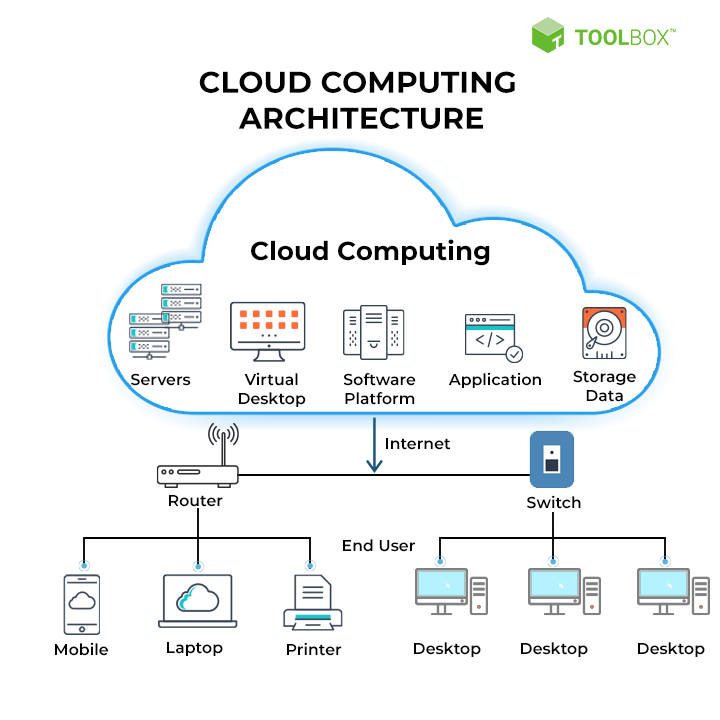
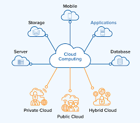
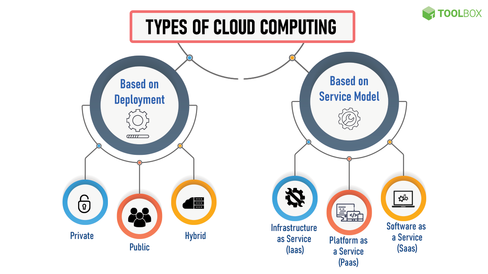
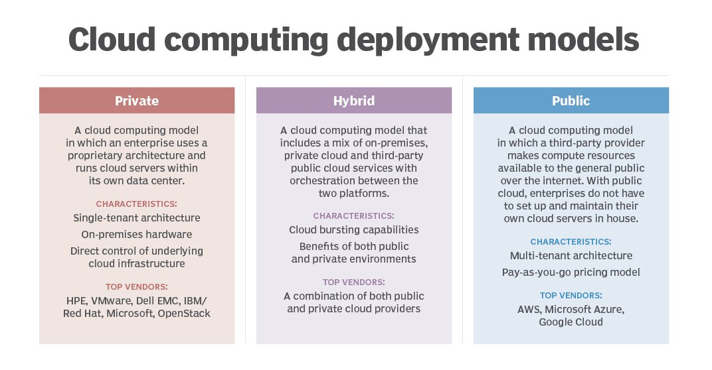
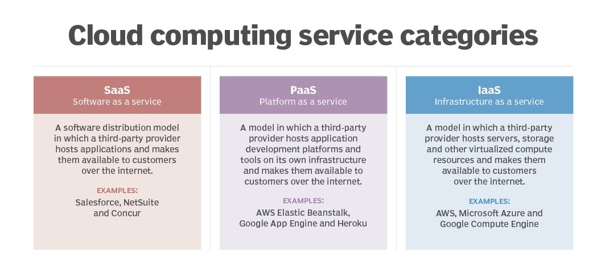
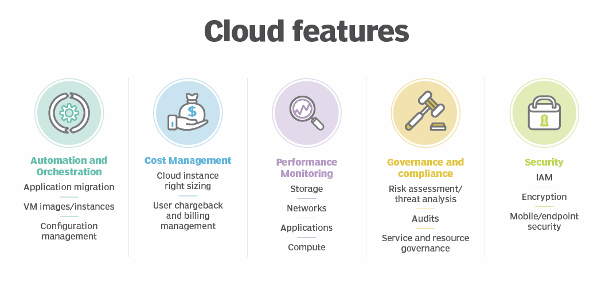

# Cloud Computing

---

# 정의

- 클라우드 컴퓨팅은 인터넷을 통해 데이터 스토리지, 서버, 데이터베이스, 네트워킹 및 소프트웨어와 같은 호스팅 서비스를 사용하는 것으로 정의된다.
- Cloud Computing은 인터넷을 통해 Cloud 서비스로 관리되는 원격 데이터 센터에서 호스팅 되는 Computing Resource(애플리케이션, 서버, 데이터 스토리지, 개발 도구, Networking 기능 등)에 대한 주문형 액세스다. 공급자는 이러한 Resource를 월간 구독료로 제공하거나 사용량에 따라 요금을 청구한다.
- 클라우드 컴퓨팅이 시작된 이후 전 세계적으로 IT 분야에서 클라우드 기반 애플리케이션과 서비스가 폭발적으로 증가하고 있으며 계속해서 확장되고 있다.
- 우리가 사용하는 거의 모든 크고 작은 애플리케이션이 클라우드에 상주하여 저장 공간, 비용, 시간을 절약하는 데 도움이 된다.
- Cloud Computing은 클라이언트 장치가 원격 물리적 서버, 데이터베이스 및 컴퓨터에서 인터넷을 통해 데이터 및 Cloud 애플리케이션에 액세스할 수 있도록 하는 방식으로 작동한다.
- 클라우드 컴퓨팅은 인터넷을 통해 데이터 스토리지, 서버, 데이터베이스, 네트워킹 및 소프트웨어와 같은 호스팅 서비스를 사용하는 것을 의미한다.
    - 데이터는 클라우드 서비스 제공업체가 관리하는 물리적 서버에 저장된다.
    - 컴퓨터 시스템 리소스, 특히 데이터 저장 및 컴퓨팅 성능은 클라우드 컴퓨팅에서 사용자가 직접 관리하지 않고도 주문형으로 사용할 수 있다.
- 사용자는 저장 장치나 하드 드라이브에 파일을 저장하는 대신 클라우드에 파일을 저장하여 웹에 액세스할 수 있는 한 어디서든 파일에 액세스할 수 있다.
- 클라우드는 배포 모델에 따라 퍼블릭, 프라이빗, 하이브리드 클라우드로 분류될 수도 있다.
- 클라우드는 프런트엔드와 백엔드라는 두 가지 계층으로 나눌 수 있다.
    - 사용자가 상호 작용하는 계층을 프런트엔드 계층이라고 한다.
        - 이 계층을 통해 사용자는 클라우드 컴퓨팅 소프트웨어를 통해 클라우드에 저장된 데이터에 액세스할 수 있다.
    - 소프트웨어와 하드웨어, 즉 컴퓨터, 서버, 중앙 서버, 데이터베이스로 구성된 계층이 백엔드 계층이다.
        - 이 계층은 클라우드의 기본 구성 요소이며 정보를 안전하게 저장하는 일을 전적으로 담당한다.
        - 클라우드 컴퓨팅으로 연결된 장치 간의 원활한 연결을 보장하기 위해 중앙 서버는 미들웨어 라는 소프트웨어를 사용한다. Opens a new window 데이터베이스와 애플리케이션 사이의 브리지 역할을 한다.

# 작동 방식

- Cloud Computing은 가상화 및 자동화 기술에 크게 의존한다. 가상화를 사용하면 서비스와 기본 Cloud System을 사용자가 요청하고 활용할 수 있는 논리적 Enitity로 쉽게 추상화하고 provisioning할 수 있다.
    - 자동화 및 그에 따른 Orchestration 기능은 사용자에게 사람의 직접적인 개입 없이 Resource를 Provisioning하고, 서비스를 연결하고, 워크로드를 배포할 수 있는 높은 수준의 셀프 서비스를 제공한다
- 가상화를 사용하면 서비스와 기본 클라우드 시스템을 사용자가 요청하고 활용할 수 있는 논리적 엔터티로 쉽게 추상화하고 프로비저닝할 수 있다.

 

# **유형**

- 클라우드 컴퓨팅은 배포 모델이나 서비스 유형에 따라 분류될 수 있다.
- 특정 배포 모델을 기반으로 클라우드를 퍼블릭, 프라이빗, 하이브리드 클라우드로 분류할 수 있다.
- 동시에 클라우드 모델의 서비스에 따라 IaaS(Infrastructure-as-a-Service), PaaS(Platform-as-a-Service), SaaS(Software-as-a-Service)로 분류할 수 있다.

## 특정 배포 모델 기반

### 프라이빗 클라우드(Private Cloud)

- 컴퓨팅 서비스가 단일 조직의 전용 사용을 위해 프라이빗 IT 네트워크를 통해 제공된다.
- 내부, 기업 또는 기업 클라우드라고도 하는 프라이빗 클라우드는 일반적으로 내부 리소스를 통해 관리되며 조직 외부의 누구도 액세스할 수 없다.
- 추가적인 제어, 보안, 맞춤화와 함께 셀프 서비스, 확장성, 탄력성 등 퍼블릭 클라우드의 모든 이점을 제공한다.
- 회사 방화벽과 내부 호스팅을 통해 더 높은 수준의 보안을 제공하여 조직의 민감한 데이터가 제3자 제공업체에 액세스할 수 없도록 보장한다.
- 그러나 조직이 데이터 센터의 모든 관리 및 유지 관리를 담당하게 되어 리소스 집약적일 수 있다.
- 프라이빗 클라우드를 사용하면 조직은 자체 기본 클라우드 인프라를 구축하고 유지 및 관리한다.
- 이 모델은 클라우드의 다양성과 편리함을 제공하는 동시에 로컬 데이터 센터에 공통적인 관리, 제어 및 보안을 유지한다.
- 내부 사용자에게는 IT 차지백을 통해 서비스 비용이 청구될 수도 있고, 그렇지 않을 수도 있다.
- 일반적인 프라이빗 클라우드 기술 및 공급업체에는 VMware 및 OpenStack이 포함된다.

### 퍼블릭 클라우드(Public Cloud)

- 인터넷을 통해 제3자 제공업체가 제공하는 컴퓨팅 서비스를 의미한다.
- 프라이빗 클라우드와 달리 퍼블릭 클라우드의 서비스는 사용하거나 구매하려는 누구나 사용할 수 있다.
- 이러한 서비스는 무료이거나 주문형으로 판매될 수 있으며, 사용자는 자신이 소비하는 CPU 주기, 스토리지 또는 대역폭에 대해서만 사용량에 따라 비용을 지불하면 된다.
- 클라우드 서비스 제공업체가 시스템 관리를 담당하므로 기업이 온프레미스 인프라 구매, 관리, 유지 비용을 절감하는 데 도움이 된다.
- 또한 확장 가능한 RAM과 유연한 대역폭을 제공하므로 기업이 스토리지 요구 사항을 더 쉽게 확장할 수 있다.
- 주요 공개 CSP로는 AWS, Microsoft [Azure](https://www.techtarget.com/searchcloudcomputing/definition/Windows-Azure) , IBM, Google Cloud Platform( [GCP](https://www.techtarget.com/searchcloudcomputing/definition/Google-Cloud-Platform) )은 물론 IBM, Oracle, Tencent 등이 있다.

### 하이브리드 클라우드(Hybrid Cloud)

- 조직에서는 점점 더 멀티 클라우드 모델을 채택하거나 여러 IaaS 공급자를 사용하고 있다.
- 이를 통해 애플리케이션은 서로 다른 클라우드 제공자 간에 마이그레이션하거나 둘 이상의 클라우드 제공자 간에 동시에 작동할 수도 있다.
- 조직은 클라우드 서비스 중단의 위험을 최소화하거나, 특정 공급자의 보다 경쟁력 있는 가격을 활용하는 등 다양한 이유를 위해 멀티 클라우드를 채택한다.
- 여러 조직에서 공유하는 커뮤니티 클라우드는 동일한 관심사를 공유하는 특정 커뮤니티를 지원한다.
- 퍼블릭 클라우드와 프라이빗 클라우드 기능을 조합하여 사용한다.
    - 퍼블릭 클라우드 서비스와 온프레미스 프라이빗 클라우드를 결합한 것이다.
- 기업은 프라이빗 클라우드에서 미션 크리티컬 워크로드나 민감한 애플리케이션을 실행하고 퍼블릭 클라우드를 사용하여 워크로드 급증이나 수요 급증을 처리할 수 있다.
- 컴퓨팅 및 처리 수요가 변동할 때 하이브리드 클라우드 Opens a new window 기업은 온프레미스 인프라를 퍼블릭 클라우드까지 확장하여 오버플로를 처리하는 동시에 타사 데이터 센터가 데이터에 액세스하지 못하도록 할 수 있다.
- 하이브리드 클라우드 모델에서 기업은 장기간 사용하지 않을 수 있는 리소스를 구매하고 유지 관리하는 대신 일시적으로 사용한 리소스에 대해서만 비용을 지불한다.
- 간단히 말해서, 하이브리드 클라우드는 보안 위험 없이 퍼블릭 클라우드의 이점을 제공한다.
- 둘 사이의 오케스트레이션과 자동화가 가능하다.
- 하이브리드 클라우드의 목표는 퍼블릭 클라우드 인프라가 제공할 수 있는 모든 기능을 활용하는 동시에 미션 크리티컬 데이터에 대한 제어를 유지하는, 자동화되고 확장 가능한 통합 환경을 만드는 것이다.

## 클라우드 모델의 서비스

### **서비스형 인프라(IaaS)**

- IaaS(Infrastructure as a Service)는 서비스 제공업체가 가상 인터페이스를 통해 서버, 스토리지 및 네트워킹을 제공하는 클라우드 컴퓨팅 유형이다.
- 이 서비스에서 사용자는 클라우드 인프라를 관리할 필요가 없지만 스토리지, 운영 체제 및 배포된 애플리케이션을 제어할 수 있다.
- 사용자 대신 타사 공급업체가 하드웨어, 소프트웨어, 서버, 스토리지 및 기타 인프라 구성 요소를 호스팅한다.
- IaaS 제공업체는 가상 서버 인스턴스와 스토리지는 물론 사용자가 워크로드를 가상 머신으로 마이그레이션할 수 있는 API도 제공한다.
- 사용자는 할당된 스토리지 용량을 가지며, 원하는 대로 가상 머신과 스토리지를 시작, 중지, 액세스 및 구성할 수 있다.
- IaaS 공급자는 다양한 워크로드 요구 사항에 맞게 인스턴스를 사용자 지정할 수 있을 뿐만 아니라 소형, 중형, 대형, 초대형, 메모리 또는 컴퓨팅 최적화 인스턴스를 제공한다.
- IaaS 클라우드 모델은 비즈니스 사용자를 위한 원격 데이터 센터에 가깝다.
- AWS(Amazon Web Services)가 이에 속한다.

### **서비스형 플랫폼(PaaS)**

- PaaS(Platform as a Service)는 사용자가 인프라 구축이나 유지 관리의 복잡성 없이 애플리케이션을 개발하고 실행할 수 있도록 클라우드에서 개발 및 배포 환경을 제공하는 클라우드 컴퓨팅 유형이다.
- PaaS 모델에서 클라우드 공급자는 인프라에서 개발 도구를 호스팅한다.
- 사용자에게 클라우드 기반 애플리케이션을 개발할 수 있는 리소스를 제공한다.
- 이러한 유형의 서비스에서 사용자는 종량제 방식으로 공급업체로부터 리소스를 구매하고 보안 연결을 통해 해당 리소스에 액세스할 수 있다.
- 사용자는 API, 웹 포털 또는 게이트웨이 소프트웨어를 사용하여 인터넷을 통해 이러한 도구에 액세스한다.
- PaaS에서는 사용자가 기본 인프라(예: 네트워크, 서버, 운영 체제 또는 스토리지)를 관리할 필요가 없지만 배포된 애플리케이션을 제어할 수 있다.
- 이를 통해 조직은 소프트웨어 유지 관리, 계획 및 리소스 조달에 대한 책임에서 벗어나 애플리케이션 배포 및 관리에 집중할 수 있다.
- Lightning Platform, AWS Elastic Beanstalk, Google App Engine이 포함된다.

### **서비스형 소프트웨어(SaaS)**

- 인터넷을 통해 소프트웨어 애플리케이션을 제공하는 배포 모델이다.
    - 흔히 웹서비스라고 한다.
- SaaS(Software-as-a-Service) 또는 서비스형 소프트웨어를 사용하면 사용자는 구독 기반으로 클라우드에 있는 공급업체의 소프트웨어에 액세스할 수 있다.
- 이러한 유형의 클라우드 컴퓨팅에서는 사용자가 로컬 장치에 애플리케이션을 설치하거나 다운로드할 필요가 없다.
- 대신 애플리케이션은 웹이나 API를 통해 직접 액세스할 수 있는 원격 클라우드 네트워크에 위치한다.
- 사용자는 인터넷 접속이 가능한 컴퓨터나 모바일 장치를 사용하여 어느 위치에서나 SaaS 애플리케이션 및 서비스에 액세스할 수 있다.
- SaaS 모델에서는 서비스 공급자가 모든 하드웨어, 미들웨어, 애플리케이션 소프트웨어 및 보안을 관리한다.
- '호스팅 소프트웨어' 또는 '주문형 소프트웨어'라고도 하는 SaaS를 사용하면 기업이 유지 관리 및 지원을 쉽게 간소화할 수 있다.
- 일반적인 예 중 하나는 생산성 및 이메일 서비스를 위한 Microsoft 365이다.

# 특징

- **셀프 서비스 provisioning**
    - 최종 사용자는 필요에 따라 거의 모든 유형의 워크로드에 대해 컴퓨팅 Resource를 가동할 수 있다.
    - 최종 사용자는 서버 시간, 네트워크 스토리지 등의 컴퓨팅 기능을 provisioning할 수 있으므로 IT 관리자가 컴퓨팅 Resource를 provisioning하고 관리해야 하는 기존의 필요성이 사라진다.
- **탄력성**
    - 기업은 컴퓨팅 요구 사항이 증가하면 자유롭게 확장하고 수요가 감소하면 다시 규모를 축소할 수 있다.
    - 이를 통해 활성 상태로 유지될 수도 있고 그렇지 않을 수도 있는 현지 인프라에 대한 막대한 투자가 필요하지 않다.
- **사용량에 따른 지불**
    - 컴퓨팅 Resource는 세분화된 수준에서 측정되므로 사용자는 자신이 사용하는 Resource와 워크로드에 대해서만 비용을 지불할 수 있다.
- **워크로드 탄력성**
    - CSP는 복원력 있는 스토리지를 보장하고 사용자의 중요한 워크로드가 여러 글로벌 지역에서 계속 실행되도록 중복 Resource를 구현하는 경우가 많다.
- **마이그레이션 유연성**
    - 조직은 더 나은 비용 절감을 위해 또는 새로운 서비스가 등장할 때 사용하기 위해 원하는 대로 특정 워크로드를 Cloud 또는 다른 Cloud 플랫폼으로 또는 자동으로 이동할 수 있다.
- **광범위한 네트워크 액세스**
    - 사용자는 모든 장치를 사용하여 인터넷 연결을 통해 어디서나 Cloud 데이터에 액세스하거나 Cloud에 데이터를 업로드할 수 있다.
- **Multi-tenancy및 Resource Fooling**
    - Multi-tenancy를 통해 수많은 고객이 동일한 물리적 인프라 또는 동일한 애플리케이션을 공유하면서도 자신의 데이터에 대한 개인 정보 보호 및 보안을 유지할 수 있다.
    - Resource 풀링을 통해 클라우드 공급자는 동일한 물리적 Resource로 수많은 고객에게 서비스를 제공한다.
    - Cloud  공급자의 Resource 풀은 여러 고객의 요구 사항을 충족할 수 있을 만큼 충분히 크고 유연해야 한다.
    

# 장점

- **비용 절감**
    - IT 시스템을 유지하려면 막대한 자본 지출이 필요하며, 클라우드를 사용하면 이를 줄이는 데 도움이 된다.
    - 클라우드 제공업체가 제공하는 리소스를 사용하면 기업은 값비싼 인프라를 구매할 필요가 없어 비용을 대폭 절감할 수 있다.
    - 클라우드 제공업체는 사용한 만큼만 지불하는 모델을 사용한다. 즉, 기업은 사용한 서비스에 대해서만 비용을 지불하여 비용을 더욱 절감할 수 있다.
- **확장성**
    - 클라우드를 사용하면 조직은 매우 짧은 시간에 사용자를 몇 명에서 수천 명으로 늘릴 수 있다.
    - 필요에 따라 기업은 스토리지 요구 사항을 확장하거나 축소하여 조직의 유연성을 높일 수 있다.
- **유연성 및 협업**
    - 클라우드의 데이터는 인터넷을 통해 직접 액세스할 수 있으므로 직원은 언제 어디서나 작업할 수 있다.
    - 클라우드를 사용하면 어디에서나 가상 사무실을 자유롭게 설정할 수 있다.
    - 또한 팀이 타사 공급업체와 동일한 파일에 액세스할 수 있도록 하여 여러 위치에서 프로젝트 작업을 수행할 수 있다.
- **비즈니스 연속성**
    - 클라우드는 가동 중단이나 위기 발생 시 데이터를 안전하게 저장하고 보호한다.
    - 이렇게 하면 시스템이 다시 가동되면 작업을 재개하기가 더 쉬워진다.
- **경쟁 우위**
    - 클라우드는 IT 인프라 유지 관리, 소프트웨어 라이선싱, 데이터 관리를 위한 인력 교육 등 다양한 비즈니스 측면을 관리한다.
    - 따라서 투자하는 시간과 자원이 최소화되므로 경쟁사보다 우위를 점할 수 있다.
- **원가 관리**
    - 조직이 장비를 구매하고 유지 및 관리하는 데 막대한 비용을 지출할 필요가 없으므로 자본 비용을 줄일 수 있다.
    - 기업 측에서는 클라우드 제공업체 팀의 전문 지식에 의존할 수 있으므로 대규모 IT 팀이 필요하지 않다.
    - 클라우드 컴퓨팅에서는 다운타임이 거의 발생하지 않으므로 기업은 다운타임과 관련된 문제를 해결하기 위해 시간과 비용을 소비할 필요가 없다.
    - Cloud 컴퓨팅은 가동 중지 시간과 관련된 비용도 절감한다.
- **데이터 및 워크로드 이동성**
    - 클라우드에 정보를 저장한다는 것은 사용자가 인터넷 연결만 하면 어디서나 어떤 기기로든 정보에 액세스할 수 있다는 것을 의미한다.
    - 최종 사용자는 클라우드에서 리소스를 쉽게 처리, 저장, 검색, 복구가 가능하다.
    - 즉, 사용자는 데이터에 액세스하기 위해 USB 드라이브, 외장 하드 드라이브 또는 여러 CD를 가지고 다닐 필요가 없다.
    - 사용자는 스마트폰 및 기타 모바일 장치를 통해 기업 데이터에 액세스할 수 있으므로 원격 직원이 동료 및 고객과 최신 정보를 얻을 수 있다.
    - 또한 Cloud 공급 업체는 모든 업그레이드와 업데이트를 자동으로 제공하여 시간과 노력을 절약한다.
- **비즈니스 연속성 및 재해 복구**
    - 클라우드에 데이터를 저장하면 사용자는 노트북이나 스마트폰과 같은 장치가 작동하지 않는 경우에도 항상 데이터에 액세스할 수 있다.
    - 조직은 자연재해나 정전 등 긴급 상황이 발생하는 경우 신속하게 데이터를 복구할 수 있다.
    - 이는 BCDR에 도움이 되며 비즈니스에 피해나 중단이 발생하더라도 워크로드와 데이터의 가용성을 보장하는 데 도움이 된다.
    

# 단점

- 클라우드 컴퓨팅의 가장 큰 과제는 기술과 관련된 보안 문제이다.
- 클라우드 서비스 제공업체는 최고의 보안 표준과 업계 인증 구현을 보장하지만 클라우드에 데이터를 저장하는 동안에는 항상 위험이 따른다.

- **가동 중지 시간**
    - **거의 모든 클라우드 사용자는 가동 중단이** 클라우드 컴퓨팅 문제 목록의 1위를 차지한다고 말한다.
    - 때때로 클라우드 서비스 제공업체는 매일 서비스를 제공하는 수많은 클라이언트로 인해 부담을 느낄 수 있다.
    - 이로 인해 기술적 중단이 발생할 수 있으며 이로 인해 애플리케이션이 일시적으로 가동 중지될 수 있다.
- **인터넷 연결 의존성**
    - 사용자는 인터넷 연결이 양호하고 호환 장치가 없으면 클라우드의 데이터에 액세스하지 못할 수 있다.
    - 또한 공용 Wi-Fi를 사용하여 파일에 액세스하는 경우 올바른 보안 조치를 취하지 않으면 위협이 될 수 있다.
- **재정적 약속**
    - 클라우드 제공업체는 종량제 가격 모델을 사용한다.
    - 그러나 기업은 대부분의 구독 계획에 대해 월별 또는 연간 재정적 약정을 제공해야 한다. 이는 운영 비용에 반영되어야 한다.
- **보안 위험**
    - 클라우드 서비스 공급자가 가장 신뢰할 수 있는 보안 인증을 보유하고 있다고 약속하더라도 항상 데이터가 손실될 가능성이 있다.
    - 해커들이 민감한 비즈니스 데이터에 접근하기 위해 클라우드 스토리지를 점점 더 표적으로 삼으면서 이는 더욱 큰 문제가 될 수 있으며 이에 대한 적절한 조치를 취해야 한다.
    - 클라우드에 의존 시 데이터 유출, API 및 인터페이스 해킹, 자격 증명 손상 및 인증 문제의 위험을 감수해야 한다.
    - 클라우드 제공자에게 맡겨진 민감한 정보를 처리하는 방법과 장소에 대한 투명성이 부족하다.
    - 보안을 위해서는 Cloud 구성과 비즈니스 정책 및 관행에 세심한 주의가 필요하다.
- **제한된 액세스**
    - 클라우드 서비스 공급자가 인프라를 소유하고 관리하므로 사용자는 최소한의 제어 권한을 가질 수 있다.
    - 사용자는 백엔드 인프라가 아닌 애플리케이션만 관리할 수 있다.
    - 펌웨어 관리와 같은 중요한 작업이 사용자에게 전혀 전달되지 않을 수 있다.
    - 보안을 보장하고 데이터를 관리하려면 항상 제3자 공급업체를 신뢰해야 한다.
- **비용 예측 불가능성**
    - 변동하는 워크로드 수요를 수용하기 위한 리소스 확장과 함께 클라우드 사용을 위한 종량제 구독 계획으로 인해 최종 비용을 정의하고 예측하기 어려울 수 있다.
    - 하나의 클라우드 서비스가 하나 이상의 다른 Cloud 서비스를 활용하는 경우가 많다.
    - 이 모든 비용은 월별 청구서에 표시된다. 이로 인해 계획되지 않은 추가 Cloud 비용이 발생할 수 있다.
- **역량과 전문성 부족**
    - 클라우드 지원 기술이 빠르게 발전함에 따라 조직은 클라우드에서 워크로드와 데이터를 설계, 배포, 관리하는 데 필요한 적절한 기술들과 지식을 갖춘 도구, 직원에 대한 수요 증가를 따라잡아야 한다.
- **IT 거버넌스**
    - DIY 기능을 강조하면 인프라 운영의 프로비저닝, 프로비저닝 해제 및 관리를 제어할 수 없기 때문에 IT 거버넌스가 어려워질 수 있다.
    - 이로 인해 위험과 보안, IT 규정 준수, 데이터 품질을 적절하게 관리하는 것이 어려워질 수 있다.
- **업계법 준수**
    - On-Premiss Local Storage에서 Cloud Storage 로 데이터를 전송할 때 제3자를 통해 업계 규정 준수를 관리하기 어려울 수 있다.
    - 규정 준수와 적절한 비즈니스 거버넌스를 유지하려면 데이터와 워크로드가 실제로 호스팅되는 위치를 아는 것이 중요하다.
- **다중 클라우드 관리**
    - 모든 클라우드는 서로 다르기 때문에 다중 클라우드 배포에서는 보다 일반적인 클라우드 컴퓨팅 문제를 해결하기 위한 노력이 필요하다.
- **클라우드 성능**
    - 대기 시간과 같은 성능은 예측하기 어렵다. 조직이 또 다른 계획을 준비하지 않은 경우 네트워크 및 공급자 중단은 생산성을 저해하고 비즈니스 프로세스를 방해할 수 있다.
- **프라이빗 클라우드 구축**
    - 프라이빗 클라우드를 설계, 구축, 관리하는 것은 IT 부서와 직원에게 어려운 작업이 될 수 있다.
- **클라우드 마이그레이션**
    - 애플리케이션과 데이터를 클라우드로 이동하는 것은 복잡하다.
    - 예상보다 오래 걸리고 예산을 초과하는 경우가 많다.
    - 워크로드 및 데이터 이동 문제(클라우드에서 다시 로컬 데이터 센터로 이동)는 예상치 못한 비용이나 성능 문제가 발생할 때까지 간과되는 경우가 많다.
- **공급업체 잠금**
    - 클라우드 제공업체 간 전환으로 인해 심각한 문제가 발생하는 경우가 많다.
    - 기술적 비호환성, 법적 및 규제적 제한, 대규모 데이터 마이그레이션으로 인해 발생하는 상당한 비용이 포함된다.