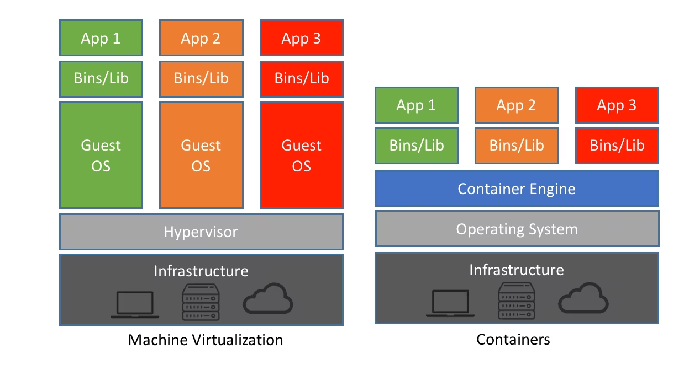
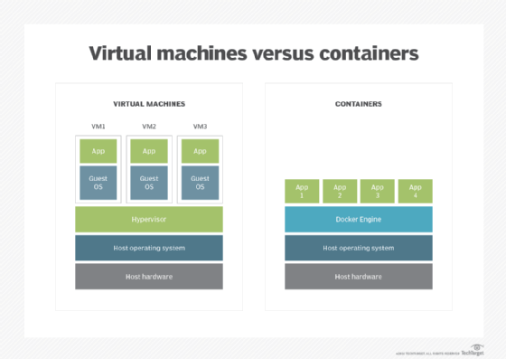

# Container

---

# 정의

- 컨테이너는 운영 체제 가상화의 한 형태이다.
- 컨테이너는 배포용 애플리케이션을 가상으로 패키지하고 격리할 수 있는 소프트웨어 유형이다.
- 서비스를 라이브러리처럼  다운받아 실행하는 것이다.
- 컨테이너는 표준화된 방식으로 애플리케이션 코드와 해당 종속성을 패키징하는 실행 가능한 경량 소프트웨어 단위이다. 이 패키징을 사용하면 애플리케이션이 이동 가능하고 여러 위치에서 실행될 수 있다.
- 애플리케이션의 코드와 종속성을 함께 패키징하여 애플리케이션이 모든 컴퓨팅 환경에서 안정적으로 실행되도록 한다.
- 컨테이너는 가상 머신 없이 OS 커널에 대한 액세스를 공유한다. 소규모 마이크로서비스, 대규모 애플리케이션 또는 경량 컨테이너 OS를 실행하는 데 사용될 수 있다.
- 컨테이너는 가상 머신과 달리 모든 인스턴스에 게스트 OS를 포함할 필요가 없고, 대신 호스트 OS의 기능과 리소스를 간단히 활용할 수 있기 때문에 작고 빠르며 이식성이 뛰어난다.
- 컨테이너 기술은 시스템 컨테이너화와 애플리케이션 컨테이너화로 나뉜다. 두 스타일 모두 기본 인프라에서 애플리케이션 코드를 추상화하여 버전 관리를 단순화하고 다양한 배포 환경에서 이식을 가능하게 한다.
    - 애플리케이션 컨테이너
        - Docker가 대표적으로, OS에서 실행될 애플리케이션의 파일, 종속성 및 라이브러리를 캡슐화한다.
        - 사용자는 여러 독립 애플리케이션 또는 단일 애플리케이션을 구성하는 여러 서비스에 대해 별도의 컨테이너를 만들고 실행할 수 있다.
    - 시스템 컨테이너
        - LXC가 대표적으로, 기술적으로 애플리케이션 컨테이너 및 VM과 유사하다.
        - OS가 VM에서 캡슐화되어 실행되는 방식과 마찬가지로 OS를 실행할 수 있다.
        - 단, 시스템 컨테이너는 시스템의 하드웨어를 에뮬레이트하지는 않으며, 대신 애플리케이션 컨테이너와 유사하게 작동한다.
        - 사용자는 다양한 라이브러리, 언어 및 시스템 데이터베이스를 설치할 수 있다.

# 주요 특징 및 개념

- 가상화(Virtualization)
    - 컨테이너는 OS 수준의 가상화를 사용하여 애플리케이션을 격리된 환경에서 실행한다.
    - 이는 호스트 시스템에 설치된 OS의 커널을 공유하면서도 각각의 컨테이너가 자체 파일 시스템과 프로세스 공간을 보유할 수 있도록 한다.
- 이식성(Portability)
    - 컨테이너는 의존성과 환경 설정을 포함하여 애플리케이션을 패키지화한다.
    - 이로써 애플리케이션은 어디에서든 실행될 수 있으며, 개발 환경에서 프로덕션 환경으로 쉽게 전이할 수 있다.
- 경량(Lightweight)
    - 컨테이너는 가상 머신보다 경량이며 빠르게 시작되고 중지된다.
    - 이는 가상 머신과 달리 각 컨테이너가 고유한 OS를 실행하지 않기 때문이다.
- 이미지(Image)
    - 컨테이너는 이미지로 패키지된다. 이미지는 실행 가능한 애플리케이션을 만들기 위해 필요한 모든 것을 포함하고 있다
    - Docker 이미지의 경우, 컨테이너 실행을 위한 파일 시스템, 코드, 라이브러리 및 종속성 등이 포함된다.
- 격리(Isolation)
    - 각 컨테이너는 다른 컨테이너와 격리되어 하나의 컨테이너에서 발생한 문제가 다른 컨테이너에 영향을 미치지 않는다
    - 이는 응용 프로그램 간의 충돌을 방지하고 보안을 강화한다

# 작동 방식(Docker 기준)

- 이미지 빌드
    - 도커 파일 작성
        - 개발자는 컨테이너를 어떻게 빌드할지 정의하는 도커 파일을 작성한다.
        - 도커 파일은 베이스 이미지, 애플리케이션 코드, 의존성, 환경 설정 등을 정의한다.
    - 도커 이미지 빌드
        - 도커 파일을 사용하여 도커 이미지를 빌드한다.
        - 이미지는 여러 계층(layer)으로 구성되며, 각 계층은 도커 파일의 각 단계에 해당한다.
- 이미지 실행
    - 도커 이미지 실행
        - 빌드된 도커 이미지를 사용하여 컨테이너를 실행한다.
        - 이때 컨테이너는 호스트 시스템의 운영 체제 커널을 공유하지만, 자체적인 파일 시스템과 프로세스 공간을 갖는다.
    - 컨테이너 격리
        - 각 컨테이너는 격리된 환경에서 실행된다.
        - 이는 호스트 및 다른 컨테이너에 영향을 미치지 않고 독립적으로 실행되도록 하는 중요한 특성이다.
- 리눅스 네임스페이스(Linux Namespaces)
    - PID 네임스페이스
        - 각 컨테이너는 자체 프로세스 ID 공간을 가진다.
        - 이로써 컨테이너는 다른 컨테이너나 호스트 시스템의 프로세스에 영향을 받지 않는다.
    - 망 네임스페이스
        - 각 컨테이너는 자체 네트워크 인터페이스, IP 주소, 라우팅 테이블을 가진다.
        - 따라서 각 컨테이너는 독립적인 네트워크 환경을 갖는다.
    - 마운트 네임스페이스
    - 각 컨테이너는 자체 파일 시스템을 가지며, 호스트 시스템과 다른 컨테이너에 대한 액세스를 격리한다.
- Cgroups(Control Groups)
    - 리소스 제한
        - 각 컨테이너는 CPU, 메모리, 디스크 I/O 등의 리소스에 대한 제한을 설정할 수 있다.
    - 우선 순위 지정
        - 리소스가 부족한 경우 각 컨테이너에 대한 우선 순위를 지정하여 리소스 할당을 관리한다.
- 도커 데몬
    - 도커 데몬은 컨테이너의 생성, 실행, 관리를 담당하는 백그라운드 프로세스다.
    - 도커 CLI(Command Line Interface)나 API를 통해 도커 데몬에 명령을 전달하여 컨테이너를 조작한다.
- 이미지 공유
    - 도커 이미지는 도커 레지스트리(Docker Registry)를 통해 저장 및 공유된다.
    - 개발자는 빌드한 이미지를 도커 허브와 같은 레지스트리에 업로드하거나, 다른 개발자들과 이미지를 공유할 수 있다.

## 작동 방식

- 컨테이너에는 원하는 소프트웨어를 실행하는 데 필요한 구성 요소가 들어 있다.
- 이러한 구성 요소에는 파일, 환경 변수, 종속성 및 라이브러리가 포함된다.
- 호스트 OS는 CPU, 스토리지, 메모리 등의 물리적 리소스에 대한 컨테이너의 액세스를 제한하므로 단일 컨테이너가 호스트의 물리적 리소스를 모두 사용할 수는 없다.
- 컨테이너 이미지 파일은 기술마다 다른 애플리케이션 또는 서비스의 완전하고 정적이며, 실행 가능한 버전이다.
    - 예를 들어, Docker 이미지는 여러 레이어로 구성된다.
    - 첫 번째 레이어인 기본 이미지에는 컨테이너에서 코드를 실행하는 데 필요한 모든 종속성이 포함되어 있다.
    - 각 이미지에는 변경되지 않는 정적 레이어 위에 읽기/쓰기 가능한 레이어가 있다.
- 각 컨테이너에는 특정 컨테이너를 사용자 정의하는 고유한 특정 컨테이너 레이어가 있으므로 기본 이미지 레이어를 정장하고 여러 컨테이너에서 재사용할 수 있다.
- 이미지의 여러 인스턴스가 컨테이너에서 동시에 실행될 수 있으며, 애플리케이션 작동을 중단하지 않고 새 인스턴스가 실패한 인스턴스를 대체할 수 있다.
- OCI 이미지는 매니페스트, 파일 시스템 레이어 및 구성으로 구성된다.
- OCI 이미지에는 런타임과 이미지 사양이라는 두 가지 작동 사양이 있다.
- 런타임 사양은 성능 및 런타임에 필요한 모든 게이터가 포함된 파일인 파일 시스템 번들의 기능을 간략하게 설명한다.
- 이미지 사양에는 OCI 컨테이너에서 애플리케이션이나 서비스를 시작하는 데 필요한 정보가 포함되어 있다.
- 컨테이너 엔진은 이미지를 실행하며, 많은 조직에서는 Kubernetes와 같은 컨테이너 스케줄러 및 오케스트레이션 기술을 사용하여 배포를 관리한다.
- 컨테이너는 각 이미지에 코드를 실행하는 데 필요한 종속성이 포함되어 있어, 이식성이 높다.
    - 예를 들어, 컨테이너 사용자는 테스트중에 AWS 클라우드 인스턴스에서 동일한 이미지를 실행한 다음, 컨테이너의 애플리케이션 코드를 변경하지 않고도 프로덕션용 온프레미스 Dell 서버에서 실행할 수 있다.
    

# VM과의 비교

- 둘 다 휴대용 단일 패키지 컴퓨팅 단위이다.
- 컨테이너는 기본 하드웨어를 가상화하는 대신 운영 체제(일반적으로 Linux)를 가상화하므로 각 개별 컨테이너에는 애플리케이션과 해당 라이브러리 및 종속성만 포함된다*.* 게스트 OS가 없기 때문에 컨테이너가 매우 가볍고 빠르고 이식성이 뛰어난다.
- 몇 가지 기본적인 유사점을 공유하지만, 컨테이너와 가상화는 가상화된 아키텍처가 하드웨어 시스템을 에뮬레이트한다는 점에서 다르다.
- 소프트웨어 계층은 가상화에서 풀링된 CPU, 메모리, 스토리지 및 네트워크 리소스의 하드웨어를 에뮬레이트하는 데 사용되며, 이는 여러 VM 인스턴스에서 여러 번 공유할 수 있다.
- 가상 머신은 각 가상 머신 내부에 관련 바이너리, 라이브러리 및 애플리케이션 파일과 함께 자체 게스트 운영 체제가 포함되어야 하는 하이퍼바이저 환경에서 실행된다.
    - 이는 많은 양의 시스템 리소스와 오버헤드를 소비하며, 특히 각각 고유한 게스트 OS가 있는 동일한 물리적 서버에서 여러 VM이 실행되는 경우 더욱 그렇다.
    - 가상화는 하드웨어 기능을 시뮬레이션하여 호스트 시스템에서 추상화된 가상 시스템을 생성한다.
        - 예를 들어, 이 프로세스를 사용하여 단일 서버에서 여러 OS, 둘 이상의 가상 시스템 및 다양한 어플리케이션을 운영할 수 있다.
- 각 VM이 게스트 OS를 실행하기에 VM에는 메모리, 디스크, 네트워크 입/출력과 같은 상당한 리소스 오버헤드가 필요할 수 있다. 이는 VM이 컨테이너보다 클 수 있고, 생성하는 데 시간이 더 오래 걸릴 수 있음을 의미한다.
- VM이 물리적 서버에서 운영 체제를 추상화하는 것을 목표로 하고, 컨테이너는 애플리케이션 코드가 실행될 환경을 생성하는 것을 목표로 한다.
- 컨테이너는 OS 커널을 공유하므로 하나의 OS 인스턴스가 여러 개의 격리된 컨테이너를 실행할 수 있다. 컨테이너를 지원하는 OS는 VM용 OS보다 더 작고 기능도 더 적을 수 있다
- 기본 하드웨어를 가상화하는 것과 달리 컨테이너는 OS를 가상화하므로 각 개별 컨테이너는 애플리케이션, 해당 라이브러리 및 종속성만 보유한다. 컨테이너는 게스트 OS를 사용할 필요가 없으므로 VM보다 가볍다.
- 대조적으로, 각 컨테이너는 동일한 호스트 OS 또는 시스템 커널을 공유하며 크기가 훨씬 가벼워서 메가바이트에 불과한 경우가 많다.
    - 이는 컨테이너를 시작하는 데 단 몇 초만 소요될 수 있음을 의미한다.(일반적인 VM에 필요한 기가바이트 및 분과 비교)
    - 온프레미스든 클라우드든  기존 가상화에서는 하이퍼바이저를  활용하여 물리적 하드웨어를 가상화한다.
    - 그런 다음 각 VM에는 게스트 OS와 OS가 실행하는 데 필요한 하드웨어의 가상 복사본, 그리고 애플리케이션과 관련 라이브러리 및 종속성이 포함된다.
- VM 하이퍼바이저가 하드웨어를 가상화하여 여러 개의 격리된 운영 체제를 호스팅하는 방식과 유사하게 컨테이너 엔진은 운영 체제를 가상화하여 여러 개의 격리된 애플리케이션을 호스팅한다.
    - 컨테이너는 애플리케이션을 실행하고 필요한 최소량의 데이터와 실행 파일만 패키징하도록 의도적으로 구축되었기 때문에 VM에 비해 크기가 자연스럽게 작다.
- 컨테이너는 가상 머신처럼 업데이트나 패치가 필요하지 않기 때문에 불변성 개념을 도입했다. 업데이트하려면 기존 컨테이너를 폐기하고 새 컨테이너로 교체해야 한다.

<aside>
💡 **하이퍼바이저**
가상 머신 모니터라고도 하는 하이퍼바이저는 **가상 머신(VM)을 생성하고 실행하는 프로세스**이다. 
하이퍼바이저는 메모리 및 처리와 같은 단일 호스트 컴퓨터의 리소스를 가상으로 공유하여 호스트 컴퓨터가 여러 게스트 가상 머신을 지원할 수 있도록 한다.

</aside>

# 이점

- VM과 비교할 때 컨테이너의 주요 장점은 가볍고 이식성이 뛰어난 추상화 수준을 제공한다는 것이다.
- **경량**
    - 컨테이너는 머신 OS 커널을 공유하므로 애플리케이션당 전체 OS 인스턴스가 필요하지 않으며 컨테이너 파일을 리소스에 맞게 작고 쉽게 만들 수 있다.
    - 특히 VM에 비해 크기가 작다는 것은 컨테이너가 빠르게 회전할 수 있고 수평으로 확장되는 클라우드 네이티브 애플리케이션을 더 잘 지원할 수 있음을 의미한다.
- **이식 가능하고 플랫폼 독립적**
    - 컨테이너는 모든 종속성을 가지고 있다. 즉, 소프트웨어를 한 번 작성하면 노트북, 클라우드 및 온프레미스 컴퓨팅 환경에서 재구성할 필요 없이 실행할 수 있다.
    - 컨테이너에서 실행되는 애플리케이션은 다양한 운영 체제 및 하드웨어 플랫폼에 쉽게 배포될 수 있다.
    - 컨테이너는 다른 애플리케이션 호스팅 기술보다 이식성이 뛰어나다.
    - 코드 변경 없이 호스트 OS 유형을 공유하는 모든 시스템 간 이동 가능하다.
    - 컨테이너에 애플리케이션 운영 코드가 캡슐화된다는 것은 관리할 게스트 OS 환경 변수나 라이브러리 종속성이 없다는 것을 의미한다.
- **최신 개발 및 아키텍처 지원**
    - 플랫폼 간 배포 이식성/일관성 및 작은 크기의 조합으로 인해 컨테이너는 일반 코드 배포를 사용하여 구축된 DevOps ,  서버리스  및  마이크로서비스 와 같은 최신 개발 및 애플리케이션 패턴에 이상적이다.
- **활용도 향상**
    - 이전 VM과 마찬가지로 컨테이너를 사용하면 개발자와 운영자가 물리적 시스템의 CPU 및 메모리 활용률을 향상할 수 있다.
    - 컨테이너가 더 나아가는 곳은 마이크로서비스 아키텍처도 지원하기 때문에 애플리케이션 구성 요소를 보다 세부적으로 배포하고 확장할 수 있다.
    - 이는 단일 구성 요소가 로드로 인해 어려움을 겪고 있기 때문에 전체 모놀리식 애플리케이션을 확장해야 하는 것에 대한 매력적인 대안이다.
- **오버헤드 감소**
    
    컨테이너는 운영 체제 이미지를 포함하지 않기 때문에 기존 또는 하드웨어 가상 머신 환경보다 시스템 리소스가 덜 필요하다.
    
- **보다 일관된 운영**
    - DevOps 팀은 컨테이너의 애플리케이션이 배포 위치에 관계없이 동일하게 실행된다는 것을 알고 있다.
- **메모리 및 CPU, 스토리지 향상**
    - 컨테이너에는 별도의 OS 인스턴스와 같이 VM에 필요한 오버헤드가 없기 때문에 동일한 인프라에서 더 많은 컨테이너를 지원할 수 있다.
- **일관성**
    - 어플리케이션 수명주기 전반에 걸쳐 일관성을 유지한다.
    - 이는 agile한 환경을 조성하고, CI/CD와 같은 새로운 접근 방식을 촉진한다.
    - 또한 VM보다 빨리 회전하며 이것은 분산 애플리케이션에 중요하다.
    

# 단점

- **격리 부족**
    - 컨테이너화의 잠재적인 단점은 호스트 OS와의 격리가 부족하다는 것이다.
    - 컨테이너는 호스트 OS를 공유하기 때문에 하이퍼바이저 기반 가상화에 비해 보안 위협이  높다.
- **OS 유연성 부족**
    - 일반적인 배포에서 각 컨테이너는 기본 OS와 동일한 OS를 사용해야 하는 반면 하이퍼바이저 인스턴스는 더 많은 유연성을 갖는다.
        - 예를 들어 Linux 기반 호스트에서 생성된 컨테이너는 Windows Server OS 인스턴스 또는 Windows Server에서 실행되도록 설계된 애플리케이션을 실행할 수 없다.
- **가시성 모니터링의 어려움**
    - 서버에서 최대 수백 개 이상의 컨테이너가 실행되면 각 컨테이너에서 무슨 일이 일어나고 있는지 확인하기 어렵다.
    

# 어플리케이션 컨테이너와 시스템 컨테이너

- Docker와 같은 애플리케이션 컨테이너는 OS에서 실행될 애플리케이션의 파일, 종속성 및 라이브러리를 캡슐화한다. 애플리케이션 컨테이너를 사용하면 사용자는 여러 독립 애플리케이션 또는 단일 애플리케이션을 구성하는 여러 서비스에 대해 별도의 컨테이너를 만들고 실행할 수 있다.
- LXC와 같은 시스템 컨테이너는 기술적으로 애플리케이션 컨테이너 및 VM과 유사하다. 시스템 컨테이너는 OS가 VM에서 캡슐화되어 실행되는 방식과 마찬가지로 OS를 실행할 수 있다. 그러나 시스템 컨테이너는 시스템의 하드웨어를 에뮬레이트하지 않는다. 대신 애플리케이션 컨테이너와 유사하게 작동하며 사용자는 다양한 라이브러리, 언어 및 시스템 데이터베이스를 설치할 수 있다.
    
    

# 컨테이너 사용 사례

- 컨테이너는 특히 클라우드 환경에서 점점 더 중요해지고 있다.
- 많은 조직에서는 애플리케이션과 워크로드를 위한 범용 컴퓨팅 플랫폼으로 VM을 대체하는 컨테이너를 고려하고 있다.
- **마이크로서비스**
    - 컨테이너는 작고 가볍기 때문에 애플리케이션이 느슨하게 결합되고 독립적으로 배포 가능한 소규모 서비스로 구성되는 마이크로서비스 아키텍처에 적합하다.
- **DevOps**
    - 아키텍처로서의 마이크로서비스와 플랫폼으로서의 컨테이너의 결합은 DevOps를 소프트웨어 구축, 출시 및 실행 방식으로 채택하는 많은 팀의 공통 기반이다.
- **하이브리드, 멀티클라우드**
    - 컨테이너는 노트북, 온프레미스, 클라우드 환경 등 어디에서나 일관되게 실행될 수 있으므로  조직이 여러 퍼블릭 클라우드를 혼합하여 운영하는 하이브리드 클라우드 및 멀티 클라우드 시나리오에 이상적인 기본 아키텍처이다.
- **애플리케이션 현대화 및 마이그레이션**
    - 애플리케이션 현대화에 대한 가장 일반적인 접근 방식 중 하나는 클라우드 마이그레이션을  준비하기 위해 애플리케이션을 컨테이너화하는 것이다.
    

# 용도

- 컨테이너는 마이크로서비스 및 클라우드와 결합되는 경우가 많지만 모놀리식 애플리케이션 및 온프레미스 데이터 센터에도 이점을 제공한다.
- 컨테이너는 마이크로서비스와 함께 작동하는 데 적합하다.
- 애플리케이션은 구성하는 각 서비스는 독립적으로 확장 가능한 컨테이너에 패키지되어 있다.
    - 예를 들어, 마이크로서비스 애플리케이션은 경고를 생성하고, 데이터를 기록하고, 사용자 식별을 처리하고, 기타 다양한 서비스를 제공하는 컨테이너화된 서비스로 구성될 수 있다.
- 각 서비스는 동일한 OS에서 작동하며 개별적으로 격리된다.
- 각 서비스는 수요에 맞춰 확장 및 축소할 수 있다.
- 클라우드 인프라는 탄력적이고 무제한 확장이 가능하도록 설계되었다.
- 기존의 모놀리식 애플리케이션 아키텍처는 프로그램의 모든 코드가 단일 실행 파일에 작성되도록 설계되었다.
- 모놀리식 애플리케이션은 분산 애플리케이션처럼 쉽게 확장할 수는 없지만 컨테이너화할 수 있다.
    - 예를 들어, Docker Modernize Traditional Application 프로그램은 사용자가 더 나은 확장을 위한 조정이나 전체 재구축 및 재설계를 통해 모놀리식 애플리케이션을 Docker 컨테이너로 있는 그대로 전환하는 데 도움이 된다.
- 컨테이너는 다양한 환경에서 애플리케이션을 실행하는 데에도 사용된다.
- 애플리케이션의 모든 코드와 종속성이 컨테이너에 포함되어 있으므로 개발자는 새로운 환경에서 작동하도록 재설계할 필요 없이 애플리케이션을 lift & shift 할 수 있다.