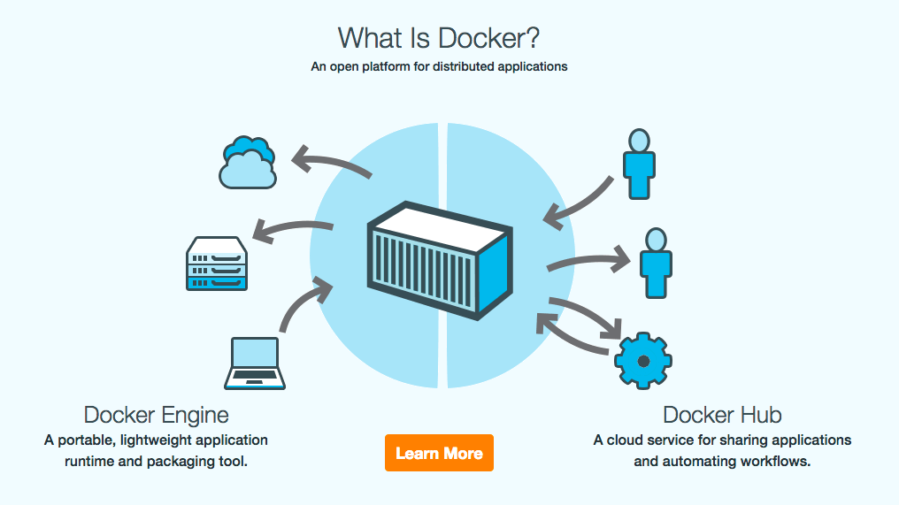
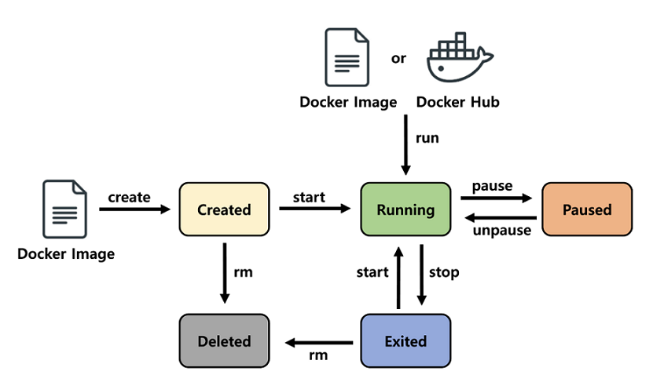
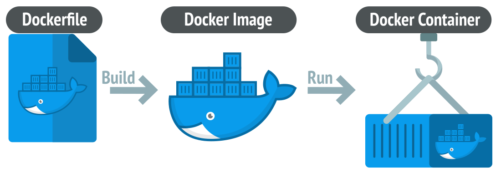
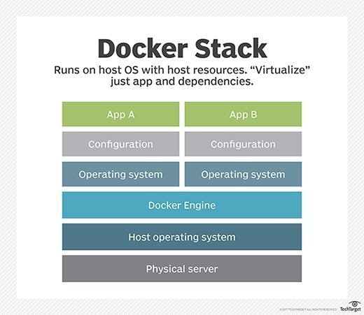
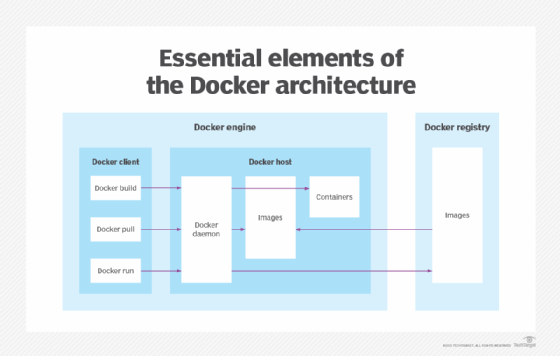
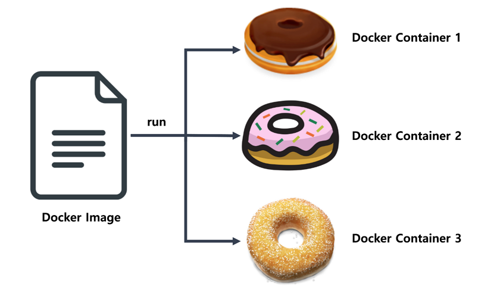
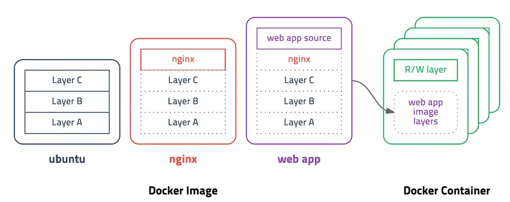

# Docker

---

# 정의

- Docker는 관련 도구 생태계를 통해 공통 운영 체제(OS)에서 가상화된 애플리케이션 컨테이너를 생성, 배포 및 관리하는 데 사용되는 오픈 소스 소프트웨어 플랫폼이다.
    - 서버에서 이야기하는 컨테이너도 이와 비슷한데 다양한 프로그램, 실행환경을 컨테이너로 추상화하고 동일한 인터페이스를 제공하여 프로그램의 배포 및 관리를 단순하게 해준다.
    - 각 컨테이너에는 소프트웨어 구성 요소를 구축하고 원활하게 구축, 테스트, 배포하는 데 필요한 모든 요소가 포함되어 있다.
    - 백엔드 프로그램, 데이터베이스 서버, 메시지 큐등 어떤 프로그램도 컨테이너로 추상화할 수 있고 조립PC, AWS, Azure, Google cloud등 어디에서든 실행할 수 있다.
- Docker는 애플리케이션을 신속하게 구축, 테스트 및 배포할 수 있는 소프트웨어 플랫폼이다.
    - OS 수준 가상화를 사용하는 PaaS 제품 세트다.
    - 소프트웨어를 컨테이너라는 표준화된 유닛으로 패키징하며, 컨테이너에는 라이브러리, 시스템 도구, 코드, 런타임 등 소프트웨어를 실행하는 데 필요한 모든 것이 포함되어 있다.
    - Docker를 사용할 경우 환경에 구애받지 않고 애플리케이션을 신속하게 배포 및 확장할 수 있으며, 코드가 문제 없이 실행될 것임을 확신할 수 있다.
- IT 소프트웨어 "Docker"는 Linux® 컨테이너를 생성하고 사용할 수 있는 컨테이너화 기술이다.
- 오픈 소스 Docker 커뮤니티는 모든 사용자에게 혜택을 제공하기 위해 이러한 기술을 개선하기 위해 노력하고 있다.
- Docker Inc.라는 회사는 Docker 커뮤니티의 작업을 기반으로 더욱 안전하게 만들고 이러한 발전을 더 큰 커뮤니티와 공유한다. 그런 다음 기업 고객을 위해 개선되고 강화된 기술을 지원한다.
- Docker를 사용하면 컨테이너를 매우 가벼운 모듈식 가상 머신처럼 처리할 수 있다.
- 또한 이러한 컨테이너를 통해 유연성을 얻을 수 있다.
    - Docker는 패키징된 컨테이너를 다른 서버나 환경으로 이동할 때 이식성을 제공한다.
- 컨테이너를 생성, 배포, 복사하고 환경 간에 이동할 수 있으므로 클라우드에 맞게 앱을 최적화하는 데 도움이 된다.

# 작동 방식

- Docker는 컨테이너를 패키지화하고, 프로비저닝하고 실행한다.
- 컨테이너 기술은 운영 체제를 통해 사용할 수 있다.
- 모든 라이브러리, 구성 파일, 종속성 및 기타 필요한 부분과 매개 변수를 사용하여 애플리케이션 서비스 또는 기능을 패키징한다.
- 각 컨테이너는 하나의 기본 OS 서비스를 공유하며 Docker 이미지에는 컨테이너 내에서 코드를 실행하는 데 필요한 모든 종속성이 포함되어 있으므로 동일한 OS를 사용하는 Docker 환경 간에 이동하는 컨테이너는 변경 없이 작동한다.
- Docker는 OS 커널의 리소스 격리를 사용하여 동일한 OS에서 여러 컨테이너를 실행한다.
    - 이는 물리적 하드웨어 리소스의 추상화된 계층 위에 실행 가능한 코드로 전체 OS를 캡슐화하는 가상 머신과는 다르다.
    

# 인기 요인

- 컨테이너 기술은 애플리케이션 격리, 비용 효율적인 확장성, 일회용성을 포함하여 VM의 모든 기능과 이점을 더했다.
- Docker는 오늘날 매우 인기가 많아 “Docker”와 “컨테이너”를 같은 의미로 사용한다.
- Docker를 사용하면 개발자는 간단한 명령을 사용하여 이러한 기본 컨테이너화 기능에 액세스하고 작업을 줄여주는 API를 통해 이를 자동화할 수 있다.
- **가벼운 무게**
    - VM과 달리 컨테이너는 전체 OS 인스턴스와 하이퍼바이저의 페이로드를 전달하지 않는다.
    - 여기에는 코드를 실행하는 데 필요한 OS 프로세스와 종속성만 포함된다.
    - 컨테이너 크기는 메가바이트 단위로 측정되며, 하드웨어 용량을 더 잘 활용하고 시작 시간이 더 빠르다.
- **개발자 생산성 향상**
    - 컨테이너화된 애플리케이션은 한 번 작성하면 어디서나 실행할 수 있다.
    - VM에 비해 컨테이너는 배포, 프로비저닝, 재시작이 더 빠르고 쉽다.
- **리소스 효율성 향상**
    - 컨테이너를 사용하면 개발자는 VM을 사용할 때보다 동일한 하드웨어에서 몇 배 더 많은 애플리케이션 복사본을 실행할 수 있다.
        - 이렇게 하면 클라우드 지출을 줄일 수 있다.
- **원활한 컨테이너 이식성** : 모든 데스크탑, 데이터 센터 및 클라우드 환경에서 수정 없이 실행된다.
- **가볍고 세분화된 업데이트** : 여러 프로세스를 단일 컨테이너 내에 결합할 수 있다. 이를 통해 업데이트나 복구를 위해 해당 부분 중 하나가 중단되는 동안 계속 실행될 수 있는 애플리케이션을 구축할 수 있다.
- **자동화된 컨테이너 생성** : 애플리케이션 소스를 기반으로 컨테이너를 자동으로 구축할 수 있다.
- **컨테이너 버전 관리** : 컨테이너 이미지 버전을 추적하고, 이전 버전으로 롤백하고, 버전을 만든 사람과 방법을 추적할 수 있다. 기존 버전과 새 버전 간의 델타만 업로드할 수도 있다.
- **컨테이너 재사용** : 기존 컨테이너를 기본 이미지로 사용할 수 있다. 기본적으로 새 컨테이너를 구축하기 위한 템플릿과 같다.
- **공유 컨테이너 라이브러리** : 개발자는 수천 개의 사용자 기여 컨테이너가 포함된 오픈 소스 레지스트리에 액세스할 수 있다.

# **Linux 컨테이너와의 차이점**

- 때때로 혼동되기는 하지만 Docker는 기존 Linux 컨테이너와 동일하지 않다.
- Docker 기술은 처음에는 대부분의 사람들이 "전통적인" Linux 컨테이너와 연관시키는 LXC 기술을 기반으로 구축되었지만 이후 해당 종속성에서 벗어났다.
    - LXC는 경량 가상화로 유용했지만 훌륭한 개발자나 사용자 경험이 없었다.
- Docker 기술은 컨테이너 실행 기능 이상의 기능을 제공한다.
    - 특히 컨테이너 생성 및 구축, 이미지 전달, 이미지 버전 관리 등의 프로세스를 쉽게 만들어준다.
- 기존 Linux 컨테이너는 여러 프로세스를 관리할 수 있는 init 시스템을 사용한다.
    - 이는 전체 애플리케이션이 하나로 실행될 수 있음을 의미한다.
- Docker 기술은 애플리케이션이 별도의 프로세스로 분할되도록 장려하고 이를 수행하는 도구를 제공한다. 이러한 세분화된 접근 방식에는 장점이 있다.

# Virtual Machine과의 차이점

- 우리에게 익숙한 VMware나 VirtualBox같은 가상머신은 하이퍼바이저를 이용해 호스트 OS위에 여러개의 게스트 OS 전체를 가상화하여 사용하는 방식이다.
- 이 방식은 여러가지 OS를 가상화(리눅스에서 윈도우 실행) 할 수 있고 비교적 사용법이 간단하지만 무겁고 느려서 운영환경에선 사용할 수 없었다.
- 이러한 상황을 개선하기 위해 CPU의 가상화 기술(HVM)을 이용한 KVMKernel-based Virtual Machine과 반가상화 Paravirtualization방식의 Xen이 등장한다.
- 이러한 방식은 게스트 OS가 필요하긴 하지만 전체OS를 가상화하는 방식이 아니였기 때문에 호스트형 가상화 방식에 비해 성능이 향상되었다.
    - 이러한 기술들은 OpenStack이나 AWS, Rackspace같은 클라우드 서비스에서 가상 컴퓨팅 기술의 기반이 되었다.

- 전가상화든 반가상화든 추가적인 OS를 설치하여 가상화하는 방법은 어쨌든 성능문제가 있었고 이를 개선하기 위해 **프로세스를 격리** 하는 방식이 등장한다.
- 리눅스에서는 이 방식을 **리눅스 컨테이너**라고 하고 단순히 프로세스를 격리시키기 때문에 가볍고 빠르게 동작한다.
    - CPU나 메모리는 딱 프로세스가 필요한 만큼만 추가로 사용하고 성능적으로도 거의 손실이 없다.
- 하나의 서버에 여러개의 컨테이너를 실행하면 서로 영향을 미치지 않고 독립적으로 실행되어 마치 가벼운 Virtual Machine을 사용하는 느낌을 준다.
- 실행중인 컨테이너에 접속하여 명령어를 입력할 수 있고 `apt-get`이나 `yum`으로 패키지를 설치할 수 있으며 사용자도 추가하고 여러개의 프로세스를 백그라운드로 실행할 수도 있다.
- CPU나 메모리 사용량을 제한할 수 있고 호스트의 특정 포트와 연결하거나 호스트의 특정 디렉토리를 내부 디렉토리인 것처럼 사용할 수도 있다.
- 새로운 컨터이너를 만드는데 걸리는 시간은 겨우 1-2초로 가상머신과 비교도 할 수 없이 빠르다.

# 장점

- **모듈성**
    - 컨테이너화에 대한 Docker 접근 방식은 전체 앱을 중단할 필요 없이 업데이트 또는 복구를 위해 애플리케이션의 일부를 중단하는 기능에 중점을 둔다.
    - 이러한 마이크로서비스 기반 접근 방식 외에도 SOA( 서비스 지향 아키텍처 )와 거의 동일한 방식으로 여러 앱 간에 프로세스를 공유할 수 있다.
- **레이어 및 이미지 버전 제어**
    - 각 Docker 이미지 파일은 단일 이미지로 결합된 일련의 레이어로 구성된다. 이미지가 변경되면 레이어가 생성된다.
    - *사용자가 run* 또는 *copy와* 같은 명령을 지정할 때마다 새 레이어가 생성된다.
    - Docker는 이러한 레이어를 재사용하여 새로운 컨테이너를 구축하므로 구축 프로세스가 가속화된다.
    - 중간 변경 사항은 이미지 간에 공유되므로 속도, 크기 및 효율성이 더욱 향상된다.
    - 또한 계층화에는 버전 제어 기능이 내재되어 있다. 새로운 변경 사항이 있을 때마다 본질적으로 내장된 변경 로그가 있어 컨테이너 이미지를 완벽하게 제어할 수 있다.
- **롤백**
    - 아마도 레이어링의 가장 좋은 부분은 롤백 기능일 것이다. 모든 이미지에는 레이어가 있다.
    - 현재 이미지 반복이 마음에 들지 않으면 이전 버전으로 롤백할 수 있다.
    - 이는 민첩한 개발 접근 방식을 지원하고 도구 관점에서 지속적인 통합 및 배포(CI/CD)를 현실화하는 데 도움이 된다.
- **신속한 배포**
    - 새로운 하드웨어를 가동하고, 실행하고, 프로비저닝하고 사용 가능하게 만드는 데 며칠이 걸렸으며 노력과 오버헤드도 부담스러웠다.
    - Docker 기반 컨테이너는 배포를 몇 초로 단축할 수 있다.
        - 각 프로세스에 대한 컨테이너를 생성하면 해당 프로세스를 새로운 앱과 빠르게 공유할 수 있다.
        - 또한 컨테이너를 추가하거나 이동하기 위해 운영 체제를 부팅할 필요가 없으므로 배포 시간이 상당히 단축된다.
        - 더 짧은 배포 시간과 함께 컨테이너에서 생성된 데이터를 걱정 없이 쉽고 비용 효율적으로 생성하고 삭제할 수 있다.
    - 따라서 Docker 기술은 효율성에 더 큰 가치를 부여하는 보다 세분화되고 제어 가능한 마이크로서비스 기반 접근 방식이다.
- 높은 수준의 이식성으로 다양한 호스트를 통해 컨테이너를 등록하고 공유할 수 있다.
- 자원 사용을 줄인다.
- VM에 비해 배포가 더 빠르다.

# 제한점

- Docker는 그 자체로 단일 컨테이너를 관리할 수 있다.
    - 점점 더 많은 컨테이너와 컨테이너화된 앱을 수백 개의 조각으로 나누어 사용하기 시작하면 관리와 오케스트레이션이 어려워질 수 있다.
    - 결국에는 한발 물러서서 컨테이너를 그룹화하여 모든 컨테이너에 걸쳐 네트워킹, 보안, 원격 측정 등의 서비스를 제공해야 한다. 이것이 바로 Kubernetes가 등장하는 곳이다.
- Docker를 사용하면 기존 Linux 컨테이너에서 제공하는 것과 동일한 UNIX 유사 기능을 사용할 수 없다.
    - 여기에는 앱과 함께 컨테이너 내에서 cron 또는 syslog와 같은 프로세스를 사용할 수 있는 기능이 포함된다.
    - 하위 프로세스를 종료한 후 손자 프로세스를 정리하는 것과 같은 작업에도 제한이 있다. 이는 기존 Linux 컨테이너가 본질적으로 처리하는 작업이다.
    - 이러한 문제는 구성 파일을 수정하고 처음부터 이러한 기능을 설정하면 완화될 수 있지만 언뜻 보기에는 명확하지 않을 수 있다.
- 네임 스페이스가 지정되지 않은 다른 Linux 하위 시스템과 장치도 있다. 여기에는 SELinux , Cgroup 및 /dev/sd* 장치가 포함된다.
    - 이는 공격자가 이러한 하위 시스템에 대한 제어권을 얻으면 호스트가 손상된다는 의미이다.
    - 경량을 유지하기 위해 호스트 커널을 컨테이너와 공유하면 보안 취약점이 발생할 가능성이 높아진다.
    - 이는 호스트 시스템과 훨씬 더 엄격하게 분리된 가상 머신과 다르다.
- Docker 데몬도 보안 문제가 될 수 있다.
- Docker 컨테이너를 사용하고 실행하려면 컨테이너의 영구 런타임인 Docker 데몬을 사용하게 될 가능성이 높다.
- Docker 데몬에는 루트 권한이 필요하므로 이 프로세스에 액세스할 수 있는 사람과 프로세스가 있는 위치에 대해 특별한 주의를 기울여야 한다.
    - 예를 들어, 로컬 데몬은 웹 서버와 같이 더 공개적인 위치에 있는 데몬보다 공격 표면이 더 작다.
- 기업에서 가능한 컨테이너 수는 효율적 관리가 어려울 수 있다
- 컨테이너 사용은 세분화된 가상 호스팅에서 애플리케이션 구성 요소 및 리소스의 오케스트레이션으로 진화하고 있다.
    - 결과적으로 수백 개의 임시 컨테이너가 포함될 수 있는 구성 요소화된 애플리케이션의 배포 및 상호 연결이 주요 장애물이 되고 있다.
- 보안 이슈
    - Docker 컨테이너는 논리적 격리가 수행되지만, 여전히 호스트의 OS를 공유한다.
    - 기본 OS의 공격이나 결함은 해당 OS 위에서 실행되는 모든 컨테이너를 잠재적으로 손상시킬 수 있다.
    - 취약점에는 액세스 및 구너한 부여, 컨테이너 이미지, 컨테이너 간 네트워크 트래픽이 포함될 수 있다
    - Docker 이미지는 기본적으로 호스트에 대한 루트 액세스를 유지할 수 있지만 이는 종종 타사 공급업체의 패키지에서 전달된다.
    

# 관련 용어 및 구성요소

### Docker 파일

- 모든 Docker 컨테이너는 Docker 컨테이너 이미지를 빌드하는 방법에 대한 지침이 포함된 간단한 텍스트 파일로 시작된다.
- DockerFile은 Docker 이미지 생성 프로세스를 자동화한다.
- 이는 기본적으로 Docker 엔진이 이미지를 어셈블하기 위해 실행할 명령줄 인터페이스(CLI) 명령 목록이다.
- Docker 명령 목록은 방대하지만 표준화되어 있다.
- Docker 작업은 콘텐츠, 인프라 또는 기타 환경 변수에 관계없이 동일하게 작동한다.

### Docker Image

- 이미지는 **컨테이너 실행에 필요한 파일과 설정값등을 포함하고 있는 것**으로 상태값을 가지지 않고 변하지 않는다(Immutable).
    - 컨테이너 실행에 필요한 파일과 설정값 등을 포함하고 있는 도커파일을 만든 후 **Dockerfile을 빌드**하여 이미지를 만든다.
- 컨테이너는 이미지를 실행한 상태라고 볼 수 있고 추가되거나 변하는 값은 컨테이너에 저장된다.
    - 같은 이미지에서 여러개의 컨테이너를 생성할 수 있고 컨테이너의 상태가 바뀌거나 컨테이너가 삭제되더라도 이미지는 변하지 않고 그대로 남아있다.
- Docker 이미지에는 실행 가능한 애플리케이션 소스 코드는 물론 애플리케이션 코드가 컨테이너로 실행되는 데 필요한 모든 도구, 라이브러리 및 종속성이 포함되어 있다.
    - 컨테이너를 실행하기 위한 모든 정보를 가지고 있기 때문에 더 이상 의존성 파일을 컴파일하고 이것저것 설치할 필요가 없다.
- Docker 이미지를 실행하면 컨테이너의 하나의 인스턴스가 된다.
- Docker 이미지를 처음부터 빌드하는 것이 가능하지만 대부분의 개발자는 공통 리포지토리에서 해당 이미지를 가져온다.
- 단일 기본 이미지에서 여러 Docker 이미지를 생성할 수 있으며 스택의 공통성을 공유한다
- Docker 이미지는 레이어로 구성되며 각 레이어는 이미지 버전에 해당한다.
- 개발자가 이미지를 변경할 때마다 새로운 최상위 레이어가 생성되고 이 최상위 레이어는 이미지의 현재 버전으로 이전 최상위 레이어를 대체한다
- 이전 레이어는 롤백을 위해 저장되거나 다른 프로젝트에서 재사용된다.
- Docker 이미지에서 컨테이너가 생성될 때마다 컨테이너 계층이라는 또 다른 새 계층이 생성된다.
- 파일 추가 또는 삭제 등 컨테이너에 대한 변경 사항은 컨테이너 레이어에만 저장되며 컨테이너가 실행되는 동안에만 존재한다
- 이제 새로운 서버가 추가되면 미리 만들어 놓은 이미지를 다운받고, 컨테이너를 생성만 하면 된다. 한 서버에 여러개의 컨테이너를 실행할 수 있고, 수십, 수백, 수천대의 서버도 문제없다.
- 이 반복적인 이미지 생성 프로세스는 여러 라이브 컨테이너 인스턴스가 단일 기본 이미지에서 실행될 수 있고 그렇게 할 때 공통 스택을 활용하므로 전반적인 효율성을 높일 수 있다.
- 도커 이미지는 [Docker hub](https://hub.docker.com/)에 등록하거나 [Docker Registry](https://docs.docker.com/registry/) 저장소를 직접 만들어 관리할 수 있다.

### Docker Container

- 도커 **이미지를 실행한 상태이**다.
- 이미지로 컨테이너를 생성하면 이미지의 목적에 맞는 파일이 들어있는 파일 시스템과 격리된 시스템 자원 및 네트워크를 사용할 수 있는 독립된 공간이 생성된다. 이것을 도커 컨테이너라고 한다.
- 도커 컨테이너는 읽기 전용인 이미지에 변경된 사항을 저장하는 컨테이너 계층(Layer)에 저장한다.

- 도커 이미지를 도넛 레시피에 비유한다면, 도커 컨테이너는 해당 레시피를 이용해 만든 도넛으로 비유할 수 있다. 하나의 도넛 레시피에서 여러 가지 맛의 도넛을 만들 수 있는 것과 같이, **하나의 도커 이미지로 여러 개의 도커 컨테이너**를 만들 수 있다.
- 또한, 기존의 도넛 레시피를 수정하게 되어도, 이미 기존 레시피로 만들어진 도넛에는 영향이 없듯이, 이처럼 **도커 이미지를 변경**해도 **이미 실행 중인 도커 컨테이너에는 영향을 주지 않는다.**
- Docker 컨테이너는 Docker 이미지의 실시간 실행 인스턴스다.
- Docker 이미지는 읽기 전용 파일인 반면, 컨테이너는 수명이 길고 일시적이며 실행 가능한 콘텐츠다.
- 사용자는 이들과 상호 작용할 수 있으며 관리자는 Dokcer 명령을 사용하여 설정과 조건을 조정할 수 있다.

### Docker Hub

- Docker Hub는 Docker 이미지의 공개 저장소이다.
- 상용 소프트웨어 공급업체, 오픈 소스 프로젝트, 개인 개발자로부터 소스를 얻은 100,000개 이상의 컨테이너 이미지를 보유하고 있다.
- Docker, Inc. 에서 생성한 이미지, Docker Trusted Registry에 속한 인증 이미지 및 기타 수천 개의 이미지가 포함된다.
- 모든 Docker Hub 사용자는 마음대로 이미지를 공유할 수 있다. 또한 Docker 파일 시스템에서 사전 정의된 기본 이미지를 다운로드하여 컨테이너화 프로젝트의 시작점으로 사용할 수도 있다.

### Docker Desktop

- Docker Desktop은 Docker 엔진, Docker CLI 클라이언트, Docker Compose, Jubernetes 등을 포함하는 Mac 또는 WInodws 용 애플리케이션이다.
- Docker Hub에 대한 액세스도 포함된다.

### Dokcer Daemon

- Docker Daemon은 클라이언트의 명령을 사용하여 Docker 이미지를 생성하고 관리하는 서비스다.
- 기본적으로 Docker 데몬은 Docker 구현의 제어 센터 역할을 한다.
- Docker 데몬이 실행되는 서버를 Docker 호스트라고 한다.

### Docker Registry

- Docker Registry는 Docker 이미지를 위한 확장 가능한 오픈 소스 스토리지 및 배포 시스템이다.
- Registry를 사용하면 식별용 태그를 사용하여 저장소의 이미지 버전을 추적할 수 있다.
- 이는 버전 제어 도구인 git을 사용하여 수행된다.

### 레이어 저장방식

- 도커 이미지는 컨테이너를 실행하기 위한 모든 정보를 가지고 있기 때문에 보통 용량이 수백메가MB에 이른다.
    - 처음 이미지를 다운받을 땐 크게 부담이 안되지만 기존 이미지에 파일 하나 추가했다고 수백메가를 다시 다운받는다면 매우 비효율적일 수 밖에 없다.
- 도커는 이런 문제를 해결하기 위해 **레이어(layer)**라는 개념을 사용하고 유니온 파일 시스템을 이용하여 여러개의 레이어를 하나의 파일시스템으로 사용할 수 있게 해준다.
    - 이미지는 여러개의 읽기 전용read only 레이어로 구성되고 파일이 추가되거나 수정되면 새로운 레이어가 생성된다.
- 컨테이너를 생성할 때도 레이어 방식을 사용하는데 기존의 이미지 레이어 위에 읽기/쓰기read-write 레이어를 추가한다.
    - 이미지 레이어를 그대로 사용하면서 컨테이너가 실행 중에 생성하는 파일이나 변경된 내용은 읽기/쓰기 레이어에 저장되므로 여러개의 컨테이너를 생성해도 최소한의 용량만 사용한다.
    - 가상화의 특성상 이미지 용량이 크고 여러대의 서버에 배포하는걸 감안하면 단순하지만 엄청나게 영리한 설계이다.
    

# 주요 사용 사례

- 소프트웨어의 지속적인 배포
    - Docker 기술과 DevOps 방식을 사용, 기존의 모놀리식 애플리케이션과 달리 컨테이너화된 애플리케이션을 몇 초 안에 배포할 수 있다.
    - 대규모의 CI/CD 파이프라인의 일부인 컨테이너를 사용하면 애플리케이션 코드에 대한 업데이트 또는 변경 사항이 신속하게 구현되고 배포된다.
- 마이크로서비스 기반 아키텍쳐 구축
    - 마이크로서비스 기반 아키텍처가 기존의 모놀리식 애플리케이션보다 더 유리한 경우 Docker는 이 아키텍처를 구축하는 프로세스에 이상적이다.
    - 개발자는 자체 컨테이너 내에 여러 마이크로서비스를 구축하고 배포한다.
    - 그 뒤 Docker Swarm과 같은 컨테이너 조정 도구를 사용하여 이를 통합하여 전체 소프트웨어 애플리케이션을 조립한다
- 레거시 애플리케이션 마이그레이션
    - 기존 레거시 소프트웨어 애플리케이션을 마이그레이션하고 싶을 때, 개발 팀은 Docker를 사용하여 앱을 컨테이너화 된 인프라로 전환 가능하다
- 하이브라이드 클라우드 및 멀티 클라우드 애플리케이션 활성화
    - Docker 컨테이너는 온프레미스에 배포하거나 클라우드 컴퓨팅 기술을 사용하거나 동일한 방식으로 작동한다.
    - 따라서 Docker를 사용하면 애플리케이션을 다양한 클라우드 공급업체의 프로덕션 및 테스트 환경으로 쉽게 이동할 수 있다.