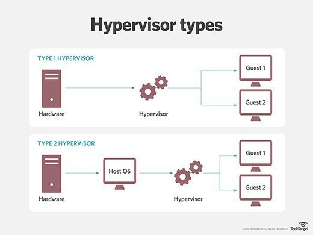
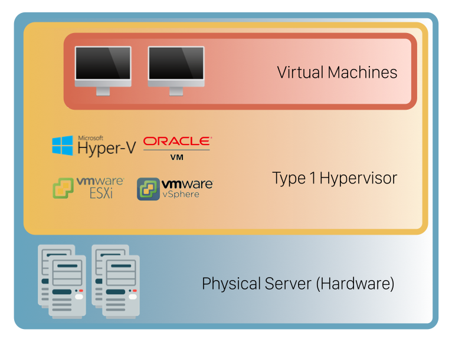
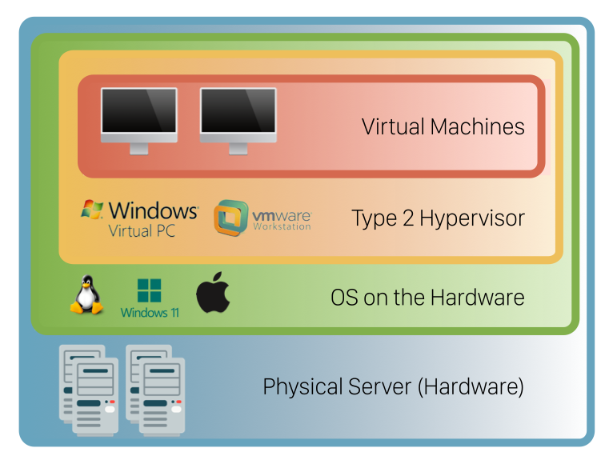

# Hypervisor

---

<aside>
💡 호스트 머신 : Hypervisor를 호스팅하는 머신
게스트 가상 머신 : Hypervisor위에서 실행되는 가상 인스턴스

</aside>

# 1. 정의

- 기본 컴퓨터 하드웨어에서 OS와 애플리케이션을 추상화 하는 기능. 가상 머신(VM)을 생성하고 실행하는 소프트웨어다.
- Hypervisor로 사용되는 물리적 하드웨어를 호스트라고 하며 해당 리소스를 사용하는 많은 VM을 게스트라고 한다.
- 하이퍼바이저는 클라우드 호스팅에서 다양한 하드웨어 부분에 리소스를 분할하고 할당하는 데 사용되는 가상화 소프트웨어의 한 형태이다.
- 파티셔닝, 격리 또는 추상화를 제공하는 프로그램을 가상화 하이퍼바이저라고 한다.
- 하이퍼바이저는 여러 게스트 운영 체제(OS)가 단일 호스트 시스템에서 동시에 실행될 수 있도록 하는 하드웨어 가상화 기술이다.
- 하이퍼바이저는 가상 머신(VM)을 생성하고 실행하는 소프트웨어이다. (툴)
- 가상 머신 관리자(VMM)라고도 불리는 하이퍼바이저는 하이퍼바이저 운영 체제와 리소스를 가상 머신에서 분리하고 해당 VM을 생성하고 관리할 수 있도록 해준다.
- 하이퍼바이저는 CPU, 메모리, 스토리지와 같은 리소스를 기존 게스트 간에 또는 새 가상 머신 간에 쉽게 재할당할 수 있는 풀로 처리한다.
- 모든 하이퍼바이저에는 VM을 실행하기 위해 메모리 관리자, 프로세스 스케줄러, 입출력(I/O) 스택, 장치 드라이버, 보안 관리자, 네트워크 스택 등과 같은 일부 운영 체제 수준 구성 요소가 필요하다.
- 하이퍼바이저는 각 가상 머신에 할당된 리소스를 제공하고 물리적 리소스에 대한 VM 리소스 일정을 관리한다.
- 물리적 하드웨어는 여전히 실행을 수행하므로 CPU는 예를 들어 하이퍼바이저가 일정을 관리하는 동안 VM의 요청에 따라 CPU 명령을 계속 실행한다.
- 여러 개의 서로 다른 운영 체제가 서로 함께 실행될 수 있으며 하이퍼바이저와 동일한 가상화된 하드웨어 리소스를 공유할 수 있다.
    - 이것이 가상화의 주요 이점이다 . 가상화가 없으면 하드웨어에서 하나의 운영 체제만 실행할 수 있다.
- 여러 개의 서로 다른 OS가 서로 함께 실행될 수 있으며 Hypervisor와 동일한 가상화 된 하드웨어 리소스를 공유할 수 있다.
- 서버의 공간을 통합하거나 단일 서버에서 여러 개의 격리된 애플리케이션을 실행하려 할 때 사용한다
- 일반적으로 vCenter Server와 같은 가상화 소프트웨어에서 지원된다.
- 주요 사용 용도는 다음과 같다.
    - 스토리지 Hypervisor의 경우 환경의 모든 스토리지 리소스를 가상화 하여 관리자가 스토리지의 물리적 위치를 고려할 필요 없이 프로비저닝할 수 있는 중앙 집중식 스토리지 풀을 만드는 데 사용된다.
    - 네트워크는 Hypervisor를 통해 가상화 되고 있으며 물리적 네트워크 장치에 대한 직접 접근 없이 소프트웨어를 통해 네트워크와 네트워크 장치를 완전히 생성, 변경, 관리 및 파괴할 수 있다.
- Hypervisor 보안 프로세스에는 개발 및 구현 과정을 포함하여 수명주기 전반에 걸쳐 Hypervisor의 보안을 보장하는 것이 포함된다. 이는 공격자가 Hypervisor, 관리 소프트웨어 또는 가상 환경을 조정하는 소프트웨어에 대한 무단 액세스 권한을 얻는 경우 각 VM에 저장된 모든 데이터에 대한 액세스 권한을 얻을 수 있음을 의미한다.

# 2. 유형

## 2-1. 유형1 **하이퍼바이저(**bare-metal hypervisors**)**

- "네이티브 하이퍼바이저" 또는 "베어메탈 하이퍼바이저"라고도 한다.
- 하이퍼바이저는 호스트 하드웨어에서 직접 실행되어 게스트 운영 체제를 관리한다.
- 기본 서버 운영 체제가 필요하지 않다.
    - 기본 OS나 기타 소프트웨어 없이 물리적 서버와 시스템 하드웨어 위에 직접 배포된다.
        - 호스트 하드웨어에서 직접 실행되어 게스트 OS를 관리한다. 이로 인해 일반적으로 더 뛰어난 성능과 효율성을 제공한다.
        - 호스트 OS를 대신하며 VM 리소스는 Hypervisor에  의해 하드웨어에 직접 예약된다.
- 엔터프라이즈 데이터 서버에서 가장 일반적으로 널리 사용되는 Hypervisor 유형이다
- VM 파티션을 격리하므로 상당한 보안 이점을 제공한다. 서버 팜은 bare-metal Hypervisor에 크게 의존한다.
- 대표적인 예시로는 vSphere및 Hyper-V가 있다.

### 1) 장점

- 물리적 하드웨어 리소스(Cpu, 메모리, 네트워크, 물리적 스토리지 등)에 직접 액세스할 수 있기 때문에 매우 효율적이다.
- 이로 인해 공격자가 어떤 것과도 타협할 수 없도록 제3자 리소스가 없기 때문에 보안이 강화된다.
- VM 이동성
    - 물리적 서버 간에 가상 머신을 수동 또는 자동으로 이동할 수 있다.
    - 이러한 이동은 특정 시점의 VM 리소스 요구 사항을 기반으로 하며 최종 사용자에게 아무런 영향을 주지 않고 발생한다.
    - 하드웨어 오류 발생 시 관리 소프트웨어는 문제가 발생하는 즉시 가상 머신을 작동 중인 서버로 이동한다.
    - 탐지 및 보안 절차는 자동으로 원활하게 수행된다
- 보안
    - 추가 OS 계층 없이 하드웨어에 직접 액세스할 수 있으므로 공격 표면을 줄일 수 있다
- 리소스 초과 할당
    - 현재 보유하고 있는 것보다 더 많은 리소스를 가상 머신에 할당할 수 있다.
- 제한된 기능
    - 상대적으로 단순하며 많은 기능을 제공한다.
    - 해당 기능에는 날짜 및 시간 변경, IP 주소, 비밀번호 등과 같은 기본 작업이 포함된다.
- 복잡한 관리
    - 가상 인스턴스를 생성하려면 다른 머신에 관리 콘솔을 설정해야 한다.
    - 콘솔을 이용하면 서버의 Hypervisor에 접속해 가상 환경을 관리할 수 있다
- 가격
    - 필요한 기능에 따라 관리 콘솔의 라이선스 비용이 크게 달라진다.

### 2) **단점**

- 일반적으로 작업을 수행하고 다른 VM에 지시하고 호스트 하드웨어 리소스를 제어하기 위해 별도의 전용 시스템이 필요하다.

### 3) 유형

- VMware vSphere
    - 많은 대규모 데이터 센터가 사용하는 제품이며, 소규모 IT 환경에서는 가장 비용 효율적인 솔루션이 아닐 가능성이 높다.
    - VMware vSphere가 제공하는 모든 고급 기능이 필요하지 않을 경우 이 Hypervisor의 무료 버전과 여러 상용 버전이 제공된다.
- KVM(커널 기반 가상 머신)
    - Linux 커널을 Hypervisor로 변환할 수 있는 추가 기능으로 Linux에 내장되어 있다.
    - 오픈 소스 솔루션이며 Linux의 모든 기능과 함께 다른 많은 기능이 추가되어 있다.
    - 엔터프라이즈 환경을 위한 최고의 선택 중 하나이며 주요 내용으로는 실시간 마이그레이션, 예약 및 리소스 제어, 더 높은 우선 순위가 포함된다.
- 마이크로소프트 Hypher-V
    - Hypervisor의 무료 버전도 있지만, GUI와 추가 기능을 원한다면 상용 버전 중 하나를 선택해야 한다.
    - VMware vSphere 패키지만큼 많은 기능을 제공하지는 않지만, 실시간 마이그레이션, 가상 머신 복제, 동적 메모리 및 기타 여러 기능은 제공된다.
- 오라클 VM
    - Hypervisor의 핵심에는 오픈 소스 Xen이 있으며 무료로 제공된다.
    - 단, 고급 기능은 유료 버전에서만 사용 가능하다.
    - 안정적인 제품이지만 vSphere, KVM, Hyper-V만큼 강력하지는 않다.
- Citrix Hypervisor
    - 엔터프라이즈 환경에 가장 적합하며 모든 유형의 작업 부하를 처리할 수 있고 가장 까다로운 작업에 대한 기능을 제공한다.

## 2-2. 유형**2 하이퍼바이저(**hosted hypervisors**)**

- 호스트 OS 위에서 소프트웨어 계층 혹은 애플리케이션으로 실행되며 일반적으로 VMware Workstation Player 또는 Parallesls Desktop과 같은 호스트형 Hypervisor라고 한다.
    - 호스트 운영 체제는 기본 호스트 시스템에서 실행된다. 'hosted 하이퍼바이저'라고도 한다.
    - 기본적으로 소프트웨어는 운영 체제에 설치된다.
- 기본 하드웨어에서 직접 실행되지 않고 호스트 시스템(물리적 기계)에서 애플리케이션으로 실행된다.
- 호스트 운영 체제에서 게스트 운영 체제를 추상화하여 작동한다.
    - VM 리소스는 호스트 운영 체제에 대해 예약된 다음 하드웨어에 대해 실행된다.
- 개인용 컴퓨터에서 여러 운영 체제를 실행하려는 개별 사용자에게 더 적합하다.
    - 일반적으로 사용자 친화적이고 데스크탑이나 개발 환경에 적합하다. 그러나 Hypervisor와 하드웨어 사이의 추가 계증으로 인해 약간의 오버헤드가 발생한다.
    - 개인용 컴퓨터와 같은 엔드포인트에서 흔히 발견된다. 즉, 일반적으로 서버 수가 적은 환경에서 사용된다.
- 호스트 OS에서 게스트 OS를 추상화하여 작동한다. VM 리소스는 호스트 OS에 대해 예약된 다음 하드웨어에 대해 실행된다.
- 하이퍼바이저는 운영 체제에 하드웨어 호출을 요청한다.
- 유형 2 하이퍼바이저의 예로는 VMware Player 또는 Parallels Desktop이 있다.
- 호스팅된 하이퍼바이저는 PC와 같은 엔드포인트에서 흔히 발견된다.
- Type-2 하이퍼바이저는 엔지니어와 보안 분석가(맬웨어 또는 악성 소스 코드 및 새로 개발된 애플리케이션을 확인하는 데)에게 매우 유용하다.
- 가상 머신을 설정하고 관리하기 위해 다른 시스템에 관리 콘솔이 필요하지 않아 편리하다. 모든 작업은 Hypervisor가 설치된 서버에서 수행되며 가상 머신은 표준 OS 창에서 실행된다.
- 호스팅된 Hypervisor는 가상 머신의 관리 콘솔 역할도 한다. 내장된 기능을 사용하여 모든 작업을 수행할 수 있다.
- 사용이 간편하고 생산성 관련 이점을 제공하지만 보안성과 성능은 떨어진다.

### 1) **장점**

- 실행 중인 호스트 시스템과 함께 게스트 운영 체제에 빠르고 쉽게 액세스할 수 있다.
- 일반적으로 게스트 컴퓨터에 유용한 추가 기능이 함께 제공된다.
- 호스트 시스템과 게스트 시스템 간의 조정을 향상시킨다.
- 관리 용이성
    - 가상 환경을 생성하고 유지하기 위해 다른 컴퓨터에 별도의 소프트웨어를 설치할 필요가 없다.
    - OS 내의 다른 애플리케이션과 마찬가지로 유형 2 Hypervisor를 설치하고 실행할 수 있다.
- 테스트에 편리함
    - 새로운 소프트웨어 및 연구 프로젝트를 테스트하는데 편리하다.
    - 하나의 물리적 시스템을 사용하여 서로 다른 OS로 여러 인스턴스를 실행하여 각 환경에서 애플리케이션이 작동하는 방식을 테스트하거나 특정 네트워크 환경을 생성할 수 있다.
    - 호스트와 가상 머신을 계속 실행하기에 충분한 물리적 리소스가 있는지 확인하기만 하면 된다.
- 추가 생산성 도구에 대한 액세스 허용
    - 기본 OS와 함께 다른 OS에서 사용 가능한 도구를 사용할 수 있다.
- 덜 유연한 리소스 관리
    - 리소스를 할당하는 것이 유형 1보다 더 어렵다.
    - bare-metal Hypervisor는 특정 VM의 현재 요구 사항에 따라 사용 가능한 리소스를 동적으로 할당할 수 있지만, 유형 2 Hypervisor는 사용자가 가상 머신에 할당한 모든 것을 차지한다.
- 성능
    - 호스트 OS는 물리적 하드웨어에 추가적인 압력을 가해 VM에 지연 시간 문제가 발생할 수 있다.
- 보안
    - OS 위에서 실행되므로 공격자가 가상 머신에 액세스하기 위해 OS의 잠재적인 취약점을 이용할 수 있다.

### 2) **단점**

- 물리적 하드웨어 리소스에 직접 액세스할 수 없으므로 효율성은 유형 1 하이퍼바이저에 비해 성능이 뒤떨어지고 잠재적인 보안 위험도 있다.
- 게스트 운영 체제에도 액세스할 수 있도록 호스트 운영 체제에 액세스한다.

### 3) 유형

- VM Virtual Box
    - 개인용으로 충분한 기능과 소규모 기업을 위한 대부분의 사용 사례를 갖춘, 무료이지만 안정적인 제품이다
    - 리소스를 많이 요구하지 않으며 데스크탑 및 서버 가상화를 위한 좋은 솔루션임이 입증되었다.
    - 가상 머신당 최대 32개의 vCPU, PXE 네트워크 부팅, 스냅샷 트리 등을 갖춘 게스트 다중 처리를 지원한다
- VMware Workstation Pro/VMware Fusion
    - Winodws 및 Linux용 유형 2 Hypervisor. 고급 기능이 많으며 vSphere와 원활하게 통합되어 데스크톱과 클라우드 환경 간에 앱을 이동할 수 있다.
    - 무료 버전이 제공되지 않는다.
- 윈도우 가상 PC
    - Microsoft에서 개발했으며, WIndows 7을 호스트 시스템으로 지원하고 게스트 시스템에서는 Winodws OS만 지원한다.
- Parallels Desktop
    - VMware Fusion의 경쟁자로, 주로 macOS 사용자를 대상으로 한다.
    - 구입한 버전에 따라 다양한 기능을 제공한다.

# 3. 이익

- 여러 게스트 VM을 실행하는 물리적 호스트 시스템의 기능은 기본 하드웨어의 활용도를 크게 향상시킬 수 있다.
    - 물리적(가상화되지 않은) 서버가 하나의 OS와 단일 애플리케이션만 호스팅할 수 있는 경우 하이퍼바이저는 서버를 가상화하여 시스템이 훨씬 더 많은 리소스를 사용하여 동일한 물리적 시스템에서 여러 VM 인스턴스(각각 독립적인 OS 및 애플리케이션을 실행함)를 호스팅 할 수 있도록 한다.
- VM은 이동성이 매우 뛰어나다. 하이퍼바이저에서 발생하는 추상화는 VM을 기본 하드웨어와 독립적으로 만든다.
    - 기존 소프트웨어는 기본 서버 하드웨어와 긴밀하게 결합될 수 있다. 즉, 애플리케이션을 다른 서버로 이동하려면 시간이 많이 걸리고 오류가 발생하기 쉬운 애플리케이션 재설치 및 재구성이 필요하다.
    - 이에 비해 하이퍼바이저는 기본 하드웨어 세부 정보를 VM과 관련이 없도록 만든다. 이를 통해 충분한 컴퓨팅 리소스를 사용할 수 있는 로컬 또는 원격 가상화 서버 간에 VM을 사실상 중단 없이 거의 마음대로 이동하거나 마이그레이션할 수 있다. *이는 종종 실시간 마이그레이션* 이라고 불리는 기능이다.
- VM은 동일한 물리적 시스템에서 실행되더라도 논리적으로 서로 격리되어 있다. 실제로 VM에는 다른 VM에 대한 기본 지식이나 종속성이 없다.
    - 한 VM에 대한 오류, 충돌 또는 맬웨어 공격은 동일한 시스템이나 다른 시스템의 다른 VM으로 확산되지 않는다. 이는 하이퍼바이저 기술을 매우 안전하게 만든다.
- 마지막으로 스냅샷을 사용하면 VM을 이전 상태로 즉시 되돌릴 수 있다.
    - 스냅샷(Microsoft에서 검사점이라고 부름)은 백업을 대체하는 용도로 사용되지 않지만 특히 VM에서 유지 관리를 수행할 때 스냅샷은 보호 메커니즘 역할을 할 수 있다.
    - 관리자가 VM의 OS를 업그레이드하려는 경우 업그레이드를 수행하기 전에 스냅샷을 만들 수 있다. 업그레이드가 실패하면 관리자는 스냅샷을 복원하여 VM을 이전 상태로 즉시 복원할 수 있다.

# 4. **하이퍼바이저 참조 모델**

기본 하드웨어를 에뮬레이션하기 위한 3가지 주요 모듈 좌표가 존재한다.

1. **DISPATCHER**
    - 디스패처는 모니터의 진입점처럼 작동하며 가상 머신 인스턴스의 명령을 다른 두 모듈 중 하나로 다시 라우팅한다.
2. **ALLOCATOR**
    - 할당자는 가상 머신 인스턴스에 제공할 시스템 리소스를 결정하는 역할을 담당한다.
    - 이는 가상 머신이 가상 머신과 연결된 머신 리소스를 변경하는 명령을 실행하려고 할 때마다 디스패처가 할당자를 호출한다는 의미이다.
3. **INTERPRETER**
    - 인터프리터 모듈은 인터프리터 루틴으로 구성된다.
    - 이는 가상 머신이 권한 있는 명령을 실행할 때마다 실행된다.