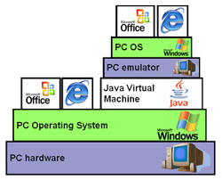
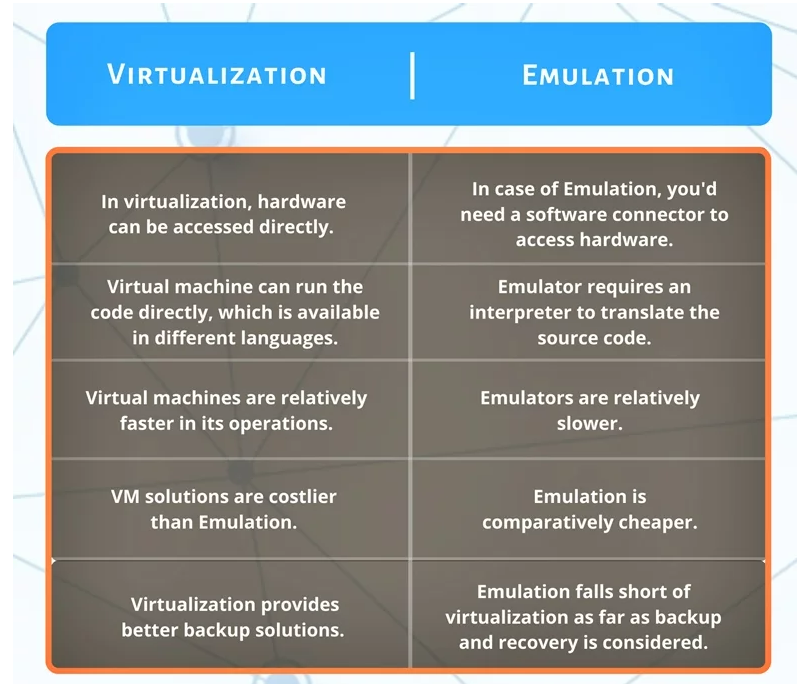

# OS Emulation

---

# 1. 개념

- 에뮬레이션은 한 컴퓨터 시스템을 사용하여 다른 컴퓨터 시스템의 기능을 모방하는 것이다.  이를 통해 한 환경에 맞게 설계된 소프트웨어를 다른 환경에서 실행할 수 있다.
- 에뮬레이터는 애플리케이션일 수도 있고 전자 장치일 수도 있다. 두 경우 모두 에뮬레이터는 소프트웨어를 사용하여 원래 시스템의 동작을 모방한다.
    - 예를 들어, 에뮬레이터를 사용하면 애플리케이션을 실행하거나 호환되지 않는 엔드포인트를 연결하기 위해 하나의 운영 체제가 다른 운영 체제로 위장할 수 있다.
    - 이러한 방식으로 에뮬레이션을 통해 Windows OS를 Mac 컴퓨터에서 실행하거나 최신 버전의 운영 체제와 호환되지 않는 레거시 응용 프로그램의 기능을 유지할 수 있다.
- 에뮬레이션의 일반적인 용도는 다음과 같다.
    - 원래 설계되지 않은 하드웨어 플랫폼에서 OS를 실행
    - 데스크톱 컴퓨터에서 아케이드 또는 콘솔 기반 게임 실행
    - 개발된 장치가 아닌 다른 장치에서 레거시 응용 프로그램 실행
    - 원래 작성된 OS가 아닌 다른 OS에서 응용 프로그램을 실행
    - Linux에서 Windows 애플리케이션 실행 등
- 서버 가상화에서의 에뮬레이션은 가상 환경과 동의어이다.
    - 가상 환경은 파티션, 게스트, 인스턴스 또는 컨테이너라고도 한다.
- 하드웨어에서 에뮬레이션은 장치를 서로 연결하거나 메인프레임 컴퓨터에 연결하기 위해 하드웨어를 사용하여 다른 하드웨어 장치의 기능을 모방하는 것이다.
    - 하드웨어 에뮬레이션은 주변 장치가 더 이상 사용되지 않을 때 유용할 수 있다.
    - 터미널 에뮬레이션을 사용하여 컴퓨터 터미널이 일반적으로 이전 유형의 다른 터미널처럼 보이고 작동하게 함으로써 사용자가 레거시 프로그램에 액세스할 수 있게 되는 것.
- **에뮬레이션 사용 사례의 예**
    
    에뮬레이션의 일반적인 응용 프로그램은 다음과 같다.
    
    1. **하드웨어 정의 패치**
        - 많은 "새로운" 사진 스캐너는 실제로 10년 전에 처음 등장한 모델이다.
        - 구매자가 현재 Windows 또는 Mac 운영 체제에서 이러한 스캐너를 사용하려는 경우 스캐너와 주고받는 명령과 데이터를 변환하는 에뮬레이터가 포함된 타사 소프트웨어를 구입해야 한다.
    2. **게임 콘솔 시뮬레이션** 
        - 에뮬레이터는 게임이 설계된 장치가 아닌 다른 장치에서 게임을 플레이할 수 있도록 하는 데 필수적이다.
    3. **OS 시뮬레이션**
        - 앞서 언급했듯이 에뮬레이션을 통해 Mac에서 Windows를 실행할 수 있으므로 Windows 응용 프로그램이 잠금 해제되고 그 반대의 경우도 마찬가지이다.
        - 또한 이는 Citrix(미국의 다국적 소프트웨어 기업)가 새로운 앱과 함께 레거시 애플리케이션을 나란히 실행할 수 있도록 하는 것의 일부이다.
    

# 2. 유형

- 에뮬레이터는 사용 사례와 호스트 환경에 따라 다양한 유형이 될 수 있다. 주목해야 할 필수 에뮬레이터 유형은 다음과 같다.

## 2-**1. 터미널 에뮬레이터**

- 터미널 에뮬레이터는 기존 컴퓨터 터미널의 기능을 시뮬레이션하는 소프트웨어다.
- 디스플레이와 키보드로 구성된 이 터미널은 주로 미니컴퓨터나 메인프레임과 같은 다른 컴퓨터와 연결하는 데 사용되었다. 터미널 에뮬레이션 프로그램도 동일한 작업을 수행한다.
- 터미널 에뮬레이터를 사용하면 호스트 컴퓨터가 명령줄이나 그래픽 인터페이스를 통해 원격 시스템을 포함한 다른 컴퓨터에 연결할 수 있다.
- Telnet, SSH 등의 프로토콜을 활용하여 통신이 가능하다.
- 이 에뮬레이션을 통해 호스트 컴퓨터는 원격 컴퓨터에서 앱을 사용하거나 실행하고 둘 사이에서 파일을 교환할 수 있다. 여기서의 장점은 두 장치의 운영 체제가 동일할 필요가 없다는 것이다.

## **2-2. 프린터 에뮬레이터**

- 프린터 에뮬레이션은 다양한 프린터 명령 언어를 제공하는 프린터 내 응용 프로그램이다. 동시에 관리 효율성과 보안도 제공한다.
- 여러 에뮬레이션을 프린터로 전송할 수 있으므로 사용자는 적절한 명령 언어를 선택할 수 있다.
    - 예를 들어, HP 프린터용으로 만들어진 소프트웨어의 양을 고려하면 많은 소프트웨어가 HP LaserJet 프린터를 복제하기 위한 것이다.
    - HP 프린터를 시뮬레이션함으로써 정품 HP 프린터용으로 설계된 모든 소프트웨어와 함께 작동할 수 있다.

## 2-**3. 게임 콘솔 에뮬레이터**

- 비디오 게임 콘솔 에뮬레이터를 사용하면 컴퓨터가 비디오 게임 콘솔의 하드웨어를 시뮬레이션하고 에뮬레이션 플랫폼에서 타이틀을 실행할 수 있다.
- 대부분의 경우 에뮬레이터에는 더 넓은 컨트롤러 호환성, 더 나은 성능, 더 선명한 명확성, 한 번의 클릭으로 액세스할 수 있는 치트 코드 등과 같이 실제 하드웨어의 경계를 초월하는 추가 기능이 있다.
- 에뮬레이터는 오래되었거나 존재하지 않거나 흔하지 않은 시스템을 위한 홈브류 데모와 새로운 게임을 제작하는 데도 도움이 된다.
- 에뮬레이터는 일반적으로 ROM 파일(게임 카트리지 콘텐츠의 복사본) 또는 ISO 이미지(광 미디어의 복사본)를 통해 게임의 코드와 데이터를 받는다.

## 2-**4. 전체 시스템 에뮬레이터**

- 전체 에뮬레이션은 CPU, 칩셋, 기본 입출력 시스템(BIOS), 장치 및 인터럽트를 포함한 모든 것을 에뮬레이션한다.
- COREMU는 전체 시스템 환경 통합의 복잡성을 분리하는 오픈 소스 동시 에뮬레이션 플랫폼이다.
    - 이와 같은 에뮬레이터는 호스트에서 시스템 종속성을 정확하게 제거해야 하기 때문에 구축하기가 어렵다.

## 2-**5. CPU 에뮬레이터**

- CPU 에뮬레이터는 물리적 CPU를 에뮬레이트하는 소프트웨어 애플리케이션이다.
- 에뮬레이트된 프로그램 코드의 실행 경로를 추적하는 컴퓨터 프로그램인 인터프리터는 CPU 에뮬레이터의 가장 간단한 변형이다.
- 감지된 각 기계어 명령어에 대해 소스 명령어와 의미상 비교 가능한 작업이 호스트 CPU에서 실행된다.
    - 컴퓨터 과학자들은 디버깅, 프로파일링, 맬웨어 분석을 포함한 다양한 작업에 이러한 에뮬레이터를 활용한다.

## 2-**6. 기능적 에뮬레이터**

- 기능적 에뮬레이션은 컴퓨터 프로그램을 사용하여 이진 기계 코드가 아닌 기호 어셈블리 언어나 컴파일러 코드로 작성된 다른 컴퓨터 프로그램의 실행을 모방하는 방식이다.
- 바이너리 코드를 생성하지 않고도 프로그래머는 기능 시뮬레이터를 사용하여 프로그래밍 오류(버그)를 찾기 위해 특정 소스 코드 비트를 실행하고 추적할 수 있다.

## 2-**7. 서버 에뮬레이터**

- 멀티플레이어 비디오 게임에는 온프레미스 설치를 위해 액세스할 수 있거나 액세스할 수 없는 인터넷 게임 서버가 필요한 경우가 많다.
- 서버 에뮬레이터는 핵심 프로세스가 다를 수 있더라도 인증된 인터넷 서버의 동작을 모방하는 인증되지 않은 온프레미스 서버다.
    - 이것이 항상 에뮬레이션 기술의 합법적인 사용은 아니다.

<aside>
💡 **온프레미스(on-premise)**
기업의 서버를 클라우드 같은 원격 환경에서 운영하는 것이 아닌, 자체적으로 보유한 전산실 서버에 직접 설치해 운영하는 방식

</aside>

## 2-**8. 네트워크 에뮬레이터**

- 실험실에서 네트워크(무선, 5G, MANET 등)의 동작을 테스트하는 것은 네트워크 에뮬레이션이다.
- PC 또는 가상 머신에서 실행되는 소프트웨어는 네트워크 에뮬레이션을 수행한다.
- 링크 에뮬레이션을 위해 별도의 에뮬레이션 장치가 활용되는 경우도 있다.
- 네트워크는 대기 시간, 결함 및 패킷 손실을 유도하여 에뮬레이터 내에서 어떻게 작동하는지 테스트한다.

## 2-**9. 모바일 에뮬레이터**

- 이름에서 알 수 있듯이 모바일 에뮬레이터는 데스크톱 컴퓨터에서 또는 클라우드 기반 테스트 플랫폼의 구성 요소로 장치의 하드웨어와 소프트웨어를 시뮬레이션한다.
- 이는 기계 수준 어셈블리 언어 기반 모바일 애플리케이션을 포괄적으로 다시 구현한 것이다.
- Android(소프트웨어 개발 키트 또는 SDK) 에뮬레이터가 이를 보여준다.
    - 이를 통해 개발자는 다양한 하드웨어 유형 및 화면 크기에서 애플리케이션의 모양을 평가할 수 있다.

# 3. **에뮬레이션 VS 가상화**

- 하드웨어 가상화는 컴퓨터를 복합 하드웨어 플랫폼으로 사용자 정의하고 가상화하거나, 여러 OS를 실행하는 데 필수적인 기능만을 제공한다.
    - 즉, 가상화는 소비자에게 컴퓨터 플랫폼의 물리적 속성을 숨기는 반면, 에뮬레이션은 그렇지 않다.
- 가상화와의 주된 차이점은 프로그램 사용 방식에 있다.
    - 소프트웨어를 눈에 띄지 않게 하려는 경우 가상화를 사용하여 게스트 코드가 CPU에서 기본적으로 실행될 수 있는 반면, 에뮬레이터는 게스트 코드를 직접 실행하여 여러 가지 다른 작업을 위해 CPU를 확보한다.
- 가상화와 에뮬레이션은 모두 비기본 환경에서 소프트웨어를 실행한다는 광범위하게 정의된 목표를 공유하지만 접근 방식, 기술 및 애플리케이션은 다르다.
- 본질적으로 두 기술 모두 컴퓨팅 기능을 확장하고 다양화할 수 있는 방법을 제공하지만 이상적인 응용 프로그램과 효율성은 프로젝트의 특정 요구 사항과 제약 조건에 따라 다르다.
    
    
| 비고 | 에뮬레이션 | 가상화 |
| --- | --- | --- |
| 작업 | 전체 하드웨어를 모방하여 한 플랫폼의 소프트웨어를 다른 플랫폼에서 실행 가능, 소프트웨어와 호스트 시스템 간의 변환기 역할을 수행 | 물리적 하드웨어 리소스를 여러 가상 환경으로 분할하고 각각은 별도의 시스템처럼 작동 |
| 성능 | 외부 코드를 번역하려면 추가 처리가 필요하므로 속도가 느려질 수 있음 | 서버 사용 최적화, 단일 시스템의 다양한 OS 테스트 또는 확장성과 리소스 할당이 중요한 클라우드 컴퓨팅에 적합 |
| 사용 사례 | 완전히 다른 하드웨어용 소프트웨어나 최신 시스템의 레거시 응용 프로그램을 실행하는 데 적합 | 클라우드 컴퓨팅에 적합 |
| 리소스 요구 사항 | 번역 프로세스로 인해 리소스를 더 많이 사용하는 경향 있음 | 오버헤드 없이 기존 하드웨어를 활용하므로 더 효율적 |
| 하드웨어 상호작용 | 하드웨어와 상호 작용을 위해 별도의 소프트웨어 계층(에뮬레이터)이 필요 | 여러 OS가 동일한 물리적 하드웨어를 공유할 수 있도록 하는 소프트웨어 계층인 하이퍼바이저를 사용하는 경우가 많음 |

### 1. **작업**

- **에뮬레이션**
    
    전체 하드웨어를 모방하여 한 플랫폼의 소프트웨어를 다른 플랫폼에서 실행할 수 있다. 이는 소프트웨어와 호스트 시스템 간의 변환기 역할을 한다.
    
- **가상화**
    
    물리적 하드웨어 리소스를 여러 가상 환경으로 분할하고 각각은 별도의 시스템처럼 작동한다.
    

### 2. **성능**

- **에뮬레이션**
    
    외부 코드를 번역하려면 추가 처리가 필요하므로 속도가 느려질 수 있다.(오버헤드 발생)
    
- **가상화**
    
    서버 사용 최적화, 단일 시스템의 다양한 OS 테스트 또는 확장성과 리소스 할당이 중요한 클라우드 컴퓨팅에 적합하다.
    

### 3. **사용 사례**

- **에뮬레이션**
    
    완전히 다른 하드웨어(예: PC의 콘솔 게임)용 소프트웨어나 최신 시스템의 레거시 응용 프로그램을 실행하는 데 적합하다.
    
- **가상화**
    
    서버 사용 최적화, 단일 시스템의 다양한 OS 테스트 또는 확장성과 리소스 할당이 중요한 클라우드 컴퓨팅에 적합하다.
    

### 4. **리소스 요구 사항**

- **에뮬레이션**
    
    번역 프로세스로 인해 리소스를 더 많이 사용하는 경향이 있다.
    
- **가상화**
    
    변환 오버헤드 없이 기존 하드웨어를 활용하므로 리소스 사용이 더욱 효율적이다.
    

### 5. **하드웨어 상호작용**

- **에뮬레이션**
    
    하드웨어와 상호 작용하려면 소프트웨어 계층(에뮬레이터)이 필요하다.
    
- **가상화**
    
    여러 OS가 동일한 물리적 하드웨어를 공유할 수 있도록 하는 소프트웨어 계층인 하이퍼바이저
    
    를 사용하는 경우가 많다.
    
    <aside>
    💡 **하이퍼바이저**
    단일 물리적 머신에서 여러 가상 머신을 실행하는 데 사용할 수 있는 소프트웨어
    
    </aside>
    

# 4. 응용

1. 시스템 간 마이그레이션
    - 마이그레이션의 첫 번째 단계로 에뮬레이터를 사용함으로써 시스템의 한 범주에서 다른 범주로 소프트웨어를 실행할 수 있다
2. 현재 시스템 강화
    - 에뮬레이터는 특히 임베디드 분야에서 하드웨어보다 훨씬 더 많은 디버깅 가능성을 제공할 수 있다.
    - MIMIC과 괕은 초기 미니 컴퓨터에 사용되었다
3. 과거의 시스템 보존
    - 에뮬레이터를 사용하여 구식 시스템의 소프트웨어를 최신 하드웨어에서 실행할 수 있다.
4. 미래 시스템을 중심으로 혁신
    - 에뮬레이터를 사용하여 실제 하드웨어가 출시되기 전, 개념적 기계를 구축하고 소프트웨어 디버깅이 가능하다.