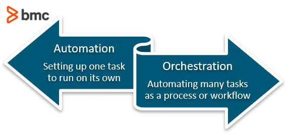
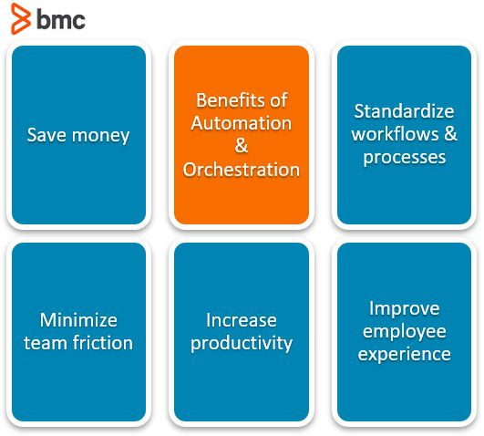
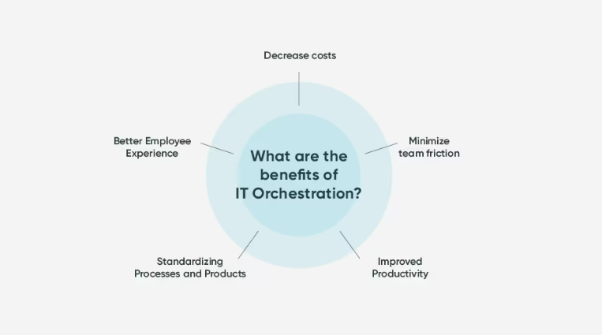

# Orchestration

---

# 1. 개요

- 끊임없이 늘어나는 서버와 애플리케이션의 시스템에 있어 수동 관리는 확장성이 부족하다.
- 성공적 비즈니스에서는 IT 관리 전략을 보완할 수 있도록 자동화로 전환하고 있다.
- 기존의 자동화는 단순히 개별 작업에 대한 수동 입력의 필요성을 줄이거나 없애는 반면에 오늘날 비즈니스는 여러 자동화된 작업과 그 구성 요소를 여러 시스템 그룹 전반에 걸쳐 통합할 수 있는 역량이 필요하다.
    - 이 접근 방식을 IT 오케스트레이션이라고 한다.
- 오케스트레이션은 여러 시스템, 서비스 또는 프로세스를 자동으로 조율하고 통합하여 효율적으로 동작하도록 한다.
- 자동화와 관련이 깊으나, 좀 더 넓은 의미로 시스템 간의 협력과 통합을 강조한다.

# 2. 개념

## 2-1. **Automation(자동화)**

- 인간의 개입은 최소화하고 기계가 기능을 수행하는 모든 상황을 의미하지만, 기술적인 의미에서의 자동화란 특히 기계가 하나의 작업을 수행하는 것을 의미한다.
- 개별 작업을 수행하는 것이 하나의 자동화이다.
- 자동화를 알맞게 사용한다면 작업의 속도와 정확성, 효율성을 크게 향상시킬 수 있다.
    - 서비스 티켓 생성, 애플리케이션 개발 및 배포, 감사, 사용자 프로비저닝 등에 사용
- 올바르게 사용하면 자동화는 시간 집약적인 작업의 속도, 정확성 및 효율성을 크게 향상시킬 수 있다.
    
    ### 장점
    
    - **비용 절감**
        - 반복적인 수동 작업을 자동화하면 효율성과 생산성이 향상된다.
        - 직원이 완료하는 데 필요한 시간이 많이 걸리는 작업의 수를 줄여 더 가치 있는 작업에 집중할 수 있는 더 많은 시간을 제공하고 작업량이 증가할 때 추가 인력에 대한 필요성을 줄인다.
    - **규정 준수 향상**
        - 프로세스에 규정 준수 검사를 구축하고 자동으로 업데이트하여 프로세스가 실행될 때마다 규제 요구 사항이 충족되도록 할 수 있다.
        - 또한 규정 준수 상태에 대한 지속적인 가시성을 제공하여 규정 위반 위험을 줄이고 보다 정확한 감사를 가능하게 한다.
    - **민첩성 증가**
    - 기술, 규정 및 고객 기대의 변화에 따라 조직은 관련성을 유지하고 경쟁에서 뒤처지지 않기 위해 신속하게 대응해야 한다.
    - 비즈니스와 IT는 중앙 집중식 플랫폼에서 협력하여 이러한 새로운 요구 사항을 충족하고 발전함에 따라 지속적으로 업데이트하는 솔루션을 만들 수 있다.
    - **정확도 증가**
        - 비즈니스 프로세스를 자동화하면 일관성이 향상되고 사람의 입력으로 인해 발생할 수 있는 오류가 발생할 가능성이 줄어든다.
        - 오류가 적다는 것은 보다 신뢰할 수 있는 정보를 기반으로 비즈니스 결정이 내려지고 직원이 오류를 수정하고 프로세스를 지연시키는 데 소요되는 시간이 줄어든다는 것을 의미한다.

## 2-2. **Orchestration**

- 오케스트레이션은 자동화 규모를 확장한 것이다.
- 더 큰 작업 흐름이나 프로세스를 실행하기 위해 여러 작업을 하나로 묶는 여러 컴퓨터 시스템, 애플리케이션 및/또는 서비스를 조정하고 관리하는 것이다.
    - 컴퓨터 시스템과 소프트웨어를 자동으로 구성, 조정 및 관리한다.
    - 여러 작업(일부는 자동화된)을 하나의 완전한 End to End 프로세스 또는 작업으로 구성하는 것이다.
    - Cloud Orchestration 도구는 IaaS 서비스 제공업체를 최대한 활용하여 완전히 자동화된 배포에 접근하고 시간 소모적인 것으로 간주되는 수동 프로세스를 삭제한다.
- 오케스트레이션의 목표는 빈번하고 반복 가능한 프로세스의 실행을 간소화하고 최적화하여 데이터 팀이 복잡한 작업과 워크플로를 보다 쉽게 관리할 수 있도록 돕는 것이다.
- 프로세스가 반복 가능하고 해당 작업이 자동화될 수 있는 경우 언제든지 오케스트레이션을 사용하여 시간을 절약하고 효율성을 높이며 중복을 제거할 수 있다.
    - 예를 들어 작업 조정을 통해 데이터와 머신러닝을 단순화 할 수 있다.
- 효과적인 오케스트레이션 도구를 사용하면 조직은 컴퓨팅 환경 내에서 상호 연결된 전체 워크플로, 컴퓨터 시스템, 서비스 및 미들웨어를 자동화하고 지원할 수 있다.
- 오케스트레이션은 다목적이며 클라우드나 온프레미스의 분산 시스템에 적용될 수 있다. 즉, 오케스트레이션은 전체 작업 그룹을 처음부터 끝까지 처리한다.
    - 예를 들어, 조직이 Active Directory 생성을 조율하려는 경우 상호 연결된 여러 작업에 대한 자동화된 워크플로를 구축하게 된다.
    - 여기에는 사용자 생성, 사용자 수정, 그룹 생성, 그룹 수정 등이 포함될 수 있다.
- 자동화된 작업이 미리 정의된 순서에 따라 발생하도록 오케스트레이션을 적용할 수도 있다.
- 오케스트레이션은 그 자체로 복잡한 작업이며 오케스트레이션할 프로세스에 포함된 모든 단계를 완전히 이해하고 다양한 환경에서 해당 단계를 추적하는 데 달려 있다.
    - 즉, 프로세스가 반복 가능하고 자동화 가능한 작업으로 구성된 경우 이를 조정할 수 있다.

# 3. 특징

- 복잡한 IT 프로세스와 워크플로우의 조정 및 관리가 필요하다.
- 상호 의존적인 작업을 자동화하고 해당 작업 간의 관계를 관리한다.
- 인프라와 애플리케이션을 정의, 배포, 관리하기 위한 통합 플랫폼을 제공한다.
- IT 운영을 간소화하고 효율성을 향상시킨다.
- IT 환경 전반에 걸쳐 일관성과 안정성을 보장한다.
- IT 프로세스에 대한 더 나은 가시성과 제어 기능을 제공하여 조직이 변화하는 비즈니스 요구에 신속하게 대응할 수 있도록 한다.

# 4. 장점

- **프로세스 표준화**
    - 비즈니스가 모든 컴퓨팅 시스템 및 서비스를 위한 표준 프로세스를 만들 수 있도록 한다.
    - 신뢰성과 일관성을 향상시켜 손쉽게 새로운 프로세스를 도입하고 빠르게 가동할 수 있도록 한다.
- **효율성 향상**
    - Orchestration은 상호 의존적인 작업을 자동화하고 해당 작업 간의 관계를 관리함으로써 조직이 IT 운영을 간소화하고 효율성을 향상시키는 데 도움이 된다.
- **안정성 향상**
    - Orchestration은 조직이 IT 프로세스의 일관성과 안정성을 보장하여 가동 중지 시간 및 기타 중단 위험을 줄이는 데 도움이 된다 .
- **확장성 향상**
    - Orchestration을 사용하면 변화하는 비즈니스 요구 사항에 맞춰 리소스를 더 쉽게 확장하거나 축소할 수 있으므로 조직의 민첩성과 대응력이 향상된다.
- **가시성 및 제어 향상**
    - IT 프로세스 정의, 배포 및 관리를 위한 통합 플랫폼을 제공함으로써 조직은 IT 운영에 대한 더 나은 가시성과 제어를 제공한다.
- **비용 절감**
    - 조직은 복잡한 IT 프로세스를 자동화함으로써 운영 비용을 대폭 절감하고 다른 이니셔티브에 필요한 예산을 확보할 수 있다.
- **향상된 보안**
    - Orchestration은 조직이 보안 정책과 절차를 보다 일관되게 시행하여 보안 침해 위험을 줄이고 민감한 데이터를 보호하도록 돕는다.
- **거버넌스 및 보안 강화**
    - 오케스트레이션을 통해 IT는 조직 전체의 모든 자동화된 프로세스를 중앙에서 관리할 수 있다.
    - 이를 통해 투명성과 거버넌스가 향상되고 섀도우 IT의 위험이 최소화된다.
    - 프로세스 애플리케이션을 중앙에서 관리하면 IT가 권한을 관리하여 보안을 강화할 수도 있다.
- **IT 자원 보존**
    - 하나의 플랫폼 내에서 전체 조직의 자동화를 관리하면 IT 팀이 여러 애플리케이션을 지속적으로 모니터링하고 수정할 필요가 없으므로 IT 인프라와 리소스를 효율적으로 사용할 수 있다.
- **새로운 기술을 빠르게 통합**
    - IT 애플리케이션을 중앙에서 조정하면 새로운 시스템을 기존 인프라에 쉽게 통합할 수 있다.
- **직원 생산성 및 만족도 향상**
    - 직원들은 여러 시스템에 로그인할 필요 없이 단일 인터페이스 내에서 작업을 완료하여 시간을 절약할 수 있다.
    - 전문가가 인적 통찰력 및 창의력이 필요한 작업에 집중하도록 하여 더 많은 성과를 낼 수 있게 돕는다.

# 5. 이점

- **비용 절약**
    - 전반적인 IT 비용을 줄이거나 예산을 혁신과 새로운 프로젝트에 사용하기로 결정할 수도 있다.
- **팀 상호 작용 최소화**
    - 팀 협업은 확실히 가치가 있지만 프로젝트와 프로세스에 마찰을 일으킬 수도 있다.
    - 특정 워크플로와 프로세스를 조정하면 팀 간의 이러한 마찰을 최소화할 수 있다.
- **생산성 향상**
    - 기계적인 작업에 인력을 사용하는 대신 인간의 사고, 의사 결정 및 기술이 필요한 프로젝트에 작업할 수 있다.
- **워크플로 및 제품 표준화**
    - 다양한 스펙트럼에 걸쳐 프로세스와 제품을 표준화한다는 것은 프로세스와 제품이 일관되고 신뢰할 수 있다는 것을 의미하며, 회사도 그렇게 보이게 될 것이다.
- **직원 경험 개선**
    - 자동화할 수 있는 플러그 앤 플레이 작업이 아닌 보다 창의적이고 사려 깊거나 도전적인 작업에 시간을 보내는 직원은 자신의 작업 환경을 더 높이 평가할 가능성이 높다.

# 6. 제한사항 및 단점

- **초기 설정 비용**
    - Orchestration 구현에는 비용이 많이 들 수 있으며 도구 및 리소스에 대한 상당한 사전 투자가 필요하다.
- **기술 요구 사항**
    - Orchestration에는 전문적인 기술과 전문 지식이 필요하므로 조직은 직원을 위한 교육 및 개발에 투자해야 할 수도 있다.
- **기술에 대한 의존성**
    - Orchestration은 기술에 의존하므로 시스템이 실패하거나 도구가 오래되면 조직이 필수 작업을 수행하지 못할 수 있다 .
- **복잡성**
    - 복잡한 IT 프로세스를 관리하는 것은 어려울 수 있으며, 조정 시스템을 구현하고 유지하려면 상당한 노력과 전문 지식이 필요하다.
- **변화에 대한 저항**
    - 일부 직원은 Orchestration 도입을 자신의 업무와 책임에 대한 위협으로 인식하여 저항할 수 있다.
- **통합 과제**
    - Orchestration 시스템을 기존 IT 시스템 및 프로세스와 통합하는 것은 어려울 수 있으며 호환성을 보장하려면 상당한 노력과 전문 지식이 필요하다.

# 7. 응용

- **워크플로 자동화**
    - Orchestration은 재해 복구, 사고 대응 등 복잡한 IT 프로세스와 워크플로를 자동화하는 데 사용된다.
- **클라우드 오케스트레이션**
    - Orchestration은 클라우드 기반 애플리케이션의 배포, 확장 및 관리를 포함하여 클라우드 리소스 관리 프로세스를 자동화하는 데 사용된다
- **Container Orchestration**
    - Orchestration은 컨테이너 배포 및 관리를 관리하고 조정하는 데 사용되므로 마이크로서비스 기반 애플리케이션을 더 쉽게 관리할 수 있다.
- **Network Orchestration**
    - Orchestration은 네트워크 장치 구성 및 관리 프로세스를 자동화하여 대규모 네트워크를 보다 쉽게 관리하는 데 사용된다.
- **ITSM(IT 서비스 관리) Orchestration**
    - Orchestration은 사고 대응, 문제 해결, 변경 관리 등 IT 서비스 관리 프로세스를 자동화하는 데 사용된다.
- **비즈니스 프로세스 Orchestration**
    - Orchestration은 고객 온보딩, 주문 이행, 결제 처리 등의 비즈니스 프로세스를 자동화하는 데 사용된다.

# 8. 자동화 VS Orchestration

- 자동화와 오케스트레이션은 상호보완적이지만 의미는 다르다.
- 자동화는 사람의 개입 없이 실행되도록 작업을 프로그래밍하는 것이다.
- 오케스트레이션은 여러 작업(일부는 자동화될 수 있음)을 하나의 완전한 엔드 투 엔드 프로세스 또는 작업으로 구성하는 것이다.
- 또한 오케스트레이션 소프트웨어는 프로세스 전반에 걸쳐 이벤트나 활동에 반응하고 하나의 자동화된 작업의 출력을 기반으로 결정을 내려 다음 작업을 결정하고 조정해야 한다.

| 요인 | 자동화 | 오케스트레이션 |
| --- | --- | --- |
| 목적 | 자동화의 주요 목적은 반복적이고 수동적인 작업을 자동화하여 효율성과 생산성을 향상시키는 것이다. | 오케스트레이션의 주요 목적은 복잡한 IT 프로세스와 워크플로를 조정하고 관리하여 올바른 순서와 올바른 종속성에 따라 실행되도록 하는 것이다. |
| 집중 포인트 | 자동화는 개별 작업을 자동화하여 수동 작업과 오류를 줄이는 데 중점을 둔다. | 오케스트레이션은 원활하고 조정된 워크플로를 보장하기 위해 상호 의존적인 작업을 자동화하고 이러한 작업 간의 관계를 관리하는 데 중점을 둔다. |
| 복잡성 수준 | 자동화는 일반적으로 단순하고 반복적인 작업을 자동화하는 데 사용된다. | 오케스트레이션은 여러 작업과 시스템이 포함된 복잡하고 상호 의존적인 프로세스를 관리하는 데 사용된다. |
| 사람의 참여 | 작업이 자동화되면 자동화에는 사람의 개입이 거의 또는 전혀 필요하지 않다. | 오케스트레이션을 위해서는 워크플로를 설정하고 전체 프로세스를 관리하는 데 사람의 참여가 필요하지만 실제 작업 실행은 자동화될 수 있다 |
| 완성 | 자동화는 다양한 시스템 및 도구와 통합될 수 있지만 일반적으로 단일 작업이나 애플리케이션에 중점을 둔다 | 오케스트레이션에는 복잡한 워크플로를 조정하고 관리하기 위해 여러 시스템 및 도구와의 통합이 필요하다 |
| 확장성 | 자동화는 자동화되는 작업의 복잡성과 빈도에 따라 필요에 따라 확장하거나 축소할 수 있다. | 오케스트레이션에는 여러 작업과 시스템을 조정하는 복잡성으로 인해 더 높은 수준의 확장성이 필요하다. |
| 오류 처리 | 자동화는 사전 정의된 방식으로 오류를 처리할 수 있지만 경우에 따라 수동 개입이 필요할 수 있다. | 오케스트레이션에는 오류 처리 기능이 내장되어 있으며 오류 발생 시 워크플로를 자동으로 조정할 수 있다. |
| 맞춤화 | 자동화는 특정 요구 사항을 충족하도록 사용자 정의할 수 있는 경우가 많지만 설정하려면 프로그래밍이나 기술적 능력이 필요할 수 있다. | 오케스트레이션은 일반적으로 더 복잡하고 사용자 정의하려면 고급 기술이 필요하지만 복잡한 워크플로에 대해 더 많은 제어 기능을 제공한다. |
| 비용 | 자동화는 자동화되는 작업의 복잡성과 빈도에 따라 상대적으로 비용이 저렴할 수 있다. | 여러 시스템 및 도구와의 통합이 필요하고 워크플로 조정이 복잡하기 때문에 오케스트레이션에는 비용이 더 많이 들 수 있다. |
| 시간 | 자동화는 반복적인 작업을 자동화하여 시간을 절약할 수 있지만 시작하려면 약간의 설정 시간이 필요할 수 있다. | 오케스트레이션은 복잡한 프로세스를 조정하여 시간을 절약할 수 있지만 시작하려면 상당한 설정 시간이 필요할 수도 있다. |