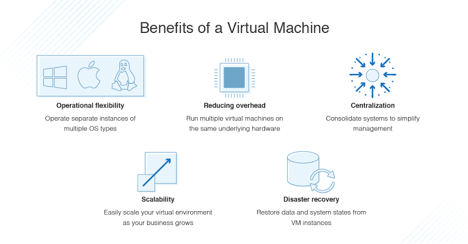
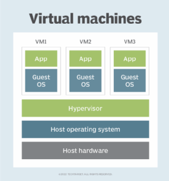

# Virtual Machine

---

# 정의

- 하드웨어를 에뮬레이션 하여 여러 개의 독립적인 가상 환경을 생성하는 소프트웨어이다.
- 실제 컴퓨터 대신 소프트웨어를 사용하여 프로그램을 실행하고 앱을 배포하는 컴퓨팅 리소스이다.
- 가상 머신 상에서 운영 체제나 응용 프로그램을 설치 및 실행할 수 있다.
- 하나 이상의 가상 게스트 시스템이 물리적 호스트 시스템에서 실행된다.
- 각 가상 머신은 모두 동일한 호스트에서 실행되는 경우에도 자체 운영 체제를 실행하고 다른 VM과 별도로 작동된다.
    - 예를 들어 가상 MacOS 가상 머신이 실제 PC에서 실행될 수 있음을 의미한다.
- 가상 머신의 가장 중요한 특징은 안에서 돌아가는 소프트웨어가 가상 머신이 제공하는 환경과 자원에 제한을 받으며, 가상 세계를 벗어날 수 없다.
- 호스트 하드웨어에서 실행하는 프로그램으로서, 호스트 OS(운영 체제) 또는 호스트 시스템에서 실행하는 다른 VM과 분리하여 자체 게스트 OS 및 애플리케이션을 갖춘 격리된 환경을 제공한다.
- 가상 머신 기술은 온프레미스 및 클라우드 환경 전반의 다양한 사용 사례에 사용된다.
- 최근에는 퍼블릭 클라우드 서비스에서 가상 머신을 사용하여 훨씬 더 비용 효율적이고 유연한 컴퓨팅을 위해 여러 사용자에게 가상 애플리케이션 리소스를 한 번에 제공하고 있다.
- 가상 머신은 시스템의 나머지 부분과 분리되어 있으므로 가상 머신 내부의 소프트웨어는 호스트 컴퓨터를 조작할 수 없다.
- VM은 물리적 컴퓨터에서 실행하는 모든 소프트웨어를 실행하는 데 사용할 수 있는 소프트웨어 컴퓨터로 생각할 수 있다. 물리적 기계와 마찬가지로 가상 머신에는 자체 운영체제, 스토리지, 네트워킹, 구성 설정 및 소프트웨어가 포함되어 있으며 해당 호스트에서 실행되는 다른 VM과 완전히 분리된다.
- 가상 머신은 물리적 머신의 OS에서 다른 애플리케이션과 마찬가지로 애플리케이션 창에서 프로세스로 실행된다. 가상 머신의 주요 구성 파일로는 로그 파일, NVRAM 설정 파일, 가상 디스크 파일, 구성 파일 등이 있다.
- 가상 머신은 관리 및 유지가 쉽고 물리적 머신에 비해 여러 장점을 제공한다
    - 가상 머신은 단일 물리적 컴퓨터에서 여러 OS 체제 환경을 실행할 수 있어 물리적 공간, 시간 및 관리 비용을 절약할 수 있다.
    - 가상 머신은 레거시 애플리케이션을 지원하므로 새 OS로 마이그레이션하는 데 드는 비용을 줄여준다.
    - VM은 통합 재해 복구 및 애플리케이션 프로비저닝 옵션도 제공할 수 있다.
    - 애플리케이션을 쉽게 확장하고 변동하는 워크로드를 수용할 수 있다.
    - 잠재적인 위협에 대해 추가 보안 계층을 제공할 수 있다.
- 가상 머신은 몇 가지 잠재적인 단점 역시 존재한다
    - 하나의 물리적 시스템에서 여러 가상 시스템을 실행할 경우 인프라 요구 사항에 따라 성능이 불안정해질 수 있다
    - 가상 머신은 전체 물리적 컴퓨터보다 효율성이 낮고 느리게 실행된다.
- 가상 머신은 프로세스 가상 머신과 시스템 가상 머신의 두 가지 유형이 존재한다

# 용도

- 가상 머신을 사용하면 기업은 데스크톱의 앱 창에서 완전히 별도의 컴퓨터처럼 작동하는 운영체제를 실행할 수 있다.
- 다양한 수준의 처리 능력 요구 사항을 수용하거나, 다른 운영 체제가 필요한 소프트웨어를 실행하거나, 안전한 샌드박스 환경에서 애플리케이션을 테스트하기 위해 VM을 배포할 수 있다.
- 바이러스에 감염된 데이터에 액세스하거나 운영 체제를 테스트하는 등 호스트 환경에서 수행하기에는 위험하다고 판단되는 특정 작업을 수행할 수 있다.
- 가상 머신은 역사적으로 서버 가상화에 사용되어 왔으며  이를 통해 IT 팀은 컴퓨팅 리소스를 통합하고 효율성을 향상시킬 수 있다.
- 가상 머신은 시스템의 나머지 부분과 분리되어 있으므로 가상 머신 내부의 소프트웨어는 호스트 컴퓨터를 조작할 수 없다.

# 유형

### **프로세스 가상 머신**

- 응용 프로그램 가상 머신이라고도 한다.
- 애플리케이션 가상 머신 또는 MRE(Managed Runtime Environment)라고도 한다. 호스트 OS 내에서 일반 애플리케이션으로 실행되며 단일 프로세스를 지원한다.
    - 해당 프로세스가 시작될 때 생성되며 종료될 때 삭제된다.
    - 목적은 기본 하드웨어 또는 OS의 세부 정보를 추상화하고 프로그램이 모든 플랫폼에서 동일한 방식으로 실행될 수 있도록 하는 플랫폼 독립적인 프로그래밍 환경을 제공하는 것에 있다.
- 운영 체제 안에서 일반 응용 프로그램을 돌리고 단일 프로세스를 지원한다.
- 단일 프로세스가 호스트 머신에서 애플리케이션으로 실행되어 기본 하드웨어 또는 운영 체제의 정보를 마스킹하여 플랫폼 독립적인 프로그래밍 환경을 제공할 수 있다.
- 모든 운영 체제에서 Java 애플리케이션이 해당 시스템의 기본 애플리케이션인 것처럼 실행할 수 있도록 하는 Java Virtual Machine(JVM)이 있다.
- 단일 프로세스가 호스트 머신에서 애플리케이션으로 실행되어 기본 하드웨어 또는 OS의 정보를 마스킹하여 플랫폼 독립적인 프로그래밍 환경을 제공할 수 있다.
- 프로세스 가상 머신은 인터프리터를 사용하여 구현된다.

### **시스템 가상 머신**

- 하드웨어 가상 머신이라고도 한다.
- 물리적 머신을 대체하기 위해 완전히 가상화 된 모델이다. 전체 가상화 VM이라고도 한다.
- 물리적 머신을 대체하기 위해 가상화 되었다.
- 시스템 플랫폼은 각각 자체 운영 체제 복사본을 실행하는 여러 가상 머신 간에 호스트 컴퓨터의 물리적 리소스 공유를 지원한다.
    - 호스트는 여러 게스트를 에뮬레이트할 수 있으며, 각 게스트는 서로 다른 OS와 하드웨어 플랫폼을 에뮬레이트할 수 있다.
- 이 가상화 프로세스는 VMware ESXi와 같은 베어 하드웨어 또는 운영 체제 위에서 실행될 수 있는 하이퍼바이저에 의존한다.
    - 하이퍼바이저는 기본 실행을 사용하여 하드웨어를 공유하고 관리하므로 서로 격리되어 있으면서도 동일한 물리적 시스템에 존재하는 여러 환경을 허용한다.
- 전체 OS를 실행하는 데 필요한 기능을 제공한다.
- 시스템 플랫폼은 각각 자체 OS 복사본을 실행하는 여러 가상 머신 간에 호스트 컴퓨터의 물리적 리소스 공유를 지원한다.

# 장점

가상 머신은 관리 및 유지 관리가 쉽고 물리적 머신에 비해 여러 가지 장점을 제공한다.

- **이동성**
    - 한 서버에서 다른 서버로 또는 온프레미스 하드웨어에서 클라우드 환경으로 쉽게 이동할 수 있다.
    - 가상 머신은 레거시 애플리케이션을 지원하므로 새 운영 체제로 마이그레이션하는 데 드는 비용을 줄여준다.
        
        <aside>
        💡 **레거시(legacy) 란?**
        정보기술에서, 레거시 프로그램과 데이터는 프로그래밍 언어, 플랫폼 그리고 기술 등에 있어, 과거로 부터 물려 내려온 것들을 의미한다. 컴퓨터를 사용하는 대부분의 기업들은 중요한 업무를 처리하는 레거시 응용프로그램들과 데이터베이스를 가지고 있다.
        
        </aside>
        
        - 예를 들어 게스트 운영 체제로 Linux 배포를 실행하는 Linux 가상 머신은 Windows와 같은 Linux가 아닌 운영 체제를 실행하는 호스트 서버에 존재할 수 있다.
- **공간 절약**
    - 하드웨어 리소스를 더욱 효율적으로 사용할 수 있다. 따라서 물리적 환경에서 실행할 때와 비교하여 워크로드 지원에 필요한 호스트 시스템의 수가 적어 공간, 에너지, 비용이 감소한다.
    - 단일 물리적 컴퓨터에서 여러 운영 체제 환경을 실행할 수 있어 물리적 공간, 시간 및 관리 비용을 절약할 수 있다.
- **고속 프로비저닝**
    - 새로운 인스턴스가 필요할 때 기존 VM을 쉽게 복제할 수 있어 처음부터 설치할 필요가 없다.
    - 통합 재해 복구 및 애플리케이션 프로비저닝 옵션도 제공할 수 있다.
        
        <aside>
        💡 **프로비저닝**
        특정 서비스를 제공받기 위하여 서비스 실행부터 시작해 서비스를 제공받기 전 단계까지 처리되는 일련의 절차를 말한다.
        ****즉, 사용자 혹은 비지니스 요구사항에 맞게 할당, 배치, 배포하여 시스템을 사용가능하도록 준비하는 절차를 뜻한다.
        
        </aside>
        
- **보안**
    - 안전한 샌드박스 환경을 제공하므로 특정 VM에 영향을 주는 악성 프로그램이나 다른 문제가 호스트 시스템 또는 다른 VM으로 확산되지 않는다.

# 단점

- 하나의 물리적 시스템에서 여러 가상 시스템을 실행하면 성능이 불안정해질 수도 있다.
- 가상 머신은 전체 물리적 컴퓨터보다 효율성이 낮고 느리게 실행된다.
- 대부분의 기업은 물리적 인프라와 가상 인프라를 결합하여 해당 장점과 단점의 균형을 유지한다.

# Container VS Virtual Machine

- 가상 머신과 마찬가지로 Kubernetes 와 같은 컨테이너 기술은 단일 플랫폼에서 격리된 애플리케이션을 실행한다는 점에서 유사하다.
    - 가상 머신은 하드웨어 계층을 가상화하여 "컴퓨터"를 생성하는 반면, 컨테이너는 해당 종속성과 함께 단일 앱만 패키징한다.
    - 가상 머신은 종종 하이퍼바이저에 의해 관리되는 반면, 컨테이너 시스템은 기본 호스트에서 공유 운영 체제 서비스를 제공하고 가상 메모리 하드웨어를 사용하여 애플리케이션을 격리한다.
- 컨테이너의 주요 이점은 가상 머신에 비해 오버헤드가 적다는 것이다.
    - 컨테이너에는 바이너리, 라이브러리, 기타 필수 종속성 및 애플리케이션만 포함된다.
    - 동일한 호스트에 있는 컨테이너는 동일한 운영 체제 커널을 공유하므로 컨테이너를 가상 머신보다 훨씬 작게 만든다.
    - 결과적으로 컨테이너는 더 빠르게 부팅되고, 서버 리소스를 최대화하며, 애플리케이션 제공을 더 쉽게 만든다.
    - 컨테이너는 웹 애플리케이션, DevOps  테스트, 마이크로서비스 및 서버당 배포할 수 있는 앱 수 최대화와  같은 사용 사례에서 대중화되었다.
- 가상 머신은 컨테이너보다 크고 부팅 속도가 느리다.
    - 이들은 자체 운영 체제 커널을 통해 서로 논리적으로 격리되어 있으며 완전히 별도의 운영 체제의 이점을 제공한다.
    - 가상 머신은 여러 애플리케이션을 함께 실행하고, 모놀리식 애플리케이션을 실행하고, 앱 간 격리를 실행하고, 이전 운영 체제에서 실행되는 레거시 앱을 실행하는 데 가장 적합하다. 컨테이너와 가상 머신을 함께 사용할 수도 있다.

# 작동 방식

- 가상 머신은 기본 호스트 시스템이나 해당 호스트의 다른 가상 머신과 독립적으로 자체 OS 및 애플리케이션을 실행하기 위한 격리된 환경을 제공한다.
- 단일 컴퓨터는 서로 영향을 주거나 방해하지 않고 서로 다른 OS 및 애플리케이션을 실행하는 여러 VM을 호스팅할 수 있다.
- 가상 머신은 여전히 호스트의 물리적 리소스에 의존하지만 해당 리소스는 가상화되어 가상 머신 전체에 분산되며 필요에 따라 다시 할당될 수 있다. 이를 통해 다양한 환경을 동시에 실행하고 변동하는 워크로드를 수용할 수 있다.
- 사용자 관점에서 가상 머신은 베어메탈 머신처럼 작동한다. 대부분의 경우 가상 머신에 연결하는 사용자는 자신이 가상 환경을 사용하고 있음을 인식하지 못 한다
- 사용자는 필요에 따라 게스트 OS와 해당 애플리케이션을 구성 및 업데이트하고 호스트나 다른 VM에 영향을 주지 않고 새 애플리케이션을 설치하거나 제거할 수 있다.

# 구성 요소 및 특징

- 하드웨어 애뮬레이션
    - 가상 머신은 하드웨어를 에뮬레이션하여 물리적인 하드웨어에서 실행되는 것처럼 동작할 수 있다
- Hypervisor
    - 가상 머신을 관리하고 제어하기 위해 소프트웨어 레이어인 Hypervisor가 사용된다. Hyperviosr는 호스트 시스템에서 여러 개의 가상 머신을 실행하고, 각각의 가상 머신이 물리적인 리소스에 접근할 수 있도록 조정한다
- 게스트 OS
    - 가상 머신 내에서 실행되는 OS로 일반적으로 호스트 시스템과는 독립적으로 작동하며, 각각의 가상 머신은 자체 파일 시스템 및 응용 프로그램을 가질 수 있다
- 스냅샷 및 복제
    - 스냅샷을 사용하여 현재 상태를 저장하고 나중에 해당 상태로 쉽게 복원할 수 있다.
    - 가상 머신을 복제하여 새로운 가상 머신을 빠르게 생성하거나 동일한 환경을 여러 개 만들 수 있다
- 이식성
    - 가상 머신은 하드웨어와 독립적으로 실행되므로, 한 플랫폼에서 다른 플랫폼으로 쉽게 이동하거나 배포할 수 있다.