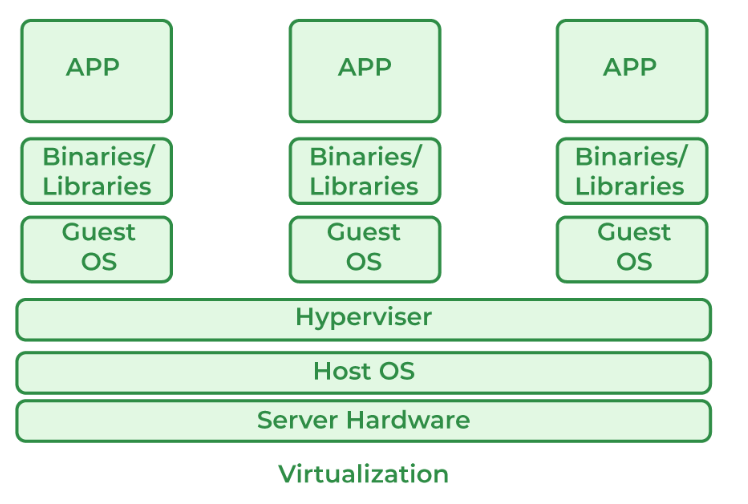
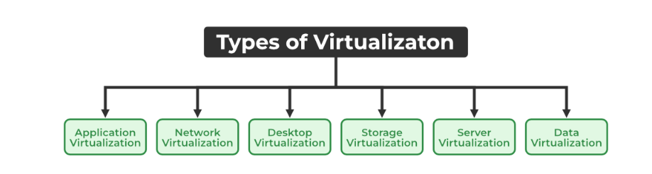
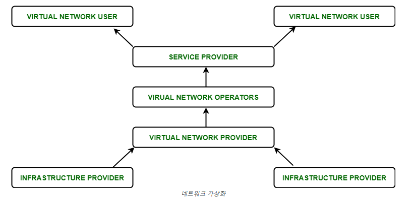
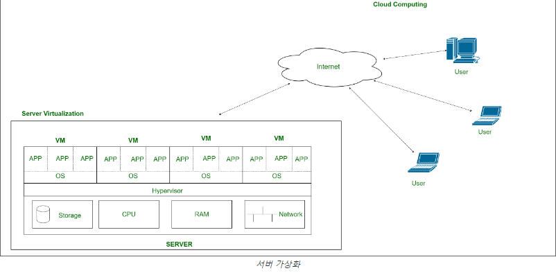

# Virtualization

---

# 1. 정의

- 물리적으로 다른 시스템을 논리적으로 통합하거나 하나의 시스템을 논리적으로 분할해 자원을 사용하게 하는 기술
- 해당 서비스의 기본 물리적 전달으로부터 서비스를 분리하는 방법이다.
- 컴퓨터 하드웨어와 같은 가상 버전을 만드는 프로세스이다.
- 하드웨어 기능을 시뮬레이션하여 가상 시스템을 생성하는 소프트웨어를 사용한다. 이를 통해 단일 서버에서 여러 OS, 둘 이상의 가상 시스템 및 다양한 애플리케이션을 운영할 수 있다.
- OS 가상화는 하드웨어가 여러 OS 이미지를 동시에 실행할 수 있도록 소프트웨어를 사용하는 것이다.
- 가상화 기술의 주요 용도는 하이퍼바이저와 같은 소프트웨어 계층을 사용하여 기본 하드웨어를 에뮬레이트하는 서버 가상화이다. 여기에는 CPU 메모리, I/O, 네트워크 트래픽이 포함되는 경우가 많다.
- 동일한 리소스의 실제 버전이 아닌 컴퓨팅 리소스의 가상 또는 소프트웨어 생성 버전을 생성하기 위해 특수 소프트웨어를 사용하는 작업이 포함된다.
- 가상화를 통해 여러 운영 체제와 애플리케이션을 동일한 시스템 및 동일한 하드웨어에서 동시에 실행할 수 있으므로 하드웨어의 활용도와 유연성이 향상된다.
- 클라우드 제공업체가 사용하는 주요 비용 효율성, 하드웨어 절감, 에너지 절약 기술 중 하나가 가상화이다.
- 가상화를 사용하면, 여러 고객 및 조직 간에 리소스 또는 애플리케이션의 단일 물리적 인스턴스를 동시에 공유 할 수 있다.
- 가상화 기술은 애플리케이션 실행 뿐만 아니라 스토리지, 메모리, 네트워킹 등을 위한 가상 환경을 제공한다.
    - 호스트 머신 : 가상화 소프트웨어가 실행되는 물리적 컴퓨터 또는 서버를 가리킨다. 이 환경에서 가상화 소프트웨어가 동작하며 가상 머신(가상 환경)을 만들고 관리한다.
    - 게스트 머신 : 게스트 환경은 가상 머신(가상 환경) 내에서 실행되는 운영체제와 응용 프로그램을 의미한다. 게스트 환경은 호스트 환경에서 실행되는 가상화 소프트웨어에 의해 관리된다.

# 2. 목적

- Performance
    - IT 자원들을 하나의 풀로 묶어서 컴퓨팅 파워를 향상한다
- Scalability
    - 더 큰 애플리케이션, 트래픽, DB 지원
- Availability, Reliability, Resiliency
    - 데이터, 애플리케이션, 컴포넌트들의 다중 카피들을 생성하여 높은 가용성 확보
- Flexibility, Agility
    - 애플리케이션과 OS의 인스턴스들을 필요에 따라 빠르게 만들고 폐지
- Resource Optimization
    - 시스템의 물리적 재구성 없이 다양한 비즈니스 애플리케이션에 맞게 IT 자원들을 최적으로 구성

# 3. 원리

- 공유(Sharing)
    - 물리적으로 위치한 자원을 사용자에게 나누어 사용할 수 있도록 한다.
    - 관련 기술 : 파티셔닝, VLAN
- 단일화(Aggregation)
    - 분산자원을 통합, 논리적 단순화를 통해 자원 활용 향상 및 관리 용이
    - 관련기술 : 클러스터링
- 에뮬레이션(Emulation)
    - 가상화로 인한 논리적 객체는 물리적인 객체와 동일한 기능을 수행한다
    - 관련 기술 : VTL, 에뮬레이터
- 절연(Insulation)
    - 물리적인 자원의 교체나 변경에도 서비스를 안정적으로 유지한다
    - 관련 기술 : RAID, HA, L4

# 4. 작동 방식

- 하이퍼바이저가 물리적 환경에서 물리적 리소스를 분리한다.
    
    <aside>
    💡 **하이퍼바이저**
    하이퍼바이저는 단일 물리적 머신에서 여러 가상 머신을 실행하는 데 사용할 수 있는 소프트웨어이다. 
    모든 가상 머신에는 고유한 운영 체제와 애플리케이션이 있다. 하이퍼바이저는 필요에 따라 CPU 및 메모리와 같은 기본 물리적 컴퓨팅 리소스를 개별 가상 머신에 할당한다. 따라서 물리적 IT 인프라의 최적 사용을 지원한다.
    
    </aside>
    
- 필요에 따라 물리적 환경에서 다양한 가상 환경으로 리소스를 가져오고 분할한다
- 시스템 사용자는 가상 환경 내에서 작업하고 계산을 수행한다
- 가상 환경에 실행되면 사용자나 프로그램이 물리적 환경에서 추가 리소스가 필요한 명령을 보낼 수 있다. 이에 대한 응답으로 하이퍼바이저는 메시지를 물리적 시스템에 전달하고 변경 사항을 저장한다.

# 5. 특징

- 향상된 보안
    - 안전하고 제어된 실행 환경을 제공할 수 있는 가능성을 열어준다. 게스트 프로그램의 모든 작업은 일반적으로 가상 머신에 대해 수행되며, 가상 머신은 이를 변환하여 호스트 프로그램에 적용한다.
- 관리 실행
    - 공유, 집계, 에뮬레이션 및 격리가 가장 관련성이 높은 기능이다.
- 공유
    - 가상화를 사용하면 동일한 호스트 내에 별도의 컴퓨팅 환경을 만들 수 있다.
- 집계
    - 여러 게스트 간에 물리적 리소스를 공유하는 것이 가능하지만 가상화에서는 반대 프로세스인 집계도 허용된다.

# 6. 유형

## 6-1. 애플리케이션 가상화

- 사용자가 서버에서 응용 프로그램에 원격으로 액세스할 수 있도록 도와준다.
- 서버는 모든 개인 정보와 애플리케이션의 기타 특성을 저장하지만 인터넷을 통해 로컬 워크스테이션에서 계속 실행될 수 있다.
    - ex) 동일한 소프트웨어의 두 가지 다른 버전을 실행해야 하는 사용자
- 응용 프로그램 가상화를 사용하는 기술은 호스팅 응용 프로그램과 패키지 응용 프로그램이다.

## 6-2. 네트워크 가상화

- 각각 별도의 제어 및 데이터 계획이 있는 여러 가상 네트워크를 실행할 수 있는 기능이다.
- 하나의 물리적 네트워크 위에 함께 공존한다.
- 잠재적으로 서로 기밀이 유지되는 개별 당사자가 관리할 수 있다.
- 며칠 또는 몇 주 내에 가상 네트워크, 논리적 스위치, 라우터, 방화벽, 로드 밸런서,  VPN 및 워크로드 보안을 생성하고 provisioning할 수 있는 기능을 제공한다.

## 6-3. 데스크탑 가상화

- 사용자의 OS를 데이터 센터의 서버에 원격으로 저장할 수 있다.
- 이를 통해, 사용자는 다른 컴퓨터를 통해 어느 위치에서나 가상으로 데스크톱에 액세스할  수 있다.
- 윈도우 서버 이외의 특정 운영 체제를 원하는 사용자는 가상 데스크톱이 필요하다.
- 데스크탑 가상화의 주요 이점은 사용자 이동성, 소프트웨어 설치 ,업데이트 및 패치의 손쉬운 관리이다.

## 6-4. 스토리지 가상화

- 가상 스토리지 시스템에 의해 관리되는 서버 배열이다.
- 서버는 데이터가 어디에 저장되어 있는지 정확히 알지 못하며, 대신 벌집의 벌처럼 작동한다.
- 여러 소스의 스토리지 관리를 단일 리포지토리로 관리하고 활용할 수 있다.
- 스토리지 가상화 소프트웨어는 기본 및 장비의 변경, 고장 및 차이에도 불구하고 원활한 작동, 일관된 성능 및 지속적인 고급 기능 제품군을 유지한다.
- 여러 네트워크 스토리지 장치의 물리적 스토리지를 중앙 콘솔에서 관리되는 단일 스토리지 장치로 풀링하는 것이다.

<aside>
💡 **폴링(polling)이란**

하나의 장치(또는 프로그램)가 충돌 회피 또는 동기화 처리 등을 목적으로 다른 장치(또는 프로그램)의 상태를 주기적으로 검사하여 일정한 조건을 만족할 때 송수신 등의 자료처리를 하는 방식

</aside>

## 6-5. 서버 가상화

- 서버 리소스가 마스킹되는 일종의 가상화이다.
- 여기서 중앙 서버는 ID 번호와 프로세서를 변경하여 여러 개의 가상 서버로 구분된다.
- 각 시스템은 자체 운영 체제를 격리된 방식으로 작동할 수 있다.
- 각 하위 서버는 중앙 서버의 신원을 알고 있다.
- 주 서버 자원을 서브 서버 자원으로 배치함으로써 성능 향상과 운영 비용 절감 효과를 가져온다.
- 가상 마이그레이션, 에너지 소비 감소, 인프라 비용 절감 등에 도움이 된다.

| 유형 | 요소 | 설명                                                                                |
| --- | --- |-----------------------------------------------------------------------------------|
| 애플리케이션 가상화 | Service | - 실행되는 기반 운영체제로부터 운용 SW를 캡슐화하는 기술, 서비스하는 애플리케이션 단위 가상화 수행                         |
| 서버 가상화 | OS 레벨 가상화 | - OS 단위 가상화 수행, 하나의 운영체제 환경 위에서, 복수의 운영체제 환경으로 분할, 지원하는 서버가상화 기술, OS에서 서버들을 가상화한다 |
| 서버 가상화 | 하이퍼바이저 | - H/W 상위 가상화                                                                      |
| 서버 가상화 | 컨테이너 | - 실행환경 포함 가상화                                                                     |
| 스토리지 가상화 | EMC | - EMC 기반 저장소 가상화                                                                  |
| 스토리지 가상화 | LUN | - Logical Unit Number 기반                                                          |
| 스토리지 가상화 | SDS | - SW 주도의 스토리지 관리                                                                  |
| 데스크톱 가상화 | VDI | - PC 구성요소 가상화하여 중앙 서버 집중, 원격에서 사용자 접속 사용하는 방식                                     |
| 네트워크 가상화 | SPN | - SW Driven NW 가상화                                                                

- 사용 가능한 대역폭을 채널로 분할하여 네트워크에서 사용 가능한 리소스를 결합하는 방법 

- 각 채널은 서로 독립적이며 특정 서버나 장치에 실시간으로 할당(또는 재할당)할 수 있다.  |

# 7. 장단점

## 7-1. 장점

- **비용 절감**
    - 기존 하드웨어의 활용도를 극대화하고 추가 물리적 시스템이나 서버의 필요성을 줄일 수 있다.
    - 하드웨어 비용 절감뿐만 아니라, 하드웨어의 유지 관리 비용 역시 절감된다.
- **능률**
    - 서로 다른 애플리케이션을 실행하기 위해 여러 개의 별도 서버를 사용하는 대신 동일한 물리적 서버에 모두 수용된 서로 다른 가상 머신에서 여러 애플리케이션을 실행할 수 있다.
    - 이를 통해 IT 관리 작업이 줄어들고 기존 리소스의 활용도가 향상되며 전반적인 효율성이 향상된다.
- **유지 관리 감소**
    - 단일 콘솔을 통해 여러 가상 머신을 관리할 수 있으므로 IT 관리 및 유지 관리에 필요한 비용이 감소한다
- **재해 복구**
    - 비즈니스 연속성을 향상시키고 재해 복구를 더 쉽게 만든다.
    - 하드웨어에 장애가 발생할 경우 쉽게 복제하고 다른서버로 옮길 수 있으며, 백업을 신속하게 생성할 수 있다.
    - 정기적인 스냅샷은 최신 데이터를 제공하므로 가상 머신을 손쉽게 백업하고 복구할 수 있다. 긴급 상황이 발생하더라도 몇 분 안에 가상 머신을 새로운 위치로 마이그레이션할 수 있다.
        
        <aside>
        💡 **스냅샷**
        마치 사진 찍듯이 특정 시점에 스토리지의 파일 시스템을 포착해 보관하는 기술
        
        </aside>
        
- **확장성과 유연성**
    - 가상화를 사용하면 필요에 따라 가상 머신을 신속하게 생성하거나 제거할 수 있어 비즈니스의 변화하는 요구 사항에 대응하기 쉽다
- **더 나은 환경 발자국**
    - 유지 관리 비용 절감에 따른 에너지 소비 감소와 환경적 관점에서 비즈니스에 도움이 된다.
- **테스트가 더 쉬워짐**
    - 가상 환경에서는 테스트가 덜 복잡하다. 큰 실수가 발생하더라도 테스트를 중단하고 처음으로 돌아갈 필요가 없다.
    - 간단히 이전 스냅샷으로 돌아가서 테스트를 진행할 수 있다.
- **빠른 백업**
    - 가상 서버와 가상 머신 모두에 대해 백업을 수행할 수 있다. 모든 데이터가 최신 상태임을 보장하기 위해 하루 종일  ****자동 스냅샷이 생성된다.
    - 또한 가상 머신은 서로 쉽게 마이그레이션하고 효율적으로 재배포할 수 있다.
- **생산성 향상**
    - 물리적 리소스가 적으면 서버 관리 및 유지 관리에 소요되는 시간이 줄어든다.
    - 물리적 환경에서는 며칠 또는 몇 주가 걸릴 수 있는 작업을 몇 분 안에 완료할 수 있다.

## 7-2. 단점

- **복잡성**
    - 가상화는 업데이트 및 유지 관리 측면을 크게 단순화할 수 있지만 기술 자체의 구현은 복잡할 수 있다.
    - 특히, IT 리소스가 제한된 경우 더욱 그렇다
- **설치 비용**
    - 가상화는 장기적으로 비용 절감으로 이어지는 경우가 많지만 초기 설정 및 구현 단계에는 비용이 많이 들 수 있다.
- **성능**
    - 단일 서버에 너무 많은 가상 머신을 생성할 경우 서버에 과부하를 주지 않는 것이 중요하다. 너무 많은 서버를 생성할 경우 성능 문제를 야기할 수 있다
- **보안 위험**
    - 가상화를 사용하려면 방화벽 및 침입 탐지 시스템과 같은 사이버 보안 조치를 구현해야 한다.
    - 장기적인 보안 검사도 필수이며 가상 머신이 손상될 경우 동일한 서버에 있는 다른 가상 머신도 영향을 받을 수 있다
- **상호의존성**
    - 단일 물리적 서버에 의존하는 여러 가상 머신이 있는 경우 서버에 장애가 발생하면 해당 서버에 실행 중인 모든 가상 머신이 다운될 수 있다