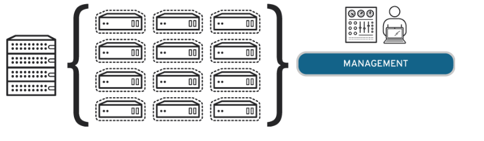

# Virtualization Management

---

# 정의

- Virtualization Management(가상화 관리)은 가상 환경 및 기본 물리적 하드웨어와 인터페이스하여 리소스 관리를 단순화하고 데이터 분석을 강화하며 운영을 간소화하는 소프트웨어이다.
    - 각 가상화 관리 시스템은 고유하나, 복잡하지 않은 사용자 인터페이스를 갖추고 있다.
    - 가상 머신(VM) 생성 프로세스를 간소화하고, 가상 환경을 모니터링하고, 리소스를 할당하고, 보고서를 컴파일하고, 자동으로 규칙을 적용한다.
- 이를 통해 서버, 스토리지, 네트워크 등의 리소스를 효율적으로 활용하고 가상 머신을 배포, 관리, 모니터링 하며 가상화 환경을 운영할 수 있다.
- 각 가상화 관리 시스템은 고유하지만 대부분 복잡하지 않은 사용자 인터페이스를 갖추고 있으며, 다음과 같은 프로세스가 포함될 수 있다.
    - 가상 머신, 가상 네트워크 및 전체 가상화 인프라의 생성, 삭제 및 수정
    - 모든 가상 머신 소프트웨어/하이퍼바이저가 설치된 OS 및 애플리케이션과 함께 최신상태 확인
    - 가상화 환경 전반에 걸쳐 네트워크 연결, 상호 연결을 설정하고 유지
    - 각 가상 머신 및 가상화 환경의 성능을 전체적으로 모니터링하고 관리
- 가상화 관리 시스템은 가상 머신의 하이퍼바이저와 상호 작용하여 작동한다.
    - 가상화 관리 시스템은 하이퍼바이저와 동기화하여 모든 가상 머신의 상태에 대한 정보를 얻는다.
    - 그 뒤 시스템은 해당 정보를 사용자가 이해할 수 있는 방식으로, 차트와 그래프 등으로 사용자에게 보낸다.
    - 가상 머신의 상태에 대한 정보를 얻는 것 외에도 가상화 관리에는 가상 머신의 작업 조정 및 관리와 같은 다른 모든 관리 활동도 포함된다.
- ERP와 같은 일부 솔루션은 하드웨어 및 소프트웨어 브랜드 전반에 걸쳐 통합되므로 사용자는 자신에게 가장 적합한 관리 시스템을 설치할 수 있다.
- 가상화 관리는 가상 환경 및 기본 물리적 하드웨어와 인터페이스하여 리소스 관리를 단순화하고 데이터 분석을 강화하며 운영을 간소화하는 소프트웨어이다.
- ERP(전사적 자원 관리) 와 같은 일부 솔루션은 하드웨어 및 소프트웨어 브랜드 전반에 걸쳐 통합되므로 사용자는 자신에게 가장 적합한 관리 시스템을 설치할 수 있다.
- 소수의 가상 머신은 수동으로 관리할 수 있지만 대규모 기업 전체 배포에서는 가상화 관리 소프트웨어의 사용 필요성이 높아진다.
    - 이는 하이퍼바이저가 설치될 때 VM이 자동으로 프로비저닝(Provisioned)되는 것이 아니기 때문이다.
    

# 사용

- 환경의 규모와 다양성, IT 팀의 경험, 전략적 목표가 무엇인지에 따라 가상화 관리 소프트웨어를 사용하면 훨씬 더 편해질 수 있다.
- 단일 시스템 관리자는 단일 워크스테이션에서 실행되는 소수의 가상 머신을 수동으로 관리할 수 있지만 대규모 기업 전체 배포에서는 가상화 관리 소프트웨어를 사용하여 시스템이 성공할 수 있게 한다.
    - 이는 하이퍼바이저가 설치될 때 VM이 자동으로 provisioning되는 것이 아니기 때문이다.
    - 누군가 소프트웨어가 수행할 작업을 알려주어야 한다.
    - 여기에는 일반적으로 새 VM이 실행될 때마다 늘어나는 4가지 책임의 조합이 포함된다.
        - 프로비저닝
            - 리소스 요청 처리, 템플릿 생성, VM 구성
        - 규정 준수
            - 시스템 보안 및 모니터링, 문제 식별, 사용자 액세스 유효성 검사
        - 운영
            - 사용되지 않거나 충분히 사용되지 않는 물리적 리소스 폐기하거나 회수하고, 버그를 조사하고, 향후 요구 사항을 예측
        - 하이브리드 통합
            - 가상, 프라이빗 클라우드, 퍼블릭 클라우드, 컨테이너 환경 전반에 걸쳐 프로비저닝, 규정 준수, 운영을 구현한다

<aside>
💡 **프로비저닝**
IT 인프라를 생성하고 설정하는 프로세스로서, 다양한 리소스에 대한 사용자 및 시스템 액세스를 관리하는 데 필요한 단계를 포함한다. 프로비저닝은 서버, 애플리케이션, 네트워크 구성, 스토리지, 엣지 기기 등을 배포하는 과정에서 초기 단계에 해당한다.

</aside>

# 기준 가상 환경 관리

- 기존의 가상 환경은 매우 간단하다.
- 물리적 하드웨어와 VM이 포함되어 있기 때문이다.
- 예를 들어 중요한 유지 관리 문제를 해결해야 할 뿐만 아니라 조명이 꺼져 있는지, 문이 잠겨 있는지, 각 방에 물이 흐르지 않는지 확인해야 하는 대형 호텔이 있다. 2가지 선택이 가능한 상황이다.
    1. 빈 방을 확인하면 더 큰 문제를 해결할 시간이 거의 없다.
    2. 더 큰 문제를 해결하면 빈 방을 확인할 시간이 거의 없다.
- 손님이 체크아웃한 후 자동으로 조명을 끄고, 문을 잠그고, 빈 방의 파이프 흐름을 확인하는 앱에 콘센트, 수도꼭지, 잠금 장치가 동기화된다면?
- 몇 가지 간단한 작업을 수행하기 위해 모든 계단을 오르고, 모든 긴 복도를 통과하고, 모든 문을 열 필요가 없으므로 자동화할 수 없는 주요 유지 관리 문제를 해결할 수 있다.
- 이 비유에서 모든 방은 VM이다.
- 간단한 유지 관리 작업이 수백 개의 인스턴스에 분산되면 다루기가 어려워진다.
- 관리 소프트웨어는 IT 전문가의 부담을 일부 덜어주므로 전사적 규모의 큰 문제를 해결할 수 있다.

# 하이브리드 환경 관리

- 하이브리드 환경은 2개 이상의 상호 연결된 가상, 컨테이너 관리 다이어그램, 프라이빗 클라우드 또는 퍼블릭 클라우드 환경으로 구성된다.
    - 일반적으로 일반적으로 온프레미스(On-Premises) 환경과 클라우드 환경(프라이빗 클라우드 또는 퍼블릭 클라우드)을 연결하여 구성된다.
- 하이브리드 환경 관리는 조직이 더욱 유연하게 리소스를 활용하고 비즈니스 요구를 충족시키기 위해 여러 종류의 인프라를 효율적으로 조합하는 것을 목표로 한다.
- 이러한 설정은 각 책임이 고유한 방식으로 반복되기 때문에 기존 가상 환경보다 훨씬 더 복잡하다.
- 프라이빗 클라우드는 퍼블릭 클라우드와 다르게 보호되며 VM 커미셔닝은 컨테이너 커미셔닝과 다르다.
- 이를 고유한 비즈니스 상황, IT 스택 및 경험 수준과 결합하면 올바른 관리 도구를 선택할 때 고려해야 할 사항이 많다.
- 그러나 올바른 도구는 존재하기 마련이며, 그 중 가장 좋은 도구는 공급업체 중립적이고 확장 가능한 솔루션으로 서로 다른 기종(heterogeneous) 환경을 통합하여 운영 비용을 늘리지 않고도 IT 관리자에게 큰 효율성을 제공할 수 있다.
    
    

<aside>
💡 **온 프레미스(On-Premises)** : 조직이 자체적으로 물리적인 하드웨어, 소프트웨어 및 인프라를 구매하고 유지보수하는 방식

</aside>

<aside>
💡 **프라이빗 클라우드**
간략하게 말해 단일 최종 사용자 또는 그룹의 전용 클라우드 환경으로, 실행 시 대개 해당 사용자 또는 그룹의 방화벽으로 보호된다. 
완전히 독립적인 액세스 권한이 있는 단일 고객만 기반 IT 인프라를 독점적으로 사용하는 경우 이러한 모든 클라우드를 프라이빗 클라우드라고 정의할 수 있다.

</aside>

<aside>
💡 **퍼블릭 클라우드**
일반적으로 최종 사용자가 소유하지 않은 IT 인프라에서 생성되는 클라우드 환경입니다.
가장 대표적인 퍼블릭 클라우드 제공업체로는 Alibaba Cloud, AWS(Amazon Web Services), Google Cloud, IBM Cloud, Microsoft Azure 등이 있다.

</aside>

<aside>
💡 **커미셔닝**
시스템이 적절히 설계, 설치되어 있는지 각종 성능시험을 통하여 설계 의도에 적합하게 운전유지 관리가 가능하도록 보증하는 과정

</aside>

# 장점

- 운영 비용 절감
    - 시스템의 모든 부분을 차례로 모니터링하는 것에 비해, 가상화 관리를 사용함으로써 에코시스템의 모든 시스템을 모니터링하고 관리할 수 있다.
- 시스템 최적화
    - 가상화 관리 시스템을 통해 시스템을 최적화하여 성능을 향상시킬 수 있다.
    - 또한 시스템 가동 중지 시간이 발생할 가능성을 낮추는 데도 도움이 된다.
    - 이는 가상화 관리 시스템이 시스템 성능과 시스템에 내재된 리소스의 균형을 재조정하여 전반적인 성능을 향상시키는 경향이 있기 때문이다.
    - 또한, 전체 시스템을 확인하여 시스템이 보유한 숨겨진 리소스 등의 잠금을 해제할 수 있는 기능도 있다.
- 전체 시스템 모니터링
    - 가상화 관리 머신이 전체 시스템을 지속적으로 모니터링하므로 가상화 관리가 기존의 DevOps 구성원이 처리하던 IT 환경을 유지하고 실행하는 일의 대부분을 처리할 수 있다.
- 결함 감지 및 해결
    - 가상화 관리는 시스템의 이상 징후를 감지하는 데 도움이 된다.
    - 또한 문제가 전체 시스템에 큰 타격을 주기 전에 문제를 진단하고 해결하는 경향이 있다.
    - 이는 시스템 가동 중지 시간이 발생할 가능성을 완화하는 좋은 방법이기도 하다.