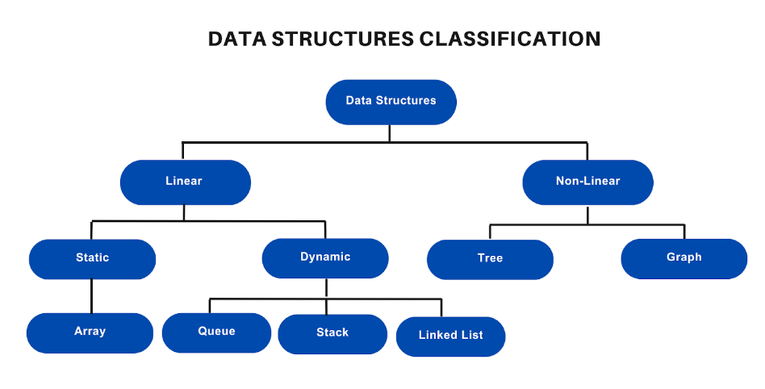
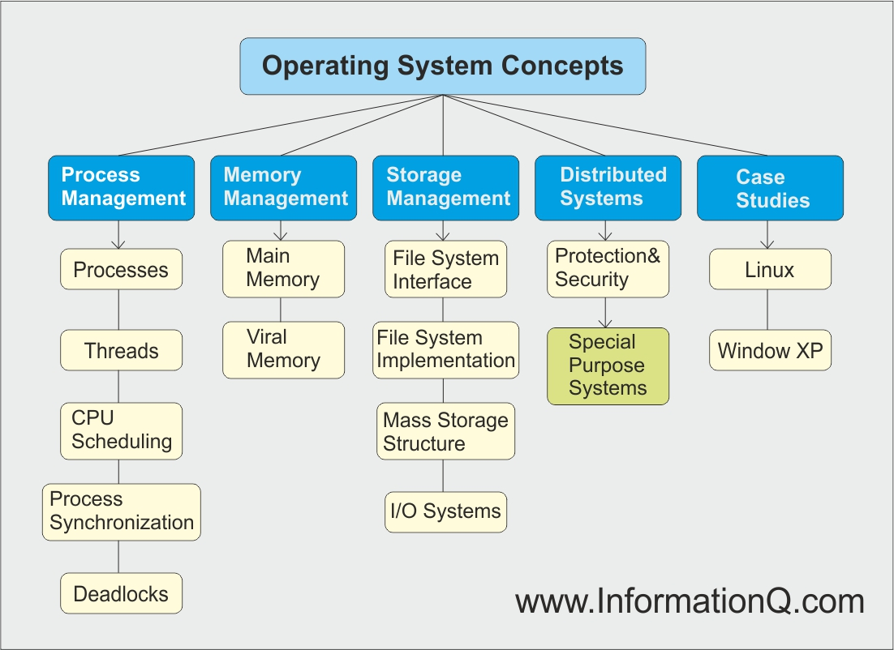
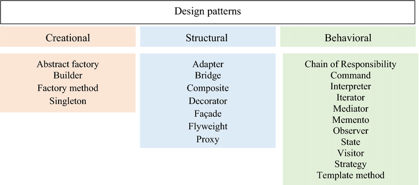
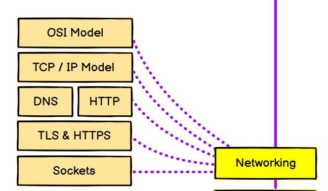
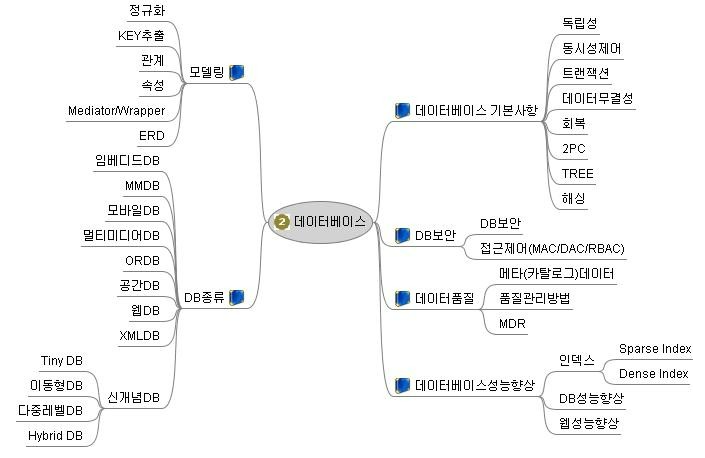

# Roadmap

---

## [Chapter 1. Data Structure](Data_Structure.md)

### [Chapter 1 - 1 : Linear Data Structure](Data_Structure/Linear_Data_Structure.md)

### [Chapter 1 - 2 : Non-Linear Data Structure](Data_Structure/Non-Linear_Data_Structure.md)

## [Chapter 2. Operating System](Operating_System.md)

### [Chapter 2 - 1 : Memory Structure](Operating_System/Memory_Structure.md)

### [Chapter 2 - 2 : Interrupt, I/O](Operating_System/Interrupt,IO.md)

### [Chapter 2 - 3 : Process/Thread](Operating_System/Process_Thread.md)

### [Chapter 2 - 4 : CPU Scheduling Algorithm / Paging](Operating_System/CPU_Scheduling_Algorithm.md)

### [Chapter 2 - 5 : Memory management](Operating_System/Process_Thread.md)

### [Chapter 2 - 6 : File System](Operating_System/File_System.md)

### [Chapter 2 - 7 : Virtual Memory](Operating_System/Virtual_Memory.md)

[//]: # (### [Chapter 2 - 8 : Basic of Security]&#40;Operating_System/BasicOfSecurity.md&#41;)

## [Chapter 3. Design Pattern](Design_Pattern.md)

### [Chapter 3 - 1 : Programming Paradigm](Design_Pattern/Programming_Paradiam.md)

### [Chapter 3 - 2 : GOF Design Pattern](Design_Pattern/Design_Pattern(GOF).md)

## [Chapter 4. Network](Network.md)

### [Chapter 4 - 1 : OSI 7 Layer](Network/OSI_7_Layer.md)

### [Chapter 4 - 2 : TCP/IP Protocol](Network/TCP_IP_Protocol.md)

### [Chapter 4 - 3 : Protocol/Well-Known Port](Network/Well_Known_Port.md)

### Chapter 4 - 4 : Network Device

### Chapter 4 - 5 : DNS

### Chapter 4 - 6 : HTTP/HTTPS

### Chapter 4 - 7 : TLS

### Chapter 4 - 8 : Sockets

## Chapter 5. DataBase

### Chapter 5 - 1 : Structure of DataBase

### Chapter 5 - 2 : Partitioning / Storage

### Chapter 5 - 3 : Software Architecture

### Chapter 5 - 4 : Memory Structure
